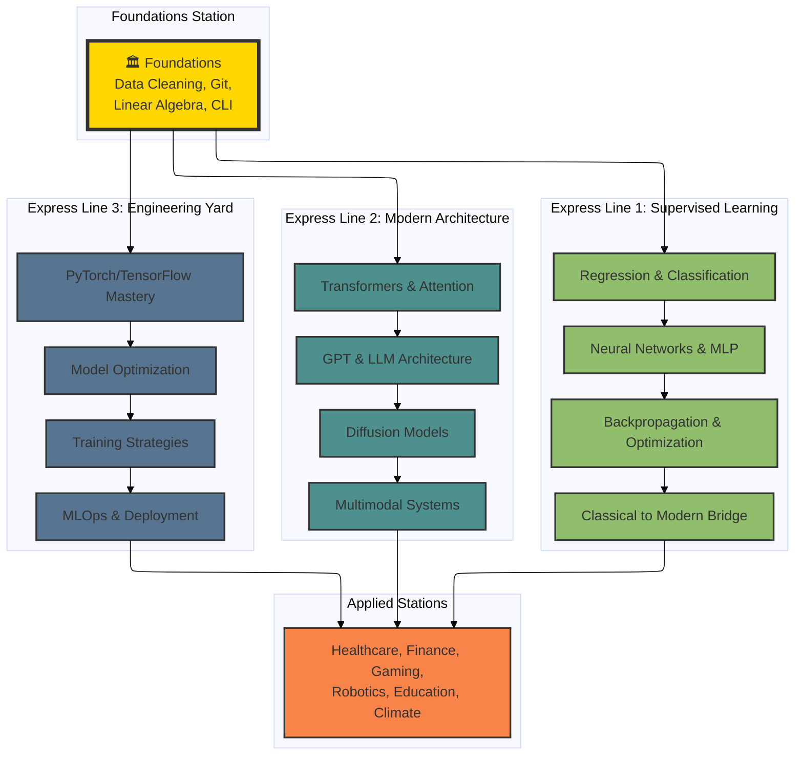

# Before you choose your path, let's understand what

```mermaid
---
config:
  theme: base
  layout: elk
---
graph TD
    subgraph "Foundations Station"
        F[🏛️ Foundations<br/>Data Cleaning, Git,<br/>Linear Algebra, CLI]
    end
    
    subgraph "Express Line 1: Supervised Learning"
        S1[Regression & Classification]
        S2[Neural Networks & MLP]
        S3[Backpropagation & Optimization]
        S4[Classical to Modern Bridge]
    end
    
    subgraph "Express Line 2: Modern Architecture"
        M1[Transformers & Attention]
        M2[GPT & LLM Architecture]
        M3[Diffusion Models]
        M4[Multimodal Systems]
    end
    
    subgraph "Express Line 3: Engineering Yard"
        E1[PyTorch/TensorFlow Mastery]
        E2[Model Optimization]
        E3[Training Strategies]
        E4[MLOps & Deployment]
    end
    
    subgraph "Applied Stations"
        A[Healthcare, Finance, Gaming,<br/>Robotics, Education, Climate]
    end
    
    F --> S1 --> S2 --> S3 --> S4 --> A
    F --> M1 --> M2 --> M3 --> M4 --> A
    F --> E1 --> E2 --> E3 --> E4 --> A
    
    style F fill:#ffd700,stroke:#333,stroke-width:4px
    style S1 fill:#90be6d,stroke:#333,stroke-width:2px
    style S2 fill:#90be6d,stroke:#333,stroke-width:2px
    style S3 fill:#90be6d,stroke:#333,stroke-width:2px
    style S4 fill:#90be6d,stroke:#333,stroke-width:2px
    style M1 fill:#4d908e,stroke:#333,stroke-width:2px
    style M2 fill:#4d908e,stroke:#333,stroke-width:2px
    style M3 fill:#4d908e,stroke:#333,stroke-width:2px
    style M4 fill:#4d908e,stroke:#333,stroke-width:2px
    style E1 fill:#577590,stroke:#333,stroke-width:2px
    style E2 fill:#577590,stroke:#333,stroke-width:2px
    style E3 fill:#577590,stroke:#333,stroke-width:2px
    style E4 fill:#577590,stroke:#333,stroke-width:2px
    style A fill:#f9844a,stroke:#333,stroke-width:2px
```
