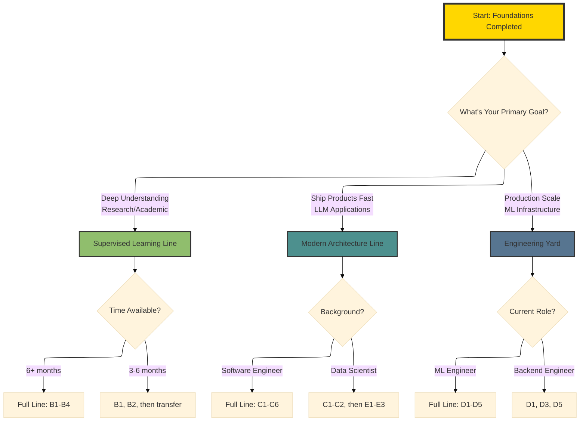

# Standing at Foundations Station, how do you choose

```mermaid
---
config:
  theme: base
  layout: elk
---
graph TD
    A[Start: Foundations Completed] --> B{What's Your Primary Goal?}
    
    B -->|"Deep Understanding<br/>Research/Academic"| C[Supervised Learning Line]
    B -->|"Ship Products Fast<br/>LLM Applications"| D[Modern Architecture Line]
    B -->|"Production Scale<br/>ML Infrastructure"| E[Engineering Yard]
    
    C --> F{Time Available?}
    D --> G{Background?}
    E --> H{Current Role?}
    
    F -->|"6+ months"| C1[Full Line: B1-B4]
    F -->|"3-6 months"| C2[B1, B2, then transfer]
    
    G -->|"Software Engineer"| D1[Full Line: C1-C6]
    G -->|"Data Scientist"| D2[C1-C2, then E1-E3]
    
    H -->|"ML Engineer"| E1[Full Line: D1-D5]
    H -->|"Backend Engineer"| E2[D1, D3, D5]
    
    style A fill:#ffd700,stroke:#333,stroke-width:4px
    style C fill:#90be6d,stroke:#333,stroke-width:2px
    style D fill:#4d908e,stroke:#333,stroke-width:2px
    style E fill:#577590,stroke:#333,stroke-width:2px
```
