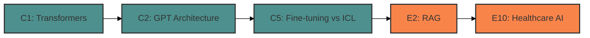

# You've learned Transformers, GPT architecture, and

```mermaid
---
config:
  theme: base
  layout: elk
---
graph LR
    A[C1: Transformers] --> B[C2: GPT Architecture]
    B --> C[C5: Fine-tuning vs ICL]
    C --> D[E2: RAG]
    D --> E[E10: Healthcare AI]
    
    style A fill:#4d908e,stroke:#333,stroke-width:2px
    style B fill:#4d908e,stroke:#333,stroke-width:2px
    style C fill:#4d908e,stroke:#333,stroke-width:2px
    style D fill:#f9844a,stroke:#333,stroke-width:2px
    style E fill:#f9844a,stroke:#333,stroke-width:2px
```
