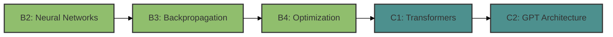

# You've built models from scratch and understand ba

```mermaid
---
config:
  theme: base
  layout: elk
---
graph LR
    A[B2: Neural Networks] --> B[B3: Backpropagation]
    B --> C[B4: Optimization]
    C --> D[C1: Transformers]
    D --> E[C2: GPT Architecture]
    
    style A fill:#90be6d,stroke:#333,stroke-width:2px
    style B fill:#90be6d,stroke:#333,stroke-width:2px
    style C fill:#90be6d,stroke:#333,stroke-width:2px
    style D fill:#4d908e,stroke:#333,stroke-width:2px
    style E fill:#4d908e,stroke:#333,stroke-width:2px
```
