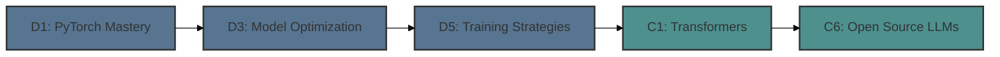

# You've mastered PyTorch and optimization. Now you 

```mermaid
---
config:
  theme: base
  layout: elk
---
graph LR
    A[D1: PyTorch Mastery] --> B[D3: Model Optimization]
    B --> C[D5: Training Strategies]
    C --> D[C1: Transformers]
    D --> E[C6: Open Source LLMs]
    
    style A fill:#577590,stroke:#333,stroke-width:2px
    style B fill:#577590,stroke:#333,stroke-width:2px
    style C fill:#577590,stroke:#333,stroke-width:2px
    style D fill:#4d908e,stroke:#333,stroke-width:2px
    style E fill:#4d908e,stroke:#333,stroke-width:2px
```
