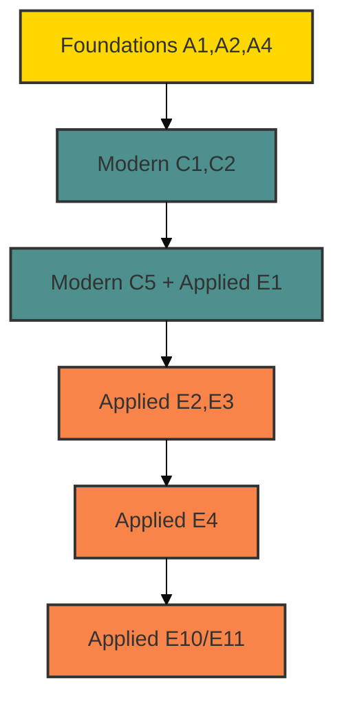

# **Transfer Map:**

```mermaid
---
config:
  theme: base
  layout: elk
---
graph TD
    A[Foundations A1,A2,A4] --> B[Modern C1,C2]
    B --> C[Modern C5 + Applied E1]
    C --> D[Applied E2,E3]
    D --> E[Applied E4]
    E --> F[Applied E10/E11]
    
    style A fill:#ffd700,stroke:#333,stroke-width:2px
    style B fill:#4d908e,stroke:#333,stroke-width:2px
    style C fill:#4d908e,stroke:#333,stroke-width:2px
    style D fill:#f9844a,stroke:#333,stroke-width:2px
    style E fill:#f9844a,stroke:#333,stroke-width:2px
    style F fill:#f9844a,stroke:#333,stroke-width:2px
```
