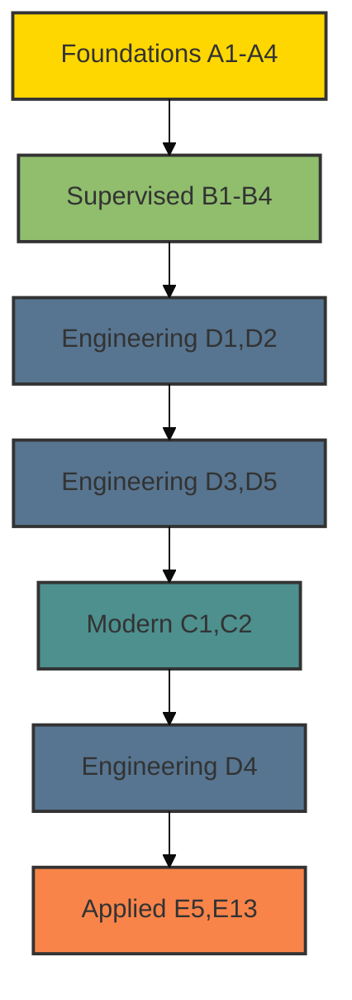

# **Transfer Map:**

```mermaid
---
config:
  theme: base
  layout: elk
---
graph TD
    A[Foundations A1-A4] --> B[Supervised B1-B4]
    B --> C[Engineering D1,D2]
    C --> D[Engineering D3,D5]
    D --> E[Modern C1,C2]
    E --> F[Engineering D4]
    F --> G[Applied E5,E13]
    
    style A fill:#ffd700,stroke:#333,stroke-width:2px
    style B fill:#90be6d,stroke:#333,stroke-width:2px
    style C fill:#577590,stroke:#333,stroke-width:2px
    style D fill:#577590,stroke:#333,stroke-width:2px
    style E fill:#4d908e,stroke:#333,stroke-width:2px
    style F fill:#577590,stroke:#333,stroke-width:2px
    style G fill:#f9844a,stroke:#333,stroke-width:2px
```
