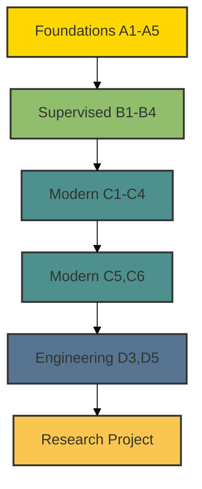

# **Transfer Map:**

```mermaid
---
config:
  theme: base
  layout: elk
---
graph TD
    A[Foundations A1-A5] --> B[Supervised B1-B4]
    B --> C[Modern C1-C4]
    C --> D[Modern C5,C6]
    D --> E[Engineering D3,D5]
    E --> F[Research Project]
    
    style A fill:#ffd700,stroke:#333,stroke-width:2px
    style B fill:#90be6d,stroke:#333,stroke-width:2px
    style C fill:#4d908e,stroke:#333,stroke-width:2px
    style D fill:#4d908e,stroke:#333,stroke-width:2px
    style E fill:#577590,stroke:#333,stroke-width:2px
    style F fill:#f9c74f,stroke:#333,stroke-width:2px
```
