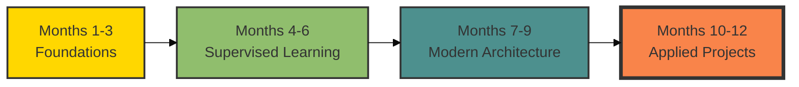

# If you have one year, here's a proven transfer seq

```mermaid
---
config:
  theme: base
  layout: elk
---
graph LR
    A[Months 1-3<br/>Foundations] --> B[Months 4-6<br/>Supervised Learning]
    B --> C[Months 7-9<br/>Modern Architecture]
    C --> D[Months 10-12<br/>Applied Projects]
    
    style A fill:#ffd700,stroke:#333,stroke-width:2px
    style B fill:#90be6d,stroke:#333,stroke-width:2px
    style C fill:#4d908e,stroke:#333,stroke-width:2px
    style D fill:#f9844a,stroke:#333,stroke-width:4px
```
