# The 2026 AI Metromap: Reading the Map

## Strategic Navigation Across the Three Core Lines

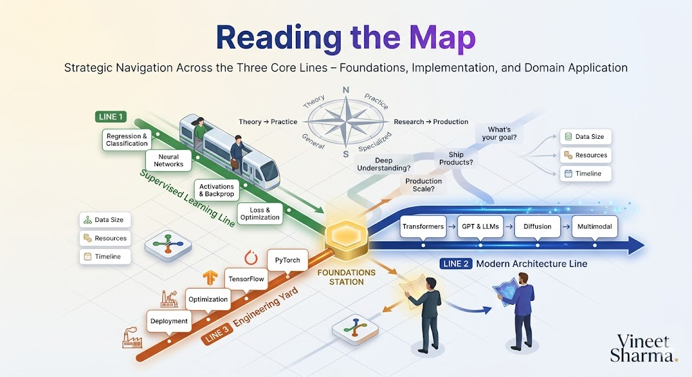


## 📖 Introduction

**Welcome to the second stop of our journey.**

In our first story, we diagnosed the problem. We saw how linear learning paths fail in 2026—they ignore motivation, can't keep pace with change, and teach knowledge without context. We introduced the Metromap philosophy: AI mastery as a transit system with a central hub (Foundations), express lines (Core Technologies), and local stops (Domain Applications).

Now comes the critical question that stops most learners cold:

**"I understand the map. But which line do I take first?"**

You're standing at Foundations Station. Trains are arriving on three tracks:
- **The Supervised Learning Line** – The classic route that built modern AI
- **The Modern Architecture Line** – The express train to LLMs, diffusion, and multimodality
- **The Engineering Yard Line** – The tracks to production, optimization, and deployment

Each leads to different destinations. Each requires different investments. Each serves different goals.

This story—**The 2026 AI Metromap: Reading the Map**—is your navigation guide. We'll build decision frameworks that help you choose your express line, understand when to transfer between tracks, and create a personalized learning path that aligns with your goals, background, and timeline.

**Let's learn to read the map.**

---

## 📚 Where You Are in the Journey

### The Master Story Arc: The 2026 AI Metromap Series

- 🗺️ **[The 2026 AI Metromap: Why the Old Learning Routes Are Obsolete](#)** – A paradigm shift from linear learning to transit-system mastery. We diagnosed why traditional paths fail and introduced the metromap philosophy. *[Read First]*

- 🧭 **The 2026 AI Metromap: Reading the Map** – Strategic navigation across the three core lines. We'll build decision frameworks for choosing your express line and transferring between tracks. **⬅️ YOU ARE HERE**

- 🎒 **[The 2026 AI Metromap: Avoiding Derailments](#)** – Diagnosing and preventing the "shiny object syndrome," foundation-skipping disasters, tutorial hell, and the comparison trap that kills momentum. 🔜 *Up Next*

- 🏁 **[The 2026 AI Metromap: From Passenger to Driver](#)** – Translating metromap "stops" into portfolio projects that hiring managers actually notice. We'll cover project selection, documentation strategies, and demonstrating depth while showing breadth. 📅 *Planned*

### The Complete Story Catalog

For a complete view of all upcoming stories across every series, visit the **[Complete 2026 AI Metromap Story Catalog](#)** – your navigation guide to every station on this journey.

---

## 🗺️ The Three Express Lines: A Closer Look

Before you choose your path, let's understand what each line offers, what it demands, and where it leads.

```mermaid
```

](images/diagram_01_before-you-choose-your-path-lets-understand-what-3073.png)

[View Source](https://github.com/Vineet-Sharma-Medium-Stories/Medium-Assets/blob/main/the-2026-ai-metromap-reading-the-map/diagram_01_before-you-choose-your-path-lets-understand-what-3073.md)


---

### 🚂 Express Line 1: The Supervised Learning Line

**The Classic Route That Built Modern AI**

This is the traditional path—the one that created the first wave of AI engineers. It's well-trodden, deeply documented, and builds understanding from the ground up.

**What You'll Learn:**
- Regression and classification fundamentals
- Neural network architecture from perceptron to MLP
- Backpropagation and optimization algorithms
- How classical ML connects to modern deep learning

**Who This Line Is For:**
- **Career switchers** who need foundational depth before specializing
- **Academic learners** who prefer theory-first, intuition-second approaches
- **Data scientists** transitioning from traditional ML to deep learning
- **Anyone with 6+ months** who wants to understand AI from first principles

**Time Investment:** 8-12 weeks (if consistent)

**Key Stations:**
- 📈 **[B1. Regression & Classification – The Grand Central Station of AI](#)**
- 🧬 **[B2. Neural Network Architecture – From Perceptron to MLP](#)**
- ⚡ **[B3. Activation Functions & Backpropagation – The Electrical Grid](#)**
- 🎯 **[B4. Loss Functions & Optimization – Navigating to the Minimum](#)**

**Destination:** Deep understanding of how neural networks learn. You'll be able to implement models from scratch, debug training issues, and understand research papers at the architecture level.

**Transfer Opportunities:** After completing this line, you can transfer to:
- **Modern Architecture Line** – Your foundation makes Transformers easier to grasp
- **Engineering Yard** – You understand what you're optimizing
- **Applied Stations** – You can build custom models for specific domains

---

### 🚀 Express Line 2: The Modern Architecture Line

**The Express Train to Cutting-Edge AI**

This line jumps straight to what's shaping the industry today. You'll start with Transformers and ride through LLMs, diffusion, and multimodality.

**What You'll Learn:**
- Transformers and attention mechanisms
- GPT architecture and LLM internals
- Diffusion models for image and audio generation
- Multimodal systems (CLIP, Flamingo, Gemini)
- Fine-tuning strategies and open-source models

**Who This Line Is For:**
- **Software engineers** who want to build AI applications quickly
- **Product builders** focused on shipping LLM-powered features
- **Entrepreneurs** building AI-native products
- **Anyone with < 3 months** who needs visible progress fast

**Time Investment:** 6-10 weeks (if focused)

**Key Stations:**
- 📖 **[C1. Transformers & Attention – The Station That Changed Everything](#)**
- 🤖 **[C2. GPT & LLM Architecture – Understanding the Engine](#)**
- 🎨 **[C3. Diffusion Models – The Scenic Route to Generative AI](#)**
- 🌐 **[C4. Multimodal Models – The Interchange Stations](#)**
- 🧩 **[C5. Fine-Tuning vs. In-Context Learning – When to Train vs. Prompt](#)**
- 📚 **[C6. Open Source LLMs – LLaMA, Mistral, DeepSeek, and Beyond](#)**

**Destination:** Ability to build production-ready AI applications using state-of-the-art models. You'll understand how to choose between GPT-4, open-source alternatives, and fine-tuned models.

**Transfer Opportunities:** After completing this line, you can transfer to:
- **Engineering Yard** – To optimize and deploy your models
- **Applied Stations** – To build domain-specific applications
- **Supervised Learning Line** – To deepen theoretical understanding (optional)

---

### ⚙️ Express Line 3: The Engineering Yard

**The Tracks to Production and Scale**

This line focuses on the craft of building AI systems that actually work in production—optimization, deployment, and MLOps.

**What You'll Learn:**
- PyTorch and TensorFlow mastery
- Model optimization (quantization, pruning, distillation)
- Training strategies (mixed precision, distributed training)
- MLOps and deployment patterns

**Who This Line Is For:**
- **ML engineers** focused on production systems
- **Backend engineers** transitioning to AI infrastructure
- **Researchers** who want to scale their experiments
- **Anyone who already understands ML theory** and wants to ship

**Time Investment:** 8-12 weeks (if experienced)

**Key Stations:**
- 🔧 **[D1. PyTorch Mastery – The Locomotive of Modern AI](#)**
- 🏭 **[D2. TensorFlow & Keras – The Production-Ready Alternative](#)**
- ⚡ **[D3. Model Optimization – Keeping the Train on Time](#)**
- 🛡️ **[D4. Batch Norm & Dropout – The Safety Systems](#)**
- 📈 **[D5. Training Strategies – Learning Rate Scheduling & Beyond](#)**

**Destination:** Ability to take any model from notebook to production. You'll understand inference optimization, distributed training, and deployment patterns.

**Transfer Opportunities:** After completing this line, you can transfer to:
- **Modern Architecture Line** – To understand what you're optimizing
- **Applied Stations** – To deploy domain-specific applications
- **Supervised Learning Line** – To debug training issues (optional)

---

## 🧭 The Decision Framework: Choosing Your Express Line

Standing at Foundations Station, how do you choose? Let's build a decision framework.

```mermaid
```

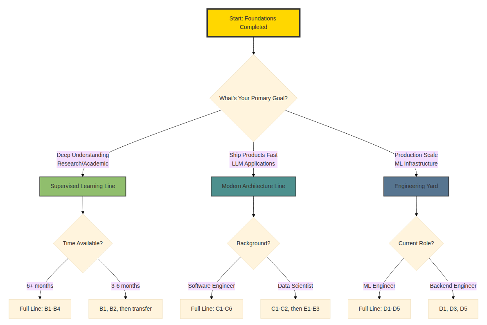

[View Source](https://github.com/Vineet-Sharma-Medium-Stories/Medium-Assets/blob/main/the-2026-ai-metromap-reading-the-map/diagram_02_standing-at-foundations-station-how-do-you-choose-3fdd.md)


### Decision Matrix: Which Line Should You Take?

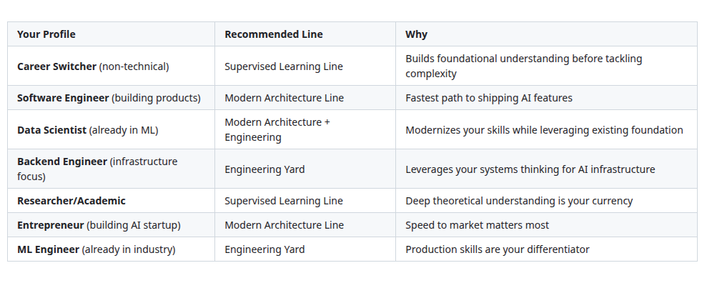

[View Source](https://github.com/Vineet-Sharma-Medium-Stories/Medium-Assets/blob/main/the-2026-ai-metromap-reading-the-map/table_01_decision-matrix-which-line-should-you-take-01f4.md)


---

## 🔄 The Art of Transfers: When to Switch Lines

The Metromap's power isn't in riding one line to the end. It's in knowing when to transfer.

### Scenario 1: The Product Builder's Transfer

**Start:** Modern Architecture Line → **Transfer to:** Applied Stations

You've learned Transformers, GPT architecture, and RAG. Now you want to build a healthcare chatbot. Transfer to E10 (AI in Healthcare) and E2 (RAG) simultaneously.

```mermaid
```

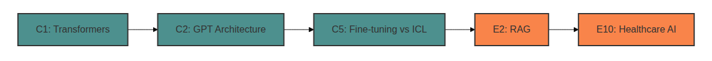

[View Source](https://github.com/Vineet-Sharma-Medium-Stories/Medium-Assets/blob/main/the-2026-ai-metromap-reading-the-map/diagram_03_youve-learned-transformers-gpt-architecture-and-cc65.md)


### Scenario 2: The Researcher's Transfer

**Start:** Supervised Learning Line → **Transfer to:** Modern Architecture Line

You've built models from scratch and understand backpropagation. Now you want to understand why Transformers work. Your foundation makes advanced concepts intuitive.

```mermaid
```

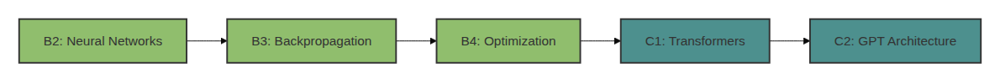

[View Source](https://github.com/Vineet-Sharma-Medium-Stories/Medium-Assets/blob/main/the-2026-ai-metromap-reading-the-map/diagram_04_youve-built-models-from-scratch-and-understand-ba-4abc.md)


### Scenario 3: The Infrastructure Engineer's Transfer

**Start:** Engineering Yard → **Transfer to:** Modern Architecture Line

You've mastered PyTorch and optimization. Now you want to understand the models you're deploying. Your engineering skills help you implement and optimize architectures faster.

```mermaid
```

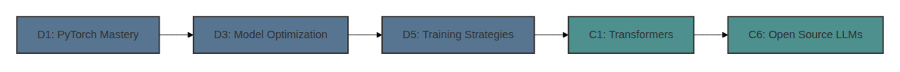

[View Source](https://github.com/Vineet-Sharma-Medium-Stories/Medium-Assets/blob/main/the-2026-ai-metromap-reading-the-map/diagram_05_youve-mastered-pytorch-and-optimization-now-you-86f1.md)


---

## 🎯 Building Your Personalized Learning Path

Now it's your turn. Let's build your path.

### Step 1: Define Your Goal

Ask yourself three questions:

1. **What do you want to build?** (Chatbots? Vision systems? Infrastructure?)
2. **What's your timeline?** (3 months? 6 months? 1 year?)
3. **What's your background?** (Software? Data? Non-technical?)

### Step 2: Choose Your Primary Line

Based on your answers, select one of the three express lines as your primary track.

### Step 3: Identify Transfer Points

Look at the applied stations that interest you. Map backward to which core concepts you need.

### Step 4: Set Your First Three Stations

Don't plan the entire journey. Just plan the next three stops.

---

## 📊 Example Learning Paths

### Path A: The AI Product Builder (12 Weeks)

**Goal:** Build and ship LLM-powered applications

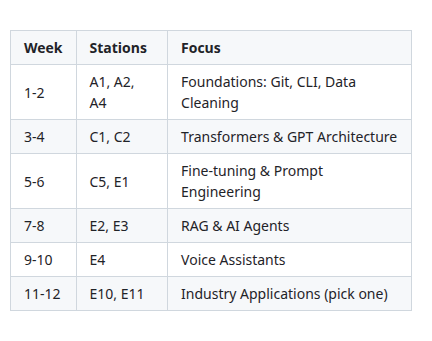

[View Source](https://github.com/Vineet-Sharma-Medium-Stories/Medium-Assets/blob/main/the-2026-ai-metromap-reading-the-map/table_02_goal-build-and-ship-llm-powered-applications-6f09.md)


**Transfer Map:**
```mermaid
```

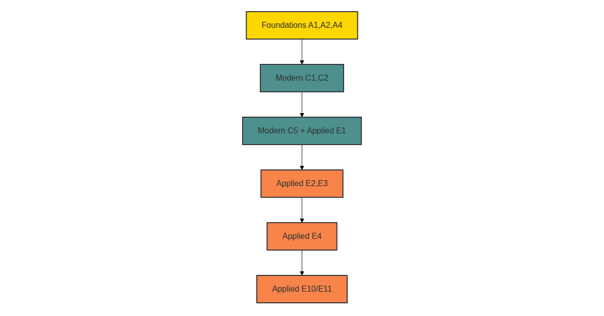

[View Source](https://github.com/Vineet-Sharma-Medium-Stories/Medium-Assets/blob/main/the-2026-ai-metromap-reading-the-map/diagram_06_transfer-map.md)


---

### Path B: The ML Engineer (16 Weeks)

**Goal:** Deploy and optimize models at scale

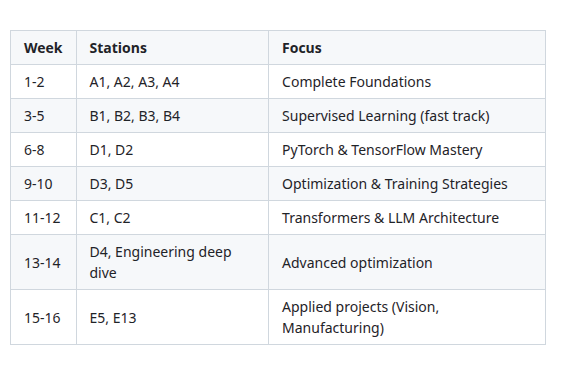

[View Source](https://github.com/Vineet-Sharma-Medium-Stories/Medium-Assets/blob/main/the-2026-ai-metromap-reading-the-map/table_03_goal-deploy-and-optimize-models-at-scale-53d3.md)


**Transfer Map:**
```mermaid
```

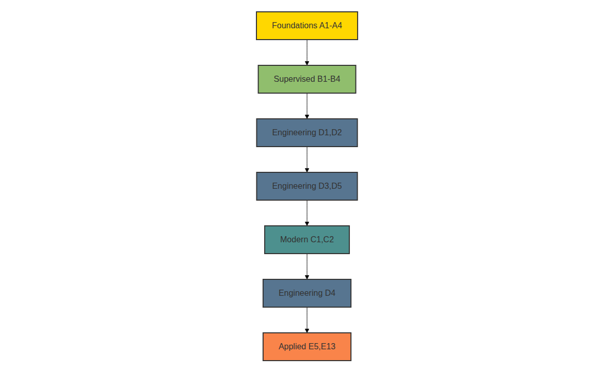

[View Source](https://github.com/Vineet-Sharma-Medium-Stories/Medium-Assets/blob/main/the-2026-ai-metromap-reading-the-map/diagram_07_transfer-map.md)


---

### Path C: The AI Researcher (20 Weeks)

**Goal:** Deep understanding to contribute to research

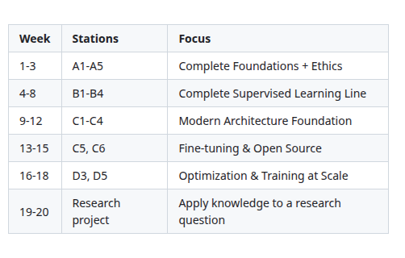

[View Source](https://github.com/Vineet-Sharma-Medium-Stories/Medium-Assets/blob/main/the-2026-ai-metromap-reading-the-map/table_04_goal-deep-understanding-to-contribute-to-rese-9c0d.md)


**Transfer Map:**
```mermaid
```

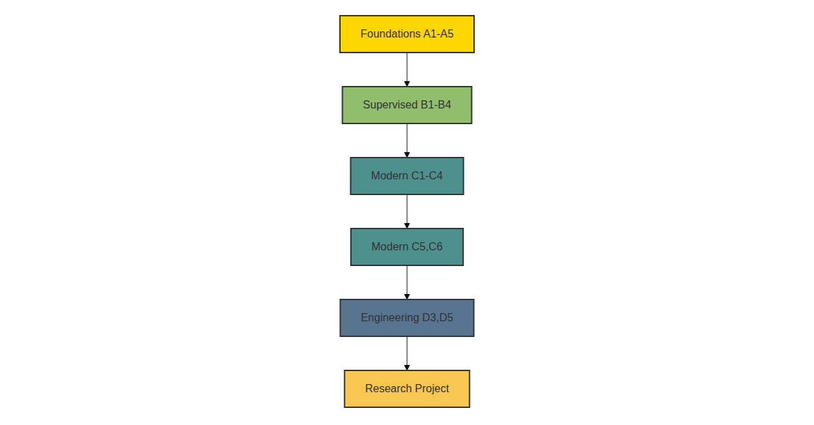

[View Source](https://github.com/Vineet-Sharma-Medium-Stories/Medium-Assets/blob/main/the-2026-ai-metromap-reading-the-map/diagram_08_transfer-map.md)


---

## 🚦 When to Stay on Your Line vs. When to Transfer

### Signs You Should Stay on Your Current Line

- You're consistently making progress and staying motivated
- You're building projects that reinforce what you're learning
- You have a clear goal that requires depth in this area
- You're within 2-3 stations of a major milestone

### Signs You Should Transfer to Another Line

- You're bored and losing motivation (transfer to a more applied station)
- You're stuck and the theory isn't clicking (transfer to Engineering for practical context)
- You've achieved your goal for this line (celebrate and move on)
- A new opportunity requires different skills (transfer strategically, not reactively)

### The One-Year Transfer Strategy

If you have one year, here's a proven transfer sequence:

```mermaid
```


[View Source](https://github.com/Vineet-Sharma-Medium-Stories/Medium-Assets/blob/main/the-2026-ai-metromap-reading-the-map/diagram_09_if-you-have-one-year-heres-a-proven-transfer-seq-9b9e.md)


This sequence builds depth, then breadth, then application. You'll understand AI from foundations to production.

---

## 📊 Takeaway from This Story

**What You Learned:**

- **The Three Express Lines** – Supervised Learning (depth), Modern Architecture (cutting-edge), Engineering Yard (production). Each serves different goals and audiences.

- **The Decision Framework** – How to choose your primary line based on your profile, goals, and timeline.

- **The Art of Transfers** – When to switch lines and how to map transfers to your goals.

- **Personalized Learning Paths** – Three example paths for different careers, with station-by-station plans.

- **The One-Year Strategy** – A proven sequence from foundations to applied projects.

---

## 🔗 Navigation

- **⬅️ Previous Story:** [The 2026 AI Metromap: Why the Old Learning Routes Are Obsolete](#)

- **📚 Story Catalog:** [Complete 2026 AI Metromap Story Catalog](#) – Your complete navigation guide to all 39+ stories across every series.

- **➡️ Next Story:** [The 2026 AI Metromap: Avoiding Derailments](#) – Diagnosing and preventing the pitfalls that stop most learners: shiny object syndrome, foundation-skipping, tutorial hell, and the comparison trap.

---

## 📝 Your Invitation

Before the next story arrives, create your personalized learning path:

1. **Define your goal** – What do you want to build in 2026?
2. **Choose your primary line** – Supervised, Modern, or Engineering?
3. **Identify your first three stations** – Which stories will you read first?
4. **Set a transfer point** – When will you switch to applied projects?

Share your path in the comments. Let's navigate together.

---

*Found this helpful? Clap, comment, and share your personalized learning path. See you at the next station!* 🚇