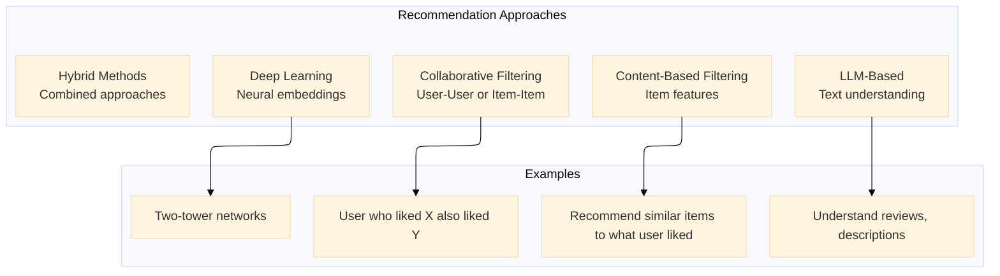

# Recommendation systems fall into several categorie

```mermaid
---
config:
  theme: base
  layout: elk
---
graph TD
    subgraph "Recommendation Approaches"
        CF[Collaborative Filtering<br/>User-User or Item-Item]
        CB[Content-Based Filtering<br/>Item features]
        HY[Hybrid Methods<br/>Combined approaches]
        DL[Deep Learning<br/>Neural embeddings]
        LLM[LLM-Based<br/>Text understanding]
    end
    
    subgraph "Examples"
        CF --> CFE[User who liked X also liked Y]
        CB --> CBE[Recommend similar items to what user liked]
        DL --> DLE[Two-tower networks]
        LLM --> LLME[Understand reviews, descriptions]
    end
```
