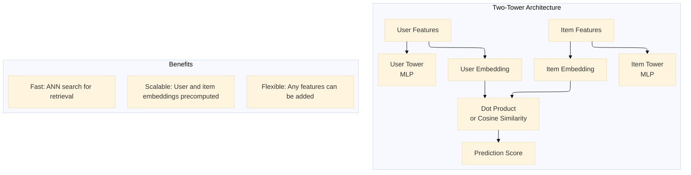

# Two-tower networks are the modern architecture for

```mermaid
---
config:
  theme: base
  layout: elk
---
graph TD
    subgraph "Two-Tower Architecture"
        U[User Features] --> UT[User Tower<br/>MLP]
        U --> UE[User Embedding]
        
        I[Item Features] --> IT[Item Tower<br/>MLP]
        I --> IE[Item Embedding]
        
        UE --> DOT[Dot Product<br/>or Cosine Similarity]
        IE --> DOT
        
        DOT --> SCORE[Prediction Score]
    end
    
    subgraph "Benefits"
        B1[Scalable: User and item embeddings precomputed]
        B2[Flexible: Any features can be added]
        B3[Fast: ANN search for retrieval]
    end
```
