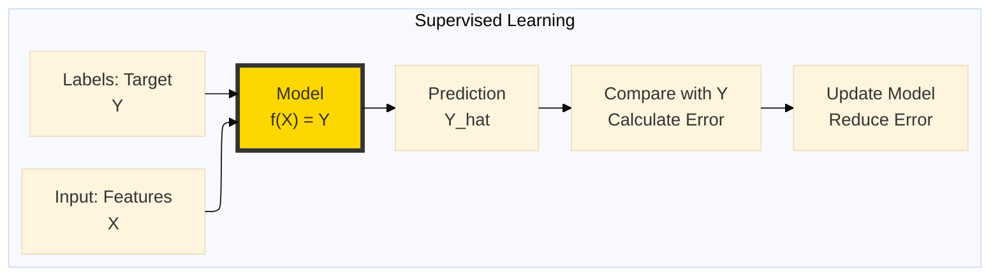

# At its core, supervised learning is simple: **Lear

```mermaid
---
config:
  theme: base
  layout: elk
---
graph LR
    subgraph Supervised["Supervised Learning"]
        I["Input: Features\nX"] --> M["Model\nf(X) = Y"]
        L["Labels: Target\nY"] --> M
        M --> P["Prediction\nY_hat"]
        P --> E["Compare with Y\nCalculate Error"]
        E --> U["Update Model\nReduce Error"]
    end
    
    style M fill:#ffd700,stroke:#333,stroke-width:4px

```
