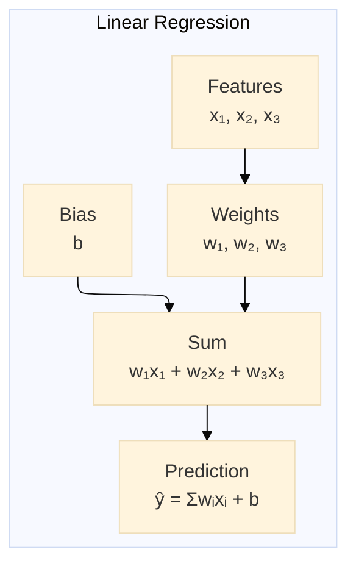

# ### Linear Regression: The Simplest Model

```mermaid
---
config:
  theme: base
  layout: elk
---
graph TD
    subgraph "Linear Regression"
        X[Features<br/>x₁, x₂, x₃] --> W[Weights<br/>w₁, w₂, w₃]
        W --> S[Sum<br/>w₁x₁ + w₂x₂ + w₃x₃]
        B[Bias<br/>b] --> S
        S --> Y[Prediction<br/>ŷ = Σwᵢxᵢ + b]
    end
```
