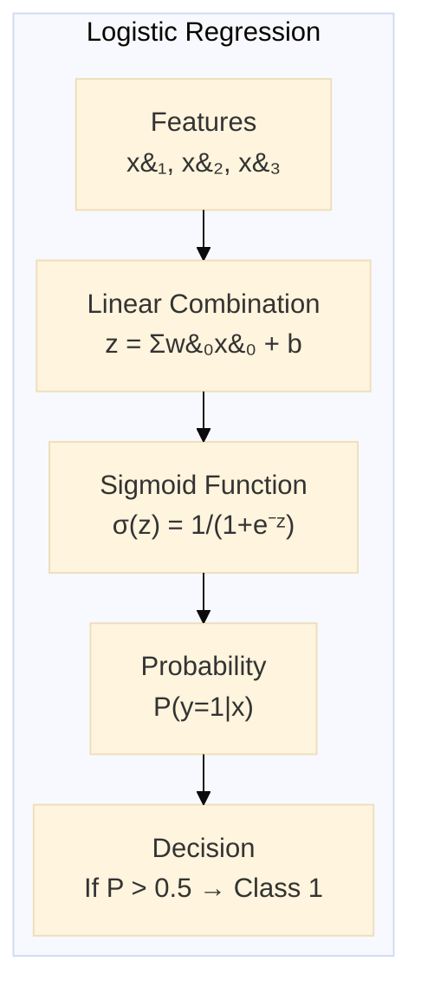

# Despite the name, logistic regression is a **class

```mermaid
---
config:
  theme: base
  layout: elk
---
graph TD
    subgraph LogisticRegression["Logistic Regression"]
        X["Features\nx&#8321;, x&#8322;, x&#8323;"] --> Z["Linear Combination\nz = Σw&#8320;x&#8320; + b"]
        Z --> S["Sigmoid Function\nσ(z) = 1/(1+e⁻ᶻ)"]
        S --> P["Probability\nP(y=1|x)"]
        P --> D["Decision\nIf P > 0.5 → Class 1"]
    end

```
