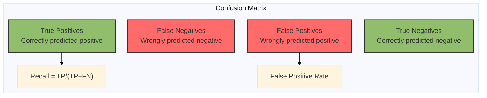

# Accuracy isn't always enough. Here's the metrics t

```mermaid
---
config:
  theme: base
  layout: elk
---
graph TD
    subgraph Confusion["Confusion Matrix"]
        TP["True Positives\nCorrectly predicted positive"] --> TPR["Recall = TP/(TP+FN)"]
        FP["False Positives\nWrongly predicted positive"] --> FPR["False Positive Rate"]
        FN["False Negatives\nWrongly predicted negative"]
        TN["True Negatives\nCorrectly predicted negative"]
    end
    
    style TP fill:#90be6d,stroke:#333,stroke-width:2px
    style TN fill:#90be6d,stroke:#333,stroke-width:2px
    style FP fill:#ff6b6b,stroke:#333,stroke-width:2px
    style FN fill:#ff6b6b,stroke:#333,stroke-width:2px

```
