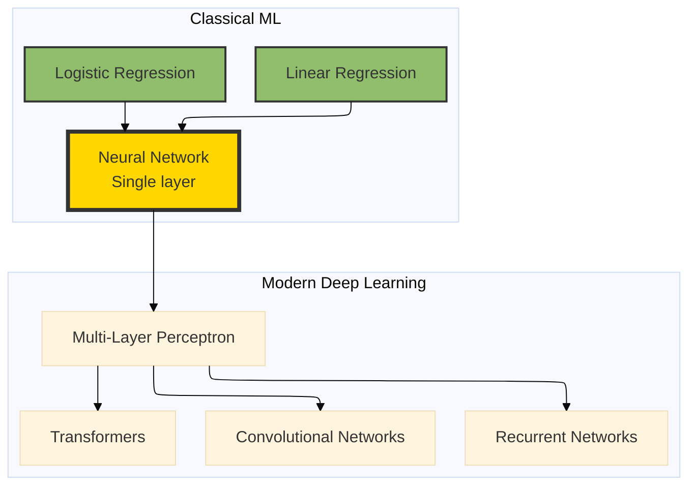

# Everything you just built is the foundation of mod

```mermaid
---
config:
  theme: base
  layout: elk
---
graph TD
    subgraph "Classical ML"
        LR[Linear Regression] --> N[Neural Network<br/>Single layer]
        LG[Logistic Regression] --> N
    end
    
    subgraph "Modern Deep Learning"
        N --> MLP[Multi-Layer Perceptron]
        MLP --> CNN[Convolutional Networks]
        MLP --> RNN[Recurrent Networks]
        MLP --> TRANS[Transformers]
    end
    
    style LR fill:#90be6d,stroke:#333,stroke-width:2px
    style LG fill:#90be6d,stroke:#333,stroke-width:2px
    style N fill:#ffd700,stroke:#333,stroke-width:4px
```
