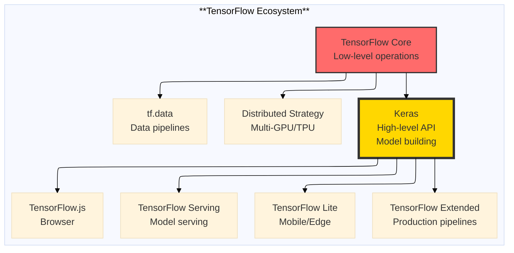

# TensorFlow is more than a framework—it's a complet

```mermaid
---
config:
  theme: base
  layout: elk
---
graph TD
    subgraph "**TensorFlow Ecosystem**"
        TF[TensorFlow Core<br/>Low-level operations]
        
        K[Keras<br/>High-level API<br/>Model building]
        DATA[tf.data<br/>Data pipelines]
        DIST[Distributed Strategy<br/>Multi-GPU/TPU]
        
        TF --> K
        TF --> DATA
        TF --> DIST
        
        K --> SERVE[TensorFlow Serving<br/>Model serving]
        K --> LITE[TensorFlow Lite<br/>Mobile/Edge]
        K --> JS[TensorFlow.js<br/>Browser]
        K --> TFX[TensorFlow Extended<br/>Production pipelines]
    end
    
    style TF fill:#ff6b6b,stroke:#333,stroke-width:2px
    style K fill:#ffd700,stroke:#333,stroke-width:4px
```
