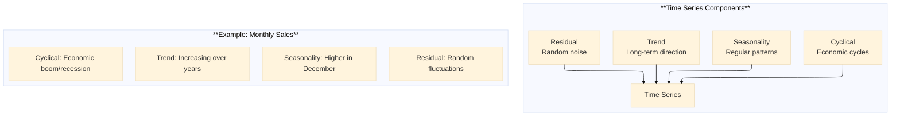

# Before forecasting, we need to understand time ser

```mermaid
---
config:
  theme: base
  layout: elk
---
graph TD
    subgraph "**Time Series Components**"
        T[Trend<br/>Long-term direction] --> TS[Time Series]
        S[Seasonality<br/>Regular patterns] --> TS
        C[Cyclical<br/>Economic cycles] --> TS
        R[Residual<br/>Random noise] --> TS
    end
    
    subgraph "**Example: Monthly Sales**"
        TR[Trend: Increasing over years]
        SE[Seasonality: Higher in December]
        CY[Cyclical: Economic boom/recession]
        RE[Residual: Random fluctuations]
    end
```
