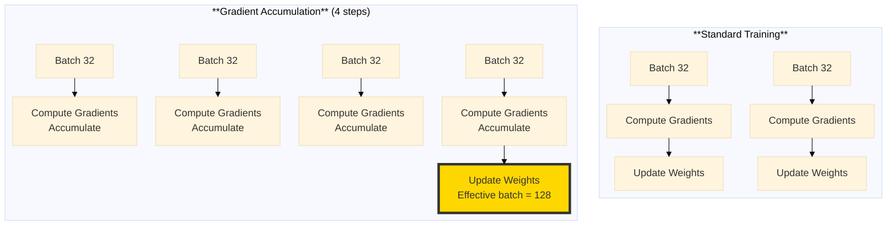

# Gradient accumulation simulates larger batch sizes

```mermaid
---
config:
  theme: base
  layout: elk
---
graph TD
    subgraph "**Standard Training**"
        B1[Batch 32] --> G1[Compute Gradients]
        G1 --> U1[Update Weights]
        B2[Batch 32] --> G2[Compute Gradients]
        G2 --> U2[Update Weights]
    end
    
    subgraph "**Gradient Accumulation** (4 steps)"
        B1b[Batch 32] --> G1b[Compute Gradients<br/>Accumulate]
        B2b[Batch 32] --> G2b[Compute Gradients<br/>Accumulate]
        B3b[Batch 32] --> G3b[Compute Gradients<br/>Accumulate]
        B4b[Batch 32] --> G4b[Compute Gradients<br/>Accumulate]
        G4b --> U[Update Weights<br/>Effective batch = 128]
    end
    
    style U fill:#ffd700,stroke:#333,stroke-width:4px
```
