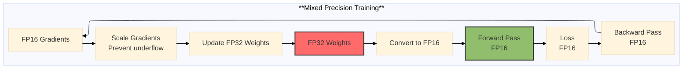

# Mixed precision uses FP16 for forward/backward and

```mermaid
---
config:
  theme: base
  layout: elk
---
graph LR
    subgraph "**Mixed Precision Training**"
        W[FP32 Weights] --> C[Convert to FP16]
        C --> F[Forward Pass<br/>FP16]
        F --> L[Loss<br/>FP16]
        L --> B[Backward Pass<br/>FP16]
        B --> G[FP16 Gradients]
        G --> S[Scale Gradients<br/>Prevent underflow]
        S --> U[Update FP32 Weights]
        U --> W
    end
    
    style W fill:#ff6b6b,stroke:#333,stroke-width:2px
    style F fill:#90be6d,stroke:#333,stroke-width:2px
```
