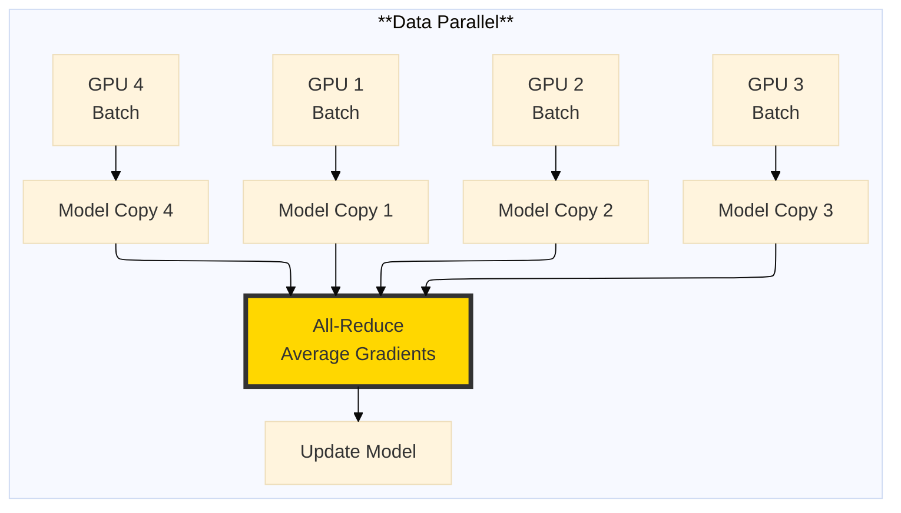

# Distributed training scales across GPUs and machin

```mermaid
---
config:
  theme: base
  layout: elk
---
graph TD
    subgraph "**Data Parallel**"
        G1[GPU 1<br/>Batch] --> M1[Model Copy 1]
        G2[GPU 2<br/>Batch] --> M2[Model Copy 2]
        G3[GPU 3<br/>Batch] --> M3[Model Copy 3]
        G4[GPU 4<br/>Batch] --> M4[Model Copy 4]
        
        M1 --> A[All-Reduce<br/>Average Gradients]
        M2 --> A
        M3 --> A
        M4 --> A
        
        A --> U[Update Model]
    end
    
    style A fill:#ffd700,stroke:#333,stroke-width:4px
```
