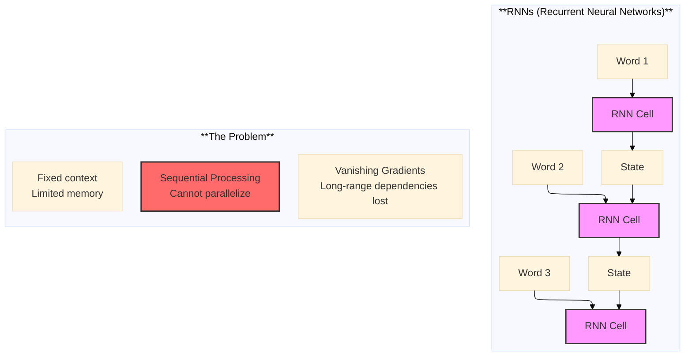

# To understand why Transformers revolutionized AI, 

```mermaid
---
config:
  theme: base
  layout: elk
---
graph TD
    subgraph "**RNNs (Recurrent Neural Networks)**"
        X1[Word 1] --> R1[RNN Cell]
        R1 --> H1[State]
        H1 --> R2[RNN Cell]
        X2[Word 2] --> R2
        R2 --> H2[State]
        H2 --> R3[RNN Cell]
        X3[Word 3] --> R3
    end
    
    subgraph "**The Problem**"
        P1[Sequential Processing<br/>Cannot parallelize]
        P2[Vanishing Gradients<br/>Long-range dependencies lost]
        P3[Fixed context<br/>Limited memory]
    end
    
    style R1 fill:#f9f,stroke:#333,stroke-width:2px
    style R2 fill:#f9f,stroke:#333,stroke-width:2px
    style R3 fill:#f9f,stroke:#333,stroke-width:2px
    style P1 fill:#ff6b6b,stroke:#333,stroke-width:2px
```
