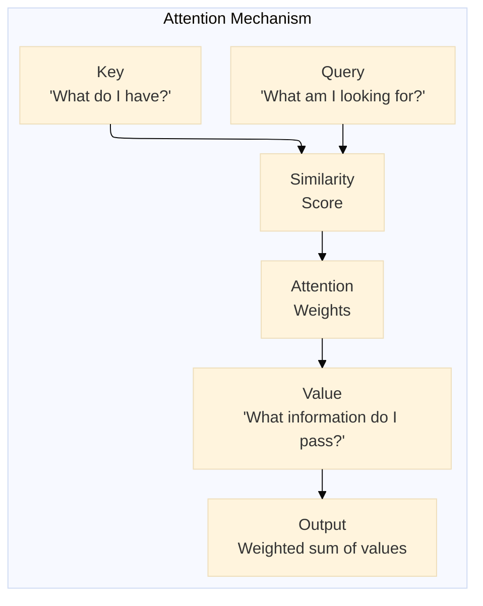

# The core insight: Instead of processing sequential

```mermaid
---
config:
  theme: base
  layout: elk
---
graph TD
    subgraph Attention["Attention Mechanism"]
        Q["Query\n'What am I looking for?'"] --> S["Similarity\nScore"]
        K["Key\n'What do I have?'"] --> S
        S --> A["Attention\nWeights"]
        A --> V["Value\n'What information do I pass?'"]
        V --> O["Output\nWeighted sum of values"]
    end

```
