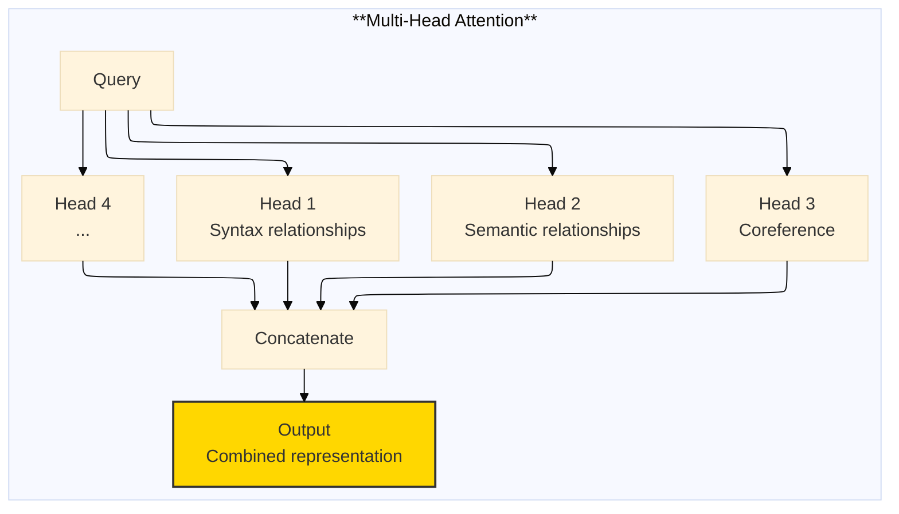

# Single attention can only capture one type of rela

```mermaid
---
config:
  theme: base
  layout: elk
---
graph TD
    subgraph "**Multi-Head Attention**"
        Q[Query] --> H1[Head 1<br/>Syntax relationships]
        Q --> H2[Head 2<br/>Semantic relationships]
        Q --> H3[Head 3<br/>Coreference]
        Q --> H4[Head 4<br/>...]
        
        H1 --> C[Concatenate]
        H2 --> C
        H3 --> C
        H4 --> C
        
        C --> O[Output<br/>Combined representation]
    end
    
    style O fill:#ffd700,stroke:#333,stroke-width:2px
```
