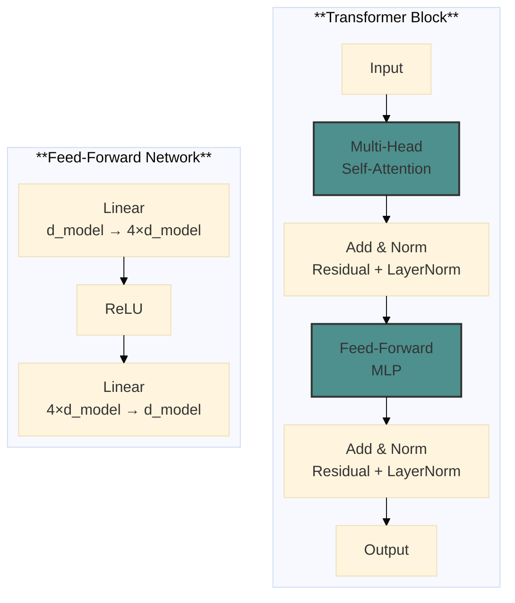

# Now let's assemble the complete Transformer block.

```mermaid
---
config:
  theme: base
  layout: elk
---
graph TD
    subgraph "**Transformer Block**"
        I[Input] --> A[Multi-Head<br/>Self-Attention]
        A --> A1[Add & Norm<br/>Residual + LayerNorm]
        A1 --> F[Feed-Forward<br/>MLP]
        F --> F1[Add & Norm<br/>Residual + LayerNorm]
        F1 --> O[Output]
    end
    
    subgraph "**Feed-Forward Network**"
        F2[Linear<br/>d_model → 4×d_model] --> R[ReLU]
        R --> F3[Linear<br/>4×d_model → d_model]
    end
    
    style A fill:#4d908e,stroke:#333,stroke-width:2px
    style F fill:#4d908e,stroke:#333,stroke-width:2px
```
