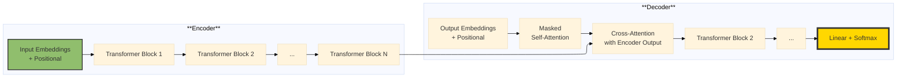

# The original Transformer had two parts: encoder (r

```mermaid
---
config:
  theme: base
  layout: elk
---
graph LR
    subgraph "**Encoder**"
        I1[Input Embeddings<br/>+ Positional] --> E1[Transformer Block 1]
        E1 --> E2[Transformer Block 2]
        E2 --> E3[...]
        E3 --> E4[Transformer Block N]
    end
    
    subgraph "**Decoder**"
        O1[Output Embeddings<br/>+ Positional] --> D1[Masked<br/>Self-Attention]
        D1 --> D2[Cross-Attention<br/>with Encoder Output]
        D2 --> D3[Transformer Block 2]
        D3 --> D4[...]
        D4 --> D5[Linear + Softmax]
    end
    
    E4 --> D2
    
    style I1 fill:#90be6d,stroke:#333,stroke-width:2px
    style D5 fill:#ffd700,stroke:#333,stroke-width:4px
```
