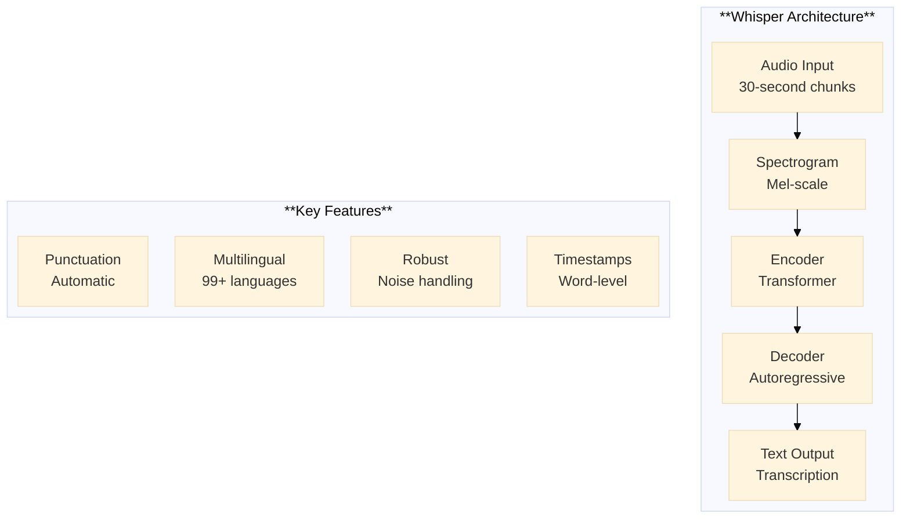

# Whisper is OpenAI's open-source speech recognition

```mermaid
---
config:
  theme: base
  layout: elk
---
graph TD
    subgraph "**Whisper Architecture**"
        A[Audio Input<br/>30-second chunks] --> S[Spectrogram<br/>Mel-scale]
        S --> E[Encoder<br/>Transformer]
        E --> D[Decoder<br/>Autoregressive]
        D --> T[Text Output<br/>Transcription]
    end
    
    subgraph "**Key Features**"
        F1[Multilingual<br/>99+ languages]
        F2[Robust<br/>Noise handling]
        F3[Punctuation<br/>Automatic]
        F4[Timestamps<br/>Word-level]
    end
```
