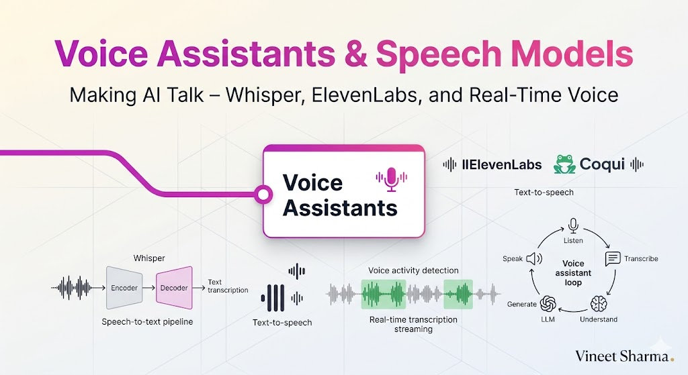

# The 2026 AI Metromap: Voice Assistants & Speech Models – Making AI Talk

## Series E: Applied AI & Agents Line | Story 4 of 15+




## 📖 Introduction

**Welcome to the fourth stop on the Applied AI & Agents Line.**

In our last three stories, we mastered prompt engineering, RAG, and AI agents. Your systems can now answer questions about any document, reason step by step, and take autonomous actions using tools. Your AI is smart, knowledgeable, and capable.

But there's one interface you haven't mastered yet: **voice**.

Text is powerful, but voice is natural. Voice is the way humans have communicated for millennia. A voice assistant can help while you're driving, cooking, or exercising. A voice interface can reach people who struggle with text—children, elderly, visually impaired. Voice is the most accessible and intuitive interface for AI.

In 2026, voice AI has matured dramatically. Models like Whisper achieve near-human transcription accuracy. Text-to-speech models sound indistinguishable from humans. And with real-time streaming, conversations feel natural and fluid.

This story—**The 2026 AI Metromap: Voice Assistants & Speech Models – Making AI Talk**—is your guide to building voice-powered AI applications. We'll master speech-to-text with Whisper—transcribing audio with remarkable accuracy. We'll explore text-to-speech with ElevenLabs and Coqui—generating natural, expressive voices. We'll implement voice activity detection for real-time interaction. And we'll build a complete voice assistant that listens, understands, and speaks back.

**Let's make AI talk.**

---

## 📚 Where You Are in the Journey

### The Master Story Arc: The 2026 AI Metromap Series (Complete)

- 🗺️ **[The 2026 AI Metromap: Why the Old Learning Routes Are Obsolete](#)** – A paradigm shift from linear learning to transit-system mastery.
- 🧭 **[The 2026 AI Metromap: Reading the Map](#)** – Strategic navigation across the three core lines.
- 🎒 **[The 2026 AI Metromap: Avoiding Derailments](#)** – Diagnosing and preventing the most common learning pitfalls.
- 🏁 **[The 2026 AI Metromap: From Passenger to Driver](#)** – Building your portfolio using the Metromap structure.

### Series A: Foundations Station (Complete)
### Series B: Supervised Learning Line (Complete)
### Series C: Modern Architecture Line (Complete)
### Series D: Engineering & Optimization Yard (Complete)

### Series E: Applied AI & Agents Line (15+ Stories)

- 💬 **[The 2026 AI Metromap: Prompt Engineering 101 – The Art of Talking to AI](#)** – System prompts; few-shot prompting; chain-of-thought; tree of thoughts; self-consistency; prompt templates; building robust prompts for production.

- 📚 **[The 2026 AI Metromap: RAG – Retrieval-Augmented Generation for Knowledge-Intensive Tasks](#)** – Vector databases (Chroma, Pinecone, Weaviate, Milvus); embedding models; semantic search; hybrid search; reranking; building a document Q&A system.

- 🤖 **[The 2026 AI Metromap: AI Agents & Autonomous Workflows – The Self-Driving Trains](#)** – Agent architectures (ReAct, Plan-and-Execute, AutoGPT); tool use and function calling; multi-agent systems; memory management.

- 🗣️ **The 2026 AI Metromap: Voice Assistants & Speech Models – Making AI Talk** – Speech-to-text (Whisper); text-to-speech (ElevenLabs, Coqui); voice activity detection; real-time transcription. **⬅️ YOU ARE HERE**

**Computer Vision**
- 👁️ **[The 2026 AI Metromap: Computer Vision Projects – From OCR to Face Recognition](#)** – Optical character recognition (Tesseract, TrOCR); face detection and recognition; object detection (YOLO, DETR); image segmentation. 🔜 *Up Next*

- 🎨 **[The 2026 AI Metromap: Image Generation & Editing – Diffusion Models in Practice](#)** – Stable diffusion pipelines; ControlNet; inpainting; outpainting; image-to-image; fine-tuning diffusion models with DreamBooth.

**NLP & Specialized Tasks**
- 🔤 **[The 2026 AI Metromap: NLP Tasks – NER, Translation, Summarization, and Beyond](#)** – Named entity recognition; machine translation; text summarization (extractive and abstractive); sentiment analysis.

- 📈 **[The 2026 AI Metromap: Time Series Forecasting – ARIMA, LSTM, and Transformers](#)** – Classical methods (ARIMA, SARIMA); LSTM networks; Transformer for time series; forecasting stock prices, weather, and demand.

- 👍 **[The 2026 AI Metromap: Recommendation Systems – From Collaborative Filtering to Two-Tower Networks](#)** – Content-based filtering; collaborative filtering; matrix factorization; neural collaborative filtering; two-tower architectures.

**Industry Applications**
- 🏥 **[The 2026 AI Metromap: AI in Healthcare – Medical Research, Diagnostics, and Wellness](#)** – Medical imaging; EHR analysis; drug discovery; clinical decision support; regulatory considerations.

- 💰 **[The 2026 AI Metromap: AI in Finance – Banking, Insurance, and Trading](#)** – Fraud detection; algorithmic trading; credit scoring; risk management; explainable AI for compliance.

- 🎮 **[The 2026 AI Metromap: AI in Gaming, VR/AR, and Entertainment](#)** – Procedural content generation; NPC behavior with LLMs; AI-driven storytelling; game testing automation.

- 🏭 **[The 2026 AI Metromap: AI in Robotics, Manufacturing, and Supply Chain](#)** – Computer vision for quality control; predictive maintenance; autonomous navigation; warehouse optimization.

- 🌱 **[The 2026 AI Metromap: AI for Social Good – Climate Action, Agriculture, and Sustainability](#)** – Crop yield prediction; climate modeling; energy optimization; wildlife conservation; disaster response.

- 🎓 **[The 2026 AI Metromap: AI in Education – Personalized Learning and Training](#)** – Intelligent tutoring systems; automated grading; personalized content recommendation; adaptive learning paths.

### The Complete Story Catalog

For a complete view of all upcoming stories across every series, visit the **[Complete 2026 AI Metromap Story Catalog](#)**.

---

## 🎙️ Speech-to-Text: Whisper and Beyond

Whisper is OpenAI's open-source speech recognition model that achieves near-human accuracy across multiple languages.

```mermaid
```

](images/diagram_01_whisper-is-openais-open-source-speech-recognition-eb61.png)

[View Source](https://github.com/Vineet-Sharma-Medium-Stories/Medium-Assets/blob/main/the-2026-ai-metromap-voice-assistants--speech-models--making-ai-talk/diagram_01_whisper-is-openais-open-source-speech-recognition-eb61.md)


```python
def whisper_stt():
    """Implement speech-to-text with Whisper"""
    
    print("="*60)
    print("SPEECH-TO-TEXT WITH WHISPER")
    print("="*60)
    
    print("""
    # Install Whisper
    pip install openai-whisper
    
    # Basic transcription
    import whisper
    
    model = whisper.load_model("base")  # tiny, base, small, medium, large
    
    result = model.transcribe("audio.mp3")
    print(result["text"])
    
    # With word-level timestamps
    result = model.transcribe("audio.mp3", word_timestamps=True)
    for segment in result["segments"]:
        print(f"{segment['start']:.2f}s - {segment['end']:.2f}s: {segment['text']}")
    
    # Different model sizes
    models = {
        "tiny": "39M params, fastest, lower accuracy",
        "base": "74M params, good balance",
        "small": "244M params, better accuracy",
        "medium": "769M params, high accuracy",
        "large": "1.55B params, best accuracy"
    }
    
    # For different languages
    result = model.transcribe("audio.mp3", language="fr")  # French
    result = model.transcribe("audio.mp3", language="es")  # Spanish
    
    # Translation (any language to English)
    result = model.transcribe("audio.mp3", task="translate")
    
    # For long audio (>30 seconds), Whisper handles chunking automatically
    """)
    
    print("\n" + "="*60)
    print("WHISPER API (CLOUD)")
    print("="*60)
    
    print("""
    # Using OpenAI's API
    import openai
    
    audio_file = open("audio.mp3", "rb")
    transcript = openai.Audio.transcribe(
        model="whisper-1",
        file=audio_file,
        response_format="json",
        language="en"
    )
    
    print(transcript.text)
    """)
    
    print("\n" + "="*60)
    print("BEST PRACTICES")
    print("="*60)
    practices = [
        "• Use 'large' model for highest accuracy in production",
        "• For real-time, use 'base' or 'small' for speed",
        "• Pre-process audio: normalize volume, remove noise",
        "• Use word_timestamps=True for alignment",
        "• For long audio, split into chunks with overlap",
        "• Consider WhisperX for faster, more accurate alignment"
    ]
    for p in practices:
        print(f"  {p}")

whisper_stt()
```

---

## 🔊 Text-to-Speech: ElevenLabs, Coqui, and More

Text-to-speech models generate natural, expressive voices from text.

```python
def text_to_speech():
    """Implement text-to-speech with various engines"""
    
    print("="*60)
    print("TEXT-TO-SPEECH ENGINES")
    print("="*60)
    
    print("\n" + "="*60)
    print("ELEVENLABS API (CLOUD)")
    print("="*60)
    
    print("""
    # Install: pip install elevenlabs
    
    from elevenlabs import generate, play, set_api_key
    
    set_api_key("YOUR_API_KEY")
    
    # Generate speech
    audio = generate(
        text="Hello! Welcome to the voice assistant.",
        voice="Rachel",  # Rachel, Adam, Antoni, etc.
        model="eleven_monolingual_v1"
    )
    
    # Play audio
    play(audio)
    
    # Save to file
    with open("output.mp3", "wb") as f:
        f.write(audio)
    
    # Voice settings
    audio = generate(
        text="I am excited about voice AI!",
        voice="Rachel",
        model="eleven_turbo_v2",  # Faster, lower latency
        voice_settings={
            "stability": 0.5,      # Voice stability (0-1)
            "similarity_boost": 0.75  # Voice similarity (0-1)
        }
    )
    """)
    
    print("\n" + "="*60)
    print("COQUI TTS (OPEN SOURCE)")
    print("="*60)
    
    print("""
    # Install: pip install TTS
    
    from TTS.api import TTS
    
    # Load model
    tts = TTS(model_name="tts_models/en/ljspeech/tacotron2-DDC")
    
    # Generate speech
    tts.tts_to_file(
        text="Hello, this is an open-source voice assistant.",
        file_path="output.wav"
    )
    
    # With specific voice (XTTS model for voice cloning)
    tts = TTS(model_name="tts_models/multilingual/multi-dataset/xtts_v2")
    
    tts.tts_to_file(
        text="This uses voice cloning technology.",
        speaker_wav="reference_voice.wav",  # Voice to clone
        language="en",
        file_path="cloned_output.wav"
    )
    
    # Available models
    # - tacotron2: Good quality, English only
    # - xtts_v2: Multilingual, voice cloning
    # - vits: Fast, good quality
    """)
    
    print("\n" + "="*60)
    print("VOICE COMPARISON")
    print("="*60)
    
    comparison = [
        ("ElevenLabs", "Cloud API", "Natural, expressive", "$", "Commercial"),
        ("Coqui TTS", "Local/OSS", "Good, voice cloning", "Free", "Open source"),
        ("Microsoft Edge TTS", "API", "Good, many voices", "Free", "Limited control"),
        ("Amazon Polly", "Cloud", "Professional", "$$", "Enterprise"),
        ("Google Cloud TTS", "Cloud", "Natural, WaveNet", "$$", "Enterprise")
    ]
    
    print(f"\n{'Engine':<15} {'Type':<10} {'Quality':<20} {'Cost':<8} {'Use Case':<15}")
    print("-"*70)
    for name, type_, quality, cost, use in comparison:
        print(f"{name:<15} {type_:<10} {quality:<20} {cost:<8} {use:<15}")

text_to_speech()
```

---

## 🎤 Voice Activity Detection (VAD)

VAD detects when someone is speaking, essential for real-time voice assistants.

```python
def voice_activity_detection():
    """Implement voice activity detection"""
    
    print("="*60)
    print("VOICE ACTIVITY DETECTION")
    print("="*60)
    
    print("""
    # Using WebRTC VAD (lightweight)
    import webrtcvad
    import wave
    
    # Initialize VAD
    vad = webrtcvad.Vad(2)  # Aggressiveness: 0-3
    
    # Read audio (must be 16-bit PCM, 16000 Hz)
    with wave.open('audio.wav', 'rb') as wf:
        frames = wf.readframes(wf.getnframes())
    
    # Detect speech in frames (30ms frames)
    frame_duration = 30  # ms
    frame_size = int(16000 * frame_duration / 1000) * 2
    
    is_speech = []
    for i in range(0, len(frames), frame_size):
        frame = frames[i:i+frame_size]
        if len(frame) == frame_size:
            is_speech.append(vad.is_speech(frame, 16000))
    
    # Alternative: Silero VAD (more accurate, neural)
    import torch
    import torchaudio
    
    # Load Silero VAD
    model, utils = torch.hub.load(
        repo_or_dir='snakers4/silero-vad',
        model='silero_vad',
        force_reload=False
    )
    
    (get_speech_timestamps, _, _, _, _) = utils
    
    # Get speech timestamps
    wav = torchaudio.load('audio.wav')[0]
    speech_timestamps = get_speech_timestamps(
        wav,
        model,
        sampling_rate=16000,
        threshold=0.5
    )
    
    for ts in speech_timestamps:
        print(f"Speech: {ts['start']/16000:.2f}s - {ts['end']/16000:.2f}s")
    """)
    
    print("\n" + "="*60)
    print("VAD COMPARISON")
    print("="*60)
    
    comparison = [
        ("WebRTC VAD", "Traditional", "Fast, low CPU", "Good", "Simple threshold"),
        ("Silero VAD", "Neural", "Accurate, robust", "Excellent", "Real-time"),
        ("pyannote.audio", "Deep Learning", "Speaker diarization", "High", "Batch processing")
    ]
    
    print(f"\n{'Method':<15} {'Type':<12} {'Pros':<20} {'Accuracy':<10} {'Use'}")
    print("-"*70)
    for method, type_, pros, acc, use in comparison:
        print(f"{method:<15} {type_:<12} {pros:<20} {acc:<10} {use}")

voice_activity_detection()
```

---

## 🎙️ Building a Complete Voice Assistant

Let's build a complete voice assistant that listens, understands, and speaks.

```python
def voice_assistant():
    """Complete voice assistant implementation"""
    
    print("="*60)
    print("COMPLETE VOICE ASSISTANT")
    print("="*60)
    
    print("""
    import whisper
    import pyaudio
    import numpy as np
    import webrtcvad
    from TTS.api import TTS
    import openai
    
    class VoiceAssistant:
        \"\"\"End-to-end voice assistant\"\"\"
        
        def __init__(self):
            # Speech-to-text
            self.stt = whisper.load_model("base")
            
            # Voice activity detection
            self.vad = webrtcvad.Vad(2)
            
            # Text-to-speech
            self.tts = TTS(model_name="tts_models/en/ljspeech/tacotron2-DDC")
            
            # Language model (using OpenAI)
            self.llm = openai.ChatCompletion
        
        def listen(self):
            \"\"\"Listen for user speech\"\"\"
            
            # Audio recording parameters
            FORMAT = pyaudio.paInt16
            CHANNELS = 1
            RATE = 16000
            CHUNK = int(RATE * 0.03)  # 30ms frames
            
            audio = pyaudio.PyAudio()
            stream = audio.open(
                format=FORMAT,
                channels=CHANNELS,
                rate=RATE,
                input=True,
                frames_per_buffer=CHUNK
            )
            
            print("Listening...")
            frames = []
            speaking = False
            
            while True:
                frame = stream.read(CHUNK)
                is_speech = self.vad.is_speech(frame, RATE)
                
                if is_speech and not speaking:
                    print("Speech detected")
                    speaking = True
                    frames = [frame]
                elif is_speech and speaking:
                    frames.append(frame)
                elif not is_speech and speaking:
                    # Silence detected, stop recording
                    print("Processing...")
                    break
            
            stream.stop_stream()
            stream.close()
            
            # Convert frames to numpy array
            audio_data = np.frombuffer(b''.join(frames), dtype=np.int16)
            
            # Save temporary file
            with open("temp_audio.wav", "wb") as f:
                f.write(audio_data.tobytes())
            
            # Transcribe
            result = self.stt.transcribe("temp_audio.wav")
            text = result["text"].strip()
            
            print(f"User: {text}")
            return text
        
        def understand(self, text):
            \"\"\"Process user query\"\"\"
            
            # Add context
            messages = [
                {"role": "system", "content": "You are a helpful voice assistant. Be concise."},
                {"role": "user", "content": text}
            ]
            
            # Generate response
            response = self.llm.create(
                model="gpt-4",
                messages=messages,
                max_tokens=100,
                temperature=0.7
            )
            
            reply = response.choices[0].message.content
            print(f"Assistant: {reply}")
            return reply
        
        def speak(self, text):
            \"\"\"Convert text to speech\"\"\"
            self.tts.tts_to_file(text=text, file_path="response.wav")
            
            # Play audio
            import playsound
            playsound.playsound("response.wav")
        
        def run(self):
            \"\"\"Main loop\"\"\"
            print("Voice Assistant Ready. Say 'exit' to quit.")
            
            while True:
                # Listen
                text = self.listen()
                
                if "exit" in text.lower():
                    print("Goodbye!")
                    break
                
                # Understand
                reply = self.understand(text)
                
                # Speak
                self.speak(reply)
    
    # Run assistant
    assistant = VoiceAssistant()
    assistant.run()
    """)
    
    print("\n" + "="*60)
    print("REAL-TIME ENHANCEMENTS")
    print("="*60)
    enhancements = [
        "• Streaming transcription (partial results)",
        "• Wake word detection ('Hey Assistant')",
        "• Multi-turn conversation context",
        "• Emotion detection from voice",
        "• Voice identification (who is speaking)",
        "• Noise cancellation and echo reduction"
    ]
    for e in enhancements:
        print(f"  {e}")

voice_assistant()
```

---

## 🚀 Real-Time Streaming Transcription

For truly interactive voice assistants, you need real-time transcription.

```python
def streaming_transcription():
    """Implement real-time streaming transcription"""
    
    print("="*60)
    print("REAL-TIME STREAMING TRANSCRIPTION")
    print("="*60)
    
    print("""
    import whisper
    import pyaudio
    import numpy as np
    import threading
    from queue import Queue
    
    class StreamingTranscriber:
        \"\"\"Real-time streaming speech-to-text\"\"\"
        
        def __init__(self):
            self.model = whisper.load_model("base")
            self.audio_queue = Queue()
            self.running = True
        
        def audio_capture(self):
            \"\"\"Capture audio in background thread\"\"\"
            FORMAT = pyaudio.paInt16
            CHANNELS = 1
            RATE = 16000
            CHUNK = int(RATE * 1)  # 1-second chunks
            
            audio = pyaudio.PyAudio()
            stream = audio.open(
                format=FORMAT,
                channels=CHANNELS,
                rate=RATE,
                input=True,
                frames_per_buffer=CHUNK
            )
            
            while self.running:
                data = stream.read(CHUNK)
                self.audio_queue.put(data)
            
            stream.stop_stream()
            stream.close()
        
        def transcribe_stream(self):
            \"\"\"Process audio chunks and transcribe\"\"\"
            audio_buffer = []
            
            while self.running:
                if not self.audio_queue.empty():
                    chunk = self.audio_queue.get()
                    audio_buffer.append(chunk)
                    
                    # Process every 3 seconds
                    if len(audio_buffer) >= 3:
                        combined = b''.join(audio_buffer)
                        audio_array = np.frombuffer(combined, dtype=np.int16).astype(np.float32) / 32768.0
                        
                        result = self.model.transcribe(audio_array, language="en")
                        print(f"Partial: {result['text']}")
                        
                        # Keep last 1 second for context
                        audio_buffer = audio_buffer[-1:]
        
        def start(self):
            \"\"\"Start streaming transcription\"\"\"
            capture_thread = threading.Thread(target=self.audio_capture)
            transcribe_thread = threading.Thread(target=self.transcribe_stream)
            
            capture_thread.start()
            transcribe_thread.start()
            
            try:
                while True:
                    pass
            except KeyboardInterrupt:
                self.running = False
                capture_thread.join()
                transcribe_thread.join()
    
    # Using faster-whisper for lower latency
    from faster_whisper import WhisperModel
    
    model = WhisperModel("base", device="cpu", compute_type="int8")
    
    segments, info = model.transcribe("audio.wav", beam_size=5)
    for segment in segments:
        print(f"[{segment.start:.2f}s -> {segment.end:.2f}s] {segment.text}")
    """)
    
    print("\n" + "="*60)
    print("LATENCY OPTIMIZATION")
    print("="*60)
    optimizations = [
        "• Use 'tiny' or 'base' model for faster inference",
        "• Process audio in overlapping chunks (1-3 seconds)",
        "• Use faster-whisper (CTranslate2) for 4x speedup",
        "• Run on GPU for 10x faster processing",
        "• Use streaming APIs (OpenAI Realtime API)"
    ]
    for opt in optimizations:
        print(f"  {opt}")

streaming_transcription()
```

---

## 🧠 Voice-Aware Agents

Combine voice with agents for truly interactive assistants.

```python
def voice_agents():
    """Combine voice with agent capabilities"""
    
    print("="*60)
    print("VOICE-AWARE AGENTS")
    print("="*60)
    
    print("""
    class VoiceAgent:
        \"\"\"Voice-enabled autonomous agent\"\"\"
        
        def __init__(self):
            self.stt = whisper.load_model("base")
            self.tts = TTS(model_name="tts_models/en/ljspeech/tacotron2-DDC")
            self.agent = ReActAgent(tools=[
                SearchTool(),
                CalculatorTool(),
                WeatherTool(),
                CalendarTool()
            ])
            self.conversation_history = []
        
        def process_voice_query(self, audio_file):
            \"\"\"Process voice input through agent\"\"\"
            
            # 1. Transcribe
            text = self.stt.transcribe(audio_file)["text"]
            print(f"User: {text}")
            
            # 2. Add to conversation
            self.conversation_history.append({"role": "user", "content": text})
            
            # 3. Run agent (may use multiple tools)
            result = self.agent.run(text, context=self.conversation_history)
            
            # 4. Add to conversation
            self.conversation_history.append({"role": "assistant", "content": result})
            
            # 5. Generate speech
            self.tts.tts_to_file(text=result, file_path="response.wav")
            
            return result
        
        def wake_word_detection(self):
            \"\"\"Detect wake word\"\"\"
            # Using Porcupine for wake word detection
            import pvporcupine
            
            porcupine = pvporcupine.create(
                keywords=["computer", "assistant", "hey google"],
                sensitivities=[0.5, 0.5, 0.5]
            )
            
            # Audio capture loop
            while True:
                pcm = get_audio_frame()
                keyword_index = porcupine.process(pcm)
                
                if keyword_index >= 0:
                    print("Wake word detected!")
                    return True
    
    # Example: Multi-modal agent with voice
    class MultiModalAgent:
        \"\"\"Agent that can see, hear, and speak\"\"\"
        
        def __init__(self):
            self.vision = CLIPModel()
            self.speech = whisper.load_model("base")
            self.llm = openai.ChatCompletion
        
        def process(self, audio_file, image_file=None):
            # Transcribe speech
            text = self.speech.transcribe(audio_file)["text"]
            
            # If image provided, analyze
            if image_file:
                image_description = self.vision.describe(image_file)
                context = f"Image shows: {image_description}"
            else:
                context = ""
            
            # Generate response
            response = self.llm.create(
                model="gpt-4",
                messages=[
                    {"role": "system", "content": f"Context: {context}"},
                    {"role": "user", "content": text}
                ]
            )
            
            return response.choices[0].message.content
    """)
    
    print("\n" + "="*60)
    print("VOICE AGENT CAPABILITIES")
    print("="*60)
    caps = [
        "• Wake word detection ('Hey Assistant')",
        "• Multi-turn conversation with context",
        "• Tool use via voice commands",
        "• Emotion detection from voice tone",
        "• Voice identification (personalization)",
        "• Real-time interruption handling"
    ]
    for cap in caps:
        print(f"  {cap}")

voice_agents()
```

---

## 📊 Evaluation and Optimization

```python
def voice_evaluation():
    """Evaluate and optimize voice systems"""
    
    print("="*60)
    print("VOICE SYSTEM EVALUATION")
    print("="*60)
    
    print("\n" + "="*60)
    print("KEY METRICS")
    print("="*60)
    
    metrics = [
        ("Word Error Rate (WER)", "STT accuracy", "Lower is better (<5% good)"),
        ("Real-Time Factor (RTF)", "Speed", "Lower is better (<1.0 real-time)"),
        ("Mean Opinion Score (MOS)", "Voice quality", "Higher is better (4-5 good)"),
        ("Latency", "End-to-end delay", "Lower is better (<500ms good)"),
        ("Task Success Rate", "Understanding", "Higher is better (>90% good)")
    ]
    
    print(f"\n{'Metric':<25} {'Measures':<20} {'Target':<20}")
    print("-"*70)
    for metric, measure, target in metrics:
        print(f"{metric:<25} {measure:<20} {target:<20}")
    
    print("\n" + "="*60)
    print("OPTIMIZATION STRATEGIES")
    print("="*60)
    
    optimizations = [
        "STT: Use faster-whisper (4x speedup), run on GPU",
        "TTS: Cache common phrases, pre-generate responses",
        "VAD: Adjust aggressiveness based on environment",
        "Pipeline: Parallelize STT and TTS with agent processing",
        "Streaming: Use partial results for faster feedback"
    ]
    
    for opt in optimizations:
        print(f"  • {opt}")
    
    print("\n" + "="*60)
    print("HARDWARE RECOMMENDATIONS")
    print("="*60)
    
    hardware = [
        ("Local", "CPU", "Raspberry Pi", "Basic, high latency"),
        ("Local", "GPU (NVIDIA)", "RTX 3060+", "Real-time, good quality"),
        ("Cloud", "GPU", "AWS EC2, RunPod", "Best quality, scalable")
    ]
    
    print(f"\n{'Deployment':<10} {'Hardware':<12} {'Example':<15} {'Latency':<15}")
    print("-"*55)
    for dep, hw, ex, lat in hardware:
        print(f"{dep:<10} {hw:<12} {ex:<15} {lat:<15}")

voice_evaluation()
```

---

## 📊 Takeaway from This Story

**What You Learned:**

- **Speech-to-Text with Whisper** – OpenAI's open-source model. Near-human accuracy. Multiple model sizes (tiny to large). Word-level timestamps.

- **Text-to-Speech** – ElevenLabs (cloud, natural), Coqui TTS (open source, voice cloning), Cloud APIs (Polly, Google). Choose based on quality, cost, and control needs.

- **Voice Activity Detection** – WebRTC VAD (lightweight), Silero VAD (neural, accurate). Essential for real-time interaction.

- **Complete Voice Assistant** – Listen → Transcribe → Understand → Generate → Speak. End-to-end pipeline with streaming.

- **Real-Time Transcription** – Streaming with overlapping chunks. faster-whisper for 4x speedup. Partial results for low latency.

- **Voice-Aware Agents** – Combine voice with agent capabilities. Wake word detection, multi-turn conversation, tool use by voice.

- **Evaluation** – WER, RTF, MOS, latency, task success. Optimize for speed and quality based on use case.

---

## 🔗 Navigation

- **⬅️ Previous Story:** [The 2026 AI Metromap: AI Agents & Autonomous Workflows – The Self-Driving Trains](#)

- **📚 Series E Catalog:** [Series E: Applied AI & Agents Line](#) – View all 15+ stories in this series.

- **📚 Complete Story Catalog:** [Complete 2026 AI Metromap Story Catalog](#) – Your navigation guide to all 39+ stories.

- **➡️ Next Story:** **[The 2026 AI Metromap: Computer Vision Projects – From OCR to Face Recognition](#)** – Optical character recognition (Tesseract, TrOCR); face detection and recognition; object detection (YOLO, DETR); image segmentation.

---

## 📝 Your Invitation

Before the next story arrives, build a voice assistant:

1. **Set up Whisper** – Install whisper and transcribe an audio file. Test different model sizes.

2. **Implement TTS** – Use ElevenLabs or Coqui to generate speech from text. Experiment with voices.

3. **Add VAD** – Implement voice activity detection. Detect speech segments in audio.

4. **Build the pipeline** – Connect STT → LLM → TTS. Create a basic voice assistant.

5. **Add streaming** – Implement real-time transcription with overlapping chunks.

**You've made AI talk. Next stop: Computer Vision!**

---

*Found this helpful? Clap, comment, and share your voice assistant. Next stop: Computer Vision!* 🚇