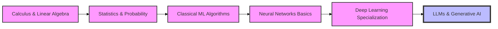

# Traditional AI education looks like this:

```mermaid
---
config:
  theme: base
  layout: elk
---
graph LR
    A[Calculus & Linear Algebra] --> B[Statistics & Probability]
    B --> C[Classical ML Algorithms]
    C --> D[Neural Networks Basics]
    D --> E[Deep Learning Specialization]
    E --> F[LLMs & Generative AI]
    
    style A fill:#f9f,stroke:#333,stroke-width:2px
    style B fill:#f9f,stroke:#333,stroke-width:2px
    style C fill:#f9f,stroke:#333,stroke-width:2px
    style D fill:#f9f,stroke:#333,stroke-width:2px
    style E fill:#f9f,stroke:#333,stroke-width:2px
    style F fill:#bbf,stroke:#333,stroke-width:4px
```
