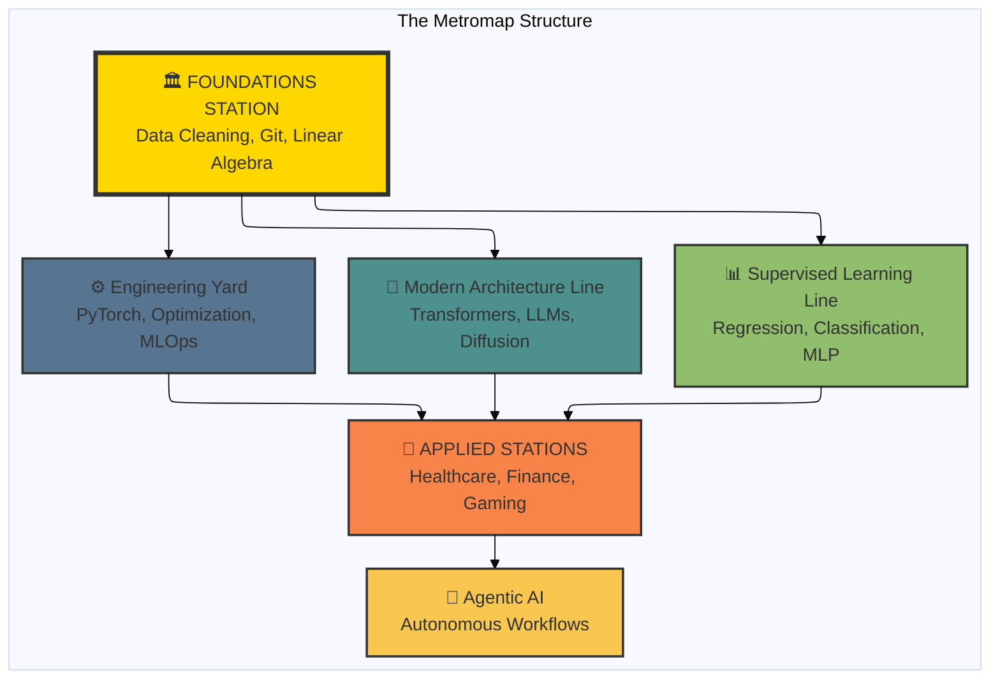

# - **Transfers** – How to move between specialties 

```mermaid
---
config:
  theme: base
  layout: elk
---
graph TD
    subgraph "The Metromap Structure"
        F[🏛️ FOUNDATIONS STATION<br/>Data Cleaning, Git, Linear Algebra] 
        
        F --> S[📊 Supervised Learning Line<br/>Regression, Classification, MLP]
        F --> M[🚀 Modern Architecture Line<br/>Transformers, LLMs, Diffusion]
        F --> E[⚙️ Engineering Yard<br/>PyTorch, Optimization, MLOps]
        
        S --> A[🏥 APPLIED STATIONS<br/>Healthcare, Finance, Gaming]
        M --> A
        E --> A
        
        A --> AG[🤖 Agentic AI<br/>Autonomous Workflows]
    end
    
    style F fill:#ffd700,stroke:#333,stroke-width:4px
    style S fill:#90be6d,stroke:#333,stroke-width:2px
    style M fill:#4d908e,stroke:#333,stroke-width:2px
    style E fill:#577590,stroke:#333,stroke-width:2px
    style A fill:#f9844a,stroke:#333,stroke-width:2px
    style AG fill:#f9c74f,stroke:#333,stroke-width:2px
```
