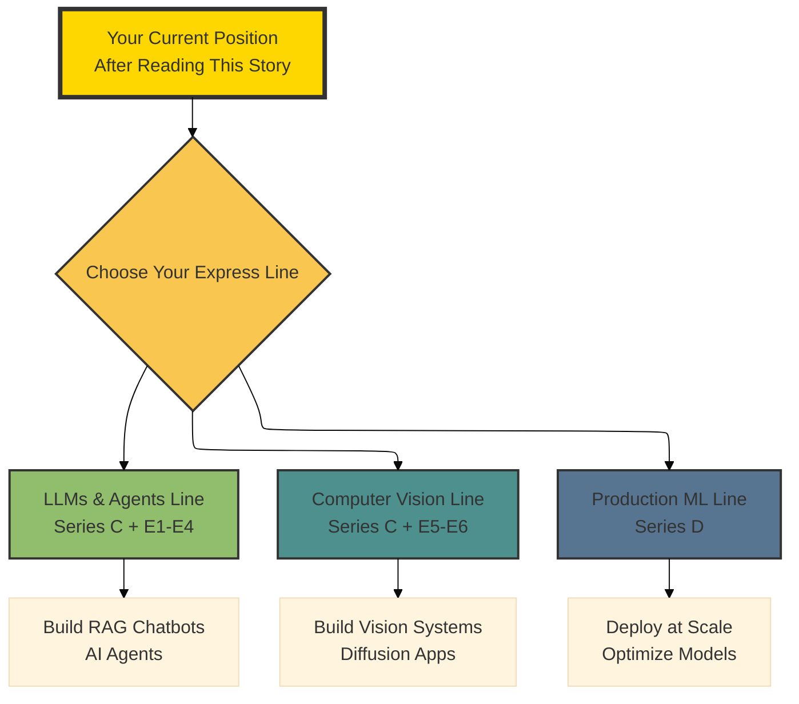

# - A practical framework for choosing your next sta

```mermaid
---
config:
  theme: base
  layout: elk
---
graph TD
    A[Your Current Position<br/>After Reading This Story] --> B{Choose Your Express Line}
    B --> C[LLMs & Agents Line<br/>Series C + E1-E4]
    B --> D[Computer Vision Line<br/>Series C + E5-E6]
    B --> E[Production ML Line<br/>Series D]
    
    C --> F[Build RAG Chatbots<br/>AI Agents]
    D --> G[Build Vision Systems<br/>Diffusion Apps]
    E --> H[Deploy at Scale<br/>Optimize Models]
    
    style A fill:#ffd700,stroke:#333,stroke-width:4px
    style B fill:#f9c74f,stroke:#333,stroke-width:2px
    style C fill:#90be6d,stroke:#333,stroke-width:2px
    style D fill:#4d908e,stroke:#333,stroke-width:2px
    style E fill:#577590,stroke:#333,stroke-width:2px
```
