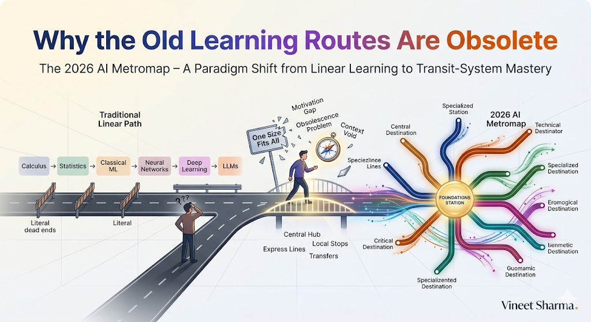
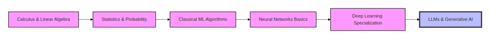
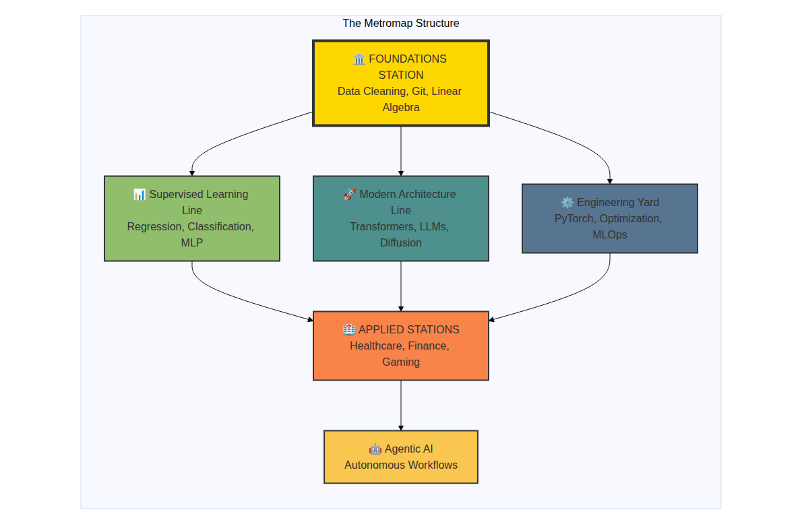
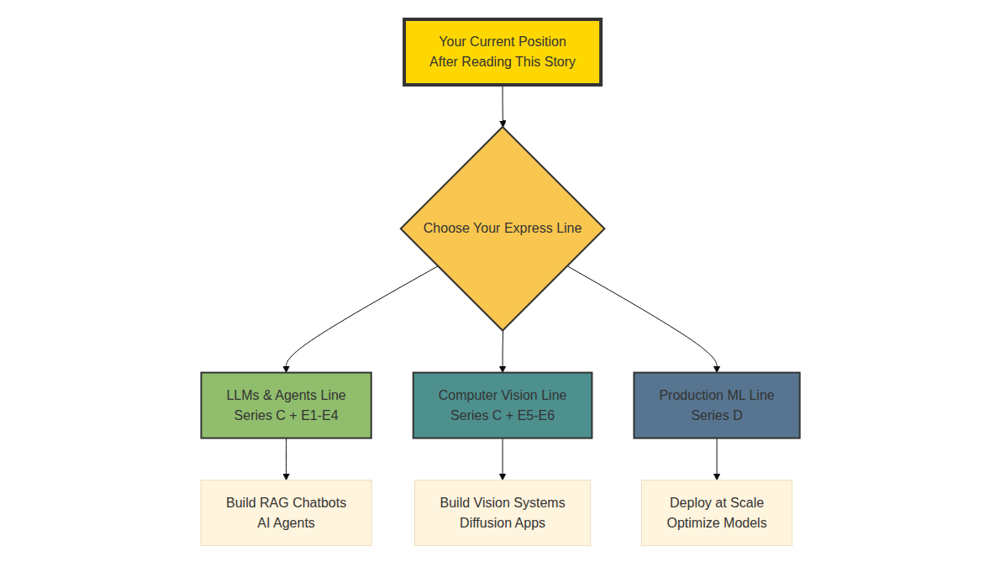

# The 2026 AI Metromap: Why the Old Learning Routes Are Obsolete

## Your First Stop on the Journey




## 📖 Introduction

**Welcome to the first stop of our journey.**

If you're reading this, you've likely felt it—that overwhelming sensation of standing at the base of Mount AI, looking up at an endless peak covered in research papers, frameworks, model releases, and conflicting advice. Every week brings a breakthrough. Every day someone announces "the death of X" or "the birth of Y." The ground beneath your feet shifts constantly.

I've been there. In 2023, I was drowning in tabs—Andrew Ng's course halfway done, a Transformer tutorial open, a diffusion model notebook that wouldn't run, and a LinkedIn feed screaming about "prompt engineering" being the only skill that matters. I was learning, but I wasn't *progressing*.

Then I realized something. **I was treating AI mastery like a highway when it was actually a subway system.**

On a highway, you pick a starting point, drive straight, and eventually reach a destination. It's linear. Predictable. But if you miss your exit, you're lost.

On a subway system, you have:
- **A central hub** where all lines connect
- **Express lines** that get you to advanced topics fast
- **Local lines** that take you deep into specific domains
- **Transfers** that let you switch between specialties

You don't need to know every station. You need to know how to navigate between them.

This story—**The 2026 AI Metromap: Why the Old Learning Routes Are Obsolete**—is the first stop on that subway map. Across this Master Arc and the 30+ deep dives that follow, we'll build a learning system that works *with* the chaos of 2026, not against it. No more paralysis. No more tutorial hell. Just a clear, navigable path from wherever you are to wherever you want to go.

**Let's board the train.**

---

## 📚 Where You Are in the Journey

### The Master Story Arc: The 2026 AI Metromap Series

- 🗺️ **The 2026 AI Metromap: Why the Old Learning Routes Are Obsolete** – A paradigm shift from linear learning to transit-system mastery. We'll diagnose why traditional paths fail, introduce the metromap philosophy, and understand the three pillars of sustainable AI expertise. **⬅️ YOU ARE HERE**

- 🧭 **The 2026 AI Metromap: Reading the Map** – Strategic navigation across the three core lines: Foundations Station (the central hub), Technical Implementation (PyTorch, Transformers, Optimization), and Domain Application (Healthcare, Finance, Gaming). We'll build decision frameworks for when to go deep and when to transfer lines. 🔜 *Up Next*

- 🎒 **The 2026 AI Metromap: Avoiding Derailments** – Diagnosing and preventing the "shiny object syndrome," foundation-skipping disasters, tutorial hell, model obsession without deployment skills, and the comparison trap that kills momentum. 📅 *Planned*

- 🏁 **The 2026 AI Metromap: From Passenger to Driver** – Translating metromap "stops" into portfolio projects that hiring managers actually notice. We'll cover project selection, documentation strategies, GitHub organization, and how to demonstrate depth in one express line while showing breadth across the map. 📅 *Planned*

### The Complete Story Catalog

For a complete view of all upcoming stories across every series, visit the **[Complete 2026 AI Metromap Story Catalog](#)** – your navigation guide to every station on this journey.

---

## 🚂 The 2026 Crisis: Why You Feel Stuck

It's 2026. You open your feed. Within seconds, you're hit with:

- A new **DeepSeek-V4** model outperforming GPT-5
- A **diffusion model** generating Hollywood-quality video
- A **multi-agent framework** promising to automate entire workflows
- A **research paper** on test-time compute rewriting optimization rules
- A **job description** demanding PyTorch, Transformers, RAG, *and* MLOps

Your brain freezes.

**The old question was:** "How do I learn AI?"

**The 2026 question is:** "How do I navigate infinite complexity without drowning?"

This is why the **Metromap to Master AI** exists. Not as another curriculum, but as a **transit system** for your learning journey.

---

## 🗺️ The Problem with Linear Learning

Traditional AI education looks like this:

```mermaid
```



[View Source](https://github.com/Vineet-Sharma-Medium-Stories/Medium-Assets/blob/main/the-2026-ai-metromap-why-the-old-learning-routes-are-obsolete/diagram_01_traditional-ai-education-looks-like-this-6a3a.md)


This worked in 2018. It fails catastrophically in 2026 for three reasons.

**1. The Motivation Gap**

You spend 6 months on abstract math before writing a single line of code that generates text. You're promised a "foundation," but all you feel is boredom. By the time you reach neural networks, the industry has moved on. You quit. Not because you're incapable, but because the path ignored the human need for **visible progress**.

**2. The Obsolescence Problem**

Linear paths are designed for stable fields. AI is not stable. By the time you work through "Classical ML," Transformers have evolved into multimodal architectures. By the time you reach "Deep Learning Specialization," the industry standard has shifted to test-time compute and agentic workflows. You're learning history while the present rushes past.

**3. The Context Void**

You learn algorithms in isolation. Gradient descent exists in a textbook, not connected to the chatbot you want to build. You memorize architecture diagrams without understanding why a healthcare AI needs different constraints than a gaming AI. Knowledge without context is trivia.

---

## 🚇 The Metromap Solution: A Transit System, Not a Highway

Think of AI mastery like navigating a city's metro system. You don't need to know every street and building. You need to know:

- **The Central Hub** – Where all lines connect. Without this, you're lost.
- **The Express Lines** – Fast tracks to the cutting edge.
- **The Local Lines** – Where you actually get off and do real work.
- **Transfers** – How to move between specialties without starting over.

```mermaid
```



[View Source](https://github.com/Vineet-Sharma-Medium-Stories/Medium-Assets/blob/main/the-2026-ai-metromap-why-the-old-learning-routes-are-obsolete/diagram_02_transfers--how-to-move-between-specialties-df06.md)


**The Key Insight:** You don't master everything. You build a strong foundation, pick an express line to specialize, and then expand your reach through transfers.

---

## 🎯 The Three Pillars of Modern AI Mastery

Based on the Metromap structure, every AI professional needs competency in three interconnected pillars. Each pillar contains its own series of stories that you can explore.

---

### 🏛️ Pillar 1: The Foundation (The Non-Negotiables)

These are your **board games**—the skills that make everything else possible. Skipping them guarantees failure.

**Series A: Foundations Station Stories**

- 🏗️ **A1. The 2026 AI Metromap: Foundations Station – Why Data Cleaning and Git Are Your Board Games, Not Just Chores** – Reframing foundational skills as strategic enablers; practical data wrangling; Git workflows for model versioning and experiment tracking; why skipping foundations guarantees failure.

- 🖥️ **A2. The 2026 AI Metromap: Command Line & Version Control – Navigating the Terminal Like a Conductor** – Essential CLI tools (curl, jq, tmux, screen) for AI development; Git branching strategies for collaborative ML projects; SSH and remote GPU training setup.

- 🧮 **A3. The 2026 AI Metromap: Linear Algebra for ML – The Language of the Map** – Vectors, matrices, and tensors explained through intuition; dot products as attention mechanisms; matrix multiplication as neural network layers; eigenvalues and PCA.

- 📊 **A4. The 2026 AI Metromap: Data Cleaning & Visualization – Turning Raw Data into Tracks** – Real-world data wrangling with pandas, polars, and DuckDB; handling missing values, outliers, and imbalanced datasets; visualization with matplotlib, seaborn, and plotly.

- 🔄 **A5. The 2026 AI Metromap: Ethics & Responsible AI – The Safety Systems of the Metro** – Bias detection and mitigation; interpretability with SHAP and LIME; privacy-preserving AI with differential privacy; regulatory compliance (GDPR, EU AI Act).

---

### 📊 Pillar 2: The Core Technologies (Your Express Lines)

You don't need to master all of these simultaneously. Pick one express line based on your goals.

**Series B: Supervised Learning Line Stories**

- 📈 **B1. The 2026 AI Metromap: Regression & Classification – The Grand Central Station of AI** – Linear regression from scratch with gradient descent; logistic regression for classification; evaluation metrics (MSE, MAE, accuracy, precision, recall, F1, ROC-AUC).

- 🧬 **B2. The 2026 AI Metromap: Neural Network Architecture – From Perceptron to MLP** – The biological inspiration; perceptron implementation; multi-layer perceptrons; forward propagation; universal approximation theorem.

- ⚡ **B3. The 2026 AI Metromap: Activation Functions & Backpropagation – The Electrical Grid of the Network** – Sigmoid, tanh, ReLU, Leaky ReLU, Swish, GELU; the chain rule explained visually; backpropagation step-by-step; vanishing and exploding gradients.

- 🎯 **B4. The 2026 AI Metromap: Loss Functions & Optimization – Navigating to the Minimum** – Cross-entropy, MSE, MAE, Huber loss; gradient descent variants (SGD, Momentum, Adam, AdamW); learning rate schedules.

---

**Series C: Modern Architecture Line Stories**

- 📖 **C1. The 2026 AI Metromap: Transformers & Attention – The Station That Changed Everything** – The "Attention Is All You Need" paper decoded; self-attention mechanisms; multi-head attention; positional encoding; encoder-decoder architecture.

- 🤖 **C2. The 2026 AI Metromap: GPT & LLM Architecture – Understanding the Engine of the Express Train** – Decoder-only architecture; causal masking; next token prediction; scaling laws; context windows; emergent abilities.

- 🎨 **C3. The 2026 AI Metromap: Diffusion Models – The Scenic Route to Generative AI** – How diffusion models work; forward diffusion process; reverse denoising; U-Net architecture; stable diffusion; text-to-image, text-to-video, text-to-audio.

- 🌐 **C4. The 2026 AI Metromap: Multimodal Models – The Interchange Stations** – CLIP: connecting images and text; Flamingo: few-shot multimodal learning; Gemini: native multimodality; contrastive learning.

- 🧩 **C5. The 2026 AI Metromap: Fine-Tuning vs. In-Context Learning – When to Train vs. When to Prompt** – Parameter-efficient fine-tuning (LoRA, QLoRA, adapters); instruction tuning; RLHF; in-context learning; few-shot prompting.

- 📚 **C6. The 2026 AI Metromap: Open Source LLMs – LLaMA, Mistral, DeepSeek, and Beyond** – Running LLMs locally; quantization (GGUF, GPTQ); inference optimization; model comparison; open-source ecosystem.

---

**Series D: Engineering & Optimization Yard Stories**

- 🔧 **D1. The 2026 AI Metromap: PyTorch Mastery – The Locomotive of Modern AI** – Tensors and autograd; nn.Module; custom layers; dataloaders; training loops; saving and loading models; TensorBoard.

- 🏭 **D2. The 2026 AI Metromap: TensorFlow & Keras – The Production-Ready Alternative** – Eager execution vs graph mode; tf.data for pipelines; Keras API; TensorFlow Serving; TensorFlow Lite for edge deployment.

- ⚡ **D3. The 2026 AI Metromap: Model Optimization – Keeping the Train on Time** – Quantization (INT8, FP16); pruning; knowledge distillation; model compression; inference optimization with ONNX, TensorRT, and OpenVINO.

- 🛡️ **D4. The 2026 AI Metromap: Batch Norm & Dropout – The Safety Systems of Deep Learning** – Batch normalization implementation; layer normalization; dropout for regularization; preventing overfitting; training stability techniques.

- 📈 **D5. The 2026 AI Metromap: Training Strategies – Learning Rate Scheduling & Beyond** – Learning rate warmup; cosine annealing; cyclical learning rates; gradient accumulation; mixed precision training (AMP); distributed training.

---

### 🏥 Pillar 3: Domain Application (Where You Stop)

This is where you **apply** your skills. Pick one that aligns with your passion and industry demand.

**Series E: Applied AI & Agents Line Stories**

**LLM Applications**

- 💬 **E1. The 2026 AI Metromap: Prompt Engineering 101 – The Art of Talking to AI** – System prompts; few-shot prompting; chain-of-thought; tree of thoughts; self-consistency; prompt templates; building robust prompts for production.

- 📚 **E2. The 2026 AI Metromap: RAG – Retrieval-Augmented Generation for Knowledge-Intensive Tasks** – Vector databases (Chroma, Pinecone, Weaviate, Milvus); embedding models; semantic search; hybrid search; reranking; building a document Q&A system.

- 🤖 **E3. The 2026 AI Metromap: AI Agents & Autonomous Workflows – The Self-Driving Trains** – Agent architectures (ReAct, Plan-and-Execute, AutoGPT); tool use and function calling; multi-agent systems; memory management.

- 🗣️ **E4. The 2026 AI Metromap: Voice Assistants & Speech Models – Making AI Talk** – Speech-to-text (Whisper); text-to-speech (ElevenLabs, Coqui); voice activity detection; real-time transcription; building a voice assistant.

**Computer Vision**

- 👁️ **E5. The 2026 AI Metromap: Computer Vision Projects – From OCR to Face Recognition** – Optical character recognition (Tesseract, TrOCR); face detection and recognition; object detection (YOLO, DETR); image segmentation.

- 🎨 **E6. The 2026 AI Metromap: Image Generation & Editing – Diffusion Models in Practice** – Stable diffusion pipelines; ControlNet; inpainting; outpainting; image-to-image; fine-tuning diffusion models with DreamBooth.

**NLP & Specialized Tasks**

- 🔤 **E7. The 2026 AI Metromap: NLP Tasks – NER, Translation, Summarization, and Beyond** – Named entity recognition; machine translation; text summarization (extractive and abstractive); sentiment analysis.

- 📈 **E8. The 2026 AI Metromap: Time Series Forecasting – ARIMA, LSTM, and Transformers** – Classical methods (ARIMA, SARIMA); LSTM networks; Transformer for time series; forecasting stock prices, weather, and demand.

- 👍 **E9. The 2026 AI Metromap: Recommendation Systems – From Collaborative Filtering to Two-Tower Networks** – Content-based filtering; collaborative filtering; matrix factorization; neural collaborative filtering; two-tower architectures.

**Industry Applications**

- 🏥 **E10. The 2026 AI Metromap: AI in Healthcare – Medical Research, Diagnostics, and Wellness** – Medical imaging; EHR analysis; drug discovery; clinical decision support; regulatory considerations (FDA); privacy and ethics in healthcare AI.

- 💰 **E11. The 2026 AI Metromap: AI in Finance – Banking, Insurance, and Trading** – Fraud detection; algorithmic trading; credit scoring; risk management; explainable AI for compliance.

- 🎮 **E12. The 2026 AI Metromap: AI in Gaming, VR/AR, and Entertainment** – Procedural content generation; NPC behavior with LLMs; AI-driven storytelling; game testing automation; immersive experiences with generative AI.

- 🏭 **E13. The 2026 AI Metromap: AI in Robotics, Manufacturing, and Supply Chain** – Computer vision for quality control; predictive maintenance; autonomous navigation; warehouse optimization; digital twins.

- 🌱 **E14. The 2026 AI Metromap: AI for Social Good – Climate Action, Agriculture, and Sustainability** – Crop yield prediction; climate modeling; energy optimization; wildlife conservation; disaster response.

- 🎓 **E15. The 2026 AI Metromap: AI in Education – Personalized Learning and Training** – Intelligent tutoring systems; automated grading; personalized content recommendation; adaptive learning paths.

---

## 🚀 What's Coming Next

### The 2026 AI Metromap: Reading the Map

In our next story, we'll answer the critical question: **"I've built something—now what?"**

We'll cover:
- How to decide which "express line" to specialize in (LLMs vs Vision vs Production)
- The decision framework for when to go deep vs when to transfer lines
- How foundations like data cleaning and Git connect to advanced topics
- Ethical considerations at every station
- A practical framework for choosing your next station

```mermaid
```



[View Source](https://github.com/Vineet-Sharma-Medium-Stories/Medium-Assets/blob/main/the-2026-ai-metromap-why-the-old-learning-routes-are-obsolete/diagram_03_a-practical-framework-for-choosing-your-next-sta-fc8e.md)


---

## 📊 Takeaway from This Story

**What You Learned:**

- **The Linear Learning Trap** – Traditional paths fail because they ignore motivation, can't keep pace with change, and teach knowledge without context.

- **The Metromap Philosophy** – AI mastery is a transit system with a central hub (Foundations), express lines (Core Technologies), and local stops (Domain Applications).

- **The Three Pillars with Their Stories** – You now have a complete map of all 39+ stories across Foundations, Core Technologies, and Domain Applications.

- **Your Path Forward** – You understand that you don't need to read everything. Choose one express line, build depth, then expand.

---

## 🔗 Navigation

- **⬅️ Previous Story:** This is the first story in the Master Arc. No previous story exists.

- **📚 Story Catalog:** [Complete 2026 AI Metromap Story Catalog](#) – Your complete navigation guide to all 39+ stories across every series.

- **➡️ Next Story:** **[The 2026 AI Metromap: Reading the Map](#)** – Learn how to choose your express line, transfer between tracks, and build your personalized learning path.

---

## 📝 Your Next Step

Before the next story arrives, take five minutes to choose your direction:

1. **Review the Three Pillars** – Look through the story lists under each pillar. Which series excites you most?

2. **Identify Your Express Line** – Do you want to build LLM applications (Series C + E1-E4), computer vision systems (Series C + E5-E6), or production ML pipelines (Series D)?

3. **Set Your First Destination** – Pick one story from the pillar you chose. That's your next station after the Master Arc.

**Your journey is now mapped. The next story will help you navigate between tracks.**

---

*Found this helpful? Clap, comment, and share which express line you're planning to take. See you at the next station!* 🚇