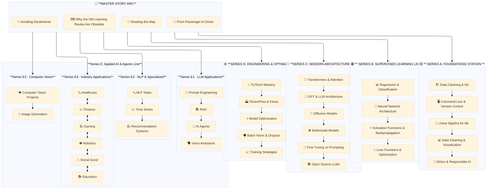

# ![The Complete AI Metromap: Visual Roadmap](<image

```mermaid
---
config:
  theme: base
  layout: elk
---
flowchart TD
 subgraph MASTER["🏁 **MASTER STORY ARC**"]
    direction TD
        M1["🗺️ Why the Old Learning Routes Are Obsolete"]
        M2["🧭 Reading the Map"]
        M3["🎒 Avoiding Derailments"]
        M4["🏁 From Passenger to Driver"]
  end
 subgraph A["🟡 ** SERIES A: FOUNDATIONS STATION **"]
    direction TD
        A1["🏗️ Data Cleaning & Git"] -->
        A2["🖥️ Command Line & Version Control"] -->
        A3["🧮 Linear Algebra for ML"] -->
        A4["📊 Data Cleaning & Visualization"] -->
        A5["🔄 Ethics & Responsible AI"]
  end
 subgraph B["🟢 ** SERIES B: SUPERVISED LEARNING LINE **"]
    direction TD
        B1["📊 Regression & Classification"]-->
        B2["🧬 Neural Network Architecture"]-->
        B3["⚡ Activation Functions & Backpropagation"] -->
        B4["🎯 Loss Functions & Optimization"]
  end
 subgraph C["🔵 **SERIES C: MODERN ARCHITECTURE LINE**"]
    direction TD
    
        C1["📖 Transformers & Attention"] -->
        C2["🤖 GPT & LLM Architecture"]-->
        C3["🎨 Diffusion Models"]-->
        C4["🌐 Multimodal Models"]-->
        C5["🧩 Fine-Tuning vs Prompting"]-->
        C6["📚 Open Source LLMs"]
  end
 subgraph D["⚙️ **SERIES D: ENGINEERING & OPTIMIZATION**"]
    direction TD
        D1["🔧 PyTorch Mastery"] -->
        D2["🏭 TensorFlow & Keras"]-->
        D3["⚡ Model Optimization"]-->
        D4["🛡️ Batch Norm & Dropout"]-->
        D5["📈 Training Strategies"]
  end
 subgraph E1["**Series E1 : LLM Applications**"]
    direction TD
        E1a["💬 Prompt Engineering"] -->
        E1b["📚 RAG"] -->
        E1c["🤖 AI Agents"] -->
        E1d["🗣️ Voice Assistants"]
  end
 subgraph E2["**Series E2 : Computer Vision**"]
    direction TD
        E2a["👁️ Computer Vision Projects"] -->
        E2b["🎨 Image Generation"]
  end
 subgraph E3["**Series E3 : NLP & Specialized**"]
    direction TD
        E3a["🔤 NLP Tasks"] -->
        E3b["📈 Time Series"] -->
        E3c["👍 Recommendation Systems"]
  end
 subgraph E4 ["**Series E4 : Industry Applications**"]
    direction TD
        E4a["🔤 Healthcare"] <-->
        E4b["📈 Finance"] <-->
        E4c["👍 Gaming"]<-->
        E4d["👁️ Robotics"] <-->
        E4e["🎨 Social Good"]<-->
        E4f["📚 Education"]
  end
   subgraph E["**Series E: Applied AI & Agents Line**"]
    direction TD
        E1
        E2
        E3
        E4
  end

    MASTER --> A & B & C & D    
    MASTER --> E1 & E2 & E3 & E4

     
```
