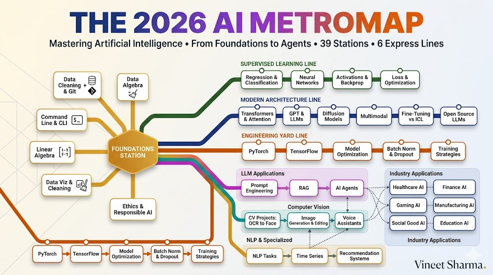
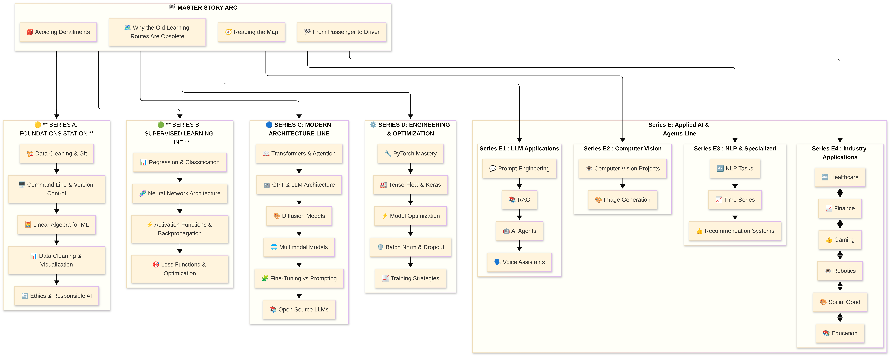

# The Complete 2026 AI Metromap: Story Catalog

## Your Navigation Guide to Mastering Artificial Intelligence! 39+ Stories


## 📖 Introduction

**Welcome to the complete story catalog of the 2026 AI Metromap.**

This is your master navigation guide to every story in the series. Think of this as the map you'd find at any metro station—showing all the lines, all the stops, and all the connections between them.

Unlike a traditional curriculum that forces you down a predetermined path, this catalog lets you choose your own route based on your goals, background, and interests. Each story is a station. Each series is a transit line. And the connections between them are transfers that let you build interdisciplinary expertise.

**How to Use This Catalog:**

- **Start with the Master Story Arc** – These four stories form the foundation of the Metromap philosophy. Read them first to understand the "why" behind the structure.

- **Choose Your Express Line** – After the Master Arc, pick one Series that matches your goals. Want to build LLM applications? Start with Series C. Focused on production ML? Series D is your track.

- **Use the Mermaid Flowchart** – Below you'll find a complete visual roadmap showing every story and how they connect. Use it to see the big picture and plan your journey.

- **Transfer Between Lines** – Each story includes "connections" to related stations. The catalog shows you these relationships.

- **Go Deep Where It Matters** – You don't need to read every story. Master one line deeply, then expand to others when needed.

---

## 🗺️ The Complete AI Metromap: Visual Roadmap


```mermaid
```


[View Source](https://github.com/Vineet-Sharma-Medium-Stories/Medium-Assets/blob/main/the-complete-2026-ai-metromap-story-catalog/diagram_01_the-complete-ai-metromap-visual-roadmapimage-2c2a.md)


---

## 🗺️ Master Story Arc: The 2026 AI Metromap Series

*The central hub of our journey. Start here to understand the philosophy before diving into specific tracks.*

- 🗺️ **[1. The 2026 AI Metromap: Why the Old Learning Routes Are Obsolete](#)** – A paradigm shift from linear learning to transit-system mastery, explaining why traditional paths fail and how the metromap structure creates sustainable expertise in 2026. *[Parent: Master Arc]*

- 🧭 **[2. The 2026 AI Metromap: Reading the Map](#)** – Strategic navigation across the three core lines: Foundations Station, Technical Implementation, and Domain Application, with practical decision frameworks for when to go deep and when to transfer lines. *[Parent: Master Arc]*

- 🎒 **[3. The 2026 AI Metromap: Avoiding Derailments](#)** – Diagnosing and preventing the "shiny object syndrome," foundation-skipping disasters, tutorial hell, model obsession without deployment skills, and the comparison trap that kills momentum. *[Parent: Master Arc]*

- 🏁 **[4. The 2026 AI Metromap: From Passenger to Driver](#)** – Translating metromap "stops" into portfolio projects that hiring managers actually notice, covering project selection, documentation strategies, GitHub organization, and demonstrating depth while showing breadth. *[Parent: Master Arc]*

---

## 🏛️ Series A: Foundations Station

*The central hub where all journeys begin. Master these skills and every other line becomes accessible.*

- 🏗️ **[A1. The 2026 AI Metromap: Foundations Station – Why Data Cleaning and Git Are Your Board Games, Not Just Chores](#)** – Reframing foundational skills as strategic enablers; practical data cleaning with pandas and polars; Git workflows for model versioning and experiment tracking; why skipping foundations guarantees failure. *[Parent: Series A]*

- 🖥️ **[A2. The 2026 AI Metromap: Command Line & Version Control – Navigating the Terminal Like a Conductor](#)** – Essential CLI tools (curl, jq, tmux, screen) for AI development; Git branching strategies for collaborative ML projects; SSH and remote GPU training setup; automating workflows with shell scripts. *[Parent: Series A]*

- 🧮 **[A3. The 2026 AI Metromap: Linear Algebra for ML – The Language of the Map](#)** – Vectors, matrices, and tensors explained through code; dot products as attention mechanisms; matrix multiplication as neural network layers; eigenvalues and PCA for dimensionality reduction; intuition before theory. *[Parent: Series A]*

- 📊 **[A4. The 2026 AI Metromap: Data Cleaning & Visualization – Turning Raw Data into Tracks](#)** – Real-world data wrangling with pandas, polars, and DuckDB; handling missing values, outliers, and imbalanced datasets; visualization with matplotlib, seaborn, and plotly; the 80% of AI that nobody talks about. *[Parent: Series A]*

- 🔄 **[A5. The 2026 AI Metromap: Ethics & Responsible AI – The Safety Systems of the Metro](#)** – Bias detection and mitigation; interpretability with SHAP and LIME; privacy-preserving AI with differential privacy; regulatory compliance (GDPR, EU AI Act); building AI that doesn't harm. *[Parent: Series A]*

---

## 📈 Series B: Supervised Learning Line

*The classic route that built modern AI. Master these fundamentals before boarding the express trains.*

- 📊 **[B1. The 2026 AI Metromap: Regression & Classification – The Grand Central Station of AI](#)** – Linear regression from scratch with gradient descent; logistic regression for classification; evaluation metrics (MSE, MAE, accuracy, precision, recall, F1, ROC-AUC); connecting classical ML to modern deep learning. *[Parent: Series B]*

- 🧬 **[B2. The 2026 AI Metromap: Neural Network Architecture – From Perceptron to MLP](#)** – The biological inspiration; perceptron implementation; multi-layer perceptrons; forward propagation; universal approximation theorem; building your first neural network from scratch with NumPy. *[Parent: Series B]*

- ⚡ **[B3. The 2026 AI Metromap: Activation Functions & Backpropagation – The Electrical Grid of the Network](#)** – Sigmoid, tanh, ReLU, Leaky ReLU, Swish, GELU; why activation functions matter; the chain rule explained visually; backpropagation step-by-step; vanishing and exploding gradients. *[Parent: Series B]*

- 🎯 **[B4. The 2026 AI Metromap: Loss Functions & Optimization – Navigating to the Minimum](#)** – Cross-entropy, MSE, MAE, Huber loss; gradient descent variants (SGD, Momentum, Adam, AdamW); learning rate schedules; avoiding local minima; building a training loop from scratch. *[Parent: Series B]*

---

## 🚀 Series C: Modern Architecture Line

*The express train to cutting-edge AI. Transformers, LLMs, diffusion, and multimodal systems.*

- 📖 **[C1. The 2026 AI Metromap: Transformers & Attention – The Station That Changed Everything](#)** – The "Attention Is All You Need" paper decoded; self-attention mechanisms; multi-head attention; positional encoding; encoder-decoder architecture; building a miniature transformer from scratch. *[Parent: Series C]*

- 🤖 **[C2. The 2026 AI Metromap: GPT & LLM Architecture – Understanding the Engine of the Express Train](#)** – Decoder-only architecture; causal masking; next token prediction; scaling laws; context windows; emergent abilities; GPT architecture deep dive with code. *[Parent: Series C]*

- 🎨 **[C3. The 2026 AI Metromap: Diffusion Models – The Scenic Route to Generative AI](#)** – How diffusion models work; forward diffusion process; reverse denoising; U-Net architecture; DDPM vs DDIM; stable diffusion; text-to-image, text-to-video, text-to-audio. *[Parent: Series C]*

- 🌐 **[C4. The 2026 AI Metromap: Multimodal Models – The Interchange Stations](#)** – CLIP: connecting images and text; Flamingo: few-shot multimodal learning; Gemini: native multimodality; contrastive learning; building a simple multimodal search engine. *[Parent: Series C]*

- 🧩 **[C5. The 2026 AI Metromap: Fine-Tuning vs. In-Context Learning – When to Train vs. When to Prompt](#)** – Parameter-efficient fine-tuning (LoRA, QLoRA, adapters); instruction tuning; RLHF; in-context learning; few-shot prompting; choosing the right approach for your use case. *[Parent: Series C]*

- 📚 **[C6. The 2026 AI Metromap: Open Source LLMs – LLaMA, Mistral, DeepSeek, and Beyond](#)** – Running LLMs locally; quantization (GGUF, GPTQ); inference optimization; model comparison; open-source ecosystem; building with local models. *[Parent: Series C]*

---

## ⚙️ Series D: Engineering & Optimization Yard

*The maintenance crew that keeps AI running in production. Build, optimize, and deploy at scale.*

- 🔧 **[D1. The 2026 AI Metromap: PyTorch Mastery – The Locomotive of Modern AI](#)** – Tensors and autograd; nn.Module; custom layers; dataloaders; training loops; saving and loading models; TensorBoard; PyTorch best practices. *[Parent: Series D]*

- 🏭 **[D2. The 2026 AI Metromap: TensorFlow & Keras – The Production-Ready Alternative](#)** – Eager execution vs graph mode; tf.data for pipelines; Keras API; TensorFlow Serving; TensorFlow Lite for edge deployment; when to choose TensorFlow over PyTorch. *[Parent: Series D]*

- ⚡ **[D3. The 2026 AI Metromap: Model Optimization – Keeping the Train on Time](#)** – Quantization (INT8, FP16); pruning; knowledge distillation; model compression; inference optimization with ONNX, TensorRT, and OpenVINO; balancing speed and accuracy. *[Parent: Series D]*

- 🛡️ **[D4. The 2026 AI Metromap: Batch Norm & Dropout – The Safety Systems of Deep Learning](#)** – Batch normalization implementation; layer normalization; dropout for regularization; preventing overfitting; training stability techniques; when and where to apply each. *[Parent: Series D]*

- 📈 **[D5. The 2026 AI Metromap: Training Strategies – Learning Rate Scheduling & Beyond](#)** – Learning rate warmup; cosine annealing; cyclical learning rates; gradient accumulation; mixed precision training (AMP); distributed training; hyperparameter optimization with Optuna. *[Parent: Series D]*

---

## 🤖 Series E: Applied AI & Agents Line

*The destination stops where theory becomes reality. Build real-world applications across domains.*

### Sub-Series E1: LLM Applications

- 💬 **[E1. The 2026 AI Metromap: Prompt Engineering 101 – The Art of Talking to AI](#)** – System prompts; few-shot prompting; chain-of-thought; tree of thoughts; self-consistency; prompt templates; building robust prompts for production. *[Parent: Series E]*

- 📚 **[E2. The 2026 AI Metromap: RAG – Retrieval-Augmented Generation for Knowledge-Intensive Tasks](#)** – Vector databases (Chroma, Pinecone, Weaviate, Milvus); embedding models; semantic search; hybrid search; reranking; building a document Q&A system. *[Parent: Series E]*

- 🤖 **[E3. The 2026 AI Metromap: AI Agents & Autonomous Workflows – The Self-Driving Trains](#)** – Agent architectures (ReAct, Plan-and-Execute, AutoGPT); tool use and function calling; multi-agent systems; memory management; building a research assistant agent. *[Parent: Series E]*

- 🗣️ **[E4. The 2026 AI Metromap: Voice Assistants & Speech Models – Making AI Talk](#)** – Speech-to-text (Whisper); text-to-speech (ElevenLabs, Coqui); voice activity detection; real-time transcription; building a voice assistant with local models. *[Parent: Series E]*

### Sub-Series E2: Computer Vision

- 👁️ **[E5. The 2026 AI Metromap: Computer Vision Projects – From OCR to Face Recognition](#)** – Optical character recognition (Tesseract, TrOCR); face detection and recognition; object detection (YOLO, DETR); image segmentation; building a document scanner. *[Parent: Series E]*

- 🎨 **[E6. The 2026 AI Metromap: Image Generation & Editing – Diffusion Models in Practice](#)** – Stable diffusion pipelines; ControlNet; inpainting; outpainting; image-to-image; fine-tuning diffusion models with DreamBooth; building a photo editing app. *[Parent: Series E]*

### Sub-Series E3: NLP & Specialized Tasks

- 🔤 **[E7. The 2026 AI Metromap: NLP Tasks – NER, Translation, Summarization, and Beyond](#)** – Named entity recognition; machine translation; text summarization (extractive and abstractive); sentiment analysis; building a multilingual news summarizer. *[Parent: Series E]*

- 📈 **[E8. The 2026 AI Metromap: Time Series Forecasting – ARIMA, LSTM, and Transformers](#)** – Classical methods (ARIMA, SARIMA); LSTM networks; Transformer for time series; forecasting stock prices, weather, and demand; anomaly detection. *[Parent: Series E]*

- 👍 **[E9. The 2026 AI Metromap: Recommendation Systems – From Collaborative Filtering to Two-Tower Networks](#)** – Content-based filtering; collaborative filtering; matrix factorization; neural collaborative filtering; two-tower architectures; building a movie recommender. *[Parent: Series E]*

### Sub-Series E4: Industry Applications

- 🏥 **[E10. The 2026 AI Metromap: AI in Healthcare – Medical Research, Diagnostics, and Wellness](#)** – Medical imaging; EHR analysis; drug discovery; clinical decision support; regulatory considerations (FDA); privacy and ethics in healthcare AI. *[Parent: Series E]*

- 💰 **[E11. The 2026 AI Metromap: AI in Finance – Banking, Insurance, and Trading](#)** – Fraud detection; algorithmic trading; credit scoring; risk management; explainable AI for compliance; building a trading bot. *[Parent: Series E]*

- 🎮 **[E12. The 2026 AI Metromap: AI in Gaming, VR/AR, and Entertainment](#)** – Procedural content generation; NPC behavior with LLMs; AI-driven storytelling; game testing automation; immersive experiences with generative AI. *[Parent: Series E]*

- 🏭 **[E13. The 2026 AI Metromap: AI in Robotics, Manufacturing, and Supply Chain](#)** – Computer vision for quality control; predictive maintenance; autonomous navigation; warehouse optimization; digital twins. *[Parent: Series E]*

- 🌱 **[E14. The 2026 AI Metromap: AI for Social Good – Climate Action, Agriculture, and Sustainability](#)** – Crop yield prediction; climate modeling; energy optimization; wildlife conservation; disaster response; building AI that benefits humanity. *[Parent: Series E]*

- 🎓 **[E15. The 2026 AI Metromap: AI in Education – Personalized Learning and Training](#)** – Intelligent tutoring systems; automated grading; personalized content recommendation; adaptive learning paths; building a coding tutor. *[Parent: Series E]*

---

## 📊 Story Count Summary

](images/table_01_story-count-summary.png)

[View Source](https://github.com/Vineet-Sharma-Medium-Stories/Medium-Assets/blob/main/the-complete-2026-ai-metromap-story-catalog/table_01_story-count-summary.md)


---

## 🔗 How to Navigate This Catalog

**For Beginners:**
1. Read Master Arc Stories 1-4
2. Complete Series A (Foundations Station)
3. Choose one express line: Series B (Supervised), Series C (Modern), or Series D (Engineering)
4. Apply your skills with Series E projects in your domain of interest

**For Experienced Engineers:**
1. Skim Master Arc Stories 1-2
2. Jump directly to Series C (Modern Architecture) or Series D (Engineering)
3. Use Series E for domain-specific application guidance
4. Reference Series A for gaps in fundamentals

**For Career Switchers:**
1. Read Master Arc Story 4 (Portfolio Building)
2. Focus on Series B (Supervised Learning) for fundamentals
3. Choose 2-3 Series E application stories in your target industry
4. Build portfolio projects that combine both

---

## 🚀 Next Steps

**Your Journey Starts Here:**

1. **Begin with** 🗺️ **[The 2026 AI Metromap: Why the Old Learning Routes Are Obsolete](#)** – Your first stop on the journey.

2. **Use the Mermaid Flowchart** – Scroll up to see the complete visual roadmap. Trace your path from Foundations Station through your chosen express line to Applied AI destinations.

3. **Choose your express line** – After the Master Arc, decide which series aligns with your goals.

4. **Transfer between lines** – The flowchart shows connections between stories. Use them to build interdisciplinary expertise.

5. **Build as you learn** – Each story includes practical code. Don't just read—build.

---

*This catalog will be updated as new stories are published. Each story links back to its parent series, ensuring you always know where you are in the journey.*

**All aboard. Let's master AI together.** 🚇