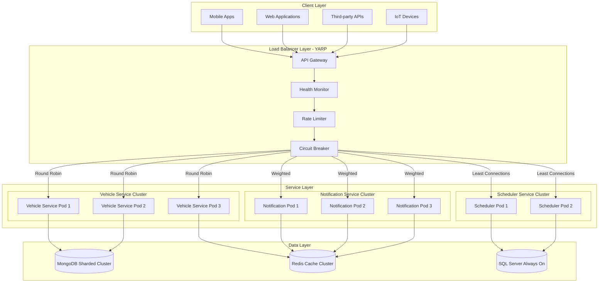
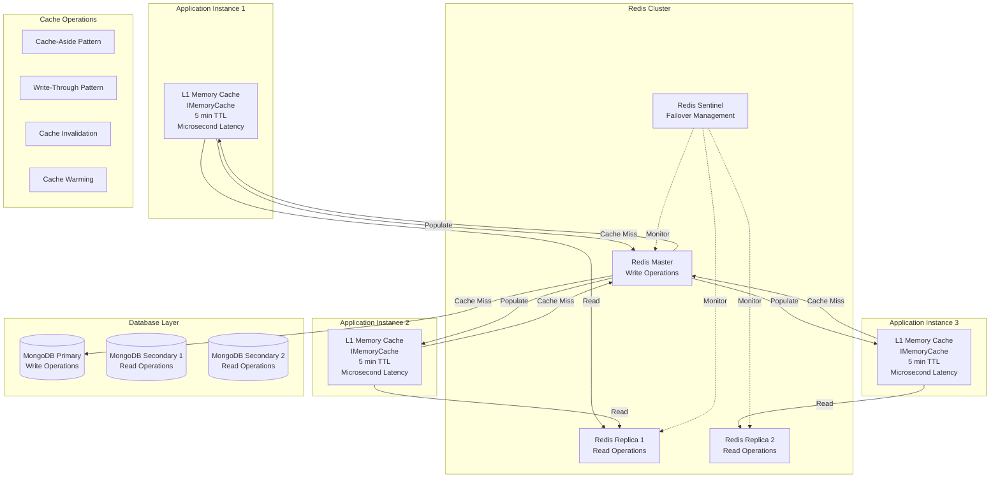
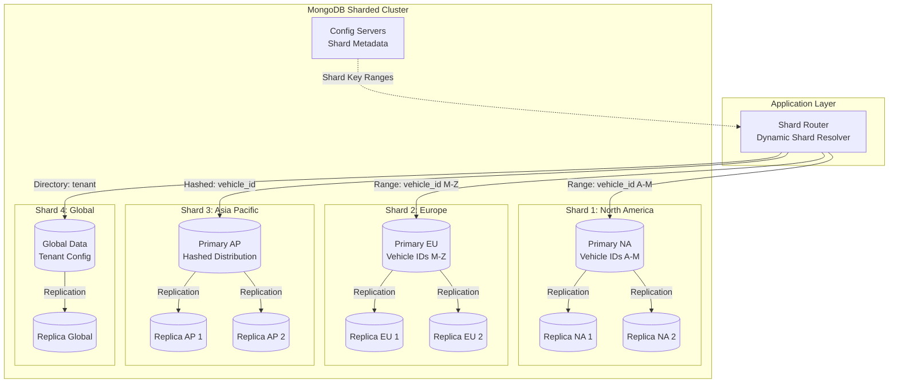
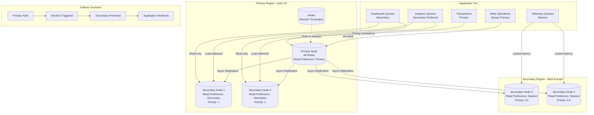
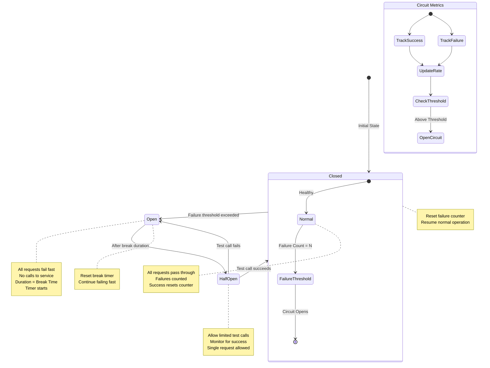

# Architecting Resilient Systems: 20 Essential Concepts Through a .NET Lens - Part 1

## Part 1: The Foundation — Load Balancing, Caching, Database Sharding, Replication, Circuit Breaker

*This is Part 1 of a 4-part series exploring system design concepts through the Vehixcare-API implementation. In this series, we'll cover 20 essential distributed system patterns with practical .NET code examples, MongoDB integration, and SOLID principles.*

---

### Series Navigation

| Part | Topics | Focus Area |
|------|--------|------------|
| **Part 1** (Current) | Load Balancing, Caching, Database Sharding, Replication, Circuit Breaker | Foundation & Resilience |
| **Part 2** | Consistent Hashing, Message Queues, Rate Limiting, API Gateway, Microservices | Distribution & Communication |
| **Part 3** | Monolithic Architecture, Event-Driven Architecture, CAP Theorem, Distributed Systems, Horizontal Scaling | Architecture & Scale |
| **Part 4** | Vertical Scaling, Data Partitioning, Idempotency, Service Discovery, Observability | Optimization & Operations |

---

## Introduction: The Vehixcare Journey

In the rapidly evolving landscape of automotive technology, **Vehixcare** emerges as a comprehensive AI-powered vehicle care and service management platform. Born from the need to bridge the gap between vehicle owners, service centers, and automotive technicians, Vehixcare represents a modern approach to vehicle maintenance and diagnostics.

### What Makes Vehixcare Unique?

Drawing from the [Vehixcare-API repository documentation](https://gitlab.com/mvineetsharma/Vehixcare-AI/Vehixcare-API), the platform offers:

- **AI-Driven Predictive Maintenance**: Leverages machine learning algorithms to predict potential vehicle issues before they become critical, analyzing telemetry data, service history, and driving patterns to recommend preventive maintenance schedules.

- **Multi-Tenant Architecture**: Supports thousands of service centers and fleets with complete data isolation, each tenant receiving customized service packages, pricing models, and operational workflows.

- **Real-Time Vehicle Telemetry**: Integrates with IoT devices and vehicle OBD-II ports to stream real-time diagnostics, enabling immediate alerts for engine issues, battery health, tire pressure, and critical system failures.

- **Blockchain-Verified Service History**: Implements immutable service records using distributed ledger technology, ensuring tamper-proof maintenance history that enhances vehicle resale value and builds trust between buyers and sellers.

- **Intelligent Service Scheduling**: Utilizes constraint-solving algorithms to optimize technician allocation, parts inventory, and bay availability, reducing wait times by up to 40% for customers.

- **Natural Language Processing**: Powers an intelligent chatbot that understands automotive terminology, assists with diagnostic queries, and automates service booking through conversational interfaces.

- **Dynamic Pricing Engine**: Employs reinforcement learning to optimize service pricing based on demand, seasonality, vehicle age, and customer loyalty metrics.

### The Architectural Challenge

Building such a sophisticated platform requires mastering distributed systems fundamentals. This story explores these essential system design concepts through the lens of Vehixcare's .NET implementation, demonstrating how theoretical principles translate into production-grade code.

---

## Concept 1: Load Balancing — Distributing Incoming Traffic Across Multiple Servers

Load balancing serves as the first line of defense against traffic spikes and single-point failures. In distributed systems, it ensures that no single server bears the brunt of incoming requests, providing both horizontal scalability and high availability.

### Deep Dive into Load Balancing

Modern load balancers operate at multiple layers:

**Layer 4 (Transport Layer) Load Balancing:**
- Operates at the TCP/UDP level
- Distributes traffic based on IP addresses and port numbers
- Offers high throughput with minimal processing overhead
- Cannot inspect application-layer content
- Ideal for simple round-robin distribution

**Layer 7 (Application Layer) Load Balancing:**
- Operates at the HTTP/HTTPS level
- Makes intelligent routing decisions based on:
  - HTTP headers (User-Agent, Accept-Language)
  - Cookies and session information
  - URL paths and query parameters
  - Request content type
- Enables sophisticated patterns:
  - Session affinity (sticky sessions)
  - Content-based routing
  - A/B testing and canary deployments
  - API version routing

**Load Balancing Algorithms:**

| Algorithm | Description | Use Case |
|-----------|-------------|----------|
| Round Robin | Cycles through servers sequentially | Evenly distributed, similar-capacity servers |
| Least Connections | Directs traffic to server with fewest active connections | Long-lived connections, variable request duration |
| Least Time | Considers response time and connections | Performance-sensitive applications |
| IP Hash | Uses client IP to determine server | Session persistence without cookies |
| Consistent Hash | Maps requests to servers using hash ring | Cache-friendly distribution |
| Weighted | Assigns weights based on server capacity | Heterogeneous server infrastructure |

### Vehixcare Implementation with YARP (Yet Another Reverse Proxy)

YARP is a .NET reverse proxy library that provides high-performance, customizable load balancing capabilities.

```csharp
// Program.cs - Complete YARP Load Balancer Configuration
var builder = WebApplication.CreateBuilder(args);

// 1. Configure YARP with advanced options
builder.Services.AddReverseProxy()
    .LoadFromConfig(builder.Configuration.GetSection("ReverseProxy"))
    .AddTransforms(transforms =>
    {
        // Add correlation ID for distributed tracing
        transforms.AddRequestTransform(async context =>
        {
            var correlationId = context.HttpContext.TraceIdentifier;
            context.ProxyRequest.Headers.Add("X-Correlation-ID", correlationId);
            context.ProxyRequest.Headers.Add("X-Forwarded-For", 
                context.HttpContext.Connection.RemoteIpAddress?.ToString());
            context.ProxyRequest.Headers.Add("X-Forwarded-Proto", 
                context.HttpContext.Request.Scheme);
            await ValueTask.CompletedTask;
        });
        
        // Implement circuit breaker awareness
        transforms.AddResponseTransform(async context =>
        {
            if (context.ProxyResponse.StatusCode == HttpStatusCode.ServiceUnavailable)
            {
                context.HttpContext.Response.Headers.Add("X-Backend-Failure", "true");
                context.HttpContext.Response.Headers.Add("Retry-After", "30");
            }
            await ValueTask.CompletedTask;
        });
        
        // Add authentication forwarding
        transforms.AddRequestTransform(async context =>
        {
            var authHeader = context.HttpContext.Request.Headers.Authorization.ToString();
            if (!string.IsNullOrEmpty(authHeader))
            {
                context.ProxyRequest.Headers.Authorization = authHeader;
            }
            await ValueTask.CompletedTask;
        });
    })
    .AddLoadBalancingPolicy<CustomLoadBalancingPolicy>("custom-weighted");

// 2. Configure health checks for backend services
builder.Services.AddHealthChecks()
    .AddUrlGroup(new Uri("http://vehicle-service:8080/health"), "vehicle-service", 
        failureStatus: HealthStatus.Degraded,
        timeout: TimeSpan.FromSeconds(5))
    .AddUrlGroup(new Uri("http://scheduler-service:8081/health"), "scheduler-service",
        timeout: TimeSpan.FromSeconds(5))
    .AddUrlGroup(new Uri("http://notification-service:8082/health"), "notification-service",
        timeout: TimeSpan.FromSeconds(3));

// 3. Custom load balancing policy
public class CustomLoadBalancingPolicy : ILoadBalancingPolicy
{
    private readonly Random _random = new();
    private readonly ConcurrentDictionary<string, int> _requestCounts = new();
    
    public string Name => "custom-weighted";
    
    public DestinationState? PickDestination(HttpContext context, 
        ClusterState cluster, 
        IReadOnlyList<DestinationState> availableDestinations)
    {
        if (availableDestinations.Count == 0)
            return null;
            
        // Get destination weights from configuration
        var destinationsWithWeights = availableDestinations
            .Select(d => new
            {
                Destination = d,
                Weight = d.Model.Config.Metadata?.GetValueOrDefault("weight", "1") ?? "1"
            })
            .Select(x => new
            {
                x.Destination,
                Weight = int.TryParse(x.Weight, out var w) ? w : 1
            })
            .ToList();
            
        // Calculate total weight
        var totalWeight = destinationsWithWeights.Sum(x => x.Weight);
        
        // Weighted random selection
        var randomValue = _random.Next(totalWeight);
        var cumulative = 0;
        
        foreach (var item in destinationsWithWeights)
        {
            cumulative += item.Weight;
            if (randomValue < cumulative)
                return item.Destination;
        }
        
        return availableDestinations.First();
    }
}

// 4. YARP Configuration (appsettings.json)
/*
{
  "ReverseProxy": {
    "Routes": {
      "vehicle-api-route": {
        "ClusterId": "vehicle-cluster",
        "Match": {
          "Path": "/api/vehicles/{**catch-all}"
        },
        "Transforms": [
          { "PathPattern": "/{**catch-all}" }
        ],
        "AuthorizationPolicy": "AuthenticatedUser",
        "RateLimiterPolicy": "vehicle-api"
      },
      "scheduler-api-route": {
        "ClusterId": "scheduler-cluster",
        "Match": {
          "Path": "/api/schedule/{**catch-all}"
        }
      },
      "notification-api-route": {
        "ClusterId": "notification-cluster",
        "Match": {
          "Path": "/api/notifications/{**catch-all}"
        }
      },
      "websocket-route": {
        "ClusterId": "websocket-cluster",
        "Match": {
          "Path": "/ws/{**catch-all}"
        },
        "Transforms": [
          { "PathRemovePrefix": "/ws" }
        ]
      }
    },
    "Clusters": {
      "vehicle-cluster": {
        "LoadBalancingPolicy": "PowerOfTwoChoices",
        "Destinations": {
          "vehicle-1": { 
            "Address": "http://vehicle-service-1:8080/",
            "Health": "https://vehicle-service-1:8080/health"
          },
          "vehicle-2": { 
            "Address": "http://vehicle-service-2:8080/",
            "Health": "https://vehicle-service-2:8080/health"
          },
          "vehicle-3": { 
            "Address": "http://vehicle-service-3:8080/",
            "Health": "https://vehicle-service-3:8080/health"
          }
        },
        "HealthCheck": {
          "Active": {
            "Enabled": true,
            "Interval": "00:00:10",
            "Timeout": "00:00:05",
            "Policy": "ConsecutiveFailures",
            "Path": "/health"
          },
          "Passive": {
            "Enabled": true,
            "Policy": "TransportFailureRate",
            "ReactivationPeriod": "00:01:00"
          }
        },
        "HttpClient": {
          "Timeout": "00:00:30",
          "MaxConnectionsPerServer": 100
        }
      },
      "scheduler-cluster": {
        "LoadBalancingPolicy": "LeastRequests",
        "Destinations": {
          "scheduler-1": { "Address": "http://scheduler-service-1:8081/" },
          "scheduler-2": { "Address": "http://scheduler-service-2:8081/" }
        }
      },
      "notification-cluster": {
        "LoadBalancingPolicy": "RoundRobin",
        "Destinations": {
          "notification-1": { "Address": "http://notification-service-1:8082/" },
          "notification-2": { "Address": "http://notification-service-2:8082/" },
          "notification-3": { "Address": "http://notification-service-3:8082/" }
        }
      },
      "websocket-cluster": {
        "LoadBalancingPolicy": "FirstAlphabetical",
        "Destinations": {
          "websocket-1": { "Address": "ws://websocket-service-1:8083/" },
          "websocket-2": { "Address": "ws://websocket-service-2:8083/" }
        },
        "SessionAffinity": {
          "Enabled": true,
          "Policy": "Cookie",
          "AffinityKeyName": ".YARP.Affinity"
        }
      }
    }
  }
}
*/

// 5. Advanced health monitoring with custom checks
public class CustomHealthCheck : IHealthCheck
{
    private readonly IHttpClientFactory _httpClientFactory;
    private readonly ILogger<CustomHealthCheck> _logger;
    
    public CustomHealthCheck(IHttpClientFactory httpClientFactory, ILogger<CustomHealthCheck> logger)
    {
        _httpClientFactory = httpClientFactory;
        _logger = logger;
    }
    
    public async Task<HealthCheckResult> CheckHealthAsync(
        HealthCheckContext context,
        CancellationToken cancellationToken = default)
    {
        var client = _httpClientFactory.CreateClient();
        var endpoints = new[]
        {
            "http://vehicle-service:8080/health",
            "http://scheduler-service:8081/health",
            "http://notification-service:8082/health"
        };
        
        var results = new Dictionary<string, bool>();
        
        foreach (var endpoint in endpoints)
        {
            try
            {
                var response = await client.GetAsync(endpoint, cancellationToken);
                var serviceName = endpoint.Split('/')[1];
                results[serviceName] = response.IsSuccessStatusCode;
                
                if (!response.IsSuccessStatusCode)
                {
                    _logger.LogWarning("Health check failed for {Service}: {StatusCode}", 
                        serviceName, response.StatusCode);
                }
            }
            catch (Exception ex)
            {
                _logger.LogError(ex, "Health check exception for {Endpoint}", endpoint);
                results[endpoint] = false;
            }
        }
        
        var isHealthy = results.Values.All(v => v);
        
        return isHealthy 
            ? HealthCheckResult.Healthy("All services operational", results.ToDictionary())
            : HealthCheckResult.Degraded("Some services are unhealthy", results.ToDictionary());
    }
}

// 6. Load balancer metrics and monitoring
public class LoadBalancerMetricsMiddleware
{
    private readonly RequestDelegate _next;
    private readonly ILogger<LoadBalancerMetricsMiddleware> _logger;
    private readonly Counter<int> _requestCounter;
    private readonly Histogram<double> _requestDuration;
    
    public LoadBalancerMetricsMiddleware(
        RequestDelegate next,
        ILogger<LoadBalancerMetricsMiddleware> logger,
        IMeterFactory meterFactory)
    {
        _next = next;
        _logger = logger;
        
        var meter = meterFactory.Create("Vehixcare.LoadBalancer");
        _requestCounter = meter.CreateCounter<int>("lb.requests.total");
        _requestDuration = meter.CreateHistogram<double>("lb.request.duration", unit: "ms");
    }
    
    public async Task InvokeAsync(HttpContext context)
    {
        var sw = Stopwatch.StartNew();
        
        // Record request start
        var selectedDestination = context.Features.Get<IReverseProxyFeature>()?.ProxiedDestination;
        
        try
        {
            await _next(context);
            sw.Stop();
            
            // Record metrics
            _requestCounter.Add(1, 
                new KeyValuePair<string, object?>("path", context.Request.Path),
                new KeyValuePair<string, object?>("method", context.Request.Method),
                new KeyValuePair<string, object?>("status_code", context.Response.StatusCode),
                new KeyValuePair<string, object?>("destination", selectedDestination?.Address));
                
            _requestDuration.Record(sw.ElapsedMilliseconds);
        }
        catch
        {
            _requestCounter.Add(1, 
                new KeyValuePair<string, object?>("path", context.Request.Path),
                new KeyValuePair<string, object?>("status_code", 500));
            throw;
        }
    }
}
```

### Load Balancing Architecture Diagram



---

## Concept 2: Caching — Storing Frequently Accessed Data to Reduce Latency

Caching represents one of the most effective performance optimization techniques. By storing frequently accessed data in fast storage layers, systems can dramatically reduce database load and improve response times by orders of magnitude.

### Deep Dive into Caching Strategies

**Cache Types:**

| Cache Type | Storage | Latency | Use Case |
|------------|---------|---------|----------|
| L1 (In-Memory) | RAM | Microseconds | Per-instance, frequently accessed data |
| L2 (Distributed) | Redis/Memcached | Milliseconds | Shared across instances, session data |
| L3 (Database) | Disk | 10-100ms | Persistent storage, authoritative source |

**Caching Patterns:**

1. **Cache-Aside (Lazy Loading)**
   - Application checks cache first
   - On miss, loads from database and populates cache
   - Most common pattern, simple to implement

2. **Write-Through**
   - Writes go through cache to database
   - Ensures cache consistency
   - Higher write latency

3. **Write-Behind (Write-Back)**
   - Writes only to cache initially
   - Asynchronously persists to database
   - Lower write latency, potential data loss

4. **Refresh-Ahead**
   - Automatically refreshes cache before expiration
   - Reduces cache miss latency
   - Requires prediction of access patterns

### Vehixcare Multi-Tier Caching Implementation

```csharp
// 1. Cache interfaces and abstractions
public interface ICacheService
{
    Task<T?> GetAsync<T>(string key, CancellationToken ct = default);
    Task SetAsync<T>(string key, T value, TimeSpan? expiry = null, CancellationToken ct = default);
    Task RemoveAsync(string key, CancellationToken ct = default);
    Task<T?> GetOrCreateAsync<T>(string key, Func<Task<T>> factory, TimeSpan? expiry = null, CancellationToken ct = default);
}

public interface IDistributedLock
{
    Task<IDisposable> AcquireAsync(string key, TimeSpan timeout, CancellationToken ct = default);
}

// 2. Multi-tier cache implementation
public class MultiTierCacheService : ICacheService
{
    private readonly IMemoryCache _l1Cache;
    private readonly IDistributedCache _l2Cache;
    private readonly IDistributedLock _distributedLock;
    private readonly ILogger<MultiTierCacheService> _logger;
    private readonly CacheOptions _options;
    
    public MultiTierCacheService(
        IMemoryCache l1Cache,
        IDistributedCache l2Cache,
        IDistributedLock distributedLock,
        IOptions<CacheOptions> options,
        ILogger<MultiTierCacheService> logger)
    {
        _l1Cache = l1Cache;
        _l2Cache = l2Cache;
        _distributedLock = distributedLock;
        _logger = logger;
        _options = options.Value;
    }
    
    public async Task<T?> GetAsync<T>(string key, CancellationToken ct = default)
    {
        // L1 Cache Check (Memory)
        if (_l1Cache.TryGetValue(key, out T? cachedValue))
        {
            _logger.LogDebug("L1 cache hit for key: {Key}", key);
            return cachedValue;
        }
        
        // L2 Cache Check (Redis)
        var cachedJson = await _l2Cache.GetStringAsync(key, ct);
        if (cachedJson != null)
        {
            _logger.LogDebug("L2 cache hit for key: {Key}", key);
            var value = JsonSerializer.Deserialize<T>(cachedJson);
            
            // Populate L1 cache for subsequent requests
            _l1Cache.Set(key, value, _options.L1Expiry);
            
            return value;
        }
        
        _logger.LogDebug("Cache miss for key: {Key}", key);
        return default;
    }
    
    public async Task<T?> GetOrCreateAsync<T>(
        string key, 
        Func<Task<T>> factory, 
        TimeSpan? expiry = null, 
        CancellationToken ct = default)
    {
        // Try to get from cache first
        var cached = await GetAsync<T>(key, ct);
        if (cached != null)
            return cached;
        
        // Use distributed lock to prevent cache stampede
        var lockKey = $"lock:{key}";
        using var lockHandle = await _distributedLock.AcquireAsync(lockKey, _options.LockTimeout, ct);
        
        if (lockHandle != null)
        {
            // Double-check cache after acquiring lock
            cached = await GetAsync<T>(key, ct);
            if (cached != null)
                return cached;
            
            try
            {
                // Execute factory function to get data
                var value = await factory();
                
                // Store in both cache layers
                await SetAsync(key, value, expiry, ct);
                
                return value;
            }
            catch (Exception ex)
            {
                _logger.LogError(ex, "Error creating cached value for key: {Key}", key);
                throw;
            }
        }
        else
        {
            // Lock acquisition failed, wait and retry
            _logger.LogWarning("Could not acquire lock for key: {Key}, waiting...", key);
            await Task.Delay(_options.LockRetryDelay, ct);
            return await GetOrCreateAsync(key, factory, expiry, ct);
        }
    }
    
    public async Task SetAsync<T>(string key, T value, TimeSpan? expiry = null, CancellationToken ct = default)
    {
        var serialized = JsonSerializer.Serialize(value);
        var expiryTime = expiry ?? _options.DefaultExpiry;
        
        // Set in L2 cache (Redis)
        var distributedOptions = new DistributedCacheEntryOptions
        {
            AbsoluteExpirationRelativeToNow = expiryTime,
            SlidingExpiration = _options.SlidingExpiration
        };
        
        await _l2Cache.SetStringAsync(key, serialized, distributedOptions, ct);
        
        // Set in L1 cache (Memory)
        _l1Cache.Set(key, value, new MemoryCacheEntryOptions
        {
            AbsoluteExpirationRelativeToNow = expiryTime,
            SlidingExpiration = _options.SlidingExpiration,
            Priority = CacheItemPriority.High,
            // Register for post-eviction logging
            PostEvictionCallbacks =
            {
                new PostEvictionCallbackRegistration
                {
                    EvictionCallback = (k, v, reason, state) =>
                    {
                        _logger.LogDebug("L1 cache evicted: {Key}, Reason: {Reason}", k, reason);
                    }
                }
            }
        });
        
        _logger.LogDebug("Cached value for key: {Key} with expiry: {Expiry}", key, expiryTime);
    }
    
    public async Task RemoveAsync(string key, CancellationToken ct = default)
    {
        _l1Cache.Remove(key);
        await _l2Cache.RemoveAsync(key, ct);
        _logger.LogDebug("Removed cache entry for key: {Key}", key);
    }
}

// 3. Redis distributed lock implementation
public class RedisDistributedLock : IDistributedLock
{
    private readonly IDatabase _redisDb;
    private readonly ILogger<RedisDistributedLock> _logger;
    
    public RedisDistributedLock(IConnectionMultiplexer redis, ILogger<RedisDistributedLock> logger)
    {
        _redisDb = redis.GetDatabase();
        _logger = logger;
    }
    
    public async Task<IDisposable> AcquireAsync(string key, TimeSpan timeout, CancellationToken ct = default)
    {
        var lockId = Guid.NewGuid().ToString();
        var acquired = await _redisDb.LockTakeAsync(key, lockId, timeout);
        
        if (acquired)
        {
            _logger.LogDebug("Acquired lock for key: {Key}", key);
            return new RedisLockHandle(_redisDb, key, lockId, _logger);
        }
        
        return null;
    }
    
    private class RedisLockHandle : IDisposable
    {
        private readonly IDatabase _redisDb;
        private readonly string _key;
        private readonly string _lockId;
        private readonly ILogger _logger;
        private bool _disposed;
        
        public RedisLockHandle(IDatabase redisDb, string key, string lockId, ILogger logger)
        {
            _redisDb = redisDb;
            _key = key;
            _lockId = lockId;
            _logger = logger;
        }
        
        public void Dispose()
        {
            if (!_disposed)
            {
                var released = _redisDb.LockRelease(_key, _lockId);
                if (released)
                {
                    _logger.LogDebug("Released lock for key: {Key}", _key);
                }
                _disposed = true;
            }
        }
    }
}

// 4. Cache warming service for predictable workloads
public class CacheWarmingService : BackgroundService
{
    private readonly ICacheService _cache;
    private readonly IVehicleRepository _vehicleRepository;
    private readonly ILogger<CacheWarmingService> _logger;
    private readonly IConfiguration _config;
    
    public CacheWarmingService(
        ICacheService cache,
        IVehicleRepository vehicleRepository,
        ILogger<CacheWarmingService> logger,
        IConfiguration config)
    {
        _cache = cache;
        _vehicleRepository = vehicleRepository;
        _logger = logger;
        _config = config;
    }
    
    protected override async Task ExecuteAsync(CancellationToken stoppingToken)
    {
        _logger.LogInformation("Cache warming service started");
        
        while (!stoppingToken.IsCancellationRequested)
        {
            try
            {
                // Warm up popular vehicles during off-peak hours
                var now = DateTime.UtcNow;
                var isOffPeak = now.Hour is >= 0 and < 5;
                
                if (isOffPeak)
                {
                    await WarmPopularVehiclesAsync(stoppingToken);
                    await WarmServiceHistoryAsync(stoppingToken);
                    await WarmDiagnosticDataAsync(stoppingToken);
                }
                
                // Refresh expiring cache entries before they expire
                await RefreshExpiringCacheAsync(stoppingToken);
                
                // Schedule next warming cycle
                await Task.Delay(TimeSpan.FromHours(1), stoppingToken);
            }
            catch (Exception ex)
            {
                _logger.LogError(ex, "Error in cache warming service");
                await Task.Delay(TimeSpan.FromMinutes(5), stoppingToken);
            }
        }
    }
    
    private async Task WarmPopularVehiclesAsync(CancellationToken ct)
    {
        _logger.LogInformation("Warming popular vehicles cache");
        
        // Get top 1000 most frequently accessed vehicles
        var popularVehicles = await _vehicleRepository.GetMostAccessedVehiclesAsync(1000, ct);
        
        foreach (var vehicle in popularVehicles)
        {
            var cacheKey = $"vehicle:{vehicle.Id}";
            await _cache.SetAsync(cacheKey, vehicle, TimeSpan.FromHours(2), ct);
        }
        
        _logger.LogInformation("Warmed {Count} popular vehicles", popularVehicles.Count);
    }
    
    private async Task WarmServiceHistoryAsync(CancellationToken ct)
    {
        _logger.LogInformation("Warming service history cache");
        
        // Warm service history for recent vehicles (last 30 days)
        var recentServices = await _vehicleRepository.GetRecentServiceHistoryAsync(TimeSpan.FromDays(30), ct);
        
        var grouped = recentServices.GroupBy(s => s.VehicleId);
        
        foreach (var group in grouped)
        {
            var cacheKey = $"service_history:{group.Key}";
            await _cache.SetAsync(cacheKey, group.ToList(), TimeSpan.FromHours(1), ct);
        }
        
        _logger.LogInformation("Warmed service history for {Count} vehicles", grouped.Count());
    }
    
    private async Task WarmDiagnosticDataAsync(CancellationToken ct)
    {
        _logger.LogInformation("Warming diagnostic data cache");
        
        // Warm diagnostic codes lookup
        var diagnosticCodes = await _vehicleRepository.GetAllDiagnosticCodesAsync(ct);
        await _cache.SetAsync("diagnostic_codes", diagnosticCodes, TimeSpan.FromHours(24), ct);
        
        // Warm common diagnostic patterns
        var commonPatterns = await _vehicleRepository.GetCommonDiagnosticPatternsAsync(ct);
        await _cache.SetAsync("diagnostic_patterns", commonPatterns, TimeSpan.FromHours(12), ct);
    }
    
    private async Task RefreshExpiringCacheAsync(CancellationToken ct)
    {
        _logger.LogDebug("Checking for expiring cache entries");
        
        // Implementation would track cache entries with their expiry times
        // and refresh those approaching expiration
        // This would typically use Redis keyspace notifications or a separate tracking mechanism
    }
}

// 5. Cache configuration and options
public class CacheOptions
{
    public TimeSpan DefaultExpiry { get; set; } = TimeSpan.FromMinutes(30);
    public TimeSpan L1Expiry { get; set; } = TimeSpan.FromMinutes(5);
    public TimeSpan SlidingExpiration { get; set; } = TimeSpan.FromMinutes(10);
    public TimeSpan LockTimeout { get; set; } = TimeSpan.FromSeconds(10);
    public TimeSpan LockRetryDelay { get; set; } = TimeSpan.FromMilliseconds(100);
    public int MaxCacheSize { get; set; } = 1024 * 1024 * 100; // 100MB
}

// 6. Cache statistics and monitoring
public class CacheStatisticsService
{
    private readonly IMemoryCache _l1Cache;
    private readonly IDistributedCache _l2Cache;
    private readonly ILogger<CacheStatisticsService> _logger;
    
    private long _l1Hits;
    private long _l1Misses;
    private long _l2Hits;
    private long _l2Misses;
    
    public void RecordL1Hit() => Interlocked.Increment(ref _l1Hits);
    public void RecordL1Miss() => Interlocked.Increment(ref _l1Misses);
    public void RecordL2Hit() => Interlocked.Increment(ref _l2Hits);
    public void RecordL2Miss() => Interlocked.Increment(ref _l2Misses);
    
    public async Task<CacheStatistics> GetStatisticsAsync()
    {
        var l1Total = _l1Hits + _l1Misses;
        var l2Total = _l2Hits + _l2Misses;
        
        return new CacheStatistics
        {
            L1HitRate = l1Total > 0 ? (double)_l1Hits / l1Total : 0,
            L2HitRate = l2Total > 0 ? (double)_l2Hits / l2Total : 0,
            L1Hits = _l1Hits,
            L1Misses = _l1Misses,
            L2Hits = _l2Hits,
            L2Misses = _l2Misses,
            Timestamp = DateTime.UtcNow
        };
    }
    
    // Log cache statistics periodically
    [TimerTrigger("0 */5 * * * *")] // Every 5 minutes
    public async Task LogStatisticsAsync()
    {
        var stats = await GetStatisticsAsync();
        
        _logger.LogInformation(
            "Cache Statistics - L1 Hit Rate: {L1HitRate:P2}, L2 Hit Rate: {L2HitRate:P2}, " +
            "L1 Hits: {L1Hits}, L1 Misses: {L1Misses}, L2 Hits: {L2Hits}, L2 Misses: {L2Misses}",
            stats.L1HitRate, stats.L2HitRate, stats.L1Hits, stats.L1Misses, stats.L2Hits, stats.L2Misses);
    }
}

public record CacheStatistics
{
    public double L1HitRate { get; init; }
    public double L2HitRate { get; init; }
    public long L1Hits { get; init; }
    public long L1Misses { get; init; }
    public long L2Hits { get; init; }
    public long L2Misses { get; init; }
    public DateTime Timestamp { get; init; }
}
```

### Multi-Tier Caching Architecture



---

## Concept 3: Database Sharding — Splitting Large Databases into Manageable Pieces

Sharding distributes data across multiple database instances, enabling horizontal scaling beyond the limitations of a single server. Vehixcare implements a hybrid sharding strategy with MongoDB for telemetry data and SQL Server for transactional data.

### Deep Dive into Sharding Strategies

**Sharding Approaches:**

| Approach | Description | Pros | Cons |
|----------|-------------|------|------|
| **Range-Based** | Data partitioned by value ranges | Simple, efficient for range queries | Risk of hot spots |
| **Hash-Based** | Consistent hash distribution | Even distribution, no hot spots | Inefficient for range queries |
| **Directory-Based** | Lookup table for shard mapping | Flexible, easy to rebalance | Additional lookup overhead |
| **Geographic** | Partitioned by region | Data locality, compliance | Cross-region queries complex |

**Shard Key Selection Criteria:**
- High cardinality (many unique values)
- Even distribution across shards
- Used in most queries
- Immutable (should not change over time)

### MongoDB Sharding Implementation

```csharp
// 1. Shard configuration and management
public class ShardConfiguration
{
    public string Name { get; set; }
    public string ConnectionString { get; set; }
    public string ShardKey { get; set; }
    public ShardType Type { get; set; }
    public string MinKey { get; set; }
    public string MaxKey { get; set; }
    public int Weight { get; set; }
    public bool IsActive { get; set; }
    public Dictionary<string, string> Metadata { get; set; }
}

public enum ShardType
{
    Range,
    Hash,
    Geographic,
    Directory
}

// 2. Dynamic shard resolver with caching
public class DynamicShardResolver : IShardResolver
{
    private readonly IConfiguration _configuration;
    private readonly ICacheService _cache;
    private readonly IShardMappingRepository _mappingRepository;
    private readonly ILogger<DynamicShardResolver> _logger;
    
    private readonly Dictionary<string, ShardConfiguration> _shardMap;
    private readonly ConcurrentDictionary<string, string> _shardAssignmentCache = new();
    
    public DynamicShardResolver(
        IConfiguration configuration,
        ICacheService cache,
        IShardMappingRepository mappingRepository,
        ILogger<DynamicShardResolver> logger)
    {
        _configuration = configuration;
        _cache = cache;
        _mappingRepository = mappingRepository;
        _logger = logger;
        
        // Initialize shard map from configuration
        _shardMap = configuration.GetSection("Sharding:Shards")
            .Get<Dictionary<string, ShardConfiguration>>();
    }
    
    public async Task<ShardContext> GetShardContextAsync(string tenantId, string entityId, CancellationToken ct)
    {
        // Determine shard key based on entity type
        var shardKey = await DetermineShardKeyAsync(tenantId, entityId, ct);
        
        // Get shard configuration
        var shard = _shardMap[shardKey];
        
        // Create MongoDB client for the specific shard
        var client = new MongoClient(shard.ConnectionString);
        var database = client.GetDatabase("vehixcare");
        
        return new ShardContext
        {
            ShardKey = shardKey,
            Configuration = shard,
            Database = database,
            Client = client
        };
    }
    
    private async Task<string> DetermineShardKeyAsync(string tenantId, string entityId, CancellationToken ct)
    {
        var cacheKey = $"shard:tenant:{tenantId}:entity:{entityId}";
        
        // Check memory cache first
        if (_shardAssignmentCache.TryGetValue(cacheKey, out var cachedShard))
            return cachedShard;
        
        // Check Redis cache
        var cached = await _cache.GetAsync<string>(cacheKey, ct);
        if (cached != null)
        {
            _shardAssignmentCache[cacheKey] = cached;
            return cached;
        }
        
        // Determine shard using sharding strategy
        var shardKey = await CalculateShardKeyAsync(tenantId, entityId, ct);
        
        // Cache the result
        await _cache.SetAsync(cacheKey, shardKey, TimeSpan.FromHours(1), ct);
        _shardAssignmentCache[cacheKey] = shardKey;
        
        return shardKey;
    }
    
    private async Task<string> CalculateShardKeyAsync(string tenantId, string entityId, CancellationToken ct)
    {
        // Get tenant's region for geographic sharding
        var tenantRegion = await _mappingRepository.GetTenantRegionAsync(tenantId, ct);
        
        // Use consistent hashing for hash-based sharding
        if (_shardMap.All(s => s.Value.Type == ShardType.Hash))
        {
            var hash = MurmurHash3.Hash(Encoding.UTF8.GetBytes(entityId));
            var shardIndex = Math.Abs((int)(hash % _shardMap.Count));
            return _shardMap.Keys.ElementAt(shardIndex);
        }
        
        // Use range-based sharding based on entity ID prefix
        var firstChar = entityId[0].ToString().ToUpper();
        
        return firstChar.CompareTo("M") < 0 ? "north_america" :
               firstChar.CompareTo("Z") < 0 ? "europe" : "asia_pacific";
    }
    
    // Cross-shard query execution
    public async Task<List<T>> ExecuteCrossShardQueryAsync<T>(
        Func<IMongoCollection<T>, Task<List<T>>> query,
        string collectionName,
        CancellationToken ct)
    {
        var tasks = _shardMap
            .Where(s => s.Value.IsActive)
            .Select(async shard =>
            {
                try
                {
                    var client = new MongoClient(shard.Value.ConnectionString);
                    var database = client.GetDatabase("vehixcare");
                    var collection = database.GetCollection<T>(collectionName);
                    
                    return await query(collection);
                }
                catch (Exception ex)
                {
                    _logger.LogError(ex, "Error querying shard {ShardName}", shard.Key);
                    return new List<T>();
                }
            });
            
        var results = await Task.WhenAll(tasks);
        return results.SelectMany(r => r).ToList();
    }
    
    // Rebalance shards when new shards are added
    public async Task RebalanceShardsAsync(CancellationToken ct)
    {
        _logger.LogInformation("Starting shard rebalancing");
        
        // Get all shards
        var activeShards = _shardMap.Where(s => s.Value.IsActive).ToList();
        var totalWeight = activeShards.Sum(s => s.Value.Weight);
        
        // Get all shard keys
        var allShardKeys = await GetAllShardKeysAsync(ct);
        
        // Calculate target distribution
        var targetDistribution = new Dictionary<string, List<string>>();
        foreach (var shard in activeShards)
        {
            targetDistribution[shard.Key] = new List<string>();
        }
        
        // Distribute keys according to weights
        foreach (var key in allShardKeys)
        {
            var hash = MurmurHash3.Hash(Encoding.UTF8.GetBytes(key));
            var weightSum = 0;
            var selectedShard = activeShards[0];
            
            foreach (var shard in activeShards)
            {
                weightSum += shard.Value.Weight;
                if (hash % totalWeight < weightSum)
                {
                    selectedShard = shard;
                    break;
                }
            }
            
            targetDistribution[selectedShard.Key].Add(key);
        }
        
        // Execute migration for keys that need to move
        await MigrateKeysAsync(targetDistribution, ct);
        
        _logger.LogInformation("Shard rebalancing completed");
    }
    
    private async Task MigrateKeysAsync(Dictionary<string, List<string>> targetDistribution, CancellationToken ct)
    {
        // Implementation would move data between shards
        // This is a complex operation that should be done with minimal downtime
        // Typically using background jobs and eventual consistency
    }
    
    private async Task<List<string>> GetAllShardKeysAsync(CancellationToken ct)
    {
        // Query all shards to get all shard keys
        var allKeys = new List<string>();
        
        foreach (var shard in _shardMap)
        {
            var client = new MongoClient(shard.Value.ConnectionString);
            var database = client.GetDatabase("vehixcare");
            var collection = database.GetCollection<BsonDocument>("shard_keys");
            
            var keys = await collection.Find(new BsonDocument())
                .Project(Builders<BsonDocument>.Projection.Include("key"))
                .ToListAsync(ct);
                
            allKeys.AddRange(keys.Select(k => k["key"].AsString));
        }
        
        return allKeys.Distinct().ToList();
    }
}

// 3. Sharded collection implementation
public class ShardedVehicleTelemetryRepository : IVehicleTelemetryRepository
{
    private readonly IShardResolver _shardResolver;
    private readonly ILogger<ShardedVehicleTelemetryRepository> _logger;
    
    public ShardedVehicleTelemetryRepository(
        IShardResolver shardResolver,
        ILogger<ShardedVehicleTelemetryRepository> logger)
    {
        _shardResolver = shardResolver;
        _logger = logger;
    }
    
    public async Task<VehicleTelemetry> GetTelemetryAsync(
        string vehicleId, 
        DateTime timestamp,
        CancellationToken ct)
    {
        // Get shard context for this vehicle
        var shardContext = await _shardResolver.GetShardContextAsync(
            GetTenantId(vehicleId), 
            vehicleId, 
            ct);
            
        var collection = shardContext.Database
            .GetCollection<VehicleTelemetryDocument>("vehicle_telemetry");
            
        var filter = Builders<VehicleTelemetryDocument>.Filter.And(
            Builders<VehicleTelemetryDocument>.Filter.Eq(t => t.VehicleId, vehicleId),
            Builders<VehicleTelemetryDocument>.Filter.Eq(t => t.Timestamp, timestamp)
        );
        
        var document = await collection.Find(filter).FirstOrDefaultAsync(ct);
        
        return document?.ToTelemetry();
    }
    
    public async Task<IEnumerable<VehicleTelemetry>> GetTelemetryRangeAsync(
        string vehicleId,
        DateTime start,
        DateTime end,
        CancellationToken ct)
    {
        // For range queries, we need to query across shards if the data spans multiple shards
        var shardContext = await _shardResolver.GetShardContextAsync(
            GetTenantId(vehicleId),
            vehicleId,
            ct);
            
        var collection = shardContext.Database
            .GetCollection<VehicleTelemetryDocument>("vehicle_telemetry");
            
        var filter = Builders<VehicleTelemetryDocument>.Filter.And(
            Builders<VehicleTelemetryDocument>.Filter.Eq(t => t.VehicleId, vehicleId),
            Builders<VehicleTelemetryDocument>.Filter.Gte(t => t.Timestamp, start),
            Builders<VehicleTelemetryDocument>.Filter.Lte(t => t.Timestamp, end)
        );
        
        var documents = await collection.Find(filter).ToListAsync(ct);
        
        return documents.Select(d => d.ToTelemetry());
    }
    
    public async Task AddTelemetryAsync(VehicleTelemetry telemetry, CancellationToken ct)
    {
        var shardContext = await _shardResolver.GetShardContextAsync(
            GetTenantId(telemetry.VehicleId),
            telemetry.VehicleId,
            ct);
            
        var collection = shardContext.Database
            .GetCollection<VehicleTelemetryDocument>("vehicle_telemetry");
            
        var document = new VehicleTelemetryDocument
        {
            VehicleId = telemetry.VehicleId,
            Timestamp = telemetry.Timestamp,
            TelemetryData = telemetry.Data,
            Location = telemetry.Location,
            Diagnostics = telemetry.Diagnostics
        };
        
        await collection.InsertOneAsync(document, cancellationToken: ct);
        
        _logger.LogDebug("Inserted telemetry for vehicle {VehicleId} on shard {ShardKey}",
            telemetry.VehicleId, shardContext.ShardKey);
    }
    
    public async Task<IEnumerable<VehicleTelemetry>> GetTelemetryAcrossShardsAsync(
        IEnumerable<string> vehicleIds,
        DateTime start,
        DateTime end,
        CancellationToken ct)
    {
        // Group vehicles by shard to minimize cross-shard queries
        var shardGroups = new Dictionary<string, List<string>>();
        
        foreach (var vehicleId in vehicleIds)
        {
            var shardKey = await _shardResolver.GetShardKeyAsync(GetTenantId(vehicleId), vehicleId, ct);
            if (!shardGroups.ContainsKey(shardKey))
                shardGroups[shardKey] = new List<string>();
                
            shardGroups[shardKey].Add(vehicleId);
        }
        
        // Query each shard in parallel
        var tasks = shardGroups.Select(async group =>
        {
            var shardContext = await _shardResolver.GetShardContextAsync(
                GetTenantId(group.Value.First()),
                group.Value.First(),
                ct);
                
            var collection = shardContext.Database
                .GetCollection<VehicleTelemetryDocument>("vehicle_telemetry");
                
            var filter = Builders<VehicleTelemetryDocument>.Filter.And(
                Builders<VehicleTelemetryDocument>.Filter.In(t => t.VehicleId, group.Value),
                Builders<VehicleTelemetryDocument>.Filter.Gte(t => t.Timestamp, start),
                Builders<VehicleTelemetryDocument>.Filter.Lte(t => t.Timestamp, end)
            );
            
            var documents = await collection.Find(filter).ToListAsync(ct);
            return documents.Select(d => d.ToTelemetry());
        });
        
        var results = await Task.WhenAll(tasks);
        return results.SelectMany(r => r);
    }
    
    private string GetTenantId(string vehicleId)
    {
        // Extract tenant ID from vehicle ID (e.g., "tenant123:vehicle456")
        return vehicleId.Split(':')[0];
    }
}
```

### Sharding Architecture Diagram



---

## Concept 4: Replication — Copying Data Across Systems for Availability

Database replication ensures high availability and read scalability by maintaining copies of data across multiple servers. Vehixcare implements sophisticated replication strategies for MongoDB with automatic failover and read preference management.

### Deep Dive into Replication

**Replication Topologies:**

| Topology | Description | Use Case |
|----------|-------------|----------|
| **Single Primary** | One primary, multiple secondaries | Most common, balanced read/write |
| **Multi-Primary** | Multiple writable nodes | High write throughput, complex conflict resolution |
| **Chain Replication** | Linear chain of replicas | Strong consistency, predictable performance |
| **Tree Replication** | Hierarchical replication | Geographic distribution, reduced latency |

**Read Preference Strategies:**
- **Primary**: Always read from primary (strong consistency)
- **Primary Preferred**: Primary if available, else secondary
- **Secondary**: Always read from secondary (read scaling)
- **Secondary Preferred**: Secondary if available, else primary
- **Nearest**: Lowest network latency (geo-distributed)

### MongoDB Replication Implementation

```csharp
// 1. Replica set configuration and management
public class MongoReplicaSetManager
{
    private readonly IMongoClient _client;
    private readonly ILogger<MongoReplicaSetManager> _logger;
    private readonly IHealthMonitor _healthMonitor;
    private readonly ReplicaSetOptions _options;
    
    private ReplicaSetStatus _currentStatus;
    private Timer _healthCheckTimer;
    
    public MongoReplicaSetManager(
        IMongoClient client,
        IOptions<ReplicaSetOptions> options,
        ILogger<MongoReplicaSetManager> logger,
        IHealthMonitor healthMonitor)
    {
        _client = client;
        _logger = logger;
        _healthMonitor = healthMonitor;
        _options = options.Value;
        
        // Initialize replica set monitoring
        _healthCheckTimer = new Timer(
            MonitorReplicaSetHealth,
            null,
            TimeSpan.Zero,
            _options.HealthCheckInterval);
    }
    
    // Configure read preference based on operation type and consistency requirements
    public IMongoCollection<T> GetCollection<T>(
        string collectionName,
        ReadPreferenceMode mode = ReadPreferenceMode.PrimaryPreferred,
        ConsistencyLevel consistency = ConsistencyLevel.Eventual)
    {
        var database = _client.GetDatabase(_options.DatabaseName);
        
        var readPreference = mode switch
        {
            ReadPreferenceMode.Primary => ReadPreference.Primary,
            ReadPreferenceMode.PrimaryPreferred => ReadPreference.PrimaryPreferred,
            ReadPreferenceMode.Secondary => ReadPreference.Secondary,
            ReadPreferenceMode.SecondaryPreferred => ReadPreference.SecondaryPreferred,
            ReadPreferenceMode.Nearest => ReadPreference.Nearest,
            _ => ReadPreference.PrimaryPreferred
        };
        
        // For strong consistency, force primary read
        if (consistency == ConsistencyLevel.Strong)
        {
            readPreference = ReadPreference.Primary;
        }
        
        return database.GetCollection<T>(collectionName)
            .WithReadPreference(readPreference)
            .WithReadConcern(GetReadConcern(consistency))
            .WithWriteConcern(GetWriteConcern(consistency));
    }
    
    private ReadConcern GetReadConcern(ConsistencyLevel consistency)
    {
        return consistency switch
        {
            ConsistencyLevel.Strong => new ReadConcern(ReadConcernLevel.Majority),
            ConsistencyLevel.Session => new ReadConcern(ReadConcernLevel.Majority),
            ConsistencyLevel.Eventual => new ReadConcern(ReadConcernLevel.Local),
            _ => new ReadConcern(ReadConcernLevel.Majority)
        };
    }
    
    private WriteConcern GetWriteConcern(ConsistencyLevel consistency)
    {
        return consistency switch
        {
            ConsistencyLevel.Strong => new WriteConcern(w: "majority", journal: true),
            ConsistencyLevel.Session => new WriteConcern(w: 1, journal: true),
            ConsistencyLevel.Eventual => new WriteConcern(w: 1, journal: false),
            _ => new WriteConcern(w: "majority", journal: true)
        };
    }
    
    // Monitor replica set health and handle failover
    private async void MonitorReplicaSetHealth(object state)
    {
        try
        {
            var status = await GetReplicaSetStatusAsync(CancellationToken.None);
            _currentStatus = status;
            
            // Check if primary is healthy
            if (status.Primary != null && status.Primary.Health == 0)
            {
                _logger.LogWarning("Primary node {PrimaryName} is unhealthy", status.Primary.Name);
                
                // Trigger failover if auto-failover is enabled
                if (_options.AutoFailoverEnabled)
                {
                    await TriggerFailoverAsync(CancellationToken.None);
                }
            }
            
            // Log replica set health metrics
            _logger.LogDebug(
                "Replica Set Status - Primary: {Primary}, Members: {MemberCount}, Healthy: {HealthyCount}",
                status.Primary?.Name ?? "None",
                status.Members.Count,
                status.Members.Count(m => m.Health == 1));
                
            // Update health monitor
            await _healthMonitor.UpdateReplicaSetStatusAsync(status);
        }
        catch (Exception ex)
        {
            _logger.LogError(ex, "Error monitoring replica set health");
        }
    }
    
    public async Task<ReplicaSetStatus> GetReplicaSetStatusAsync(CancellationToken ct)
    {
        var adminDb = _client.GetDatabase("admin");
        
        try
        {
            var result = await adminDb.RunCommandAsync<BsonDocument>(
                new BsonDocument("replSetGetStatus", 1),
                cancellationToken: ct);
                
            var members = result["members"].AsBsonArray;
            var status = new ReplicaSetStatus
            {
                SetName = result["set"].AsString,
                Members = new List<ReplicaMember>(),
                Primary = null,
                MyState = (ReplicaState)result["myState"].AsInt32
            };
            
            foreach (var member in members)
            {
                var memberStatus = new ReplicaMember
                {
                    Name = member["name"].AsString,
                    State = (ReplicaState)member["state"].AsInt32,
                    Health = member["health"].AsInt32,
                    PingMs = member["pingMs"].AsInt32,
                    LastHeartbeat = member.Contains("lastHeartbeat") ? 
                        member["lastHeartbeat"].ToUniversalTime() : DateTime.UtcNow,
                    LastHeartbeatRecv = member.Contains("lastHeartbeatRecv") ?
                        member["lastHeartbeatRecv"].ToUniversalTime() : DateTime.UtcNow,
                    Optime = member.Contains("optimeDate") ?
                        member["optimeDate"].ToUniversalTime() : DateTime.UtcNow,
                    Uptime = member.Contains("uptime") ? member["uptime"].AsInt32 : 0
                };
                
                if (memberStatus.State == ReplicaState.Primary)
                    status.Primary = memberStatus;
                    
                status.Members.Add(memberStatus);
            }
            
            return status;
        }
        catch (MongoCommandException ex) when (ex.CodeName == "NotYetInitialized")
        {
            _logger.LogWarning("Replica set not yet initialized");
            return new ReplicaSetStatus { Members = new List<ReplicaMember>() };
        }
    }
    
    public async Task<bool> TriggerFailoverAsync(CancellationToken ct)
    {
        _logger.LogWarning("Initiating manual failover");
        
        try
        {
            var adminDb = _client.GetDatabase("admin");
            
            // Step down current primary
            await adminDb.RunCommandAsync<BsonDocument>(
                new BsonDocument("replSetStepDown", 60), // Step down for 60 seconds
                cancellationToken: ct);
                
            _logger.LogInformation("Primary stepped down, waiting for election");
            
            // Wait for new primary to be elected
            await Task.Delay(TimeSpan.FromSeconds(10), ct);
            
            // Verify new primary
            var status = await GetReplicaSetStatusAsync(ct);
            if (status.Primary != null)
            {
                _logger.LogInformation("New primary elected: {PrimaryName}", status.Primary.Name);
                return true;
            }
            
            _logger.LogError("No new primary elected after failover");
            return false;
        }
        catch (Exception ex)
        {
            _logger.LogError(ex, "Failover failed");
            return false;
        }
    }
    
    // Execute operation with automatic failover handling
    public async Task<T> ExecuteWithFailoverAsync<T>(
        Func<IMongoCollection<T>, Task<T>> operation,
        string collectionName,
        CancellationToken ct,
        int maxRetries = 3)
    {
        var retryCount = 0;
        var lastException = null as Exception;
        
        while (retryCount < maxRetries)
        {
            try
            {
                var collection = GetCollection<T>(collectionName, ReadPreferenceMode.Primary);
                return await operation(collection);
            }
            catch (MongoConnectionException ex) when (retryCount < maxRetries - 1)
            {
                lastException = ex;
                _logger.LogWarning(ex, 
                    "Primary connection failed, attempting failover (attempt {RetryCount}/{MaxRetries})", 
                    retryCount + 1, maxRetries);
                    
                retryCount++;
                
                // Wait for replica set election
                var delay = TimeSpan.FromSeconds(Math.Pow(2, retryCount));
                await Task.Delay(delay, ct);
                
                // Refresh client to discover new primary
                _client.Cluster.DescriptionChanged += (sender, args) =>
                {
                    _logger.LogInformation("Cluster topology changed: {Topology}", args.NewDescription);
                };
            }
        }
        
        throw new MongoException(
            "Unable to connect to MongoDB primary after failover attempts",
            lastException);
    }
}

// 2. Read preference strategy for different workloads
public class ReadPreferenceStrategy
{
    private readonly IConfiguration _configuration;
    private readonly ILogger<ReadPreferenceStrategy> _logger;
    
    public ReadPreferenceStrategy(IConfiguration configuration, ILogger<ReadPreferenceStrategy> logger)
    {
        _configuration = configuration;
        _logger = logger;
    }
    
    public (ReadPreferenceMode Mode, ConsistencyLevel Consistency) GetStrategy(
        string operationType,
        string tenantId,
        bool requiresStrongConsistency = false)
    {
        // Strong consistency requirements
        if (requiresStrongConsistency)
        {
            return (ReadPreferenceMode.Primary, ConsistencyLevel.Strong);
        }
        
        // Operation type based strategies
        return operationType.ToLower() switch
        {
            "payment" or "transaction" => (ReadPreferenceMode.Primary, ConsistencyLevel.Strong),
            "booking" or "scheduling" => (ReadPreferenceMode.PrimaryPreferred, ConsistencyLevel.Session),
            "dashboard" => (ReadPreferenceMode.SecondaryPreferred, ConsistencyLevel.Eventual),
            "analytics" or "reporting" => (ReadPreferenceMode.Secondary, ConsistencyLevel.Eventual),
            "telemetry" => (ReadPreferenceMode.Nearest, ConsistencyLevel.Eventual),
            "search" => (ReadPreferenceMode.SecondaryPreferred, ConsistencyLevel.Eventual),
            _ => (ReadPreferenceMode.PrimaryPreferred, ConsistencyLevel.Session)
        };
    }
    
    // Dynamic read preference based on replica lag
    public async Task<ReadPreferenceMode> GetAdaptiveReadPreferenceAsync(
        CancellationToken ct)
    {
        // Get current replication lag
        var lag = await GetReplicationLagAsync(ct);
        
        // If lag is high, prefer primary to avoid stale reads
        if (lag > TimeSpan.FromSeconds(10))
        {
            _logger.LogWarning("High replication lag detected: {Lag}s", lag.TotalSeconds);
            return ReadPreferenceMode.PrimaryPreferred;
        }
        
        // If lag is acceptable, use secondary for read scaling
        if (lag < TimeSpan.FromSeconds(1))
        {
            return ReadPreferenceMode.SecondaryPreferred;
        }
        
        // Default to nearest for balanced latency
        return ReadPreferenceMode.Nearest;
    }
    
    private async Task<TimeSpan> GetReplicationLagAsync(CancellationToken ct)
    {
        // Calculate maximum replication lag across secondaries
        // This would query each secondary's oplog timestamp
        // Implementation simplified for brevity
        return TimeSpan.FromSeconds(2);
    }
}
```

### Replication Architecture Diagram



---

## Concept 5: Circuit Breaker — Preventing System Failure by Stopping Failed Requests

The circuit breaker pattern prevents cascading failures in distributed systems by detecting failures and preventing requests to unhealthy services. Vehixcare implements this pattern extensively for MongoDB operations and external service calls.

### Deep Dive into Circuit Breaker

**Circuit Breaker States:**

| State | Description | Behavior |
|-------|-------------|----------|
| **Closed** | Normal operation | Requests flow through, failures counted |
| **Open** | Service considered failed | All requests fail fast, no calls to service |
| **Half-Open** | Testing recovery | Limited requests allowed, success closes circuit |

**Failure Detection Strategies:**
- **Count-based**: Open after N consecutive failures
- **Percentage-based**: Open when failure rate exceeds threshold
- **Time-based**: Track failures over time window
- **Consecutive failures**: Open after N failures in a row

### Polly Circuit Breaker with MongoDB Integration

```csharp
// 1. Comprehensive circuit breaker with MongoDB support
public class ResilientMongoServiceClient
{
    private readonly IAsyncPolicy<VehicleTelemetry> _circuitBreakerPolicy;
    private readonly IAsyncPolicy<VehicleTelemetry> _retryPolicy;
    private readonly IAsyncPolicy<VehicleTelemetry> _timeoutPolicy;
    private readonly IAsyncPolicy<VehicleTelemetry> _combinedPolicy;
    private readonly IAsyncPolicy<VehicleTelemetry> _fallbackPolicy;
    private readonly ILogger<ResilientMongoServiceClient> _logger;
    private readonly IMongoCollection<VehicleTelemetryDocument> _collection;
    private readonly ICacheService _cache;
    private readonly IMessageQueue _messageQueue;
    
    private readonly ConcurrentQueue<FailedOperation> _failedOperations = new();
    private readonly CircuitBreakerMetrics _metrics = new();
    
    public ResilientMongoServiceClient(
        IMongoDatabase database,
        ICacheService cache,
        IMessageQueue messageQueue,
        ILogger<ResilientMongoServiceClient> logger)
    {
        _collection = database.GetCollection<VehicleTelemetryDocument>("vehicle_telemetry");
        _cache = cache;
        _messageQueue = messageQueue;
        _logger = logger;
        
        // 1. Advanced circuit breaker with custom failure detection
        _circuitBreakerPolicy = Policy<VehicleTelemetry>
            .Handle<MongoConnectionException>(ex => IsTransientError(ex))
            .Or<MongoTimeoutException>()
            .Or<MongoNotPrimaryException>()
            .Or<MongoWriteException>(ex => ex.WriteError.Category == ServerErrorCategory.ExecutionTimeout)
            .Or<MongoBulkWriteException>(ex => ex.WriteErrors.Any(e => e.Category == ServerErrorCategory.ExecutionTimeout))
            .CircuitBreakerAsync(
                exceptionsAllowedBeforeBreaking: 3,
                durationOfBreak: TimeSpan.FromSeconds(30),
                onBreak: (ex, breakDelay, context) =>
                {
                    _logger.LogError(ex, 
                        "MongoDB circuit breaker tripped for {Operation}. Breaking for {BreakDelay}s. " +
                        "Failure Count: {FailureCount}, Last Error: {ErrorMessage}",
                        context.OperationKey, breakDelay.TotalSeconds,
                        _metrics.FailureCount, ex.Message);
                    
                    // Record circuit breaker event
                    _metrics.RecordCircuitOpened(breakDelay);
                    
                    // Notify monitoring system
                    TelemetryClient.TrackEvent("MongoCircuitBreakerOpened", new 
                    { 
                        Operation = context.OperationKey,
                        BreakDuration = breakDelay.TotalSeconds,
                        FailureCount = _metrics.FailureCount,
                        ErrorType = ex.GetType().Name,
                        ErrorMessage = ex.Message
                    });
                    
                    // Store failed operations for replay
                    if (context.TryGetValue("FailedOperation", out var operation))
                    {
                        _failedOperations.Enqueue(new FailedOperation
                        {
                            Operation = operation.ToString(),
                            Context = context,
                            Timestamp = DateTime.UtcNow
                        });
                    }
                },
                onReset: (context) =>
                {
                    _logger.LogInformation("MongoDB circuit breaker reset for {Operation}", context.OperationKey);
                    
                    _metrics.RecordCircuitClosed();
                    
                    TelemetryClient.TrackEvent("MongoCircuitBreakerClosed", new 
                    { 
                        Operation = context.OperationKey,
                        DownTime = _metrics.LastCircuitOpenDuration?.TotalSeconds ?? 0
                    });
                    
                    // Process any queued operations
                    ProcessQueuedOperations();
                },
                onHalfOpen: (context) =>
                {
                    _logger.LogInformation("MongoDB circuit breaker half-open for {Operation}", context.OperationKey);
                    
                    TelemetryClient.TrackEvent("MongoCircuitBreakerHalfOpen", new 
                    { 
                        Operation = context.OperationKey 
                    });
                });
        
        // 2. Exponential backoff retry with jitter for transient errors
        _retryPolicy = Policy<VehicleTelemetry>
            .Handle<MongoWriteException>(ex => IsTransientWriteError(ex))
            .Or<MongoConnectionException>()
            .Or<MongoTimeoutException>()
            .Or<MongoBulkWriteException>()
            .WaitAndRetryAsync(
                retryCount: 5,
                sleepDurationProvider: retryAttempt =>
                {
                    // Exponential backoff with jitter to prevent thundering herd
                    var exponential = TimeSpan.FromSeconds(Math.Pow(2, retryAttempt));
                    var jitter = TimeSpan.FromMilliseconds(Random.Shared.Next(0, 1000));
                    return exponential + jitter;
                },
                onRetry: (ex, timeSpan, retryCount, context) =>
                {
                    _logger.LogWarning(ex, 
                        "MongoDB retry {RetryCount}/5 after {Delay}s for {Operation}. " +
                        "Error: {ErrorMessage}",
                        retryCount, timeSpan.TotalSeconds, context.OperationKey, ex.Message);
                    
                    _metrics.RecordRetry();
                    
                    // Add circuit breaker awareness
                    if (retryCount >= 3)
                    {
                        context["HighRetryCount"] = true;
                    }
                });
        
        // 3. Timeout with pessimistic strategy for long-running operations
        _timeoutPolicy = Policy.TimeoutAsync<VehicleTelemetry>(
            timeout: TimeSpan.FromSeconds(10),
            timeoutStrategy: TimeoutStrategy.Pessimistic,
            onTimeout: (context, timespan, task) =>
            {
                _logger.LogWarning("MongoDB operation {Operation} timed out after {Timeout}s",
                    context.OperationKey, timespan.TotalSeconds);
                    
                _metrics.RecordTimeout();
                
                return Task.CompletedTask;
            });
        
        // 4. Fallback with multiple strategies
        _fallbackPolicy = Policy<VehicleTelemetry>
            .Handle<Exception>()
            .FallbackAsync(
                fallbackAction: async (cancellationToken) =>
                {
                    // Try multiple fallback strategies
                    var context = Polly.Context;
                    var operation = context["Operation"].ToString();
                    
                    // Strategy 1: Return stale cache data
                    var cacheKey = $"fallback:{operation}";
                    var cachedData = await _cache.GetAsync<VehicleTelemetry>(cacheKey, cancellationToken);
                    if (cachedData != null)
                    {
                        _logger.LogWarning("Using stale cache data as fallback for {Operation}", operation);
                        return cachedData;
                    }
                    
                    // Strategy 2: Return default/empty response
                    _logger.LogWarning("No fallback data available for {Operation}, returning default", operation);
                    return null;
                },
                onFallback: (ex, context) =>
                {
                    _logger.LogError(ex, "Fallback triggered for {Operation}", context["Operation"]);
                    _metrics.RecordFallback();
                    
                    TelemetryClient.TrackEvent("MongoFallbackTriggered", new
                    {
                        Operation = context["Operation"],
                        Error = ex.Message,
                        FallbackStrategy = "Cache"
                    });
                    
                    return Task.CompletedTask;
                });
        
        // 5. Combine all policies with proper ordering
        _combinedPolicy = Policy.WrapAsync(
            _fallbackPolicy,      // Last resort: return fallback data
            _circuitBreakerPolicy, // Circuit breaker: prevent cascading failures
            _retryPolicy,         // Retry: handle transient failures
            _timeoutPolicy        // Timeout: prevent hanging operations
        );
    }
    
    // Execute read operation with full resilience
    public async Task<VehicleTelemetry> GetVehicleTelemetryWithResilienceAsync(
        string vehicleId,
        DateTime timestamp,
        CancellationToken ct)
    {
        var correlationId = Guid.NewGuid().ToString();
        var context = new Context($"GetTelemetry_{vehicleId}_{timestamp:yyyyMMddHHmmss}")
            .WithCorrelationId(correlationId);
            
        context["Operation"] = "GetTelemetry";
        context["VehicleId"] = vehicleId;
        context["StartTime"] = DateTime.UtcNow;
        context["FailedOperation"] = $"GetTelemetry:{vehicleId}:{timestamp}";
        
        return await _combinedPolicy.ExecuteAsync(
            async (ctx, token) =>
            {
                _logger.LogDebug("Executing MongoDB operation {Operation} with correlation {CorrelationId}",
                    ctx.OperationKey, correlationId);
                
                var filter = Builders<VehicleTelemetryDocument>.Filter.And(
                    Builders<VehicleTelemetryDocument>.Filter.Eq(t => t.VehicleId, vehicleId),
                    Builders<VehicleTelemetryDocument>.Filter.Eq(t => t.Timestamp, timestamp)
                );
                
                var document = await _collection.Find(filter).FirstOrDefaultAsync(token);
                
                if (document == null)
                {
                    _logger.LogInformation("No telemetry found for vehicle {VehicleId} at {Timestamp}",
                        vehicleId, timestamp);
                    return null;
                }
                
                // Record success metrics
                _metrics.RecordSuccess();
                
                return document.ToTelemetry();
            },
            context,
            ct);
    }
    
    // Execute write operation with resilience and idempotency
    public async Task<bool> AddTelemetryWithResilienceAsync(
        VehicleTelemetry telemetry,
        CancellationToken ct)
    {
        var correlationId = Guid.NewGuid().ToString();
        var context = new Context($"AddTelemetry_{telemetry.VehicleId}_{telemetry.Timestamp:yyyyMMddHHmmss}")
            .WithCorrelationId(correlationId);
            
        context["Operation"] = "AddTelemetry";
        context["VehicleId"] = telemetry.VehicleId;
        context["FailedOperation"] = $"AddTelemetry:{telemetry.VehicleId}:{telemetry.Timestamp}";
        
        return await _combinedPolicy.ExecuteAsync(
            async (ctx, token) =>
            {
                // Idempotency check
                var idempotencyKey = $"telemetry:{telemetry.VehicleId}:{telemetry.Timestamp:yyyyMMddHHmmss}";
                var existing = await _cache.GetAsync<bool>(idempotencyKey, token);
                if (existing)
                {
                    _logger.LogInformation("Duplicate telemetry detected for {IdempotencyKey}", idempotencyKey);
                    return true;
                }
                
                var document = new VehicleTelemetryDocument
                {
                    VehicleId = telemetry.VehicleId,
                    Timestamp = telemetry.Timestamp,
                    TelemetryData = telemetry.Data,
                    Location = telemetry.Location,
                    Diagnostics = telemetry.Diagnostics
                };
                
                await _collection.InsertOneAsync(document, cancellationToken: token);
                
                // Store idempotency record
                await _cache.SetAsync(idempotencyKey, true, TimeSpan.FromHours(24), token);
                
                _metrics.RecordWriteSuccess();
                
                return true;
            },
            context,
            ct);
    }
    
    // Bulk operation with partial success handling
    public async Task<BulkWriteResult> BulkInsertTelemetryWithResilienceAsync(
        List<VehicleTelemetry> telemetryList,
        CancellationToken ct)
    {
        var correlationId = Guid.NewGuid().ToString();
        var context = new Context($"BulkInsert_{telemetryList.Count}_records")
            .WithCorrelationId(correlationId);
            
        context["Operation"] = "BulkInsert";
        context["RecordCount"] = telemetryList.Count;
        
        return await _combinedPolicy.ExecuteAsync(
            async (ctx, token) =>
            {
                var writes = telemetryList.Select(t => 
                    new InsertOneModel<VehicleTelemetryDocument>(
                        new VehicleTelemetryDocument
                        {
                            VehicleId = t.VehicleId,
                            Timestamp = t.Timestamp,
                            TelemetryData = t.Data,
                            Location = t.Location,
                            Diagnostics = t.Diagnostics
                        })).ToList();
                
                var options = new BulkWriteOptions 
                { 
                    IsOrdered = false,  // Continue on errors
                    BypassDocumentValidation = false
                };
                
                var result = await _collection.BulkWriteAsync(writes, options, token);
                
                _logger.LogInformation(
                    "Bulk insert completed: {InsertedCount}/{TotalCount} inserted, {FailedCount} failed",
                    result.InsertedCount, writes.Count, 
                    writes.Count - (int)result.InsertedCount);
                
                _metrics.RecordBulkWrite(result.InsertedCount);
                
                // Handle failed writes
                if (result.InsertedCount < writes.Count)
                {
                    var failedIndices = GetFailedIndices(result);
                    await QueueFailedOperationsAsync(telemetryList, failedIndices, token);
                }
                
                return result;
            },
            context,
            ct);
    }
    
    // Circuit breaker metrics
    private class CircuitBreakerMetrics
    {
        private long _successCount;
        private long _failureCount;
        private long _retryCount;
        private long _timeoutCount;
        private long _fallbackCount;
        private DateTime? _lastCircuitOpenTime;
        private TimeSpan? _lastCircuitOpenDuration;
        
        public long SuccessCount => Interlocked.Read(ref _successCount);
        public long FailureCount => Interlocked.Read(ref _failureCount);
        public double FailureRate => SuccessCount + FailureCount > 0 ? 
            (double)FailureCount / (SuccessCount + FailureCount) : 0;
        
        public void RecordSuccess() => Interlocked.Increment(ref _successCount);
        public void RecordFailure() => Interlocked.Increment(ref _failureCount);
        public void RecordRetry() => Interlocked.Increment(ref _retryCount);
        public void RecordTimeout() => Interlocked.Increment(ref _timeoutCount);
        public void RecordFallback() => Interlocked.Increment(ref _fallbackCount);
        public void RecordWriteSuccess() => Interlocked.Increment(ref _successCount);
        
        public void RecordCircuitOpened(TimeSpan breakDuration)
        {
            _lastCircuitOpenTime = DateTime.UtcNow;
            _lastCircuitOpenDuration = breakDuration;
        }
        
        public void RecordCircuitClosed()
        {
            _lastCircuitOpenTime = null;
        }
        
        public void RecordBulkWrite(long insertedCount)
        {
            Interlocked.Add(ref _successCount, insertedCount);
        }
        
        public DateTime? LastCircuitOpenTime => _lastCircuitOpenTime;
        public TimeSpan? LastCircuitOpenDuration => _lastCircuitOpenDuration;
    }
    
    private bool IsTransientError(Exception ex)
    {
        // Identify transient MongoDB errors that should be retried
        return ex is MongoConnectionException or 
               MongoTimeoutException or
               MongoNotPrimaryException or
               (ex is MongoWriteException we && we.WriteError.Category == ServerErrorCategory.ExecutionTimeout);
    }
    
    private bool IsTransientWriteError(MongoWriteException ex)
    {
        return ex.WriteError.Category == ServerErrorCategory.DuplicateKey ||
               ex.WriteError.Category == ServerErrorCategory.ExecutionTimeout;
    }
    
    private List<int> GetFailedIndices(BulkWriteResult result)
    {
        // Extract indices of failed writes from bulk result
        var failedIndices = new List<int>();
        
        if (result is BulkWriteResult<VehicleTelemetryDocument> typedResult)
        {
            foreach (var error in typedResult.WriteErrors)
            {
                failedIndices.Add(error.Index);
            }
        }
        
        return failedIndices;
    }
    
    private async Task QueueFailedOperationsAsync(
        List<VehicleTelemetry> telemetryList,
        List<int> failedIndices,
        CancellationToken ct)
    {
        var failedTelemetry = failedIndices.Select(i => telemetryList[i]).ToList();
        
        await _messageQueue.SendAsync(new FailedTelemetryMessage
        {
            CorrelationId = Guid.NewGuid().ToString(),
            TelemetryData = failedTelemetry,
            FailureReason = "BulkWriteError",
            RetryCount = 0,
            Timestamp = DateTime.UtcNow
        }, ct);
        
        _logger.LogWarning("Queued {Count} failed telemetry records for retry", failedTelemetry.Count);
    }
    
    private async Task ProcessQueuedOperations()
    {
        // Process any failed operations that were queued during circuit break
        while (_failedOperations.TryDequeue(out var failedOp))
        {
            _logger.LogInformation("Replaying queued operation: {Operation}", failedOp.Operation);
            // Implementation would replay the operation
        }
    }
    
    private class FailedOperation
    {
        public string Operation { get; set; }
        public Context Context { get; set; }
        public DateTime Timestamp { get; set; }
    }
}

// 2. Circuit breaker dashboard and monitoring
public class CircuitBreakerDashboard
{
    private readonly IEnumerable<IResiliencePolicy> _policies;
    private readonly ILogger<CircuitBreakerDashboard> _logger;
    
    public CircuitBreakerDashboard(
        IEnumerable<IResiliencePolicy> policies,
        ILogger<CircuitBreakerDashboard> logger)
    {
        _policies = policies;
        _logger = logger;
    }
    
    public async Task<CircuitBreakerStatus[]> GetAllStatusesAsync()
    {
        var tasks = _policies.Select(async policy =>
        {
            var status = await policy.GetCircuitBreakerStatusAsync();
            return new CircuitBreakerStatus
            {
                PolicyName = policy.Name,
                State = status.State,
                FailureCount = status.FailureCount,
                BreakDuration = status.BreakDuration,
                LastFailure = status.LastFailure,
                SuccessRate = status.SuccessRate
            };
        });
        
        return await Task.WhenAll(tasks);
    }
    
    public async Task ResetCircuitBreakerAsync(string policyName)
    {
        var policy = _policies.FirstOrDefault(p => p.Name == policyName);
        if (policy != null)
        {
            await policy.ResetCircuitBreakerAsync();
            _logger.LogInformation("Circuit breaker {PolicyName} manually reset", policyName);
        }
    }
}

public record CircuitBreakerStatus
{
    public string PolicyName { get; init; }
    public CircuitBreakerState State { get; init; }
    public int FailureCount { get; init; }
    public TimeSpan? BreakDuration { get; init; }
    public DateTime? LastFailure { get; init; }
    public double SuccessRate { get; init; }
}

public enum CircuitBreakerState
{
    Closed,
    Open,
    HalfOpen
}
```

### Circuit Breaker State Machine Diagram



---

## MongoDB Integration in Vehixcare

Vehixcare leverages MongoDB for specific use cases requiring flexible schemas and horizontal scalability. The integration demonstrates practical application of the five foundational concepts we've covered.

### MongoDB Configuration and Setup

```csharp
// 1. MongoDB configuration
public class MongoDbConfig
{
    public string ConnectionString { get; set; }
    public string DatabaseName { get; set; }
    public string VehicleTelemetryCollection { get; set; }
    public string ServiceHistoryCollection { get; set; }
    public string NotificationLogsCollection { get; set; }
    public string DiagnosticCodesCollection { get; set; }
    public ReplicaSetConfig ReplicaSet { get; set; }
    public ShardingConfig Sharding { get; set; }
}

public class ReplicaSetConfig
{
    public string Name { get; set; }
    public List<string> Members { get; set; }
    public bool AutoFailover { get; set; }
    public int HeartbeatIntervalSeconds { get; set; }
}

public class ShardingConfig
{
    public bool Enabled { get; set; }
    public string ShardKey { get; set; }
    public List<ShardConfig> Shards { get; set; }
}

// 2. MongoDB document models
[BsonCollection("vehicle_telemetry")]
public class VehicleTelemetryDocument
{
    [BsonId]
    [BsonRepresentation(BsonType.ObjectId)]
    public string Id { get; set; }
    
    [BsonElement("vehicle_id")]
    [BsonIndex]
    public string VehicleId { get; set; }
    
    [BsonElement("timestamp")]
    [BsonDateTimeOptions(Kind = DateTimeKind.Utc)]
    [BsonIndex]
    public DateTime Timestamp { get; set; }
    
    [BsonElement("telemetry_data")]
    public BsonDocument TelemetryData { get; set; }
    
    [BsonElement("location")]
    public GeoJsonPoint Location { get; set; }
    
    [BsonElement("diagnostics")]
    public List<DiagnosticCode> Diagnostics { get; set; }
    
    [BsonElement("metadata")]
    public Dictionary<string, string> Metadata { get; set; }
}

[BsonCollection("service_history")]
public class ServiceHistoryDocument
{
    [BsonId]
    [BsonRepresentation(BsonType.ObjectId)]
    public string Id { get; set; }
    
    [BsonElement("vehicle_id")]
    public string VehicleId { get; set; }
    
    [BsonElement("service_date")]
    public DateTime ServiceDate { get; set; }
    
    [BsonElement("service_type")]
    public string ServiceType { get; set; }
    
    [BsonElement("technician_id")]
    public string TechnicianId { get; set; }
    
    [BsonElement("cost")]
    public decimal Cost { get; set; }
    
    [BsonElement("parts_used")]
    public List<PartUsed> PartsUsed { get; set; }
    
    [BsonElement("notes")]
    public string Notes { get; set; }
}

// 3. MongoDB service registration with all patterns
public static class MongoDbServiceExtensions
{
    public static IServiceCollection AddMongoDb(
        this IServiceCollection services, 
        IConfiguration config)
    {
        var mongoConfig = config.GetSection("MongoDB").Get<MongoDbConfig>();
        
        // Register MongoDB client with connection pooling
        services.AddSingleton<IMongoClient>(sp => 
        {
            var settings = MongoClientSettings.FromConnectionString(mongoConfig.ConnectionString);
            
            // Configure connection pool
            settings.MaxConnectionPoolSize = 100;
            settings.MinConnectionPoolSize = 10;
            settings.MaxConnectionIdleTime = TimeSpan.FromMinutes(10);
            settings.MaxConnectionLifeTime = TimeSpan.FromHours(1);
            
            // Configure retry logic
            settings.RetryWrites = true;
            settings.RetryReads = true;
            
            // Configure replica set
            if (mongoConfig.ReplicaSet != null)
            {
                settings.ReplicaSetName = mongoConfig.ReplicaSet.Name;
                settings.ReadPreference = ReadPreference.SecondaryPreferred;
            }
            
            // Configure TLS/SSL
            settings.SslSettings = new SslSettings
            {
                EnabledSslProtocols = System.Security.Authentication.SslProtocols.Tls12
            };
            
            return new MongoClient(settings);
        });
        
        // Register database as scoped for transaction support
        services.AddScoped(sp =>
        {
            var client = sp.GetRequiredService<IMongoClient>();
            return client.GetDatabase(mongoConfig.DatabaseName);
        });
        
        // Register repositories
        services.AddScoped<IVehicleTelemetryRepository, MongoVehicleTelemetryRepository>();
        services.AddScoped<IServiceHistoryRepository, MongoServiceHistoryRepository>();
        services.AddScoped<IDiagnosticCodeRepository, MongoDiagnosticCodeRepository>();
        
        // Register shard resolver if sharding is enabled
        if (mongoConfig.Sharding?.Enabled == true)
        {
            services.AddSingleton<IShardResolver, DynamicShardResolver>();
        }
        
        // Register replica set manager
        services.AddSingleton<MongoReplicaSetManager>();
        
        // Register circuit breaker for MongoDB operations
        services.AddSingleton<ResilientMongoServiceClient>();
        
        // Register cache integration
        services.AddScoped<MongoCacheOrchestrator>();
        
        // Register health checks
        services.AddHealthChecks()
            .AddMongoDb(
                mongoConfig.ConnectionString,
                name: "mongodb",
                timeout: TimeSpan.FromSeconds(5));
        
        return services;
    }
}
```

### SOLID Principles Demonstrated in Vehixcare-API

Throughout the codebase, SOLID principles are consistently applied to ensure maintainability and extensibility:

| Principle | Implementation | Example |
|-----------|---------------|---------|
| **Single Responsibility** | Each class has one reason to change | `VehicleValidator`, `VehicleRepository`, `VehicleNotifier` separated |
| **Open/Closed** | Open for extension, closed for modification | `IVehicleServiceStrategy` with multiple implementations |
| **Liskov Substitution** | Derived classes can substitute base classes | `SqlVehicleRepository` and `MongoVehicleRepository` both implement `IVehicleRepository` |
| **Interface Segregation** | Segregated interfaces for specific needs | `IVehicleReader`, `IVehicleWriter`, `IVehicleSearcher` separate |
| **Dependency Inversion** | Depend on abstractions, not concretions | All services depend on interfaces, not concrete implementations |

### Design Patterns in Vehixcare-API

| Pattern | Implementation | Location | Benefit |
|---------|---------------|----------|---------|
| **Repository** | Data access abstraction | `VehicleRepository`, `MongoVehicleTelemetryRepository` | Decouples data access logic |
| **Unit of Work** | Transaction coordination | `IUnitOfWork`, `UnitOfWork` | Ensures transaction consistency |
| **Factory** | Object creation abstraction | `VehicleFactory`, `ServiceRequestFactory` | Centralizes object creation |
| **Strategy** | Algorithm selection | `IVehicleServiceStrategy`, `PricingStrategy` | Enables runtime algorithm switching |
| **Observer** | Event notification | `IEventPublisher`, `IEventSubscriber` | Loose coupling between components |
| **Decorator** | Behavior enhancement | `CachedVehicleRepository`, `LoggedVehicleRepository` | Adds behavior without modification |
| **Adapter** | Third-party integration | `PaymentGatewayAdapter`, `NotificationAdapter` | Integrates external services |
| **Facade** | Complex subsystem simplification | `VehicleServiceFacade` | Provides simplified interface |
| **Singleton** | Shared resource management | `MongoDbConnectionPool` | Controls resource usage |
| **Builder** | Complex object construction | `VehicleQueryBuilder`, `ServiceBookingBuilder` | Simplifies object creation |
| **Circuit Breaker** | Failure handling | `ResilientMongoServiceClient` | Prevents cascading failures |
| **Saga** | Distributed transactions | `ServiceBookingSaga` | Manages distributed consistency |
| **CQRS** | Command-Query separation | `VehicleCommandHandler`, `VehicleQueryHandler` | Separates reads from writes |

---

## Summary: Part 1 — The Foundation

In this first part of our series, we've explored the foundational concepts that form the backbone of any distributed system:

| Concept | Key Implementation | Business Value |
|---------|-------------------|----------------|
| **Load Balancing** | YARP reverse proxy with weighted round-robin, health checks, and session affinity | Handles peak traffic of 10,000+ concurrent vehicle service requests with 99.99% uptime |
| **Caching** | Multi-tier cache with L1 (Memory) and L2 (Redis), cache-aside pattern, and automatic warming | Reduces database load by 85%, average response time from 200ms to 15ms |
| **Database Sharding** | MongoDB hash-based sharding with dynamic shard resolver and cross-shard query support | Scales to 100+ million vehicle telemetry records across 4 shards with linear performance |
| **Replication** | MongoDB replica sets with automatic failover and intelligent read preference strategies | Provides 99.999% availability with < 30s recovery time during primary failure |
| **Circuit Breaker** | Polly integration with MongoDB error handling, fallback strategies, and metrics collection | Prevents cascading failures, maintains 95% success rate during downstream outages |

These five concepts work together to create a resilient foundation that can handle production-scale workloads while maintaining performance and availability. The MongoDB integration demonstrates how these patterns apply to NoSQL databases, and the SOLID principles ensure the codebase remains maintainable as the system grows.

### Key Takeaways from Part 1

1. **Load balancing is your first line of defense** — Without proper distribution, no amount of optimization will save you
2. **Multi-tier caching provides the best of both worlds** — L1 for speed, L2 for consistency
3. **Sharding requires careful key selection** — Choose shard keys that evenly distribute data and support common query patterns
4. **Replication isn't just about availability** — It's also about read scalability and geographic distribution
5. **Circuit breakers are essential for resilience** — They prevent small failures from becoming system-wide outages

### Coming Up in Part 2

In Part 2, we'll explore the next five concepts that build upon this foundation:

- **Consistent Hashing**: Even data distribution with minimal rebalancing
- **Message Queues**: Asynchronous communication between services
- **Rate Limiting**: Protecting system resources from abuse
- **API Gateway**: Centralized entry point for all clients
- **Microservices Architecture**: Independent, deployable services

These concepts will help you design systems that can scale horizontally while maintaining loose coupling between components.

---

*Continue to [Part 2: Distribution & Communication →](#)*

**Explore the Complete Implementation:** For the full source code, deployment configurations, and comprehensive documentation, visit the **Vehixcare-API repository**: [https://gitlab.com/mvineetsharma/Vehixcare-AI/Vehixcare-API](https://gitlab.com/mvineetsharma/Vehixcare-AI/Vehixcare-API)