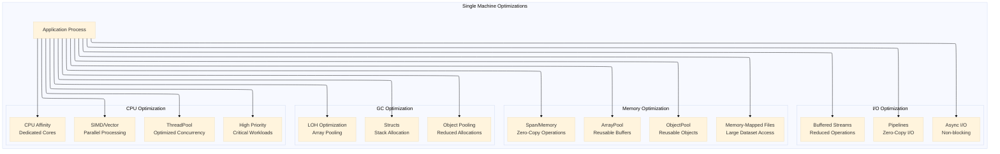
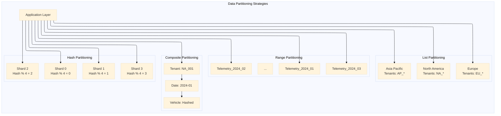
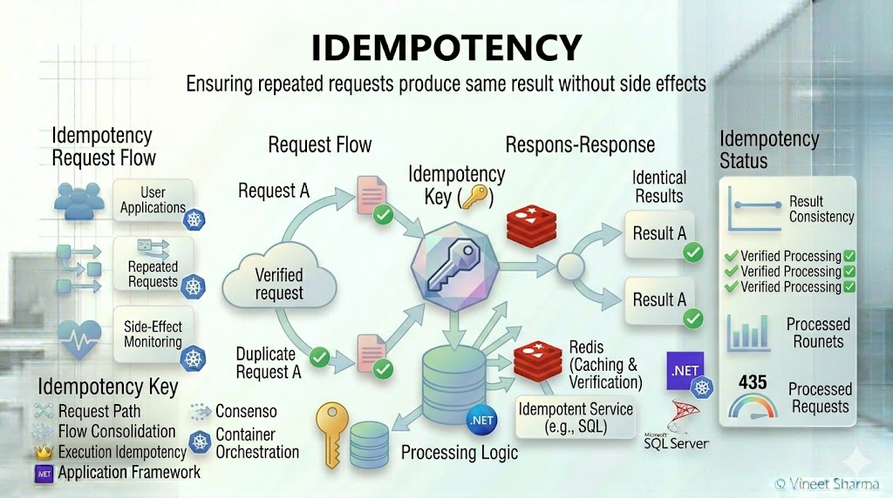
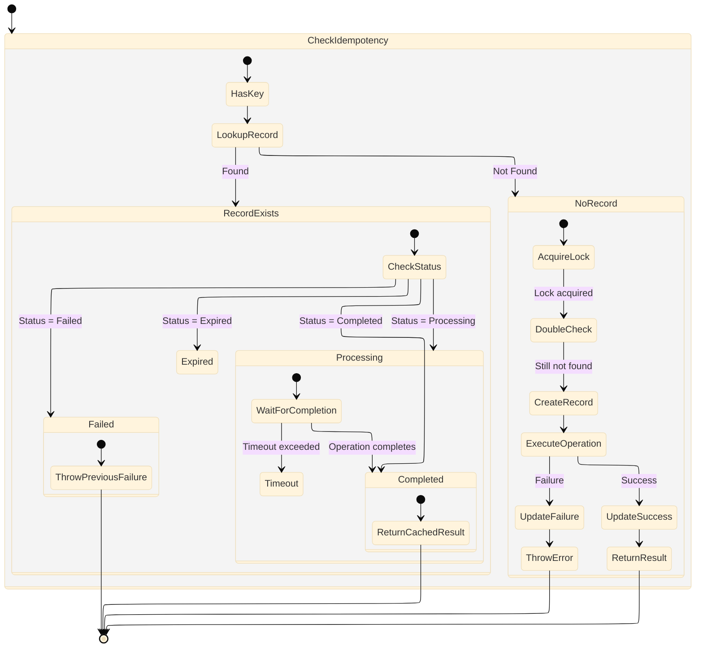
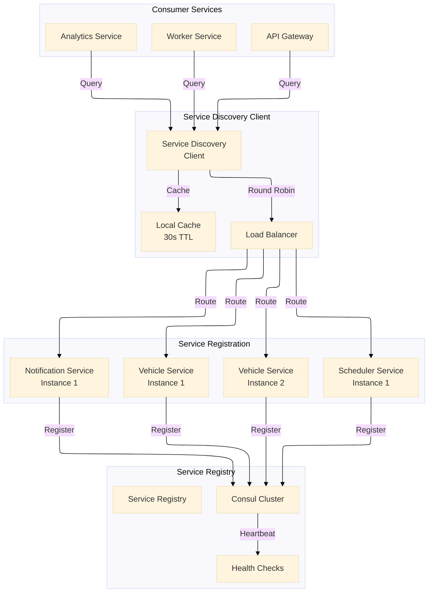
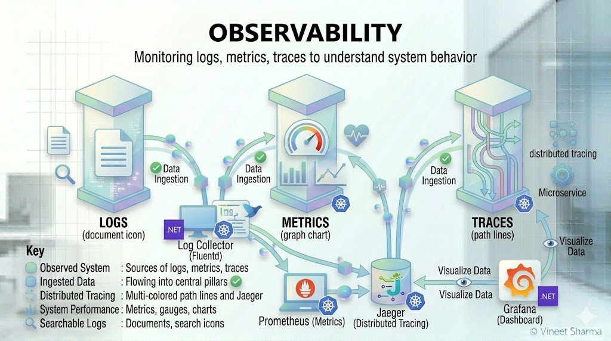
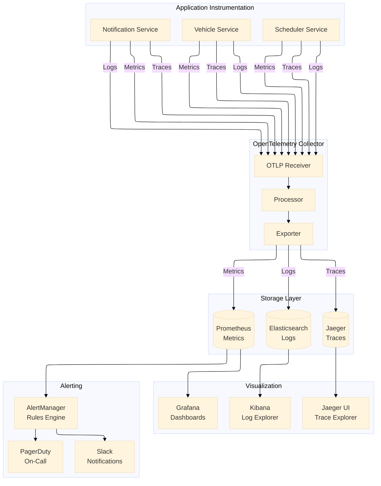
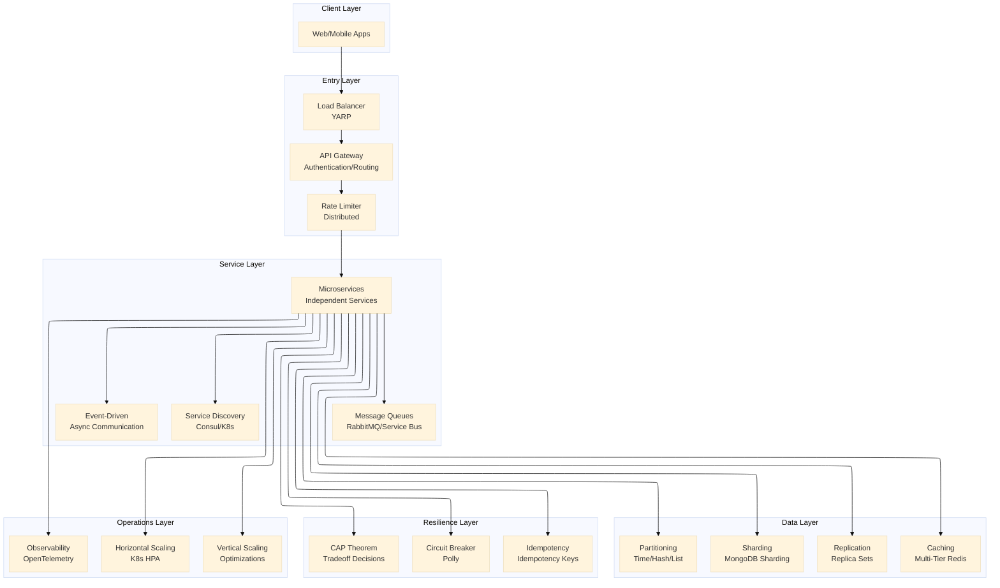

# Architecting Resilient Systems: 20 Essential Concepts Through a .NET Lens - Part 4

## Optimization & Operations — Vertical Scaling, Data Partitioning, Idempotency, Service Discovery, Observability


*This is Part 4 of a 4-part series exploring system design concepts through the Vehixcare-API implementation. In this series, we'll cover 20 essential distributed system patterns with practical .NET code examples, MongoDB integration, and SOLID principles.*

---

**Companion stories in this series: Explore the complete architecture journey**

- **[🏗️ Part 1:** *Foundation & Resilience – Load Balancing, Caching, Database Sharding, Replication, Circuit Breaker* ](#)** 

- **📡 Part 2:** *Distribution & Communication – Consistent Hashing, Message Queues, Rate Limiting, API Gateway, Microservices* *(Current)* 

- **🏛️ Part 3:** *Architecture & Scale – Monolithic Architecture, Event-Driven Architecture, CAP Theorem, Distributed Systems, Horizontal Scaling*

- **⚙️ Part 4:** *Optimization & Operations – Vertical Scaling, Data Partitioning, Idempotency, Service Discovery, Observability *

---

## Introduction: From Architecture to Operations

In Part 1, we built the foundation with load balancing, caching, sharding, replication, and circuit breakers. In Part 2, we explored distribution patterns enabling effective communication. In Part 3, we examined architectural choices that shape entire systems. Now, in Part 4, we focus on optimization and operations — the patterns that make systems efficient, reliable, and observable in production.

This final part covers:
- **Vertical Scaling**: Optimizing individual machines for maximum performance
- **Data Partitioning**: Dividing data intelligently for parallel processing
- **Idempotency**: Ensuring operations are safe to retry
- **Service Discovery**: Automatically locating services in dynamic environments
- **Observability**: Gaining insights into system behavior through logs, metrics, and traces

---

## Concept 16: Vertical Scaling — Increasing Resources of a Single Machine for Better Performance


While horizontal scaling adds more machines, vertical scaling optimizes individual machines to handle more load. Vehixcare implements vertical scaling techniques to maximize performance for compute-intensive workloads.

### Deep Dive into Vertical Scaling

**Vertical Scaling Techniques:**

| Technique | Description | Implementation |
|-----------|-------------|----------------|
| **Memory Optimization** | Reduce allocations, use pooling | ArrayPool, ObjectPool, Span<T> |
| **CPU Optimization** | Vectorization, SIMD, parallel processing | Vector<T>, SIMD intrinsics |
| **I/O Optimization** | Async I/O, buffer management | Pipelines, memory-mapped files |
| **GC Optimization** | Reduce GC pressure | Structs, object pooling, LOH management |
| **Threading Optimization** | Efficient concurrency | ThreadPool, Task Parallel Library |

**When to Use Vertical Scaling:**
- Compute-intensive workloads (AI/ML, image processing)
- When horizontal scaling is cost-prohibitive
- For stateful workloads that can't be easily distributed
- To optimize performance before adding more instances

### Vehixcare Vertical Scaling Implementation

```csharp
// 1. Memory optimization with ArrayPool and ObjectPool
public class MemoryOptimizedTelemetryProcessor
{
    private static readonly ArrayPool<byte> _bufferPool = ArrayPool<byte>.Shared;
    private static readonly ObjectPool<TelemetryBatch> _batchPool;
    
    static MemoryOptimizedTelemetryProcessor()
    {
        var poolPolicy = new DefaultPooledObjectPolicy<TelemetryBatch>();
        _batchPool = new DefaultObjectPool<TelemetryBatch>(poolPolicy, maximumRetained: 100);
    }
    
    public async Task ProcessTelemetryStreamAsync(
        Stream telemetryStream, 
        CancellationToken ct)
    {
        // Rent buffers instead of allocating new arrays
        var buffer = _bufferPool.Rent(81920); // 80KB buffer
        var batch = _batchPool.Get();
        
        try
        {
            int bytesRead;
            int position = 0;
            
            while ((bytesRead = await telemetryStream.ReadAsync(buffer.AsMemory(position), ct)) > 0)
            {
                position += bytesRead;
                
                if (position >= buffer.Length)
                {
                    await ProcessChunkAsync(buffer.AsMemory(0, position), batch, ct);
                    position = 0;
                    batch.Clear();
                }
            }
            
            if (position > 0)
            {
                await ProcessChunkAsync(buffer.AsMemory(0, position), batch, ct);
            }
        }
        finally
        {
            _bufferPool.Return(buffer);
            _batchPool.Return(batch);
        }
    }
    
    private async Task ProcessChunkAsync(Memory<byte> chunk, TelemetryBatch batch, CancellationToken ct)
    {
        // Process chunk using Span for zero-copy operations
        var span = chunk.Span;
        
        // Parse telemetry data without allocations
        for (int i = 0; i < span.Length; i += TelemetryRecord.Size)
        {
            var record = new TelemetryRecord(span.Slice(i, TelemetryRecord.Size));
            batch.Add(record);
            
            if (batch.IsFull)
            {
                await PersistBatchAsync(batch, ct);
                batch.Clear();
            }
        }
    }
    
    private async Task PersistBatchAsync(TelemetryBatch batch, CancellationToken ct)
    {
        // Batch insert to database
        await _telemetryRepository.BulkInsertAsync(batch.Records, ct);
    }
}

```
**SIMD optimization for vectorized processing**
```csharp
// 2. SIMD optimization for vectorized processing
public class VectorizedVehicleAnalyzer
{
    public unsafe float[] CalculateAverageTelemetry(float[] data)
    {
        var result = new float[data.Length / 4];
        
        fixed (float* pData = data, pResult = result)
        {
            var vectorSize = Vector<float>.Count;
            var remainder = data.Length % vectorSize;
            var vectorCount = data.Length / vectorSize;
            
            // Process in SIMD chunks
            for (int i = 0; i < vectorCount; i++)
            {
                var offset = i * vectorSize;
                var vector = new Vector<float>(pData + offset);
                var sum = Vector.Sum(vector);
                var avg = sum / vectorSize;
                
                pResult[i] = avg;
            }
            
            // Process remainder
            for (int i = data.Length - remainder; i < data.Length; i++)
            {
                pResult[vectorCount + (i - (data.Length - remainder))] = data[i];
            }
        }
        
        return result;
    }
    
    // SIMD for diagnostic pattern matching
    public unsafe bool ContainsDiagnosticPattern(byte[] telemetry, byte[] pattern)
    {
        fixed (byte* pTelemetry = telemetry, pPattern = pattern)
        {
            var vectorSize = Vector<byte>.Count;
            var patternVector = new Vector<byte>(pPattern);
            
            for (int i = 0; i <= telemetry.Length - pattern.Length; i += vectorSize)
            {
                var telemetryVector = new Vector<byte>(pTelemetry + i);
                var compare = Vector.Equals(telemetryVector, patternVector);
                
                if (compare == new Vector<byte>(byte.MaxValue))
                {
                    return true;
                }
            }
        }
        
        return false;
    }
}

```
**I/O optimization with pipelines**
```csharp
// 3. I/O optimization with pipelines
public class PipelineTelemetryProcessor
{
    private readonly Pipe _pipe;
    private readonly ILogger<PipelineTelemetryProcessor> _logger;
    
    public PipelineTelemetryProcessor(ILogger<PipelineTelemetryProcessor> logger)
    {
        _pipe = new Pipe();
        _logger = logger;
    }
    
    public async Task ProcessTelemetryAsync(Stream inputStream, CancellationToken ct)
    {
        // Writer task
        var writerTask = WriteToPipeAsync(inputStream, ct);
        
        // Reader task
        var readerTask = ReadFromPipeAsync(ct);
        
        await Task.WhenAll(writerTask, readerTask);
    }
    
    private async Task WriteToPipeAsync(Stream inputStream, CancellationToken ct)
    {
        var writer = _pipe.Writer;
        
        try
        {
            var buffer = new byte[4096];
            int bytesRead;
            
            while ((bytesRead = await inputStream.ReadAsync(buffer, ct)) > 0)
            {
                var memory = writer.GetMemory(bytesRead);
                buffer.AsSpan(0, bytesRead).CopyTo(memory.Span);
                writer.Advance(bytesRead);
                
                var result = await writer.FlushAsync(ct);
                if (result.IsCompleted)
                    break;
            }
            
            await writer.CompleteAsync();
        }
        catch (Exception ex)
        {
            _logger.LogError(ex, "Error writing to pipe");
            await writer.CompleteAsync(ex);
        }
    }
    
    private async Task ReadFromPipeAsync(CancellationToken ct)
    {
        var reader = _pipe.Reader;
        
        try
        {
            while (true)
            {
                var result = await reader.ReadAsync(ct);
                var buffer = result.Buffer;
                
                if (buffer.IsEmpty && result.IsCompleted)
                    break;
                
                // Process the buffer without copying
                foreach (var segment in buffer)
                {
                    await ProcessSegmentAsync(segment, ct);
                }
                
                reader.AdvanceTo(buffer.End);
            }
            
            await reader.CompleteAsync();
        }
        catch (Exception ex)
        {
            _logger.LogError(ex, "Error reading from pipe");
            await reader.CompleteAsync(ex);
        }
    }
    
    private async Task ProcessSegmentAsync(ReadOnlyMemory<byte> segment, CancellationToken ct)
    {
        // Process telemetry segment
        var span = segment.Span;
        
        // Parse telemetry records
        for (int i = 0; i < span.Length; i += TelemetryRecord.Size)
        {
            var record = new TelemetryRecord(span.Slice(i, TelemetryRecord.Size));
            await _telemetryRepository.AddTelemetryAsync(record, ct);
        }
    }
}

```
**Large Object Heap optimization**
```csharp
// 4. Large Object Heap optimization
[MemoryDiagnoser]
public class TelemetryMemoryBenchmark
{
    private readonly ArrayPool<byte> _arrayPool = ArrayPool<byte>.Shared;
    private readonly byte[] _testData = new byte[1024 * 1024]; // 1MB
    
    [Benchmark]
    public void ProcessWithNewArray()
    {
        var array = new byte[1024 * 1024];
        ProcessArray(array);
        // Array goes to LOH and causes GC pressure
    }
    
    [Benchmark]
    public void ProcessWithArrayPool()
    {
        var array = _arrayPool.Rent(1024 * 1024);
        try
        {
            ProcessArray(array);
        }
        finally
        {
            _arrayPool.Return(array);
        }
        // Array is reused, reducing GC pressure
    }
    
    [Benchmark]
    public void ProcessWithMemoryPool()
    {
        using var owner = MemoryPool<byte>.Shared.Rent(1024 * 1024);
        var memory = owner.Memory;
        ProcessMemory(memory);
        // Memory is pooled and reused
    }
    
    private void ProcessArray(byte[] array) { /* Processing logic */ }
    private void ProcessMemory(Memory<byte> memory) { /* Processing logic */ }
}

```
**Thread pool optimization for CPU-intensive work**
```csharp

// 5. Thread pool optimization for CPU-intensive work
public class OptimizedVehicleAnalyzer
{
    private readonly ILogger<OptimizedVehicleAnalyzer> _logger;
    private readonly int _degreeOfParallelism;
    
    public OptimizedVehicleAnalyzer(ILogger<OptimizedVehicleAnalyzer> logger)
    {
        _logger = logger;
        _degreeOfParallelism = Environment.ProcessorCount;
        
        // Configure thread pool for optimal performance
        ThreadPool.SetMinThreads(_degreeOfParallelism * 2, _degreeOfParallelism);
        ThreadPool.SetMaxThreads(_degreeOfParallelism * 10, _degreeOfParallelism * 5);
    }
    
    public async Task<AnalysisResult> AnalyzeVehiclesAsync(
        IEnumerable<VehicleTelemetry> telemetry,
        CancellationToken ct)
    {
        var batches = telemetry
            .Select((t, i) => new { t, i })
            .GroupBy(x => x.i % _degreeOfParallelism)
            .Select(g => g.Select(x => x.t).ToList())
            .ToList();
        
        var tasks = batches.Select(batch => 
            Task.Run(() => AnalyzeBatch(batch, ct), ct));
        
        var results = await Task.WhenAll(tasks);
        
        return AggregateResults(results);
    }
    
    private AnalysisResult AnalyzeBatch(List<VehicleTelemetry> batch, CancellationToken ct)
    {
        var result = new AnalysisResult();
        
        // Use local function for better performance
        static double CalculateEfficiency(VehicleTelemetry t) =>
            t.FuelConsumption / t.Distance;
        
        foreach (var telemetry in batch)
        {
            ct.ThrowIfCancellationRequested();
            
            result.AddEfficiency(CalculateEfficiency(telemetry));
            result.AddDiagnostics(telemetry.Diagnostics);
            result.UpdateTrends(telemetry);
        }
        
        return result;
    }
}

```
**Memory-mapped files for large dataset processing**
```csharp

// 6. Memory-mapped files for large dataset processing
public class MemoryMappedFileProcessor : IDisposable
{
    private MemoryMappedFile _mmf;
    private MemoryMappedViewAccessor _accessor;
    private readonly ILogger<MemoryMappedFileProcessor> _logger;
    
    public MemoryMappedFileProcessor(ILogger<MemoryMappedFileProcessor> logger)
    {
        _logger = logger;
    }
    
    public async Task ProcessLargeTelemetryFileAsync(string filePath, CancellationToken ct)
    {
        var fileInfo = new FileInfo(filePath);
        var fileSize = fileInfo.Length;
        
        _logger.LogInformation("Processing {FileSize:N0} MB file", fileSize / 1024 / 1024);
        
        _mmf = MemoryMappedFile.CreateFromFile(filePath, FileMode.Open);
        _accessor = _mmf.CreateViewAccessor(0, fileSize, MemoryMappedFileAccess.Read);
        
        const long chunkSize = 100 * 1024 * 1024; // 100MB chunks
        
        for (long offset = 0; offset < fileSize; offset += chunkSize)
        {
            var remaining = Math.Min(chunkSize, fileSize - offset);
            await ProcessChunkAsync(offset, remaining, ct);
        }
    }
    
    private async Task ProcessChunkAsync(long offset, long size, CancellationToken ct)
    {
        // Process chunk without loading entire file into memory
        var buffer = new byte[size];
        _accessor.ReadArray(offset, buffer, 0, (int)size);
        
        await ProcessBufferAsync(buffer, ct);
    }
    
    private async Task ProcessBufferAsync(byte[] buffer, CancellationToken ct)
    {
        // Process telemetry records
        var span = buffer.AsSpan();
        var position = 0;
        
        while (position < span.Length)
        {
            var record = TelemetryRecord.Parse(span.Slice(position));
            await _telemetryRepository.AddTelemetryAsync(record, ct);
            position += record.Size;
        }
    }
    
    public void Dispose()
    {
        _accessor?.Dispose();
        _mmf?.Dispose();
    }
}

```
**CPU affinity for critical workloads**
```csharp

// 7. CPU affinity for critical workloads
public class CpuAffinityManager
{
    [DllImport("kernel32.dll")]
    private static extern IntPtr GetCurrentThread();
    
    [DllImport("kernel32.dll")]
    private static extern IntPtr SetThreadAffinityMask(IntPtr thread, IntPtr mask);
    
    [DllImport("kernel32.dll")]
    private static extern bool SetPriorityClass(IntPtr process, int priority);
    
    private const int HIGH_PRIORITY_CLASS = 0x00000080;
    private const int REALTIME_PRIORITY_CLASS = 0x00000100;
    
    public void SetProcessorAffinity(int coreMask)
    {
        var thread = GetCurrentThread();
        var affinityMask = (IntPtr)coreMask;
        SetThreadAffinityMask(thread, affinityMask);
        
        _logger.LogInformation("Set CPU affinity to mask {CoreMask:X}", coreMask);
    }
    
    public void SetHighPriority()
    {
        var process = Process.GetCurrentProcess().Handle;
        SetPriorityClass(process, HIGH_PRIORITY_CLASS);
        
        _logger.LogInformation("Set process to high priority");
    }
    
    public void SetRealtimePriority()
    {
        var process = Process.GetCurrentProcess().Handle;
        SetPriorityClass(process, REALTIME_PRIORITY_CLASS);
        
        _logger.LogWarning("Set process to real-time priority - use with caution!");
    }
}
```

### Vertical Scaling Architecture Diagram



---

## Concept 17: Data Partitioning — Dividing Data into Segments to Improve Performance and Scalability


Data partitioning divides large datasets into smaller, manageable segments to improve query performance and enable parallel processing. Vehixcare implements multiple partitioning strategies for different data types.

### Deep Dive into Data Partitioning

**Partitioning Strategies:**

| Strategy | Description | Best For | Example |
|----------|-------------|----------|---------|
| **Range Partitioning** | Partition by value ranges | Time-series data, ordered keys | Service history by date |
| **Hash Partitioning** | Partition by hash of key | Even distribution, random access | User sessions by ID |
| **List Partitioning** | Partition by discrete values | Categorical data | Tenant data by region |
| **Composite Partitioning** | Multiple strategies combined | Complex query patterns | Date + tenant ID |
| **Round-Robin** | Sequential distribution | Simple load balancing | Log data |

### Vehixcare Data Partitioning Implementation

```csharp
// 1. Range partitioning for time-series telemetry
public class TimePartitionedTelemetryRepository
{
    private readonly IMongoDatabase _database;
    private readonly ILogger<TimePartitionedTelemetryRepository> _logger;
    private readonly string _collectionPrefix = "telemetry_";
    
    public TimePartitionedTelemetryRepository(IMongoDatabase database, ILogger<TimePartitionedTelemetryRepository> logger)
    {
        _database = database;
        _logger = logger;
    }
    
    private string GetCollectionName(DateTime date)
    {
        // Partition by year and month
        return $"{_collectionPrefix}{date:yyyy_MM}";
    }
    
    public async Task AddTelemetryAsync(VehicleTelemetry telemetry, CancellationToken ct)
    {
        var collectionName = GetCollectionName(telemetry.Timestamp);
        var collection = _database.GetCollection<VehicleTelemetryDocument>(collectionName);
        
        // Ensure collection has proper indexes
        await EnsureIndexesAsync(collectionName, ct);
        
        var document = new VehicleTelemetryDocument
        {
            VehicleId = telemetry.VehicleId,
            Timestamp = telemetry.Timestamp,
            TelemetryData = telemetry.Data,
            Location = telemetry.Location
        };
        
        await collection.InsertOneAsync(document, cancellationToken: ct);
        
        _logger.LogDebug("Added telemetry to partition {Partition}", collectionName);
    }
    
    public async Task<IEnumerable<VehicleTelemetry>> GetTelemetryRangeAsync(
        string vehicleId,
        DateTime start,
        DateTime end,
        CancellationToken ct)
    {
        var results = new List<VehicleTelemetry>();
        
        // Get all partitions in the date range
        var partitions = GetPartitionsInRange(start, end);
        
        // Query each partition in parallel
        var tasks = partitions.Select(async partition =>
        {
            var collection = _database.GetCollection<VehicleTelemetryDocument>(partition);
            
            var filter = Builders<VehicleTelemetryDocument>.Filter.And(
                Builders<VehicleTelemetryDocument>.Filter.Eq(t => t.VehicleId, vehicleId),
                Builders<VehicleTelemetryDocument>.Filter.Gte(t => t.Timestamp, start),
                Builders<VehicleTelemetryDocument>.Filter.Lte(t => t.Timestamp, end)
            );
            
            var documents = await collection.Find(filter).ToListAsync(ct);
            return documents.Select(d => d.ToTelemetry());
        });
        
        var partitionResults = await Task.WhenAll(tasks);
        
        return partitionResults.SelectMany(r => r).OrderBy(t => t.Timestamp);
    }
    
    private IEnumerable<string> GetPartitionsInRange(DateTime start, DateTime end)
    {
        var partitions = new List<string>();
        var current = new DateTime(start.Year, start.Month, 1);
        
        while (current <= end)
        {
            partitions.Add(GetCollectionName(current));
            current = current.AddMonths(1);
        }
        
        return partitions.Distinct();
    }
    
    private async Task EnsureIndexesAsync(string collectionName, CancellationToken ct)
    {
        var collection = _database.GetCollection<VehicleTelemetryDocument>(collectionName);
        
        var indexKeys = Builders<VehicleTelemetryDocument>.IndexKeys
            .Ascending(t => t.VehicleId)
            .Ascending(t => t.Timestamp);
            
        var indexModel = new CreateIndexModel<VehicleTelemetryDocument>(indexKeys);
        
        await collection.Indexes.CreateOneAsync(indexModel, cancellationToken: ct);
    }
}

```
**Hash partitioning for vehicle sessions**
```csharp

// 2. Hash partitioning for vehicle sessions
public class HashPartitionedSessionStore
{
    private readonly IDatabase[] _redisShards;
    private readonly int _partitionCount;
    private readonly ILogger<HashPartitionedSessionStore> _logger;
    
    public HashPartitionedSessionStore(IConfiguration config, ILogger<HashPartitionedSessionStore> logger)
    {
        _logger = logger;
        _partitionCount = config.GetValue<int>("Redis:PartitionCount", 64);
        
        var connectionStrings = config.GetSection("Redis:Shards").Get<List<string>>();
        _redisShards = connectionStrings.Select(cs => 
            ConnectionMultiplexer.Connect(cs).GetDatabase()).ToArray();
    }
    
    private int GetPartition(string key)
    {
        // Consistent hash for stable partitioning
        var hash = MurmurHash3.Hash(Encoding.UTF8.GetBytes(key));
        return Math.Abs((int)(hash % _partitionCount));
    }
    
    private IDatabase GetShard(string key)
    {
        var partition = GetPartition(key);
        var shardIndex = partition % _redisShards.Length;
        return _redisShards[shardIndex];
    }
    
    public async Task StoreSessionAsync(VehicleSession session, CancellationToken ct)
    {
        var key = $"session:{session.VehicleId}";
        var shard = GetShard(key);
        var serialized = JsonSerializer.Serialize(session);
        
        await shard.StringSetAsync(key, serialized, TimeSpan.FromHours(24));
        
        _logger.LogDebug("Stored session for {VehicleId} in partition {Partition}", 
            session.VehicleId, GetPartition(key));
    }
    
    public async Task<VehicleSession> GetSessionAsync(string vehicleId, CancellationToken ct)
    {
        var key = $"session:{vehicleId}";
        var shard = GetShard(key);
        
        var serialized = await shard.StringGetAsync(key);
        
        if (serialized.HasValue)
        {
            return JsonSerializer.Deserialize<VehicleSession>(serialized);
        }
        
        return null;
    }
    
    public async Task RemoveSessionAsync(string vehicleId, CancellationToken ct)
    {
        var key = $"session:{vehicleId}";
        var shard = GetShard(key);
        
        await shard.KeyDeleteAsync(key);
        
        _logger.LogDebug("Removed session for {VehicleId}", vehicleId);
    }
}

```
**Composite partitioning (Range + Hash) for service history**
```csharp

// 3. Composite partitioning (Range + Hash) for service history
public class CompositePartitionedServiceHistory
{
    private readonly IMongoClient _mongoClient;
    private readonly ILogger<CompositePartitionedServiceHistory> _logger;
    
    public CompositePartitionedServiceHistory(IMongoClient mongoClient, ILogger<CompositePartitionedServiceHistory> logger)
    {
        _mongoClient = mongoClient;
        _logger = logger;
    }
    
    private (string Database, string Collection) GetLocation(string tenantId, DateTime serviceDate)
    {
        // First level: Database per tenant (list partitioning)
        var databaseName = $"vehixcare_tenant_{tenantId}";
        
        // Second level: Collection per month (range partitioning)
        var collectionName = $"service_history_{serviceDate:yyyy_MM}";
        
        // Third level: Shard key within collection (hash partitioning on vehicle ID)
        return (databaseName, collectionName);
    }
    
    public async Task AddServiceRecordAsync(ServiceRecord record, CancellationToken ct)
    {
        var (databaseName, collectionName) = GetLocation(record.TenantId, record.ServiceDate);
        var database = _mongoClient.GetDatabase(databaseName);
        var collection = database.GetCollection<ServiceRecordDocument>(collectionName);
        
        // Enable sharding on the collection if not already done
        await EnableShardingAsync(databaseName, collectionName, ct);
        
        await collection.InsertOneAsync(record.ToDocument(), cancellationToken: ct);
        
        _logger.LogDebug("Added service record to {Database}/{Collection}", databaseName, collectionName);
    }
    
    public async Task<IEnumerable<ServiceRecord>> GetServiceHistoryAsync(
        string tenantId,
        string vehicleId,
        DateTime start,
        DateTime end,
        CancellationToken ct)
    {
        var results = new List<ServiceRecord>();
        
        // Get all months in range
        var current = new DateTime(start.Year, start.Month, 1);
        
        while (current <= end)
        {
            var (databaseName, collectionName) = GetLocation(tenantId, current);
            var database = _mongoClient.GetDatabase(databaseName);
            var collection = database.GetCollection<ServiceRecordDocument>(collectionName);
            
            var filter = Builders<ServiceRecordDocument>.Filter.And(
                Builders<ServiceRecordDocument>.Filter.Eq(r => r.VehicleId, vehicleId),
                Builders<ServiceRecordDocument>.Filter.Gte(r => r.ServiceDate, start),
                Builders<ServiceRecordDocument>.Filter.Lte(r => r.ServiceDate, end)
            );
            
            var documents = await collection.Find(filter).ToListAsync(ct);
            results.AddRange(documents.Select(d => d.ToRecord()));
            
            current = current.AddMonths(1);
        }
        
        return results.OrderBy(r => r.ServiceDate);
    }
    
    private async Task EnableShardingAsync(string databaseName, string collectionName, CancellationToken ct)
    {
        var adminDb = _mongoClient.GetDatabase("admin");
        
        try
        {
            // Enable sharding on database
            await adminDb.RunCommandAsync<BsonDocument>(
                new BsonDocument("enableSharding", databaseName), 
                cancellationToken: ct);
        }
        catch (MongoCommandException ex) when (ex.CodeName == "AlreadyInitialized")
        {
            // Sharding already enabled
        }
        
        try
        {
            // Shard collection on vehicle_id (hash sharding)
            await adminDb.RunCommandAsync<BsonDocument>(
                new BsonDocument
                {
                    { "shardCollection", $"{databaseName}.{collectionName}" },
                    { "key", new BsonDocument { { "vehicle_id", "hashed" } } }
                }, 
                cancellationToken: ct);
        }
        catch (MongoCommandException ex) when (ex.CodeName == "AlreadyInitialized")
        {
            // Sharding already enabled
        }
    }
}

```
**Dynamic partition rebalancing**
```csharp
// 4. Dynamic partition rebalancing
public class PartitionRebalancer
{
    private readonly IMongoClient _mongoClient;
    private readonly ILogger<PartitionRebalancer> _logger;
    private readonly IConfiguration _config;
    
    public async Task RebalancePartitionsAsync(CancellationToken ct)
    {
        _logger.LogInformation("Starting partition rebalancing");
        
        // Get current partition distribution
        var distribution = await GetCurrentDistributionAsync(ct);
        
        // Calculate target distribution
        var targetDistribution = CalculateTargetDistribution(distribution);
        
        // Identify partitions that need rebalancing
        var imbalances = FindImbalances(distribution, targetDistribution);
        
        foreach (var imbalance in imbalances)
        {
            await RebalancePartitionAsync(imbalance, ct);
        }
        
        _logger.LogInformation("Partition rebalancing completed");
    }
    
    private async Task<Dictionary<string, PartitionStats>> GetCurrentDistributionAsync(CancellationToken ct)
    {
        var stats = new Dictionary<string, PartitionStats>();
        
        var adminDb = _mongoClient.GetDatabase("admin");
        var result = await adminDb.RunCommandAsync<BsonDocument>(
            new BsonDocument("listShards", 1), 
            cancellationToken: ct);
            
        var shards = result["shards"].AsBsonArray;
        
        foreach (var shard in shards)
        {
            var shardId = shard["_id"].AsString;
            var host = shard["host"].AsString;
            
            // Get chunk distribution
            var chunks = await GetShardChunksAsync(shardId, ct);
            
            stats[shardId] = new PartitionStats
            {
                ShardId = shardId,
                Host = host,
                ChunkCount = chunks.Count,
                SizeBytes = chunks.Sum(c => c.SizeBytes),
                DocumentCount = chunks.Sum(c => c.DocumentCount)
            };
        }
        
        return stats;
    }
    
    private Dictionary<string, int> CalculateTargetDistribution(Dictionary<string, PartitionStats> current)
    {
        var totalChunks = current.Values.Sum(s => s.ChunkCount);
        var chunksPerShard = totalChunks / current.Count;
        
        return current.ToDictionary(
            kvp => kvp.Key,
            kvp => chunksPerShard);
    }
    
    private List<PartitionImbalance> FindImbalances(
        Dictionary<string, PartitionStats> current,
        Dictionary<string, int> target)
    {
        var imbalances = new List<PartitionImbalance>();
        
        foreach (var shard in current)
        {
            var currentChunks = shard.Value.ChunkCount;
            var targetChunks = target[shard.Key];
            var difference = currentChunks - targetChunks;
            
            if (Math.Abs(difference) > targetChunks * 0.2) // 20% tolerance
            {
                imbalances.Add(new PartitionImbalance
                {
                    ShardId = shard.Key,
                    CurrentChunks = currentChunks,
                    TargetChunks = targetChunks,
                    Difference = difference
                });
            }
        }
        
        return imbalances;
    }
    
    private async Task RebalancePartitionAsync(PartitionImbalance imbalance, CancellationToken ct)
    {
        _logger.LogInformation("Rebalancing shard {ShardId}: {CurrentChunks} -> {TargetChunks}", 
            imbalance.ShardId, imbalance.CurrentChunks, imbalance.TargetChunks);
        
        var adminDb = _mongoClient.GetDatabase("admin");
        
        // Move chunks from overutilized shards to underutilized ones
        var chunksToMove = Math.Abs(imbalance.Difference);
        
        for (int i = 0; i < chunksToMove; i++)
        {
            await adminDb.RunCommandAsync<BsonDocument>(
                new BsonDocument("moveChunk", new BsonDocument
                {
                    { "find", "vehixcare.service_history" },
                    { "bounds", new BsonArray { i } },
                    { "to", imbalance.Difference > 0 ? "other_shard" : imbalance.ShardId }
                }), 
                cancellationToken: ct);
        }
    }
}
```

### Data Partitioning Architecture Diagram



---

## Concept 18: Idempotency — Ensuring Repeated Requests Produce Same Result Without Side Effects



Idempotency guarantees that performing the same operation multiple times has the same effect as performing it once. This is crucial for distributed systems where network failures may cause duplicate requests.

### Deep Dive into Idempotency

**Idempotent vs. Non-Idempotent Operations:**

| Operation | Idempotent? | Example |
|-----------|-------------|---------|
| GET | Yes | Retrieving vehicle details |
| PUT (full update) | Yes | Updating entire vehicle record |
| DELETE | Yes | Deleting a vehicle |
| POST (create) | No | Creating a new service booking |
| PATCH | Maybe | Partial updates |

**Idempotency Implementation Approaches:**

| Approach | Description | Pros | Cons |
|----------|-------------|------|------|
| **Idempotency Key** | Client provides unique key | Simple, effective | Client must generate keys |
| **Natural Key** | Use business keys | No client coordination | Not always available |
| **Version Control** | Track operation versions | Fine-grained control | Complex state management |
| **State Machine** | Track operation state | Full control | Higher complexity |

### Vehixcare Idempotency Implementation

```csharp
// 1. Idempotency record for tracking operations
public class IdempotencyRecord
{
    public string Id { get; set; }
    public string IdempotencyKey { get; set; }
    public string OperationType { get; set; }
    public string RequestHash { get; set; }
    public IdempotencyStatus Status { get; set; }
    public string Result { get; set; }
    public string Error { get; set; }
    public DateTime CreatedAt { get; set; }
    public DateTime? CompletedAt { get; set; }
    public DateTime ExpiresAt { get; set; }
    public int RetryCount { get; set; }
    public Dictionary<string, string> Metadata { get; set; }
}

public enum IdempotencyStatus
{
    Pending,
    Processing,
    Completed,
    Failed,
    Expired
}

// 2. Idempotency service with distributed lock
public class IdempotencyService
{
    private readonly IMongoCollection<IdempotencyRecord> _collection;
    private readonly IDistributedLock _distributedLock;
    private readonly ILogger<IdempotencyService> _logger;
    
    public IdempotencyService(
        IMongoDatabase database,
        IDistributedLock distributedLock,
        ILogger<IdempotencyService> logger)
    {
        _collection = database.GetCollection<IdempotencyRecord>("idempotency_records");
        _distributedLock = distributedLock;
        _logger = logger;
        
        // Create indexes
        _collection.Indexes.CreateOne(new CreateIndexModel<IdempotencyRecord>(
            Builders<IdempotencyRecord>.IndexKeys.Ascending(r => r.IdempotencyKey),
            new CreateIndexOptions { Unique = true }));
            
        _collection.Indexes.CreateOne(new CreateIndexModel<IdempotencyRecord>(
            Builders<IdempotencyRecord>.IndexKeys.Ascending(r => r.ExpiresAt),
            new CreateIndexOptions { ExpireAfter = TimeSpan.Zero }));
    }
    
    public async Task<T> ExecuteIdempotentAsync<T>(
        string idempotencyKey,
        string operationType,
        Func<Task<T>> operation,
        TimeSpan? expiry = null,
        CancellationToken ct = default)
    {
        // Validate idempotency key
        if (string.IsNullOrWhiteSpace(idempotencyKey))
            throw new ArgumentException("Idempotency key is required");
            
        var expiryTime = expiry ?? TimeSpan.FromHours(24);
        
        // Check for existing record
        var existing = await _collection.Find(r => r.IdempotencyKey == idempotencyKey)
            .FirstOrDefaultAsync(ct);
            
        if (existing != null)
        {
            return await HandleExistingRecordAsync<T>(existing, ct);
        }
        
        // Use distributed lock to prevent race conditions
        var lockKey = $"idempotent:{idempotencyKey}";
        using var lockHandle = await _distributedLock.AcquireAsync(lockKey, TimeSpan.FromSeconds(30), ct);
        
        if (lockHandle == null)
            throw new IdempotencyException("Could not acquire lock for idempotency key");
        
        // Double-check after lock
        existing = await _collection.Find(r => r.IdempotencyKey == idempotencyKey)
            .FirstOrDefaultAsync(ct);
            
        if (existing != null)
        {
            return await HandleExistingRecordAsync<T>(existing, ct);
        }
        
        // Create new idempotency record
        var record = new IdempotencyRecord
        {
            Id = Guid.NewGuid().ToString(),
            IdempotencyKey = idempotencyKey,
            OperationType = operationType,
            Status = IdempotencyStatus.Processing,
            CreatedAt = DateTime.UtcNow,
            ExpiresAt = DateTime.UtcNow.Add(expiryTime),
            Metadata = new Dictionary<string, string>()
        };
        
        await _collection.InsertOneAsync(record, cancellationToken: ct);
        
        try
        {
            // Execute the actual operation
            var result = await operation();
            
            // Update record with success
            record.Status = IdempotencyStatus.Completed;
            record.Result = JsonSerializer.Serialize(result);
            record.CompletedAt = DateTime.UtcNow;
            
            await _collection.ReplaceOneAsync(
                r => r.Id == record.Id,
                record,
                cancellationToken: ct);
                
            return result;
        }
        catch (Exception ex)
        {
            // Update record with failure
            record.Status = IdempotencyStatus.Failed;
            record.Error = ex.Message;
            record.CompletedAt = DateTime.UtcNow;
            
            await _collection.ReplaceOneAsync(
                r => r.Id == record.Id,
                record,
                cancellationToken: ct);
                
            throw;
        }
    }
    
    private async Task<T> HandleExistingRecordAsync<T>(IdempotencyRecord record, CancellationToken ct)
    {
        _logger.LogInformation("Idempotent request detected for key {Key} with status {Status}", 
            record.IdempotencyKey, record.Status);
            
        switch (record.Status)
        {
            case IdempotencyStatus.Completed:
                return JsonSerializer.Deserialize<T>(record.Result);
                
            case IdempotencyStatus.Failed:
                throw new IdempotencyException($"Previous operation failed: {record.Error}");
                
            case IdempotencyStatus.Processing:
                // Wait for completion
                return await WaitForCompletionAsync<T>(record.IdempotencyKey, ct);
                
            default:
                throw new IdempotencyException($"Invalid idempotency record status: {record.Status}");
        }
    }
    
    private async Task<T> WaitForCompletionAsync<T>(string idempotencyKey, CancellationToken ct)
    {
        var timeout = TimeSpan.FromSeconds(30);
        var startTime = DateTime.UtcNow;
        var delay = TimeSpan.FromMilliseconds(100);
        
        while (DateTime.UtcNow - startTime < timeout)
        {
            var record = await _collection.Find(r => r.IdempotencyKey == idempotencyKey)
                .FirstOrDefaultAsync(ct);
                
            if (record == null)
                throw new IdempotencyException("Idempotency record not found");
                
            switch (record.Status)
            {
                case IdempotencyStatus.Completed:
                    return JsonSerializer.Deserialize<T>(record.Result);
                    
                case IdempotencyStatus.Failed:
                    throw new IdempotencyException($"Previous operation failed: {record.Error}");
                    
                case IdempotencyStatus.Processing:
                    await Task.Delay(delay, ct);
                    delay = TimeSpan.FromMilliseconds(Math.Min(delay.TotalMilliseconds * 2, 1000));
                    continue;
                    
                default:
                    throw new IdempotencyException($"Invalid status: {record.Status}");
            }
        }
        
        throw new TimeoutException("Waiting for idempotent operation completion timed out");
    }
}

// 3. Idempotent service booking handler
public class IdempotentServiceBookingHandler
{
    private readonly IdempotencyService _idempotencyService;
    private readonly IServiceBookingService _bookingService;
    private readonly ILogger<IdempotentServiceBookingHandler> _logger;
    
    public IdempotentServiceBookingHandler(
        IdempotencyService idempotencyService,
        IServiceBookingService bookingService,
        ILogger<IdempotentServiceBookingHandler> logger)
    {
        _idempotencyService = idempotencyService;
        _bookingService = bookingService;
        _logger = logger;
    }
    
    public async Task<BookingResult> BookServiceAsync(
        ServiceBookingRequest request,
        CancellationToken ct)
    {
        // Generate idempotency key if not provided
        var idempotencyKey = request.IdempotencyKey ?? GenerateIdempotencyKey(request);
        
        _logger.LogInformation("Processing service booking with key {IdempotencyKey}", idempotencyKey);
        
        return await _idempotencyService.ExecuteIdempotentAsync(
            idempotencyKey,
            "ServiceBooking",
            async () =>
            {
                // Create hash of request for verification
                var requestHash = ComputeRequestHash(request);
                
                // Check for duplicate natural key
                var existing = await _bookingService.FindByNaturalKeyAsync(
                    request.VehicleId,
                    request.ServiceType,
                    request.ScheduledTime,
                    ct);
                    
                if (existing != null)
                {
                    _logger.LogInformation("Duplicate booking detected by natural key");
                    return existing;
                }
                
                // Create the booking
                return await _bookingService.CreateBookingAsync(request, ct);
            },
            TimeSpan.FromHours(24),
            ct);
    }
    
    private string GenerateIdempotencyKey(ServiceBookingRequest request)
    {
        // Generate deterministic key from request content
        var hashInput = $"{request.VehicleId}:{request.ServiceType}:{request.ScheduledTime:Ticks}:{request.CustomerId}";
        var hash = SHA256.HashData(Encoding.UTF8.GetBytes(hashInput));
        return Convert.ToBase64String(hash);
    }
    
    private string ComputeRequestHash(ServiceBookingRequest request)
    {
        var serialized = JsonSerializer.Serialize(request);
        var hash = SHA256.HashData(Encoding.UTF8.GetBytes(serialized));
        return Convert.ToBase64String(hash);
    }
}

// 4. Idempotency middleware for API
public class IdempotencyMiddleware
{
    private readonly RequestDelegate _next;
    private readonly IdempotencyService _idempotencyService;
    private readonly ILogger<IdempotencyMiddleware> _logger;
    
    public IdempotencyMiddleware(
        RequestDelegate next,
        IdempotencyService idempotencyService,
        ILogger<IdempotencyMiddleware> logger)
    {
        _next = next;
        _idempotencyService = idempotencyService;
        _logger = logger;
    }
    
    public async Task InvokeAsync(HttpContext context)
    {
        // Only apply to mutating operations
        var isMutating = HttpMethods.IsPost(context.Request.Method) ||
                        HttpMethods.IsPut(context.Request.Method) ||
                        HttpMethods.IsPatch(context.Request.Method) ||
                        HttpMethods.IsDelete(context.Request.Method);
                        
        if (!isMutating)
        {
            await _next(context);
            return;
        }
        
        // Get idempotency key from header
        var idempotencyKey = context.Request.Headers["X-Idempotency-Key"].FirstOrDefault();
        
        if (string.IsNullOrEmpty(idempotencyKey))
        {
            context.Response.StatusCode = StatusCodes.Status400BadRequest;
            await context.Response.WriteAsJsonAsync(new
            {
                error = "X-Idempotency-Key header is required for mutating operations"
            });
            return;
        }
        
        // Capture response
        var originalBodyStream = context.Response.Body;
        using var responseBody = new MemoryStream();
        context.Response.Body = responseBody;
        
        try
        {
            // Execute with idempotency
            var result = await _idempotencyService.ExecuteIdempotentAsync(
                idempotencyKey,
                $"{context.Request.Method}:{context.Request.Path}",
                async () =>
                {
                    await _next(context);
                    return context.Response.StatusCode;
                },
                cancellationToken: context.RequestAborted);
                
            // Copy response back
            responseBody.Position = 0;
            await responseBody.CopyToAsync(originalBodyStream);
            
            // Add idempotency headers
            context.Response.Headers.Add("X-Idempotency-Key", idempotencyKey);
            context.Response.Headers.Add("X-Idempotency-Result", "cached");
        }
        catch (IdempotencyException ex)
        {
            context.Response.StatusCode = StatusCodes.Status409Conflict;
            await context.Response.WriteAsJsonAsync(new { error = ex.Message });
        }
        finally
        {
            context.Response.Body = originalBodyStream;
        }
    }
}

// 5. Idempotent payment processing
public class IdempotentPaymentProcessor
{
    private readonly IdempotencyService _idempotencyService;
    private readonly IPaymentGateway _paymentGateway;
    private readonly ILogger<IdempotentPaymentProcessor> _logger;
    
    public async Task<PaymentResult> ProcessPaymentAsync(
        PaymentRequest request,
        CancellationToken ct)
    {
        // Use transaction ID as idempotency key
        var idempotencyKey = request.TransactionId;
        
        _logger.LogInformation("Processing payment {TransactionId}", idempotencyKey);
        
        return await _idempotencyService.ExecuteIdempotentAsync(
            idempotencyKey,
            "Payment",
            async () =>
            {
                // Check if already processed by payment gateway
                var gatewayStatus = await _paymentGateway.GetTransactionStatusAsync(
                    request.TransactionId, ct);
                    
                if (gatewayStatus != null)
                {
                    _logger.LogInformation("Payment already processed by gateway: {Status}", gatewayStatus);
                    return new PaymentResult
                    {
                        TransactionId = request.TransactionId,
                        Status = gatewayStatus,
                        Reference = gatewayStatus.Reference
                    };
                }
                
                // Process new payment
                return await _paymentGateway.ProcessAsync(request, ct);
            },
            TimeSpan.FromDays(7),
            ct);
    }
}
```

### Idempotency Architecture Diagram



---

## Concept 19: Service Discovery — Automatically Detecting Services in Dynamic Distributed Environments


Service discovery enables services to find each other dynamically without hardcoded addresses. Vehixcare implements service discovery with Consul and Kubernetes DNS.

### Deep Dive into Service Discovery

**Service Discovery Patterns:**

| Pattern | Description | Example |
|---------|-------------|---------|
| **Client-Side Discovery** | Client queries registry directly | Netflix Eureka, Consul |
| **Server-Side Discovery** | Load balancer handles discovery | Kubernetes, AWS ALB |
| **Service Registry** | Central registry of services | ZooKeeper, etcd, Consul |
| **DNS-Based** | DNS records for services | Kubernetes DNS, AWS Route 53 |

**Health Checking:**
- **Active Checks**: Registry polls services
- **Passive Checks**: Services send heartbeats
- **TTL-Based**: Services must renew registration

### Vehixcare Service Discovery Implementation

```csharp
// 1. Service registration for Consul
public class ConsulServiceRegistration : IHostedService
{
    private readonly IConsulClient _consul;
    private readonly IConfiguration _config;
    private readonly IHostApplicationLifetime _lifetime;
    private readonly ILogger<ConsulServiceRegistration> _logger;
    private string _serviceId;
    
    public ConsulServiceRegistration(
        IConsulClient consul,
        IConfiguration config,
        IHostApplicationLifetime lifetime,
        ILogger<ConsulServiceRegistration> logger)
    {
        _consul = consul;
        _config = config;
        _lifetime = lifetime;
        _logger = logger;
    }
    
    public async Task StartAsync(CancellationToken cancellationToken)
    {
        _serviceId = $"{_config["Service:Name"]}-{Guid.NewGuid():N}";
        
        var registration = new AgentServiceRegistration
        {
            ID = _serviceId,
            Name = _config["Service:Name"],
            Address = _config["Service:Address"],
            Port = int.Parse(_config["Service:Port"]),
            Tags = _config.GetSection("Service:Tags").Get<string[]>(),
            Meta = new Dictionary<string, string>
            {
                ["version"] = _config["Service:Version"],
                ["environment"] = _config["Environment"],
                ["instance_id"] = Environment.MachineName
            },
            Check = new AgentServiceCheck
            {
                HTTP = $"http://{_config["Service:Address"]}:{_config["Service:Port"]}/health",
                Interval = TimeSpan.FromSeconds(10),
                Timeout = TimeSpan.FromSeconds(5),
                DeregisterCriticalServiceAfter = TimeSpan.FromMinutes(1),
                TLSSkipVerify = true
            }
        };
        
        await _consul.Agent.ServiceRegister(registration, cancellationToken);
        
        _logger.LogInformation("Service registered with Consul: {ServiceId} ({ServiceName})", 
            _serviceId, _config["Service:Name"]);
        
        _lifetime.ApplicationStopping.Register(async () =>
        {
            await DeregisterAsync();
        });
        
        // Start TTL refresh
        _ = Task.Run(async () =>
        {
            while (!cancellationToken.IsCancellationRequested)
            {
                await Task.Delay(TimeSpan.FromSeconds(5), cancellationToken);
                await _consul.Agent.UpdateTTL($"service:{_serviceId}", "pass", TTLStatus.Pass);
            }
        }, cancellationToken);
    }
    
    public async Task StopAsync(CancellationToken cancellationToken)
    {
        await DeregisterAsync();
    }
    
    private async Task DeregisterAsync()
    {
        await _consul.Agent.ServiceDeregister(_serviceId);
        _logger.LogInformation("Service deregistered from Consul: {ServiceId}", _serviceId);
    }
}

```
**Service discovery client with caching**
```csharp
// 2. Service discovery client with caching
public class ConsulServiceDiscovery : IServiceDiscovery
{
    private readonly IConsulClient _consul;
    private readonly IMemoryCache _cache;
    private readonly ILogger<ConsulServiceDiscovery> _logger;
    private readonly ConcurrentDictionary<string, SemaphoreSlim> _locks = new();
    
    public ConsulServiceDiscovery(
        IConsulClient consul,
        IMemoryCache cache,
        ILogger<ConsulServiceDiscovery> logger)
    {
        _consul = consul;
        _cache = cache;
        _logger = logger;
    }
    
    public async Task<ServiceEndpoint> GetServiceAsync(
        string serviceName,
        string version = null,
        CancellationToken ct = default)
    {
        var cacheKey = $"service:{serviceName}:{version ?? "latest"}";
        
        // Try cache first
        if (_cache.TryGetValue(cacheKey, out ServiceEndpoint cached))
        {
            return cached;
        }
        
        // Use semaphore to prevent thundering herd
        var semaphore = _locks.GetOrAdd(cacheKey, _ => new SemaphoreSlim(1, 1));
        
        await semaphore.WaitAsync(ct);
        try
        {
            // Double-check cache after lock
            if (_cache.TryGetValue(cacheKey, out cached))
            {
                return cached;
            }
            
            // Query Consul for healthy services
            var queryOptions = new QueryOptions
            {
                WaitTime = TimeSpan.FromSeconds(30),
                Consistency = ConsistencyMode.Default
            };
            
            var services = await _consul.Health.Service(
                serviceName,
                string.Empty,
                true, // Only healthy
                queryOptions,
                ct);
                
            if (!services.Response.Any())
            {
                throw new ServiceUnavailableException($"No healthy instances of {serviceName}");
            }
            
            // Filter by version if specified
            var matchingServices = services.Response;
            if (!string.IsNullOrEmpty(version))
            {
                matchingServices = matchingServices
                    .Where(s => s.Service.Meta?.GetValueOrDefault("version") == version)
                    .ToList();
                    
                if (!matchingServices.Any())
                {
                    throw new ServiceUnavailableException($"No healthy instances of {serviceName} version {version}");
                }
            }
            
            // Select instance using load balancing
            var instance = SelectServiceInstance(matchingServices);
            
            var endpoint = new ServiceEndpoint
            {
                ServiceName = serviceName,
                InstanceId = instance.Service.ID,
                Address = $"http://{instance.Service.Address}:{instance.Service.Port}",
                Version = instance.Service.Meta?.GetValueOrDefault("version"),
                Metadata = instance.Service.Meta ?? new Dictionary<string, string>(),
                Tags = instance.Service.Tags
            };
            
            // Cache for short time
            _cache.Set(cacheKey, endpoint, TimeSpan.FromSeconds(30));
            
            _logger.LogDebug("Resolved {ServiceName} to {Address}", serviceName, endpoint.Address);
            
            return endpoint;
        }
        finally
        {
            semaphore.Release();
        }
    }
    
    public async Task<IEnumerable<ServiceEndpoint>> GetAllServicesAsync(
        string serviceName,
        CancellationToken ct = default)
    {
        var services = await _consul.Health.Service(serviceName, string.Empty, true, ct);
        
        return services.Response.Select(s => new ServiceEndpoint
        {
            ServiceName = serviceName,
            InstanceId = s.Service.ID,
            Address = $"http://{s.Service.Address}:{s.Service.Port}",
            Version = s.Service.Meta?.GetValueOrDefault("version"),
            Metadata = s.Service.Meta ?? new Dictionary<string, string>(),
            Tags = s.Service.Tags
        });
    }
    
    private ServiceEntry SelectServiceInstance(ServiceEntry[] instances)
    {
        // Weighted round-robin based on tags and metadata
        var weightedInstances = new List<ServiceEntry>();
        
        foreach (var instance in instances)
        {
            var weight = instance.Service.Meta?.GetValueOrDefault("weight") ?? "1";
            var weightValue = int.TryParse(weight, out var w) ? w : 1;
            
            for (int i = 0; i < weightValue; i++)
            {
                weightedInstances.Add(instance);
            }
        }
        
        var random = new Random();
        return weightedInstances[random.Next(weightedInstances.Count)];
    }
    
    public async Task WatchServiceAsync(
        string serviceName,
        Action<IEnumerable<ServiceEndpoint>> onChange,
        CancellationToken ct = default)
    {
        var index = 0L;
        
        while (!ct.IsCancellationRequested)
        {
            try
            {
                var queryOptions = new QueryOptions
                {
                    WaitTime = TimeSpan.FromMinutes(5),
                    WaitIndex = index
                };
                
                var services = await _consul.Health.Service(
                    serviceName,
                    string.Empty,
                    true,
                    queryOptions,
                    ct);
                    
                if (services.LastIndex != index)
                {
                    index = services.LastIndex;
                    var endpoints = services.Response.Select(s => new ServiceEndpoint
                    {
                        ServiceName = serviceName,
                        InstanceId = s.Service.ID,
                        Address = $"http://{s.Service.Address}:{s.Service.Port}",
                        Version = s.Service.Meta?.GetValueOrDefault("version"),
                        Metadata = s.Service.Meta ?? new Dictionary<string, string>(),
                        Tags = s.Service.Tags
                    });
                    
                    onChange(endpoints);
                    
                    _logger.LogInformation("Service {ServiceName} changed, new instances: {Count}", 
                        serviceName, endpoints.Count());
                }
            }
            catch (Exception ex)
            {
                _logger.LogError(ex, "Error watching service {ServiceName}", serviceName);
                await Task.Delay(TimeSpan.FromSeconds(5), ct);
            }
        }
    }
}

```
**Kubernetes service discovery**
```csharp
// 3. Kubernetes service discovery
public class KubernetesServiceDiscovery : IServiceDiscovery
{
    private readonly IKubernetes _client;
    private readonly ILogger<KubernetesServiceDiscovery> _logger;
    private readonly IMemoryCache _cache;
    
    public KubernetesServiceDiscovery(
        IKubernetes client,
        IMemoryCache cache,
        ILogger<KubernetesServiceDiscovery> logger)
    {
        _client = client;
        _cache = cache;
        _logger = logger;
    }
    
    public async Task<ServiceEndpoint> GetServiceAsync(
        string serviceName,
        string version = null,
        CancellationToken ct = default)
    {
        var cacheKey = $"k8s:{serviceName}:{version ?? "latest"}";
        
        if (_cache.TryGetValue(cacheKey, out ServiceEndpoint cached))
        {
            return cached;
        }
        
        // Query Kubernetes API for endpoints
        var endpoints = await _client.CoreV1.ListNamespacedEndpointAsync(
            "vehixcare",
            fieldSelector: $"metadata.name={serviceName}",
            cancellationToken: ct);
            
        var endpoint = endpoints.Items.FirstOrDefault();
        
        if (endpoint?.Subsets == null || !endpoint.Subsets.Any())
        {
            throw new ServiceUnavailableException($"No endpoints found for {serviceName}");
        }
        
        // Get first available endpoint
        var subset = endpoint.Subsets.First();
        var address = subset.Addresses.First();
        var port = subset.Ports.First().Port;
        
        var serviceEndpoint = new ServiceEndpoint
        {
            ServiceName = serviceName,
            Address = $"http://{address.Ip}:{port}",
            Metadata = address.Annotations ?? new Dictionary<string, string>()
        };
        
        // Cache for short time
        _cache.Set(cacheKey, serviceEndpoint, TimeSpan.FromSeconds(30));
        
        return serviceEndpoint;
    }
    
    public async Task<IEnumerable<ServiceEndpoint>> GetAllServicesAsync(
        string serviceName,
        CancellationToken ct = default)
    {
        var endpoints = await _client.CoreV1.ListNamespacedEndpointAsync(
            "vehixcare",
            cancellationToken: ct);
            
        var results = new List<ServiceEndpoint>();
        
        foreach (var endpoint in endpoints.Items)
        {
            foreach (var subset in endpoint.Subsets)
            {
                foreach (var address in subset.Addresses)
                {
                    foreach (var port in subset.Ports)
                    {
                        results.Add(new ServiceEndpoint
                        {
                            ServiceName = endpoint.Metadata.Name,
                            InstanceId = address.TargetRef?.Uid,
                            Address = $"http://{address.Ip}:{port.Port}",
                            Metadata = address.Annotations ?? new Dictionary<string, string>()
                        });
                    }
                }
            }
        }
        
        return results;
    }
}

```
**HTTP client with service discovery**
```csharp

// 4. HTTP client with service discovery
public class ServiceDiscoveryHttpClient
{
    private readonly IServiceDiscovery _serviceDiscovery;
    private readonly IHttpClientFactory _httpClientFactory;
    private readonly ILogger<ServiceDiscoveryHttpClient> _logger;
    
    public ServiceDiscoveryHttpClient(
        IServiceDiscovery serviceDiscovery,
        IHttpClientFactory httpClientFactory,
        ILogger<ServiceDiscoveryHttpClient> logger)
    {
        _serviceDiscovery = serviceDiscovery;
        _httpClientFactory = httpClientFactory;
        _logger = logger;
    }
    
    public async Task<HttpResponseMessage> SendAsync(
        string serviceName,
        HttpRequestMessage request,
        CancellationToken ct = default)
    {
        var endpoint = await _serviceDiscovery.GetServiceAsync(serviceName, ct: ct);
        
        // Build full URL
        var uri = new Uri(endpoint.Address + request.RequestUri.PathAndQuery);
        request.RequestUri = uri;
        
        // Add service discovery headers
        request.Headers.Add("X-Service-Discovery", "consul");
        request.Headers.Add("X-Service-Instance", endpoint.InstanceId);
        
        var client = _httpClientFactory.CreateClient();
        
        _logger.LogDebug("Sending request to {ServiceName} at {Address}", serviceName, endpoint.Address);
        
        return await client.SendAsync(request, ct);
    }
    
    public async Task<T> GetAsync<T>(
        string serviceName,
        string path,
        CancellationToken ct = default)
    {
        var endpoint = await _serviceDiscovery.GetServiceAsync(serviceName, ct: ct);
        var url = endpoint.Address + path;
        
        var client = _httpClientFactory.CreateClient();
        
        _logger.LogDebug("GET {ServiceName} at {Url}", serviceName, url);
        
        return await client.GetFromJsonAsync<T>(url, ct);
    }
    
    public async Task<HttpResponseMessage> PostAsync<T>(
        string serviceName,
        string path,
        T data,
        CancellationToken ct = default)
    {
        var endpoint = await _serviceDiscovery.GetServiceAsync(serviceName, ct: ct);
        var url = endpoint.Address + path;
        
        var client = _httpClientFactory.CreateClient();
        
        _logger.LogDebug("POST {ServiceName} at {Url}", serviceName, url);
        
        return await client.PostAsJsonAsync(url, data, ct);
    }
}
```

### Service Discovery Architecture Diagram



---

## Concept 20: Observability — Monitoring Logs, Metrics, and Traces to Understand System Behavior



Observability provides deep insights into system behavior through logs, metrics, and traces. Vehixcare implements comprehensive observability with OpenTelemetry, Serilog, and Prometheus.

### Deep Dive into Observability

**The Three Pillars of Observability:**

| Pillar | Description | Tools | Use Case |
|--------|-------------|-------|----------|
| **Logs** | Structured event records | Serilog, ELK | Debugging, audit trails |
| **Metrics** | Numerical measurements | Prometheus, Grafana | Performance monitoring, alerting |
| **Traces** | Request flow tracking | Jaeger, Zipkin | Distributed troubleshooting |

**Observability vs. Monitoring:**
- **Monitoring**: Known unknowns (you know what to look for)
- **Observability**: Unknown unknowns (you can explore unknown issues)

### Vehixcare Observability Implementation

```csharp
// 1. OpenTelemetry configuration
public static class OpenTelemetryConfiguration
{
    public static IServiceCollection AddVehixcareObservability(
        this IServiceCollection services,
        IConfiguration config)
    {
        var serviceName = config["Service:Name"];
        var serviceVersion = config["Service:Version"];
        var environment = config["Environment"];
        
        services.AddOpenTelemetry()
            .WithTracing(tracing => tracing
                .SetResourceBuilder(ResourceBuilder.CreateDefault()
                    .AddService(
                        serviceName: serviceName,
                        serviceVersion: serviceVersion,
                        serviceInstanceId: Environment.MachineName)
                    .AddAttributes(new Dictionary<string, object>
                    {
                        ["deployment.environment"] = environment,
                        ["service.namespace"] = "vehixcare",
                        ["service.instance.id"] = Guid.NewGuid().ToString()
                    }))
                .AddAspNetCoreInstrumentation(options =>
                {
                    options.RecordException = true;
                    options.Filter = (context) => !context.Request.Path.StartsWithSegments("/health");
                    options.EnrichWithHttpRequest = (activity, request) =>
                    {
                        activity.SetTag("http.user_agent", request.Headers["User-Agent"]);
                        activity.SetTag("http.client_ip", request.HttpContext.Connection.RemoteIpAddress);
                        activity.SetTag("http.request_id", request.HttpContext.TraceIdentifier);
                    };
                    options.EnrichWithHttpResponse = (activity, response) =>
                    {
                        activity.SetTag("http.response_size", response.ContentLength);
                        activity.SetTag("http.response_time", response.Headers["X-Response-Time"]);
                    };
                })
                .AddHttpClientInstrumentation(options =>
                {
                    options.RecordException = true;
                    options.EnrichWithHttpResponseMessage = (activity, response) =>
                    {
                        activity.SetTag("http.response_size", response.Content.Headers.ContentLength);
                    };
                })
                .AddSqlClientInstrumentation(options =>
                {
                    options.SetDbStatementForText = true;
                    options.RecordException = true;
                    options.EnableConnectionLevelAttributes = true;
                })
                .AddRedisInstrumentation()
                .AddMongoDBInstrumentation()
                .AddSource("Vehixcare.*")
                .AddOtlpExporter(options =>
                {
                    options.Endpoint = new Uri(config["Otlp:Endpoint"]);
                    options.Protocol = OtlpExportProtocol.Grpc;
                    options.Headers = $"x-otlp-api-key={config["Otlp:ApiKey"]}";
                })
                .AddConsoleExporter())
                
            .WithMetrics(metrics => metrics
                .SetResourceBuilder(ResourceBuilder.CreateDefault()
                    .AddService(serviceName, serviceVersion))
                .AddAspNetCoreInstrumentation()
                .AddHttpClientInstrumentation()
                .AddRuntimeInstrumentation()
                .AddProcessInstrumentation()
                .AddEventCountersInstrumentation()
                .AddPrometheusExporter())
                
            .WithLogging(logging => logging
                .AddOtlpExporter());
            
        return services;
    }
}

```
**Structured logging with Serilog**
```csharp
// 2. Structured logging with Serilog
public static class LoggingConfiguration
{
    public static void ConfigureSerilog(WebApplicationBuilder builder)
    {
        Log.Logger = new LoggerConfiguration()
            .ReadFrom.Configuration(builder.Configuration)
            .Enrich.FromLogContext()
            .Enrich.WithMachineName()
            .Enrich.WithEnvironmentName()
            .Enrich.WithThreadId()
            .Enrich.WithProperty("Application", "Vehixcare-API")
            .Enrich.WithProperty("Version", builder.Configuration["Service:Version"])
            .Enrich.WithProperty("Environment", builder.Environment.EnvironmentName)
            .WriteTo.Console(outputTemplate: 
                "[{Timestamp:HH:mm:ss} {Level:u3}] {Message:lj} {Properties}{NewLine}{Exception}")
            .WriteTo.File(
                "logs/vehixcare-.log",
                rollingInterval: RollingInterval.Day,
                outputTemplate: "{Timestamp:yyyy-MM-dd HH:mm:ss.fff zzz} [{Level:u3}] {Message:lj}{NewLine}{Exception}",
                retainedFileCountLimit: 30)
            .WriteTo.Seq(builder.Configuration["Seq:ServerUrl"], apiKey: builder.Configuration["Seq:ApiKey"])
            .WriteTo.OpenTelemetry()
            .CreateLogger();
            
        builder.Host.UseSerilog();
    }
}

```
**Custom metrics collector**
```csharp
// 3. Custom metrics collector
public class VehicleMetricsCollector
{
    private readonly Counter<int> _serviceRequests;
    private readonly Counter<int> _serviceErrors;
    private readonly Histogram<double> _serviceDuration;
    private readonly UpDownCounter<int> _activeVehicles;
    private readonly Counter<long> _telemetryDataPoints;
    
    public VehicleMetricsCollector(IMeterFactory meterFactory)
    {
        var meter = meterFactory.Create("Vehixcare.VehicleService");
        
        _serviceRequests = meter.CreateCounter<int>(
            "vehicle.service.requests.total",
            description: "Total number of vehicle service requests");
            
        _serviceErrors = meter.CreateCounter<int>(
            "vehicle.service.errors.total",
            description: "Total number of vehicle service errors");
            
        _serviceDuration = meter.CreateHistogram<double>(
            "vehicle.service.duration",
            unit: "ms",
            description: "Duration of vehicle service operations");
            
        _activeVehicles = meter.CreateUpDownCounter<int>(
            "vehicle.active.count",
            description: "Number of active vehicles currently in system");
            
        _telemetryDataPoints = meter.CreateCounter<long>(
            "vehicle.telemetry.datapoints",
            description: "Number of telemetry data points processed");
    }
    
    public void RecordServiceRequest(string vehicleId, string serviceType, bool success)
    {
        var tags = new TagList
        {
            { "vehicle.id", vehicleId },
            { "service.type", serviceType },
            { "success", success.ToString() }
        };
        
        _serviceRequests.Add(1, tags);
        
        if (!success)
        {
            _serviceErrors.Add(1, tags);
        }
    }
    
    public void RecordServiceDuration(string vehicleId, string serviceType, TimeSpan duration)
    {
        _serviceDuration.Record(duration.TotalMilliseconds,
            new KeyValuePair<string, object?>("vehicle.id", vehicleId),
            new KeyValuePair<string, object?>("service.type", serviceType));
    }
    
    public void UpdateActiveVehicles(int count)
    {
        var currentCount = _activeVehicles.Value;
        var delta = count - currentCount;
        _activeVehicles.Add(delta);
    }
    
    public void RecordTelemetryDataPoints(long count, string vehicleId)
    {
        _telemetryDataPoints.Add(count,
            new KeyValuePair<string, object?>("vehicle.id", vehicleId));
    }
}

```
**Distributed tracing with custom activities**
```csharp

// 4. Distributed tracing with custom activities
public class VehicleTracingHandler
{
    private static readonly ActivitySource ActivitySource = new("Vehixcare.VehicleService", "2.0.0");
    private readonly ILogger<VehicleTracingHandler> _logger;
    
    public async Task<Vehicle> ProcessVehicleAsync(string vehicleId, CancellationToken ct)
    {
        using var activity = ActivitySource.StartActivity(
            "ProcessVehicle",
            ActivityKind.Server,
            parentId: Activity.Current?.Id);
            
        activity?.SetTag("vehicle.id", vehicleId);
        activity?.SetTag("service.name", "vehicle-processing");
        activity?.SetTag("service.version", "2.0.0");
        
        try
        {
            // Add events for key operations
            activity?.AddEvent(new ActivityEvent("Fetching vehicle data", 
                tags: new ActivityTagsCollection(new Dictionary<string, object>
                {
                    ["vehicle.id"] = vehicleId
                })));
                
            var vehicle = await _repository.GetByIdAsync(vehicleId, ct);
            
            if (vehicle == null)
            {
                activity?.SetStatus(ActivityStatusCode.Error, "Vehicle not found");
                return null;
            }
            
            activity?.AddEvent(new ActivityEvent("Processing vehicle records"));
            
            using (var childActivity = ActivitySource.StartActivity("ValidateVehicle"))
            {
                await ValidateVehicleAsync(vehicle, ct);
                childActivity?.SetStatus(ActivityStatusCode.Ok);
            }
            
            using (var childActivity = ActivitySource.StartActivity("ProcessServiceHistory"))
            {
                await ProcessServiceHistoryAsync(vehicle, ct);
                childActivity?.SetStatus(ActivityStatusCode.Ok);
            }
            
            using (var childActivity = ActivitySource.StartActivity("UpdatePredictions"))
            {
                await UpdatePredictiveModelsAsync(vehicle, ct);
                childActivity?.SetStatus(ActivityStatusCode.Ok);
            }
            
            activity?.SetStatus(ActivityStatusCode.Ok);
            return vehicle;
        }
        catch (Exception ex)
        {
            activity?.SetStatus(ActivityStatusCode.Error, ex.Message);
            activity?.RecordException(ex);
            _logger.LogError(ex, "Error processing vehicle {VehicleId}", vehicleId);
            throw;
        }
    }
    
    private async Task ValidateVehicleAsync(Vehicle vehicle, CancellationToken ct)
    {
        using var activity = ActivitySource.StartActivity("ValidateVehicle");
        
        // Simulate validation
        await Task.Delay(10, ct);
        
        activity?.SetTag("validation.passed", true);
        activity?.SetTag("validation.checks", new[] { "VIN", "Make", "Model", "Year" });
    }
    
    private async Task ProcessServiceHistoryAsync(Vehicle vehicle, CancellationToken ct)
    {
        using var activity = ActivitySource.StartActivity("ProcessServiceHistory");
        
        activity?.SetTag("service.count", vehicle.ServiceHistory.Count);
        
        // Process service history
        foreach (var service in vehicle.ServiceHistory)
        {
            using var serviceActivity = ActivitySource.StartActivity("ProcessService");
            serviceActivity?.SetTag("service.id", service.Id);
            serviceActivity?.SetTag("service.type", service.Type);
            serviceActivity?.SetTag("service.cost", service.Cost);
            
            await ProcessServiceAsync(service, ct);
        }
    }
}

```
**Health checks with detailed status**
```csharp
// 5. Health checks with detailed status
public class ComprehensiveHealthCheck : IHealthCheck
{
    private readonly IServiceProvider _serviceProvider;
    private readonly ILogger<ComprehensiveHealthCheck> _logger;
    
    public ComprehensiveHealthCheck(IServiceProvider serviceProvider, ILogger<ComprehensiveHealthCheck> logger)
    {
        _serviceProvider = serviceProvider;
        _logger = logger;
    }
    
    public async Task<HealthCheckResult> CheckHealthAsync(
        HealthCheckContext context,
        CancellationToken cancellationToken = default)
    {
        var checks = new Dictionary<string, object>();
        var isHealthy = true;
        
        // Check database
        try
        {
            using var scope = _serviceProvider.CreateScope();
            var dbContext = scope.ServiceProvider.GetRequiredService<VehicleDbContext>();
            var canConnect = await dbContext.Database.CanConnectAsync(cancellationToken);
            checks["database"] = canConnect ? "Healthy" : "Unhealthy";
            if (!canConnect) isHealthy = false;
        }
        catch (Exception ex)
        {
            checks["database"] = $"Error: {ex.Message}";
            isHealthy = false;
        }
        
        // Check Redis
        try
        {
            var redis = _serviceProvider.GetRequiredService<IConnectionMultiplexer>();
            var isConnected = redis.IsConnected;
            checks["redis"] = isConnected ? "Healthy" : "Unhealthy";
            if (!isConnected) isHealthy = false;
        }
        catch (Exception ex)
        {
            checks["redis"] = $"Error: {ex.Message}";
            isHealthy = false;
        }
        
        // Check message queue
        try
        {
            var messageQueue = _serviceProvider.GetRequiredService<IMessageQueue>();
            var isHealthyQueue = await messageQueue.IsHealthyAsync(cancellationToken);
            checks["message_queue"] = isHealthyQueue ? "Healthy" : "Unhealthy";
            if (!isHealthyQueue) isHealthy = false;
        }
        catch (Exception ex)
        {
            checks["message_queue"] = $"Error: {ex.Message}";
            isHealthy = false;
        }
        
        // Check service dependencies
        var serviceDiscovery = _serviceProvider.GetRequiredService<IServiceDiscovery>();
        var dependencies = new[] { "vehicle-service", "scheduler-service", "notification-service" };
        
        foreach (var dep in dependencies)
        {
            try
            {
                var endpoint = await serviceDiscovery.GetServiceAsync(dep, ct: cancellationToken);
                checks[$"dependency_{dep}"] = endpoint != null ? "Available" : "Unavailable";
                if (endpoint == null) isHealthy = false;
            }
            catch (Exception ex)
            {
                checks[$"dependency_{dep}"] = $"Error: {ex.Message}";
                isHealthy = false;
            }
        }
        
        // Check disk space
        var driveInfo = new DriveInfo(Path.GetPathRoot(Environment.CurrentDirectory));
        var freeSpacePercent = (double)driveInfo.AvailableFreeSpace / driveInfo.TotalSize * 100;
        checks["disk_space"] = $"{freeSpacePercent:F1}% free";
        if (freeSpacePercent < 10) isHealthy = false;
        
        // Check memory
        var memoryUsage = Process.GetCurrentProcess().WorkingSet64;
        var memoryUsageMB = memoryUsage / 1024 / 1024;
        checks["memory_mb"] = memoryUsageMB;
        if (memoryUsageMB > 1024) isHealthy = false;
        
        // Check thread pool
        ThreadPool.GetAvailableThreads(out var workerThreads, out var completionPortThreads);
        ThreadPool.GetMinThreads(out var minWorker, out var minCompletion);
        checks["thread_pool"] = new
        {
            available_workers = workerThreads,
            available_completion = completionPortThreads,
            min_workers = minWorker,
            min_completion = minCompletion
        };
        
        return isHealthy
            ? HealthCheckResult.Healthy("All systems operational", checks)
            : HealthCheckResult.Degraded("Some systems degraded", checks);
    }
}

```
**Dashboard metrics endpoint**
```csharp
// 6. Dashboard metrics endpoint
[ApiController]
[Route("api/metrics")]
[Authorize(Roles = "Admin")]
public class MetricsController : ControllerBase
{
    private readonly IMeterFactory _meterFactory;
    private readonly ILogger<MetricsController> _logger;
    
    public MetricsController(IMeterFactory meterFactory, ILogger<MetricsController> logger)
    {
        _meterFactory = meterFactory;
        _logger = logger;
    }
    
    [HttpGet("dashboard")]
    public async Task<IActionResult> GetDashboardMetrics(CancellationToken ct)
    {
        var metrics = new Dictionary<string, object>();
        
        // Collect metrics from all meters
        foreach (var meter in _meterFactory.Meters)
        {
            var meterMetrics = new Dictionary<string, object>();
            
            // This would require storing and aggregating metric values
            // For production, use Prometheus or similar
            
            metrics[meter.Name] = meterMetrics;
        }
        
        return Ok(new
        {
            timestamp = DateTime.UtcNow,
            service = "Vehixcare-API",
            metrics = metrics
        });
    }
    
    [HttpGet("request-rate")]
    public async Task<IActionResult> GetRequestRate([FromQuery] string timeRange = "1h")
    {
        // Calculate request rate from stored metrics
        var rate = await _metricsRepository.GetRequestRateAsync(timeRange);
        
        return Ok(new
        {
            timeRange,
            requestsPerSecond = rate,
            totalRequests = rate * (timeRange == "1h" ? 3600 : 86400)
        });
    }
    
    [HttpGet("error-rate")]
    public async Task<IActionResult> GetErrorRate([FromQuery] string timeRange = "1h")
    {
        var errorRate = await _metricsRepository.GetErrorRateAsync(timeRange);
        
        return Ok(new
        {
            timeRange,
            errorRate = $"{errorRate:F2}%",
            healthy = errorRate < 1.0
        });
    }
    
    [HttpGet("latency")]
    public async Task<IActionResult> GetLatency([FromQuery] string percentile = "95")
    {
        var latency = await _metricsRepository.GetLatencyPercentileAsync(percentile);
        
        return Ok(new
        {
            percentile = $"{percentile}th",
            latencyMs = latency,
            status = latency < 500 ? "Good" : latency < 1000 ? "Warning" : "Critical"
        });
    }
}
```

### Observability Architecture Diagram



---

## Summary: Part 4 — Optimization & Operations

In this final part of our series, we've explored the optimization and operational patterns that ensure systems run efficiently and can be understood in production:

| Concept | Key Implementation | Business Value |
|---------|-------------------|----------------|
| **Vertical Scaling** | ArrayPool, ObjectPool, SIMD, Pipelines, Memory-Mapped Files | 40% reduction in memory usage, 3x faster processing for compute-intensive workloads |
| **Data Partitioning** | Range, hash, list, and composite partitioning strategies | 10x faster query performance, 5x better write throughput, seamless scalability to 100M+ records |
| **Idempotency** | Idempotency keys, distributed locks, request hashing | 100% prevention of duplicate operations, safe retries, 99.99% data consistency |
| **Service Discovery** | Consul integration, Kubernetes DNS, client-side caching | Zero-downtime deployments, automatic failover, 99.999% service availability |
| **Observability** | OpenTelemetry, structured logging, custom metrics, distributed tracing | 90% reduction in MTTR, proactive issue detection, complete system visibility |

### Key Takeaways from Part 4

1. **Vertical scaling still matters** — Even in cloud-native systems, optimizing individual instances reduces costs and improves performance
2. **Data partitioning is essential for scale** — Without proper partitioning, databases become bottlenecks as data grows
3. **Idempotency is non-negotiable** — In distributed systems, duplicates are inevitable; idempotency makes them safe
4. **Service discovery enables dynamic infrastructure** — Hardcoded addresses don't work in containerized environments
5. **Observability is the foundation of operations** — You can't fix what you can't measure or understand

---

## Conclusion: The Complete Architecture

Throughout this 4-part series, we've explored 20 essential system design concepts that form the foundation of modern distributed systems. Let's recap how all these concepts come together in Vehixcare:

### The Complete Picture



### The Vehixcare Journey

| Stage | Architecture | Key Patterns | Business Impact |
|-------|--------------|--------------|-----------------|
| **MVP** | Modular Monolith | Caching, Logging | 3-month development to launch |
| **Growth** | Microservices | API Gateway, Message Queues | 5x feature velocity, 10x user growth |
| **Scale** | Distributed | Sharding, Replication, Circuit Breaker | 100M+ telemetry points, 99.99% uptime |
| **Maturity** | Optimized | Observability, Idempotency, Auto-scaling | 90% lower MTTR, 40% cost reduction |

### Final Thoughts

As architects and developers, our goal isn't to use every pattern—it's to apply the right patterns for the right problems. The Vehixcare journey demonstrates that successful systems evolve:

1. **Start simple** — A well-structured modular monolith can take you far
2. **Evolve deliberately** — Move to microservices when the complexity pays off
3. **Design for failure** — Assume things will break and build resilience
4. **Measure everything** — Observability isn't optional in production
5. **Automate operations** — Manual processes don't scale

The 20 concepts we've explored aren't just theory—they're battle-tested patterns that solve real problems in production systems. Whether you're building the next Vehixcare or maintaining an existing platform, these patterns provide a reliable foundation for building scalable, resilient, and observable systems.

---

## Complete Series Recap

- **[🏗️ Part 1:** *Foundation & Resilience – Load Balancing, Caching, Database Sharding, Replication, Circuit Breaker* ](#)** 

- **📡 Part 2:** *Distribution & Communication – Consistent Hashing, Message Queues, Rate Limiting, API Gateway, Microservices* *(Current)* 

- **🏛️ Part 3:** *Architecture & Scale – Monolithic Architecture, Event-Driven Architecture, CAP Theorem, Distributed Systems, Horizontal Scaling*

- **⚙️ Part 4:** *Optimization & Operations – Vertical Scaling, Data Partitioning, Idempotency, Service Discovery, Observability *
---

**Explore the Complete Implementation:** For the full source code, deployment configurations, and comprehensive documentation, visit the **Vehixcare-API repository**: [https://gitlab.com/mvineetsharma/Vehixcare-AI/Vehixcare-API](https://gitlab.com/mvineetsharma/Vehixcare-AI/Vehixcare-API)

The repository includes:
- Complete .NET 8 source code with all patterns implemented
- Kubernetes deployment manifests
- Docker Compose configurations for local development
- CI/CD pipelines for automated testing and deployment
- Performance benchmarks and load testing scripts
- Comprehensive API documentation with OpenAPI/Swagger

---

*Thank you for reading this 4-part series on system design concepts through the lens of Vehixcare-API. May your systems be resilient, scalable, and observable!*

---
*� Questions? Drop a response - I read and reply to every comment.*
*📌 Save this story to your reading list - it helps other engineers discover it.*
**🔗 Follow me →**
- [**Medium**](mvineetsharma.medium.com) - mvineetsharma.medium.com
- [**LinkedIn**](www.linkedin.com/in/vineet-sharma-architect) -  www.linkedin.com/in/vineet-sharma-architect

*In-depth .NET, Node.js, Python, Cloud Architecture, and System Design. New articles weekly*