# Terraform with Kubernetes on Azure: A Complete Architectural Guide With Vehixcare

## Vehixcare Platform Implementation

**Keywords:** Infrastructure as Code, Azure Kubernetes Service (AKS), Cosmos DB MongoDB API, Terraform State Management, Pod Identity, Horizontal Pod Autoscaler, Secrets Store CSI Driver, Azure CNI, Workload Identity, Multi-Region Failover, SignalR, Event-Driven Architecture, Rx.NET, Geo-fencing, Telemetry Processing, KEDA, Azure Event Grid


## Introduction: Terraform and Kubernetes on Azure

When building cloud-native applications on Microsoft Azure, infrastructure teams face a critical architectural decision: how to provision cloud resources and how to deploy applications. Two dominant tools emerge—Terraform and Kubernetes—but they serve fundamentally different purposes.

**Terraform** is an infrastructure-as-code tool that provisions Azure resources such as virtual networks, AKS clusters, Cosmos DB accounts, and Key Vaults. It uses a declarative language called HCL (HashiCorp Configuration Language) and maintains a state file that maps your configuration to real Azure resources. When you run `terraform apply`, Terraform makes API calls to Azure Resource Manager to create, update, or delete resources. Terraform's job ends the moment the infrastructure is ready—it does not care about pod replicas, rolling updates, or whether your API responds to health checks.

**Kubernetes** is a container orchestration platform that schedules, scales, and manages application workloads inside a cluster. On Azure, AKS (Azure Kubernetes Service) provides a managed control plane while you manage worker nodes and application deployments. Kubernetes handles pod scheduling, automatic restarts of failed containers, rolling updates with zero downtime, service discovery via DNS, horizontal scaling based on metrics, and secret injection.

These tools are not competitors. Terraform manages the **cloud control plane**—everything outside the container boundary. Kubernetes manages the **application data plane**—everything inside the cluster. AKS sits at the intersection: Terraform creates the AKS cluster, and Kubernetes runs workloads inside it.

This document provides a complete implementation guide for both tools working in harmony, using **Vehixcare**—a .NET 9.0 fleet telemetry platform with real-time GPS tracking, driver behavior analysis, geo-fencing, and SignalR streaming—as the reference application. The complete source code is available at [https://gitlab.com/mvineetsharma/Vehixcare-AI/Vehixcare-API](https://gitlab.com/mvineetsharma/Vehixcare-AI/Vehixcare-API).

---

## 1. Vehixcare Platform: Features and Infrastructure Mapping

Vehixcare is a comprehensive fleet management and vehicle telemetry platform built with .NET 9.0, ASP.NET Core, and MongoDB. Below are its core features and how each maps to Terraform and Kubernetes concepts:

| Feature | Description | Terraform Responsibility | Kubernetes Responsibility |
|---------|-------------|--------------------------|---------------------------|
| **Real-time Vehicle Telemetry** | GPS tracking, speed monitoring, engine diagnostics with sub-second latency | Provision Cosmos DB for telemetry storage (40,000 RU/s autoscale), Event Grid namespace for event routing | Deploy Telemetry API pods (3-20 replicas), HPA based on telemetry messages/sec, SignalR for live streaming |
| **Driver Behavior Analysis** | Scoring system for driving patterns, safety metrics, risk assessment using Rx.NET pipelines | Create MongoDB collections for driver scores with TTL indexes, configure change feed processors | Run Rx.NET background processors (2-15 replicas), scale with KEDA based on Azure Queue depth |
| **Geo-fencing** | Virtual boundaries with entry/exit alerts and automated triggers | Provision geospatial indexes (2dsphere) in Cosmos DB, configure private endpoints | Deploy Geo-fence Monitor pods (2-10 replicas), cache active fences in Redis, trigger alerts |
| **Maintenance Management** | Service scheduling, predictive maintenance alerts, digital records | Create ServiceRecords collection with 180-day TTL, configure backup policies | Run maintenance scheduler as Kubernetes CronJob, send notifications via Event Grid |
| **Lease Management** | Vehicle leasing, rental tracking, contract lifecycle management | Configure lease collections with partition keys by organization_id, enable point-in-time recovery | Deploy Lease API pods, integrate with Stripe payment gateway, manage lease state machines |
| **Anti-theft Protection** | Unauthorized movement detection, geolocation alerts, immobilization triggers | Set up Cosmos DB change feed processors, configure Azure Functions for serverless detection | Run anomaly detection pods (2-5 replicas), trigger alerts via SignalR, log to Azure Monitor |
| **Multi-tenant Architecture** | Isolated data and configurations for multiple organizations | Configure Cosmos DB partition keys by organization_id, separate Key Vault secrets per tenant | Enforce tenant isolation via namespace policies, RBAC roles (SuperAdmin, OrgAdmin, FleetManager), network policies |

**Technical Features and Infrastructure Mapping:**

| Technical Feature | Implementation | Terraform Role | Kubernetes Role |
|-------------------|---------------|----------------|-----------------|
| **RESTful API with JWT** | ASP.NET Core controllers, JWT Bearer authentication with Google OAuth | Create Key Vault for JWT signing secrets (HSM-backed), configure access policies | Deploy API pods (3-20 replicas), inject secrets via CSI driver with polling, HPA scaling |
| **SignalR Real-time** | WebSocket connections for live telemetry streaming to dashboards | Provision Azure Load Balancer with session affinity (ClientIP, 10800s timeout), configure health probes | Deploy SignalR Hub pods with backplane (Azure Redis Cache), session affinity service |
| **Google OAuth** | Social login for fleet managers and drivers | Create Key Vault secrets for OAuth client ID and secret, configure redirect URIs | Mount secrets to API pods, implement OAuth callback handlers, manage token refresh |
| **Rx.NET Event-driven** | Reactive pipelines for telemetry processing with backpressure handling | Provision Azure Service Bus or Kafka topics, configure Event Grid subscriptions | Deploy background processor pods with memory limits (4-8 Gi), Rx.NET buffer windows (5s/10000 messages) |
| **Multi-provider Eventing** | Azure Event Grid, AWS EventBridge, Apache Kafka support | Create Event Grid topics and subscriptions, configure private endpoints for Kafka | Run event adapter pods, configuration via ConfigMaps, provider abstraction interface |
| **MongoDB Change Streams** | Real-time database change notifications for geo-fence triggers | Enable change feed in Cosmos DB, configure partition key routing | Deploy change stream processor pods, resume tokens for fault tolerance |
| **Health Checks** | /health, /ready, /live endpoints for probe detection | Configure Application Gateway health probes (interval 30s, timeout 30s, unhealthy threshold 3) | Implement liveness/readiness/startup probes in deployment manifests |
| **Prometheus Metrics** | /metrics endpoint for telemetry and business metrics | Deploy Prometheus with Azure Monitor integration | Configure ServiceMonitor, PodMonitor resources for scraping |

---


## 1. Architecture Overview

### 1.1 High-Level Architecture Diagram

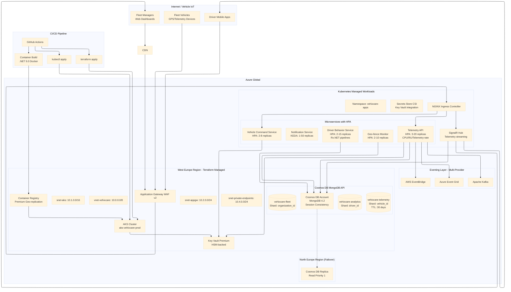

### 1.2 Deployment Workflow Sequence Diagram

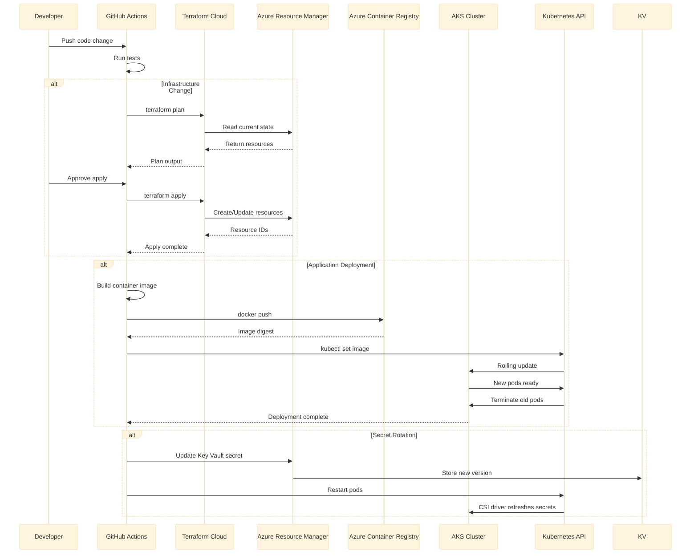

### 1.3 Telemetry Processing Sequence Diagram

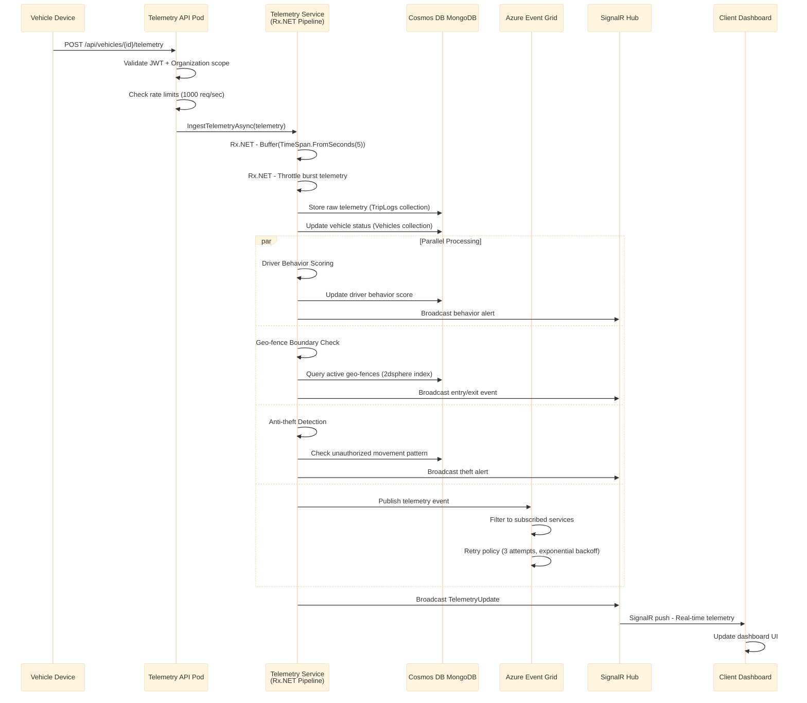

### 1.4 Network Topology Diagram

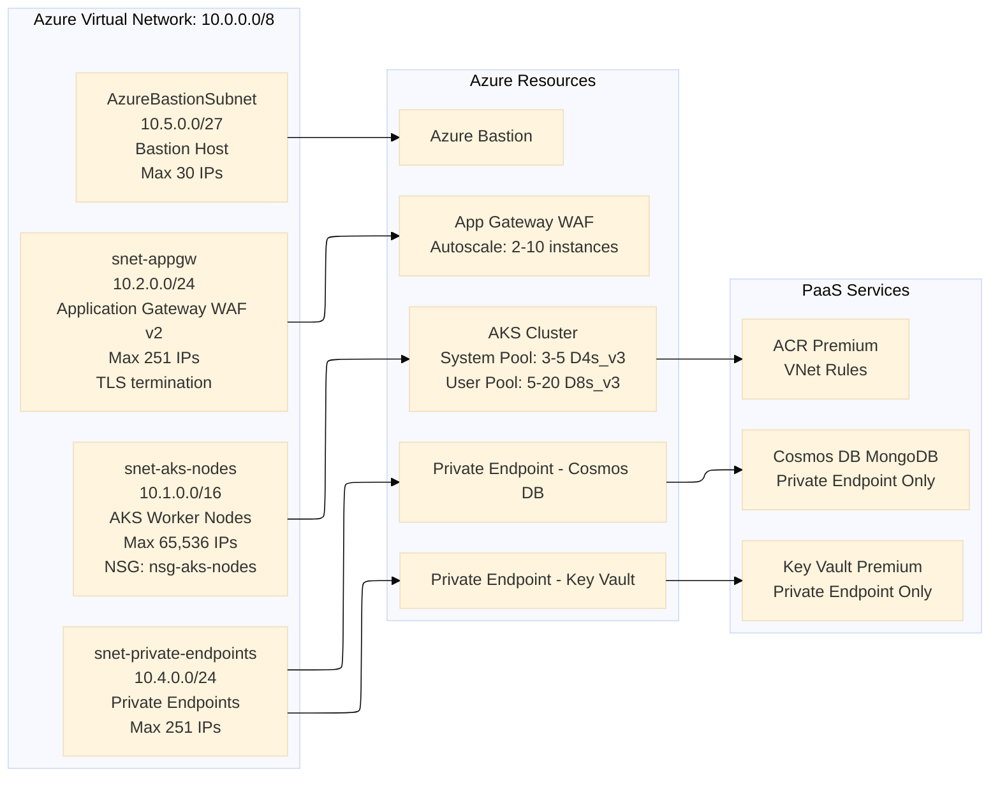

### 1.5 Responsibility Matrix Diagram

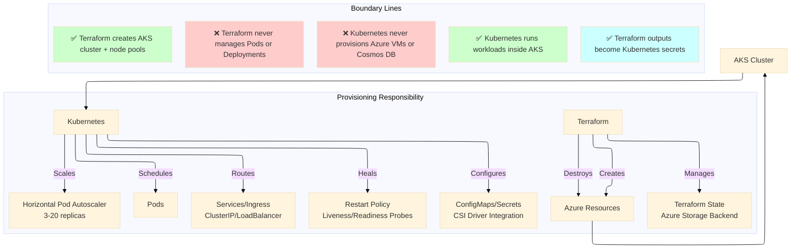

### 1.6 CI/CD Pipeline Flow Diagram

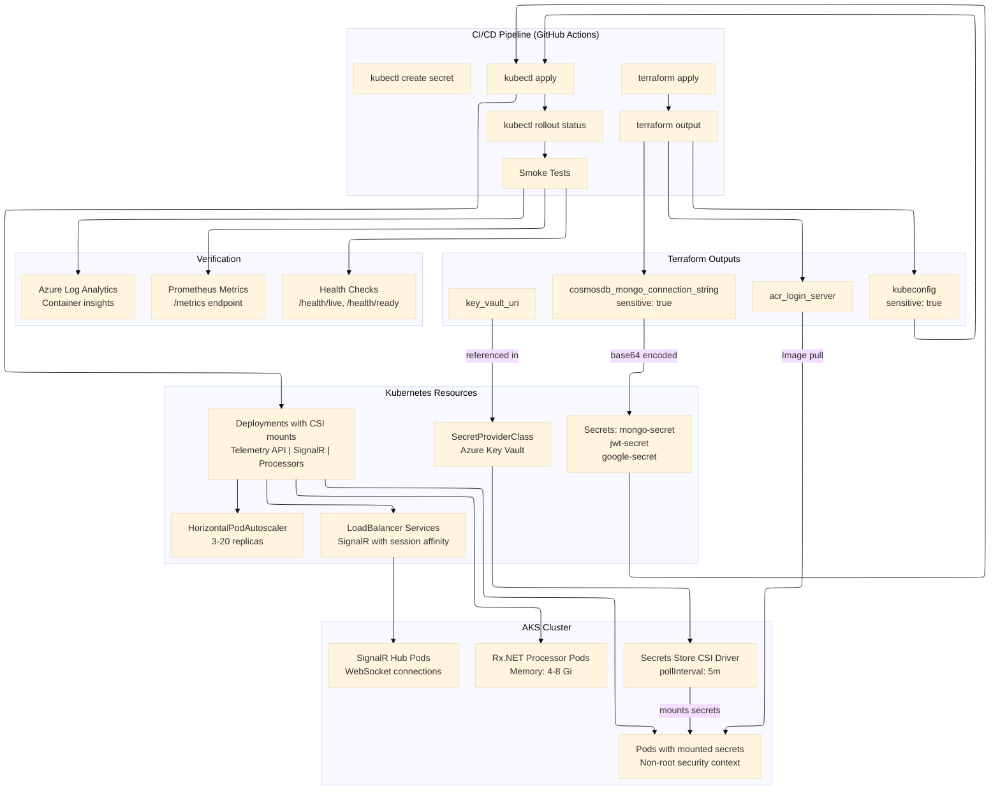

### 1.7 AKS Cluster Node Pools Diagram

```mermaid
---
config:
  theme: base
  layout: elk
---
graph TB
    subgraph "AKS Cluster: aks-vehixcare-prod"
        subgraph "System Node Pool (systempool)"
            S1["Node 1<br/>D4s_v3<br/>Zone 1"]
            S2["Node 2<br/>D4s_v3<br/>Zone 2"]
            S3["Node 3<br/>D4s_v3<br/>Zone 3"]
            S4["Node 4 (scaled)<br/>D4s_v3<br/>Zone 1"]
            
            subgraph "System Pods (Tainted: CriticalAddonsOnly=true:NoSchedule)"
                COREDNS["CoreDNS<br/>DNS resolution"]
                METRICS["Metrics Server<br/>Resource metrics"]
                TUNNEL["AKS Tunnel<br/>Control plane comms"]
                CSI["CSI Drivers<br/>Secrets Store + Azure Disk"]
                CALICO["Calico CNI<br/>Network policy"]
            end
        end
        
        subgraph "User Node Pool (userpool)"
            U1["Node 1<br/>D8s_v3<br/>Zone 1"]
            U2["Node 2<br/>D8s_v3<br/>Zone 2"]
            U3["Node 3<br/>D8s_v3<br/>Zone 3"]
            U4["Node 4<br/>D8s_v3<br/>Zone 1"]
            U5["Node 5<br/>D8s_v3<br/>Zone 2"]
            U6["Node 6 (scaled)<br/>D8s_v3<br/>Zone 3"]
            
            subgraph "User Pods (No Taints)"
                BOOKING["Telemetry API Pods<br/>3-20 replicas<br/>CPU: 1-3 cores"]
                BEHAVIOR["Behavior Processor Pods<br/>2-15 replicas<br/>Memory: 4-8 Gi"]
                GEOFENCE["Geo-fence Monitor Pods<br/>2-10 replicas"]
                SIGNALR["SignalR Hub Pods<br/>2-5 replicas<br/>Session affinity"]
            end
        end
    end
    
    subgraph "Azure CNI Networking"
        VNET["vnet-vehixcare<br/>10.0.0.0/8"]
        POD_CIDR["Pod CIDR: 10.244.0.0/16<br/>65,536 IPs"]
        SVC_CIDR["Service CIDR: 10.245.0.0/16<br/>65,536 IPs"]
    end
    
    subgraph "Node Labels & Taints"
        SYS_LABEL["nodepool-type: system<br/>environment: production<br/>critical: true"]
        USER_LABEL["nodepool-type: user<br/>environment: production<br/>workload: telemetry"]
    end
    
    S1 --> VNET
    S2 --> VNET
    U1 --> VNET
    U2 --> VNET
    
    BOOKING --> POD_CIDR
    SIGNALR --> SVC_CIDR
```

### 1.8 Cosmos DB MongoDB Architecture Diagram

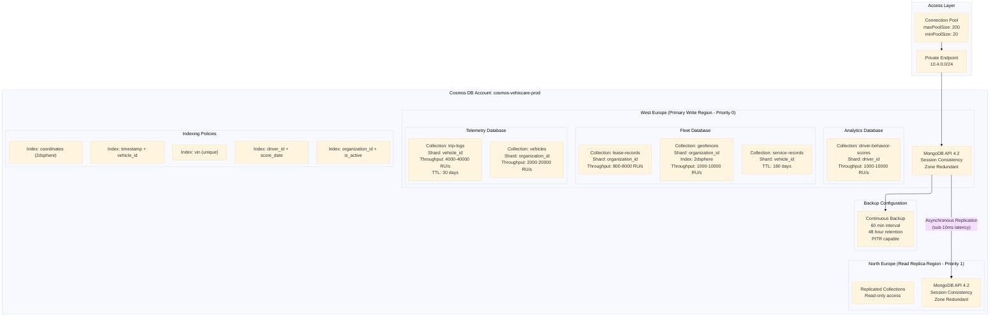

### 1.9 Azure Key Vault Secrets Architecture Diagram

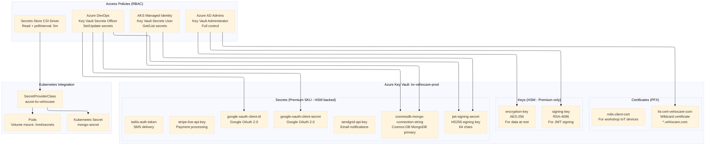

### 1.10 Data Flow: MongoDB Operations with Cosmos DB

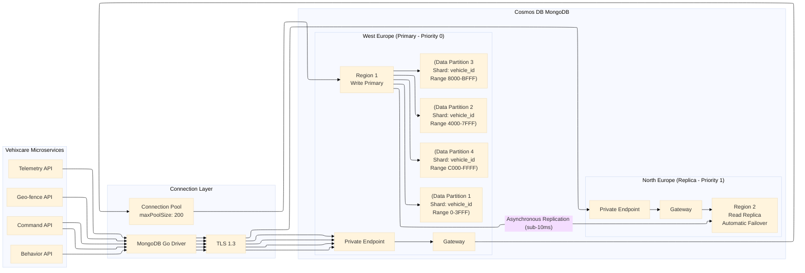

## 2. Core Concepts Deep Dive

### 2.1 Terraform Core Concepts

**State Management:** Terraform maintains a state file that maps your HCL configuration to real Azure resources. This file is the source of truth. For Vehixcare production, state lives in Azure Storage Account (`vehixcaretfstateprod`) with state locking via blob leases to prevent concurrent modifications. Losing this file means Terraform cannot track existing resources, leading to drift or accidental duplication. The backend configuration uses `azurerm` backend with `key` parameter to namespace different environments.

**Provider Configuration:** The AzureRM provider translates Terraform resources into Azure API calls. Each resource block—whether for a virtual network, AKS cluster, or Cosmos DB—contains arguments that map directly to Azure's REST API payload structure. The `features` block configures provider-level behavior like resource group protection and soft-delete handling.

**Dependency Resolution:** Terraform automatically builds a dependency graph from your configuration. When you reference `azurerm_subnet.aks_nodes.id` inside an AKS cluster definition, Terraform knows to create the subnet before the cluster. This implicit ordering prevents race conditions during provisioning. Explicit dependencies can be added with `depends_on` for complex scenarios.

**Plan and Apply Cycle:** Terraform separates planning from execution. `terraform plan` shows what will change without making any modifications, outputting a machine-readable plan file. `terraform apply` executes the changes. This allows code review of infrastructure changes before they hit production. The `-auto-approve` flag skips confirmation for automated pipelines.

**Resource Lifecycle:** Terraform manages resources through four operations: Create (provision new resource via Azure API), Read (refresh state from Azure, updating drift), Update (modify existing resource in-place using PATCH), and Delete (destroy resource via DELETE API). Some resources require replacement rather than in-place updates (e.g., changing `os_disk_type` on AKS node pool forces new nodes). Understanding this distinction prevents unexpected downtime.

**Data Sources:** Terraform data sources read information from Azure without creating resources. For Vehixcare, `data "azurerm_client_config" "current"` retrieves the current Azure AD tenant ID for Key Vault configuration. Data sources are evaluated during plan phase and can be used in resource arguments.

**Modules:** Terraform modules encapsulate resource groups into reusable components. Vehixcare modules include `networking`, `aks-cluster`, `cosmosdb`, and `monitoring`. Modules accept input variables and return output values for composition.

### 2.2 Kubernetes Core Concepts

**Pods:** The smallest deployable unit, containing one or more containers that share network namespace, IPC, and UTS namespace. Vehixcare's telemetry API runs in its own pod with a container for the API and optionally a sidecar for logging (Fluent Bit) or metrics collection (Prometheus exporter). Pods are ephemeral—when a pod fails, Kubernetes replaces it with a new one at a new IP address.

**Deployments:** Declarative updates for pods and ReplicaSets. When you change the container image, Kubernetes performs a rolling update—starting new pods before terminating old ones. The `strategy` field controls update behavior: `RollingUpdate` (default) with `maxSurge` and `maxUnavailable` parameters, or `Recreate` (delete all old pods before creating new ones). Vehixcare uses `maxSurge: 1` and `maxUnavailable: 0` for zero-downtime updates.

**Services:** Stable network endpoints that abstract away pod IPs (which change frequently). Service types include:
- **ClusterIP** (default): Internal-only virtual IP. Vehixcare uses this for telemetry API to restrict access.
- **NodePort:** Exposes service on each node's IP at a static port (30000-32767).
- **LoadBalancer:** Provisions cloud load balancer (Azure Load Balancer). Vehixcare uses this for SignalR hubs with session affinity.
- **ExternalName:** Maps service to external DNS name via CNAME.

**Ingress:** HTTP/HTTPS routing rules that expose services to the internet. An Ingress controller (NGINX Ingress Controller or Azure Application Gateway Ingress Controller) reads Ingress resources and configures routing based on hostnames and paths. Vehixcare routes `/api/telemetry` to Telemetry API and `/hubs` to SignalR services.

**Horizontal Pod Autoscaler (HPA):** Automatically scales the number of pods based on observed CPU, memory, or custom metrics. HPA queries the metrics server (CPU/Memory) or Prometheus (custom metrics), calculates desired replica count using formula `desiredReplicas = ceil(currentMetricValue / targetMetricValue)`, and scales the deployment. Vehixcare scales Telemetry API when telemetry messages per second exceed 1000.

**ConfigMaps and Secrets:** Configuration data injected into pods as environment variables or mounted volumes. ConfigMaps are plain text; Secrets are base64-encoded but not encrypted by default. For production, use external secrets management—Vehixcare uses Azure Key Vault Provider for Secrets Store CSI Driver to mount secrets from Key Vault directly.

**Controllers and Operators:** Controllers are control loops that watch cluster state and make changes to reach desired state. The ReplicaSet controller ensures correct number of pods; Deployment controller manages ReplicaSet updates; Service controller provisions cloud load balancers. Operators extend Kubernetes with custom resources and application-specific automation—Vehixcare uses Prometheus Operator for monitoring and KEDA for event-driven autoscaling.

**Namespaces:** Virtual clusters within a physical cluster for resource isolation. Vehixcare uses `vehixcare-telemetry` for APIs, `vehixcare-hubs` for SignalR, `vehixcare-background` for processors, and `vehixcare-monitoring` for observability tools.

**Resource Quotas and Limits:** ResourceRequests (minimum guaranteed resources) and ResourceLimits (maximum allowed) are set per container. Vehixcare's telemetry API requests 1000m CPU and 2Gi memory, limits 3000m CPU and 4Gi memory. Exceeding memory limits triggers OOM kill; exceeding CPU limits causes throttling.

### 2.3 Responsibility Matrix

| Concern | Terraform | Kubernetes |
|---------|-----------|------------|
| Provision Azure VNet and subnets with CIDR 10.0.0.0/8 | ✅ Creates | ❌ Cannot |
| Create AKS cluster with system and user node pools | ✅ Provisions cluster (15 min apply) | ❌ Cannot |
| Deploy ACR with geo-replication and retention policies | ✅ Creates Premium SKU registry | ❌ Cannot |
| Configure Cosmos DB MongoDB with 40,000 RU/s autoscale | ✅ Creates account, databases, collections | ❌ Cannot |
| Manage MongoDB connection strings and secrets | ✅ Outputs to state (sensitive) | ✅ Injects via CSI driver with polling |
| Autoscale based on telemetry ingestion rate (1000 msg/sec) | ❌ Not possible | ✅ HPA with custom Prometheus metrics |
| Handle SignalR WebSocket connections with session affinity | ❌ No awareness | ✅ LoadBalancer service with ClientIP affinity, 10800s timeout |
| Process Rx.NET event streams with backpressure | ❌ No capability | ✅ Deployments with memory limits (4-8 Gi), buffer operators |
| Configure Event Grid topics and subscriptions | ✅ Creates topics, event subscriptions | ❌ Cannot |
| Rotate JWT signing keys without pod restart | ⚠️ Requires terraform apply | ✅ CSI driver with pollInterval: 5m |
| Restart failed containers on crash loop | ❌ Cannot | ✅ Liveness probes (HTTP GET /health/live) |
| Rolling updates without downtime | ❌ Replace-only | ✅ Deployment with maxSurge: 1, maxUnavailable: 0 |
| Create geospatial indexes for geo-fencing | ✅ Creates 2dsphere indexes | ❌ Cannot |
| Configure Prometheus scraping and Grafana dashboards | ✅ Deploy with Helm provider | ✅ ServiceMonitor resources |
| Implement network policies for tenant isolation | ❌ Cannot | ✅ Calico network policies |

---

## 3. Terraform on Azure: Complete Implementation

### 3.1 Backend and Provider Configuration

The backend block tells Terraform where to store state. For team collaboration, Azure Storage provides state locking via blob leases, preventing concurrent modifications.

```hcl
# backend.tf
terraform {
  required_version = ">= 1.5.0"
  
  backend "azurerm" {
    resource_group_name  = "tfstate-vehixcare"
    storage_account_name = "vehixcaretfstateprod"
    container_name       = "terraform-state"
    key                  = "vehixcare-prod.tfstate"
  }
  
  required_providers {
    azurerm = {
      source  = "hashicorp/azurerm"
      version = "~> 3.0"
    }
    random = {
      source  = "hashicorp/random"
      version = "~> 3.0"
    }
    kubernetes = {
      source  = "hashicorp/kubernetes"
      version = "~> 2.0"
    }
    helm = {
      source  = "hashicorp/helm"
      version = "~> 2.0"
    }
  }
}

provider "azurerm" {
  features {
    key_vault {
      purge_soft_delete_on_destroy = true
      recover_soft_deleted_key_vaults = true
    }
    cosmosdb {
      enable_automatic_upgrade = true
    }
    resource_group {
      prevent_deletion_if_contains_resources = true
    }
  }
  
  # Use Azure CLI authentication for development
  # Use service principal with client_id/client_secret for CI/CD
  client_id       = var.azure_client_id
  client_secret   = var.azure_client_secret
  tenant_id       = var.azure_tenant_id
  subscription_id = var.azure_subscription_id
}

resource "azurerm_resource_group" "vehixcare" {
  name     = "rg-vehixcare-production"
  location = "westeurope"
  
  tags = {
    Environment = "production"
    Application = "vehixcare"
    ManagedBy   = "terraform"
    CostCenter  = "fleet-platform"
    DataRetention = "30days"
  }
}
```

### 3.2 Network Topology with Explicit CIDR Planning

Vehixcare requires isolated network segments for AKS nodes, application gateway, private endpoints, and bastion host. Each subnet receives a non-overlapping CIDR block from the 10.0.0.0/8 address space.

```hcl
# networking.tf
resource "azurerm_virtual_network" "vehixcare" {
  name                = "vnet-vehixcare"
  location            = azurerm_resource_group.vehixcare.location
  resource_group_name = azurerm_resource_group.vehixcare.name
  address_space       = ["10.0.0.0/8"]
  
  tags = {
    Environment = "production"
    Purpose     = "vehixcare-core-network"
  }
}

resource "azurerm_subnet" "aks_nodes" {
  name                 = "snet-aks-nodes"
  resource_group_name  = azurerm_resource_group.vehixcare.name
  virtual_network_name = azurerm_virtual_network.vehixcare.name
  address_prefixes     = ["10.1.0.0/16"]
  
  # Service endpoints for Azure services without private endpoints
  service_endpoints = [
    "Microsoft.ContainerRegistry",
    "Microsoft.KeyVault", 
    "Microsoft.Storage",
    "Microsoft.EventGrid"
  ]
  
  delegation {
    name = "aks-delegation"
    service_delegation {
      name = "Microsoft.ContainerService/managedClusters"
      actions = [
        "Microsoft.Network/virtualNetworks/subnets/join/action",
        "Microsoft.Network/virtualNetworks/subnets/prepareNetworkPolicies/action"
      ]
    }
  }
  
  # Required for AKS network policies
  private_endpoint_network_policies = "Enabled"
  private_link_service_network_policies_enabled = true
}

resource "azurerm_subnet" "application_gateway" {
  name                 = "snet-appgw"
  resource_group_name  = azurerm_resource_group.vehixcare.name
  virtual_network_name = azurerm_virtual_network.vehixcare.name
  address_prefixes     = ["10.2.0.0/24"]
}

resource "azurerm_subnet" "private_endpoints" {
  name                 = "snet-private-endpoints"
  resource_group_name  = azurerm_resource_group.vehixcare.name
  virtual_network_name = azurerm_virtual_network.vehixcare.name
  address_prefixes     = ["10.4.0.0/24"]
  
  # Private endpoints require network policies disabled
  private_endpoint_network_policies = "Disabled"
  private_link_service_network_policies_enabled = false
}

resource "azurerm_subnet" "bastion" {
  name                 = "AzureBastionSubnet"
  resource_group_name  = azurerm_resource_group.vehixcare.name
  virtual_network_name = azurerm_virtual_network.vehixcare.name
  address_prefixes     = ["10.5.0.0/27"]
}

# Network Security Group for AKS node subnet
resource "azurerm_network_security_group" "aks_nodes" {
  name                = "nsg-aks-nodes"
  location            = azurerm_resource_group.vehixcare.location
  resource_group_name = azurerm_resource_group.vehixcare.name
  
  # Allow AKS API server communication
  security_rule {
    name                       = "AllowAKSAPIServer"
    priority                   = 100
    direction                  = "Inbound"
    access                     = "Allow"
    protocol                   = "Tcp"
    source_port_range          = "*"
    destination_port_range     = "443"
    source_address_prefix      = "AzureLoadBalancer"
    destination_address_prefix = "*"
    description                = "Required for AKS control plane communication"
  }
  
  # Allow SignalR WebSocket ports
  security_rule {
    name                       = "AllowSignalRWebSockets"
    priority                   = 110
    direction                  = "Inbound"
    access                     = "Allow"
    protocol                   = "Tcp"
    source_port_range          = "*"
    destination_port_ranges    = ["5000-5500", "8080-8090"]
    source_address_prefix      = "*"
    destination_address_prefix = "*"
    description                = "SignalR WebSocket connections"
  }
  
  # Allow SSH from bastion only
  security_rule {
    name                       = "AllowSSHFromBastion"
    priority                   = 120
    direction                  = "Inbound"
    access                     = "Allow"
    protocol                   = "Tcp"
    source_port_range          = "*"
    destination_port_range     = "22"
    source_address_prefix      = "10.5.0.0/27"
    destination_address_prefix = "*"
    description                = "SSH access only from Azure Bastion"
  }
  
  # Allow node-to-node communication for Calico
  security_rule {
    name                       = "AllowNodeToNode"
    priority                   = 130
    direction                  = "Inbound"
    access                     = "Allow"
    protocol                   = "*"
    source_port_range          = "*"
    destination_port_range     = "*"
    source_address_prefix      = "10.1.0.0/16"
    destination_address_prefix = "10.1.0.0/16"
    description                = "Internal cluster communication"
  }
  
  # Deny all other inbound traffic
  security_rule {
    name                       = "DenyAllInbound"
    priority                   = 4000
    direction                  = "Inbound"
    access                     = "Deny"
    protocol                   = "*"
    source_port_range          = "*"
    destination_port_range     = "*"
    source_address_prefix      = "*"
    destination_address_prefix = "*"
    description                = "Default deny all inbound"
  }
  
  tags = {
    Environment = "production"
    ManagedBy   = "terraform"
  }
}

resource "azurerm_subnet_network_security_group_association" "aks" {
  subnet_id                 = azurerm_subnet.aks_nodes.id
  network_security_group_id = azurerm_network_security_group.aks_nodes.id
}

# Azure Bastion for secure management access
resource "azurerm_bastion_host" "vehixcare" {
  name                = "bastion-vehixcare"
  location            = azurerm_resource_group.vehixcare.location
  resource_group_name = azurerm_resource_group.vehixcare.name
  
  ip_configuration {
    name                 = "configuration"
    subnet_id            = azurerm_subnet.bastion.id
    public_ip_address_id = azurerm_public_ip.bastion.id
  }
}

resource "azurerm_public_ip" "bastion" {
  name                = "pip-bastion-vehixcare"
  location            = azurerm_resource_group.vehixcare.location
  resource_group_name = azurerm_resource_group.vehixcare.name
  allocation_method   = "Static"
  sku                 = "Standard"
}
```

### 3.3 Cosmos DB with MongoDB API (Vehixcare Backbone)

Vehixcare stores all operational data in Cosmos DB using the MongoDB wire protocol. This provides global distribution, automatic sharding, and multiple write regions.

```hcl
# cosmosdb-mongo.tf
resource "azurerm_cosmosdb_account" "vehixcare" {
  name                = "cosmos-vehixcare-prod"
  location            = azurerm_resource_group.vehixcare.location
  resource_group_name = azurerm_resource_group.vehixcare.name
  offer_type          = "Standard"
  kind                = "MongoDB"
  
  # Global distribution with failover priorities
  # Priority 0 = Primary write region
  # Priority 1 = Secondary read region (automatic failover)
  locations {
    location_name = "westeurope"
    failover_priority = 0
    zone_redundant = true
  }
  
  locations {
    location_name = "northeurope"
    failover_priority = 1
    zone_redundant = true
  }
  
  # Consistency: Session provides read-your-writes with low latency
  consistency_policy {
    consistency_level       = "Session"
    max_interval_in_seconds = 5   # Max staleness for bounded staleness
    max_staleness_prefix    = 100  # Max stale document count
  }
  
  # Enable multiple write regions for active-active (optional)
  multiple_write_locations_enabled = false
  
  # MongoDB specific capabilities
  capabilities {
    name = "EnableMongo"
  }
  
  capabilities {
    name = "DisableRateLimitingResponses"  # Prevents rate limiting errors
  }
  
  # Using provisioned throughput for predictable performance
  mongo_server_version = "4.2"
  
  # Network security - no public access
  public_network_access_enabled = false
  
  # Virtual network rules for service endpoints
  virtual_network_rule {
    id                                   = azurerm_subnet.aks_nodes.id
    ignore_missing_vnet_service_endpoint = false
  }
  
  # Analytical store for reporting (separate from transactional)
  analytical_storage {
    schema_type = "FullFidelity"  # Keeps all historical versions
  }
  
  # Continuous backup for point-in-time recovery
  backup {
    type                = "Continuous"
    interval_in_minutes = 60   # Backup every hour
    retention_in_hours  = 48   # 2 days of PITR
  }
  
  tags = {
    Environment = "production"
    Database    = "mongodb"
    Workload    = "vehixcare-core"
    CostCenter  = "data-services"
    Backup      = "continuous-48h"
  }
}

# MongoDB databases for each Vehixcare domain
resource "azurerm_cosmosdb_mongo_database" "telemetry" {
  name                = "vehixcare-telemetry"
  resource_group_name = azurerm_resource_group.vehixcare.name
  account_name        = azurerm_cosmosdb_account.vehixcare.name
}

resource "azurerm_cosmosdb_mongo_database" "fleet" {
  name                = "vehixcare-fleet"
  resource_group_name = azurerm_resource_group.vehixcare.name
  account_name        = azurerm_cosmosdb_account.vehixcare.name
}

resource "azurerm_cosmosdb_mongo_database" "analytics" {
  name                = "vehixcare-analytics"
  resource_group_name = azurerm_resource_group.vehixcare.name
  account_name        = azurerm_cosmosdb_account.vehixcare.name
}

# TripLogs collection - stores every telemetry data point from vehicles
# Shard key vehicle_id ensures even distribution across partitions
resource "azurerm_cosmosdb_mongo_collection" "triplogs" {
  name                = "trip-logs"
  resource_group_name = azurerm_resource_group.vehixcare.name
  account_name        = azurerm_cosmosdb_account.vehixcare.name
  database_name       = azurerm_cosmosdb_mongo_database.telemetry.name
  
  default_ttl_seconds = 2592000  # 30 days for raw telemetry
  shard_key           = "vehicle_id"
  
  # Collection-level throughput with autoscale
  throughput          = 4000
  
  autoscale_settings {
    max_throughput = 40000  # Scales up during peak hours (9 AM - 6 PM)
  }
  
  # Indexes for common query patterns
  indexes {
    keys   = ["timestamp", "vehicle_id"]
    unique = false
  }
  
  indexes {
    keys   = ["trip_id"]
    unique = false
  }
  
  indexes {
    keys   = ["organization_id", "timestamp"]
    unique = false
  }
  
  indexes {
    keys   = ["vehicle_id", "event_type"]
    unique = false
  }
}

# Vehicles collection - master vehicle registry
resource "azurerm_cosmosdb_mongo_collection" "vehicles" {
  name                = "vehicles"
  resource_group_name = azurerm_resource_group.vehixcare.name
  account_name        = azurerm_cosmosdb_account.vehixcare.name
  database_name       = azurerm_cosmosdb_mongo_database.fleet.name
  
  shard_key           = "organization_id"
  
  autoscale_settings {
    max_throughput = 20000
  }
  
  indexes {
    keys   = ["vin"]
    unique = true
  }
  
  indexes {
    keys   = ["license_plate"]
    unique = true
  }
  
  indexes {
    keys   = ["status", "organization_id"]
    unique = false
  }
  
  indexes {
    keys   = ["current_driver_id"]
    unique = false
  }
}

# Driver behavior scores collection
resource "azurerm_cosmosdb_mongo_collection" "driver_scores" {
  name                = "driver-behavior-scores"
  resource_group_name = azurerm_resource_group.vehixcare.name
  account_name        = azurerm_cosmosdb_account.vehixcare.name
  database_name       = azurerm_cosmosdb_mongo_database.analytics.name
  
  shard_key           = "driver_id"
  default_ttl_seconds = 7776000  # 90 days
  
  autoscale_settings {
    max_throughput = 10000
  }
  
  indexes {
    keys   = ["organization_id", "score_date"]
    unique = false
  }
  
  indexes {
    keys   = ["driver_id", "score_date"]
    unique = false
  }
  
  indexes {
    keys   = ["safety_rating"]
    unique = false
  }
}

# Geo-fences collection with geospatial index for boundary detection
resource "azurerm_cosmosdb_mongo_collection" "geofences" {
  name                = "geofences"
  resource_group_name = azurerm_resource_group.vehixcare.name
  account_name        = azurerm_cosmosdb_account.vehixcare.name
  database_name       = azurerm_cosmosdb_mongo_database.fleet.name
  
  shard_key           = "organization_id"
  
  autoscale_settings {
    max_throughput = 10000
  }
  
  indexes {
    keys   = ["coordinates"]
    unique = false
  }
  
  indexes {
    keys   = ["type", "is_active"]
    unique = false
  }
  
  indexes {
    keys   = ["organization_id", "is_active"]
    unique = false
  }
}

# Service records collection for maintenance management
resource "azurerm_cosmosdb_mongo_collection" "service_records" {
  name                = "service-records"
  resource_group_name = azurerm_resource_group.vehixcare.name
  account_name        = azurerm_cosmosdb_account.vehixcare.name
  database_name       = azurerm_cosmosdb_mongo_database.fleet.name
  
  shard_key           = "vehicle_id"
  default_ttl_seconds = 15552000  # 180 days
  
  autoscale_settings {
    max_throughput = 8000
  }
  
  indexes {
    keys   = ["vehicle_id", "service_date"]
    unique = false
  }
  
  indexes {
    keys   = ["status", "scheduled_date"]
    unique = false
  }
  
  indexes {
    keys   = ["service_type", "organization_id"]
    unique = false
  }
}

# Lease records collection
resource "azurerm_cosmosdb_mongo_collection" "lease_records" {
  name                = "lease-records"
  resource_group_name = azurerm_resource_group.vehixcare.name
  account_name        = azurerm_cosmosdb_account.vehixcare.name
  database_name       = azurerm_cosmosdb_mongo_database.fleet.name
  
  shard_key           = "organization_id"
  
  autoscale_settings {
    max_throughput = 8000
  }
  
  indexes {
    keys   = ["vehicle_id", "status"]
    unique = false
  }
  
  indexes {
    keys   = ["lessee_id", "end_date"]
    unique = false
  }
  
  indexes {
    keys   = ["status", "end_date"]
    unique = false
  }
}

# Private endpoint for Cosmos DB
resource "azurerm_private_endpoint" "cosmosdb" {
  name                = "pe-cosmos-vehixcare"
  location            = azurerm_resource_group.vehixcare.location
  resource_group_name = azurerm_resource_group.vehixcare.name
  subnet_id           = azurerm_subnet.private_endpoints.id
  
  private_service_connection {
    name                           = "psc-cosmos-mongo"
    private_connection_resource_id = azurerm_cosmosdb_account.vehixcare.id
    is_manual_connection           = false
    subresource_names              = ["MongoDB"]
  }
  
  private_dns_zone_group {
    name                 = "cosmos-dns-zone-group"
    private_dns_zone_ids = [azurerm_private_dns_zone.cosmosdb.id]
  }
  
  tags = {
    Environment = "production"
    Purpose     = "cosmos-db-private-access"
  }
}

resource "azurerm_private_dns_zone" "cosmosdb" {
  name                = "privatelink.mongo.cosmos.azure.com"
  resource_group_name = azurerm_resource_group.vehixcare.name
  
  tags = {
    Environment = "production"
  }
}

resource "azurerm_private_dns_zone_virtual_network_link" "cosmosdb" {
  name                  = "cosmos-dns-link"
  resource_group_name   = azurerm_resource_group.vehixcare.name
  private_dns_zone_name = azurerm_private_dns_zone.cosmosdb.name
  virtual_network_id    = azurerm_virtual_network.vehixcare.id
  registration_enabled  = false
  
  tags = {
    Environment = "production"
  }
}

# Cosmos DB connection string outputs
output "cosmosdb_mongo_connection_string" {
  value     = azurerm_cosmosdb_account.vehixcare.connection_strings[0]
  sensitive = true
  description = "MongoDB connection string for Cosmos DB"
}

output "cosmosdb_mongo_host" {
  value = azurerm_cosmosdb_account.vehixcare.mongo_server_version
  description = "MongoDB endpoint hostname"
}
```

### 3.4 Azure Container Registry with Geo-Replication

Every Vehixcare microservice container image is stored in ACR. The Premium SKU provides geo-replication for faster pulls across regions and availability zones.

```hcl
# container-registry.tf
resource "azurerm_container_registry" "vehixcare" {
  name                = "vehixcareprod"
  resource_group_name = azurerm_resource_group.vehixcare.name
  location            = azurerm_resource_group.vehixcare.location
  sku                 = "Premium"  # Required for geo-replication and zone redundancy
  admin_enabled       = false      # Disable admin user, use managed identity
  
  # Zone redundancy for high availability
  zone_redundancy_enabled = true
  
  # Geo-replication to secondary region for faster pulls
  georeplications {
    location                = "northeurope"
    zone_redundancy_enabled = true
    tags = {
      Environment = "production"
      Region      = "north-europe"
    }
  }
  
  # Network security - only allow from AKS subnet and CI/CD IPs
  network_rule_set {
    default_action = "Deny"
    
    virtual_network {
      action    = "Allow"
      subnet_id = azurerm_subnet.aks_nodes.id
    }
    
    # Allow GitHub Actions IP ranges (example)
    ip_rule {
      action   = "Allow"
      ip_range = "20.41.0.0/16"  # Azure DevOps / GitHub Actions
    }
  }
  
  # Retention policy for old images (30 days)
  retention_policy {
    days    = 30
    enabled = true
  }
  
  # Content trust for signed images
  trust_policy {
    enabled = true
  }
  
  # Anonymous pull disabled
  anonymous_pull_enabled = false
  
  # Data endpoint enabled for geo-replication
  data_endpoint_enabled = true
  
  tags = {
    Environment = "production"
    Application = "vehixcare"
    CostCenter  = "container-platform"
  }
}

# Role assignment allowing AKS to pull images
resource "azurerm_role_assignment" "aks_to_acr" {
  principal_id                     = azurerm_kubernetes_cluster.vehixcare.kubelet_identity[0].object_id
  role_definition_name             = "AcrPull"
  scope                            = azurerm_container_registry.vehixcare.id
  skip_service_principal_aad_check = true
  
  description = "Allow AKS cluster to pull container images from ACR"
}

output "acr_login_server" {
  value = azurerm_container_registry.vehixcare.login_server
  description = "ACR login server URL for container images"
}
```

### 3.5 Azure Key Vault with HSM Support

Vehixcare stores Cosmos DB connection strings, JWT signing keys, Google OAuth credentials, and TLS certificates here. The Premium SKU supports HSM-backed keys for PCI compliance.

```hcl
# keyvault.tf
data "azurerm_client_config" "current" {}

resource "azurerm_key_vault" "vehixcare" {
  name                       = "kv-vehixcare-prod"
  location                   = azurerm_resource_group.vehixcare.location
  resource_group_name        = azurerm_resource_group.vehixcare.name
  tenant_id                  = data.azurerm_client_config.current.tenant_id
  sku_name                   = "premium"  # Premium for HSM support
  soft_delete_retention_days = 7
  purge_protection_enabled   = true      # Prevent accidental deletion
  
  # Network ACLs - deny all by default, only private endpoint
  network_acls {
    default_action = "Deny"
    bypass         = "AzureServices"  # Allow Azure services to access
  }
  
  # Enable RBAC authorization
  role_based_access_control_enabled = true
  
  tags = {
    Environment = "production"
    Compliance  = "pci-dss"
    ManagedBy   = "terraform"
  }
}

# Private endpoint for Key Vault
resource "azurerm_private_endpoint" "keyvault" {
  name                = "pe-kv-vehixcare"
  location            = azurerm_resource_group.vehixcare.location
  resource_group_name = azurerm_resource_group.vehixcare.name
  subnet_id           = azurerm_subnet.private_endpoints.id
  
  private_service_connection {
    name                           = "psc-keyvault"
    private_connection_resource_id = azurerm_key_vault.vehixcare.id
    is_manual_connection           = false
    subresource_names              = ["vault"]
  }
  
  private_dns_zone_group {
    name                 = "keyvault-dns-zone-group"
    private_dns_zone_ids = [azurerm_private_dns_zone.keyvault.id]
  }
}

resource "azurerm_private_dns_zone" "keyvault" {
  name                = "privatelink.vaultcore.azure.net"
  resource_group_name = azurerm_resource_group.vehixcare.name
}

resource "azurerm_private_dns_zone_virtual_network_link" "keyvault" {
  name                  = "keyvault-dns-link"
  resource_group_name   = azurerm_resource_group.vehixcare.name
  private_dns_zone_name = azurerm_private_dns_zone.keyvault.name
  virtual_network_id    = azurerm_virtual_network.vehixcare.id
  registration_enabled  = false
}

# Secrets for Vehixcare applications
resource "azurerm_key_vault_secret" "cosmosdb_connection_string" {
  name         = "cosmosdb-mongo-connection-string"
  value        = azurerm_cosmosdb_account.vehixcare.connection_strings[0]
  key_vault_id = azurerm_key_vault.vehixcare.id
  
  tags = {
    Environment = "production"
    Application = "vehixcare"
  }
}

resource "azurerm_key_vault_secret" "jwt_secret" {
  name         = "jwt-signing-secret"
  value        = random_password.jwt_secret.result
  key_vault_id = azurerm_key_vault.vehixcare.id
}

resource "random_password" "jwt_secret" {
  length  = 64
  special = false
  min_upper = 2
  min_lower = 2
  min_numeric = 2
}

resource "azurerm_key_vault_secret" "google_client_id" {
  name         = "google-oauth-client-id"
  value        = var.google_oauth_client_id
  key_vault_id = azurerm_key_vault.vehixcare.id
}

resource "azurerm_key_vault_secret" "google_client_secret" {
  name         = "google-oauth-client-secret"
  value        = var.google_oauth_client_secret
  key_vault_id = azurerm_key_vault.vehixcare.id
}

# RBAC assignments for AKS
resource "azurerm_role_assignment" "aks_to_keyvault" {
  principal_id                     = azurerm_kubernetes_cluster.vehixcare.kubelet_identity[0].object_id
  role_definition_name             = "Key Vault Secrets User"
  scope                            = azurerm_key_vault.vehixcare.id
  skip_service_principal_aad_check = true
  
  description = "Allow AKS to read secrets via CSI driver"
}
```

### 3.6 AKS Cluster with System and User Node Pools

This is the crown jewel of Terraform's responsibilities. The AKS cluster runs all Vehixcare microservices. Note how Terraform configures Azure CNI for native VNet integration and separate node pools for system vs. user workloads.

```hcl
# aks-cluster.tf
resource "azurerm_log_analytics_workspace" "vehixcare" {
  name                = "log-vehixcare-prod"
  location            = azurerm_resource_group.vehixcare.location
  resource_group_name = azurerm_resource_group.vehixcare.name
  sku                 = "PerGB2018"
  retention_in_days   = 60
  
  tags = {
    Environment = "production"
  }
}

resource "azurerm_kubernetes_cluster" "vehixcare" {
  name                = "aks-vehixcare-prod"
  location            = azurerm_resource_group.vehixcare.location
  resource_group_name = azurerm_resource_group.vehixcare.name
  dns_prefix          = "vehixcare"
  kubernetes_version  = "1.28"
  
  # System node pool - runs critical cluster components
  default_node_pool {
    name                = "systempool"
    node_count          = 3
    vm_size             = "Standard_D4s_v3"  # 4 vCPU, 16 GB RAM
    vnet_subnet_id      = azurerm_subnet.aks_nodes.id
    orchestrator_version = "1.28"
    enable_auto_scaling = true
    min_count           = 3
    max_count           = 5
    os_disk_size_gb     = 128
    os_disk_type        = "Ephemeral"        # Better performance, no persistent disk
    type                = "VirtualMachineScaleSets"
    zones               = ["1", "2", "3"]    # Spread across availability zones
    
    # Node labels for scheduling
    node_labels = {
      "nodepool-type" = "system"
      "environment"   = "production"
      "critical"      = "true"
    }
    
    # Taints prevent user pods from scheduling on system nodes
    node_taints = [
      "CriticalAddonsOnly=true:NoSchedule"
    ]
    
    # Upgrade settings
    max_pods = 50  # Maximum pods per node
  }
  
  # User node pool - runs application workloads
  user_node_pool {
    name                = "userpool"
    node_count          = 5
    vm_size             = "Standard_D8s_v3"  # 8 vCPU, 32 GB RAM
    vnet_subnet_id      = azurerm_subnet.aks_nodes.id
    orchestrator_version = "1.28"
    enable_auto_scaling = true
    min_count           = 5
    max_count           = 20
    os_disk_size_gb     = 256
    os_disk_type        = "Ephemeral"
    zones               = ["1", "2", "3"]
    
    node_labels = {
      "nodepool-type" = "user"
      "environment"   = "production"
      "workload"      = "telemetry"
    }
    
    # No taints on user pool
    max_pods = 100
  }
  
  # Managed identity for AKS (instead of service principal)
  identity {
    type = "SystemAssigned"
  }
  
  # Local account disabled - use Azure AD only
  local_account_disabled = true
  
  # Azure CNI for native VNet integration
  network_profile {
    network_plugin    = "azure"       # Azure CNI gives pods VNet IPs
    network_policy    = "calico"      # Calico for network policy enforcement
    load_balancer_sku = "standard"    # Standard LB for zone redundancy
    outbound_type     = "loadBalancer" # Use LB for outbound connections
    
    # IP address planning for pods and services
    pod_cidr          = "10.244.0.0/16"    # 65,536 pod IPs
    service_cidr      = "10.245.0.0/16"    # 65,536 service IPs
    dns_service_ip    = "10.245.0.10"      # CoreDNS service IP
    docker_bridge_cidr = "172.17.0.1/16"   # Bridge network
    
    # Network monitoring
    network_monitoring {
      enabled = true
    }
  }
  
  # RBAC with Azure AD integration
  role_based_access_control_enabled = true
  azure_active_directory_role_based_access_control {
    managed            = true
    azure_rbac_enabled = true
    admin_group_object_ids = [
      azuread_group.vehixcare_platform_admins[0].object_id
    ]
  }
  
  # Container monitoring with Azure Monitor
  oms_agent {
    log_analytics_workspace_id = azurerm_log_analytics_workspace.vehixcare.id
  }
  
  # Automatic upgrades with maintenance window
  auto_upgrade_channel = "stable"
  maintenance_window_auto_upgrade {
    day_of_week   = "Sunday"
    start_time    = "02:00"
    duration_hours = 4
    utc_offset    = "+00:00"
  }
  
  # Maintenance window for OS updates
  maintenance_window {
    allowed {
      day   = "Sunday"
      hours = [2, 3, 4, 5]
    }
  }
  
  # API server authorized IP ranges
  api_server_authorized_ip_ranges = [
    "20.41.0.0/16",    # GitHub Actions / Azure DevOps
    "10.0.0.0/8",      # Internal VNet
    "13.80.0.0/16",    # Additional CI/CD ranges
  ]
  
  # Enable workload identity for pod-to-Azure authentication
  workload_identity_enabled = true
  
  # Open Service Mesh for service-to-service mTLS (optional)
  open_service_mesh_enabled = false
  
  # Tags
  tags = {
    Environment = "production"
    Application = "vehixcare"
    ManagedBy   = "terraform"
  }
}

# Role assignment allowing AKS to pull from ACR
resource "azurerm_role_assignment" "aks_to_acr" {
  principal_id                     = azurerm_kubernetes_cluster.vehixcare.kubelet_identity[0].object_id
  role_definition_name             = "AcrPull"
  scope                            = azurerm_container_registry.vehixcare.id
  skip_service_principal_aad_check = true
}

# Get kubeconfig for CI/CD
output "kubeconfig" {
  value     = azurerm_kubernetes_cluster.vehixcare.kube_config_raw
  sensitive = true
}

output "aks_cluster_name" {
  value = azurerm_kubernetes_cluster.vehixcare.name
}
```

### 3.7 Application Gateway with WAF

Vehixcare routes all external traffic through Application Gateway, which terminates TLS and provides Web Application Firewall protection.

```hcl
# app-gateway.tf
resource "azurerm_public_ip" "appgw" {
  name                = "pip-vehixcare-appgw"
  resource_group_name = azurerm_resource_group.vehixcare.name
  location            = azurerm_resource_group.vehixcare.location
  allocation_method   = "Static"
  sku                 = "Standard"
  zones               = ["1", "2", "3"]  # Zone redundant
  
  tags = {
    Environment = "production"
  }
}

resource "azurerm_application_gateway" "vehixcare" {
  name                = "agw-vehixcare-prod"
  resource_group_name = azurerm_resource_group.vehixcare.name
  location            = azurerm_resource_group.vehixcare.location
  
  sku {
    name     = "WAF_v2"
    tier     = "WAF_v2"
    capacity = 2  # Start with 2 instances, autoscaling enabled
  }
  
  # Enable autoscaling
  autoscale_configuration {
    min_capacity = 2
    max_capacity = 10
  }
  
  gateway_ip_configuration {
    name      = "appgw-ip-config"
    subnet_id = azurerm_subnet.application_gateway.id
  }
  
  # Frontend ports
  frontend_port {
    name = "http-port"
    port = 80
  }
  
  frontend_port {
    name = "https-port"
    port = 443
  }
  
  # Frontend IP configurations
  frontend_ip_configuration {
    name                 = "public-ip"
    public_ip_address_id = azurerm_public_ip.appgw.id
  }
  
  # Backend pool for AKS (AGIC will update this dynamically)
  backend_address_pool {
    name = "aks-backend-pool"
  }
  
  # HTTP settings for backend communication
  backend_http_settings {
    name                  = "https-settings"
    cookie_based_affinity = "Disabled"
    port                  = 80
    protocol              = "Http"
    request_timeout       = 60
    probe_name            = "aks-probe"
    
    # Trusted root certificate for mTLS (optional)
    trusted_root_certificate_names = []
  }
  
  # HTTPS listener
  http_listener {
    name                           = "https-listener"
    frontend_ip_configuration_name = "public-ip"
    frontend_port_name             = "https-port"
    protocol                       = "Https"
    ssl_certificate_name           = "vehixcare-cert"
    
    # Hostname configuration
    host_name = "api.vehixcare.com"
  }
  
  # HTTP redirect to HTTPS
  http_listener {
    name                           = "http-listener"
    frontend_ip_configuration_name = "public-ip"
    frontend_port_name             = "http-port"
    protocol                       = "Http"
    
    host_name = "api.vehixcare.com"
  }
  
  # SSL certificate (from Key Vault or local file)
  ssl_certificate {
    name     = "vehixcare-cert"
    data     = filebase64("certificates/vehixcare.com.pfx")
    password = var.cert_password
  }
  
  # Health probe for AKS pods
  probe {
    name                = "aks-probe"
    protocol            = "Http"
    path                = "/health/live"
    interval            = 30
    timeout             = 30
    unhealthy_threshold = 3
    
    # Probe matches ingress health check
    match {
      status_code = ["200-399"]
    }
  }
  
  # Request routing rule for HTTPS
  request_routing_rule {
    name                       = "https-rule"
    rule_type                  = "Basic"
    http_listener_name         = "https-listener"
    backend_address_pool_name  = "aks-backend-pool"
    backend_http_settings_name = "https-settings"
    priority                   = 100
  }
  
  # Redirect HTTP to HTTPS
  request_routing_rule {
    name               = "http-redirect"
    rule_type          = "Basic"
    http_listener_name = "http-listener"
    
    redirect_configuration {
      name                 = "redirect-to-https"
      redirect_type        = "Permanent"
      target_listener_name = "https-listener"
      include_path         = true
      include_query_string = true
    }
    
    priority = 101
  }
  
  # WAF configuration
  waf_configuration {
    enabled          = true
    firewall_mode    = "Prevention"  # Block attacks
    rule_set_type    = "OWASP"
    rule_set_version = "3.2"
    
    # File upload limits
    file_upload_limit_mb = 100
    request_body_check   = true
    
    # Exclude certain rules for Vehixcare
    disabled_rule_group {
      rule_group_name = "REQUEST-942-APPLICATION-ATTACK-SQLI"
      rules           = [942100, 942110]  # False positives on workshop IDs
    }
    
    disabled_rule_group {
      rule_group_name = "REQUEST-920-PROTOCOL-ENFORCEMENT"
      rules           = [920300]  # Missing Accept header
    }
    
    # Custom rules for Vehixcare
    custom_error_page {
      status_code = "403"
      page_url    = "https://vehixcare.com/blocked.html"
    }
  }
  
  tags = {
    Environment = "production"
    Service     = "ingress"
  }
}
```

### 3.8 Common Terraform Pitfalls and Mitigations

| Pitfall | Mitigation |
|---------|------------|
| **State file corruption** from concurrent runs | Enable Azure Storage blob leases with `use_azuread_auth`. Configure `azurerm` backend with `snapshot = true`. |
| **Sensitive data in state file** (connection strings, passwords) | Mark outputs `sensitive = true`. Use `terraform state pull` for debugging only. Store state in encrypted storage account with `encryption.services.blob.enabled = true`. Never commit `.tfstate` files to Git. |
| **Drift between config and Azure** from manual changes | Run `terraform plan` regularly in CI/CD. Enable `prevent_deletion_if_contains_resources` on resource groups. Use Azure Policy to block manual changes. |
| **Long apply times** for AKS clusters (10-15 minutes) | Use `timeout` blocks on resources (`timeouts { create = "30m" }`). Break configuration into modules. Use `-parallelism=1` if hitting rate limits. |
| **Accidental resource deletion** on destroy | Enable `prevent_destroy` lifecycle on critical resources (`lifecycle { prevent_destroy = true }`). Use `terraform plan -destroy` before actual destroy. Enable soft delete on Key Vault and Cosmos DB. |
| **Provider version mismatches** across team | Pin provider versions in `required_providers`. Use Terraform lock files (`.terraform.lock.hcl`). Commit lock files to repository. |
| **Cosmos DB RU throttling** during provisioning | Set `autoscale_settings` with `max_throughput`. Use `timeouts` for create/update operations. Implement retry logic in application. |
| **Private endpoint DNS resolution failures** | Create private DNS zones with proper VNet links. Verify DNS configuration with `nslookup` from AKS nodes. Ensure `private_dns_zone_group` is configured. |
| **Terraform state secrets exposure** in CI/CD logs | Mask sensitive outputs with `echo "::add-mask::$value"`. Use Azure Key Vault for storing Terraform variables. |
| **Module version drift** | Use `ref` tags for Git modules (`source = "git::https://...?ref=v1.2.0"`). Run `terraform get -update` regularly. |

---

## 4. Kubernetes on Azure (AKS): Complete Implementation

### 4.1 Namespace Strategy

Vehixcare uses namespaces to isolate environments, teams, and workload types:

```yaml
# namespaces.yaml
apiVersion: v1
kind: Namespace
metadata:
  name: vehixcare-telemetry
  labels:
    name: vehixcare-telemetry
    environment: production
    pod-security.kubernetes.io/enforce: restricted
---
apiVersion: v1
kind: Namespace
metadata:
  name: vehixcare-hubs
  labels:
    name: vehixcare-hubs
    environment: production
---
apiVersion: v1
kind: Namespace
metadata:
  name: vehixcare-background
  labels:
    name: vehixcare-background
    environment: production
---
apiVersion: v1
kind: Namespace
metadata:
  name: vehixcare-monitoring
  labels:
    name: vehixcare-monitoring
---
apiVersion: v1
kind: Namespace
metadata:
  name: vehixcare-ingress
  labels:
    name: vehixcare-ingress
---
apiVersion: v1
kind: Namespace
metadata:
  name: vehixcare-keda
  labels:
    name: vehixcare-keda
```

### 4.2 Secret Provider Class for Azure Key Vault Integration

Vehixcare uses the Secrets Store CSI Driver to mount secrets from Azure Key Vault directly into pods. This enables the JWT authentication feature without hardcoding secrets.

```yaml
# secret-provider-class.yaml
apiVersion: secrets-store.csi.x-k8s.io/v1
kind: SecretProviderClass
metadata:
  name: azure-kv-vehixcare
  namespace: vehixcare-telemetry
spec:
  provider: azure
  parameters:
    usePodIdentity: "true"  # Use workload identity
    keyvaultName: "kv-vehixcare-prod"
    objects: |
      array:
        - |
          objectName: cosmosdb-mongo-connection-string
          objectType: secret
          objectVersion: ""
        - |
          objectName: jwt-signing-secret
          objectType: secret
          objectVersion: ""
        - |
          objectName: google-oauth-client-id
          objectType: secret
        - |
          objectName: google-oauth-client-secret
          objectType: secret
    tenantId: "your-tenant-id"
  # Optional: Sync to Kubernetes secret
  secretObjects:
  - secretName: mongo-secret
    type: Opaque
    data:
    - objectName: cosmosdb-mongo-connection-string
      key: connection-string
---
apiVersion: secrets-store.csi.x-k8s.io/v1
kind: SecretProviderClass
metadata:
  name: azure-kv-vehixcare-hubs
  namespace: vehixcare-hubs
spec:
  provider: azure
  parameters:
    usePodIdentity: "true"
    keyvaultName: "kv-vehixcare-prod"
    objects: |
      array:
        - |
          objectName: cosmosdb-mongo-connection-string
          objectType: secret
    tenantId: "your-tenant-id"
```

### 4.3 Telemetry API Deployment

The Telemetry API handles real-time GPS tracking and engine diagnostics. Kubernetes manages rolling updates and health checking.

```yaml
# telemetry-api-deployment.yaml
apiVersion: apps/v1
kind: Deployment
metadata:
  name: telemetry-api
  namespace: vehixcare-telemetry
  labels:
    app: vehixcare
    service: telemetry
    version: v2
spec:
  replicas: 3
  strategy:
    type: RollingUpdate
    rollingUpdate:
      maxSurge: 1          # Add one extra pod during update
      maxUnavailable: 0    # Ensure zero downtime
  selector:
    matchLabels:
      app: vehixcare
      service: telemetry
  template:
    metadata:
      labels:
        app: vehixcare
        service: telemetry
        version: v2
      annotations:
        prometheus.io/scrape: "true"
        prometheus.io/port: "8080"
        prometheus.io/path: "/metrics"
        prometheus.io/scheme: "http"
    spec:
      # Use workload identity for Azure authentication
      serviceAccountName: telemetry-api-sa
      
      # Node selection - run on user node pool only
      nodeSelector:
        nodepool-type: user
      
      containers:
      - name: telemetry-api
        image: vehixcareprod.azurecr.io/vehixcare-api:3.2.1
        imagePullPolicy: Always
        
        ports:
        - containerPort: 8080
          name: http
          protocol: TCP
        - containerPort: 5000
          name: signalr
          protocol: TCP
        
        # MongoDB connection configuration
        env:
        - name: ConnectionStrings__MongoDB
          valueFrom:
            secretKeyRef:
              name: mongo-secret
              key: connection-string
        - name: ConnectionStrings__MongoDB__Database
          value: "vehixcare-telemetry"
        - name: ConnectionStrings__MongoDB__Options
          value: "retryWrites=true&ssl=true&tlsAllowInvalidCertificates=false&maxPoolSize=200"
        
        # JWT Authentication
        - name: Authentication__Jwt__Secret
          valueFrom:
            secretKeyRef:
              name: jwt-secret
              key: secret
        - name: Authentication__Jwt__Issuer
          value: "vehixcare.com"
        - name: Authentication__Jwt__Audience
          value: "api.vehixcare.com"
        
        # Google OAuth
        - name: Authentication__Google__ClientId
          valueFrom:
            secretKeyRef:
              name: google-secret
              key: client-id
        - name: Authentication__Google__ClientSecret
          valueFrom:
            secretKeyRef:
              name: google-secret
              key: client-secret
        
        # Eventing configuration for multi-provider support
        - name: Eventing__Provider
          value: "AzureEventGrid"  # Options: AzureEventGrid, AWS, Kafka
        - name: Eventing__EventGrid__TopicEndpoint
          value: "https://vehixcare-telemetry.westeurope-1.eventgrid.azure.net/api/events"
        - name: Eventing__EventGrid__TopicKey
          valueFrom:
            secretKeyRef:
              name: eventgrid-secret
              key: topic-key
        
        # Cosmos DB specific tuning
        - name: COSMOSDB_CONSISTENCY_LEVEL
          value: "Session"
        - name: COSMOSDB_MAX_CONNECTION_POOL_SIZE
          value: "200"
        - name: COSMOSDB_CONNECTION_MODE
          value: "Direct"
        
        # Service configuration
        - name: ASPNETCORE_ENVIRONMENT
          value: "Production"
        - name: LOG_LEVEL
          value: "Information"
        - name: CORS_ALLOWED_ORIGINS
          value: "https://dashboard.vehixcare.com,https://app.vehixcare.com"
        
        resources:
          requests:
            cpu: "1000m"
            memory: "2Gi"
          limits:
            cpu: "3000m"
            memory: "4Gi"
        
        # Liveness probe - restarts pod if unhealthy
        livenessProbe:
          httpGet:
            path: /health/live
            port: 8080
          initialDelaySeconds: 30
          periodSeconds: 10
          timeoutSeconds: 5
          failureThreshold: 3
        
        # Readiness probe - stops traffic if not ready
        readinessProbe:
          httpGet:
            path: /health/ready
            port: 8080
          initialDelaySeconds: 10
          periodSeconds: 5
          timeoutSeconds: 3
          failureThreshold: 3
        
        # Startup probe - gives slow-starting containers time
        startupProbe:
          httpGet:
            path: /health/startup
            port: 8080
          initialDelaySeconds: 0
          periodSeconds: 5
          failureThreshold: 30
          timeoutSeconds: 5
        
        # Volume mounts for secrets
        volumeMounts:
        - name: secrets-store
          mountPath: "/mnt/secrets"
          readOnly: true
        
        # Security context for non-root execution
        securityContext:
          runAsNonRoot: true
          runAsUser: 1000
          capabilities:
            drop:
            - ALL
          readOnlyRootFilesystem: true
      
      # Volumes from Secrets Store CSI
      volumes:
      - name: secrets-store
        csi:
          driver: secrets-store.csi.k8s.io
          readOnly: true
          volumeAttributes:
            secretProviderClass: "azure-kv-vehixcare"
      
      # Pod security
      securityContext:
        fsGroup: 1000
      
      # Termination grace period
      terminationGracePeriodSeconds: 60
      
      # Affinity rules for high availability
      affinity:
        podAntiAffinity:
          preferredDuringSchedulingIgnoredDuringExecution:
          - weight: 100
            podAffinityTerm:
              labelSelector:
                matchExpressions:
                - key: app
                  operator: In
                  values:
                  - vehixcare
                - key: service
                  operator: In
                  values:
                  - telemetry
              topologyKey: kubernetes.io/hostname
---
apiVersion: v1
kind: Service
metadata:
  name: telemetry-api-service
  namespace: vehixcare-telemetry
  labels:
    app: vehixcare
    service: telemetry
  annotations:
    # Internal load balancer only (ingress handles external)
    service.beta.kubernetes.io/azure-load-balancer-internal: "true"
    prometheus.io/scrape: "true"
    prometheus.io/port: "8080"
spec:
  selector:
    app: vehixcare
    service: telemetry
  ports:
  - port: 80
    targetPort: 8080
    protocol: TCP
    name: http
  - port: 5000
    targetPort: 5000
    protocol: TCP
    name: signalr
  type: ClusterIP
```

### 4.4 Horizontal Pod Autoscaler with Custom Metrics

Vehixcare uses HPA to scale the Telemetry API based on telemetry message rate and CPU utilization—critical for handling variable GPS data ingestion.

```yaml
# telemetry-hpa.yaml
apiVersion: autoscaling/v2
kind: HorizontalPodAutoscaler
metadata:
  name: telemetry-api-hpa
  namespace: vehixcare-telemetry
spec:
  scaleTargetRef:
    apiVersion: apps/v1
    kind: Deployment
    name: telemetry-api
  minReplicas: 3
  maxReplicas: 20
  metrics:
  # CPU-based scaling
  - type: Resource
    resource:
      name: cpu
      target:
        type: Utilization
        averageUtilization: 70
  # Memory-based scaling
  - type: Resource
    resource:
      name: memory
      target:
        type: Utilization
        averageUtilization: 80
  # Custom metric: telemetry messages per second (from Prometheus)
  - type: Pods
    pods:
      metric:
        name: telemetry_messages_per_second
      target:
        type: AverageValue
        averageValue: "1000"
  # Custom metric: MongoDB connection pool usage
  - type: Pods
    pods:
      metric:
        name: mongodb_connection_pool_usage
      target:
        type: AverageValue
        averageValue: "150"
  # Custom metric: SignalR connection count
  - type: Pods
    pods:
      metric:
        name: signalr_connections_active
      target:
        type: AverageValue
        averageValue: "5000"
  behavior:
    scaleDown:
      stabilizationWindowSeconds: 300  # Wait 5 minutes before scaling down
      policies:
      - type: Percent
        value: 50
        periodSeconds: 60
      - type: Pods
        value: 2
        periodSeconds: 60
      selectPolicy: Min
    scaleUp:
      stabilizationWindowSeconds: 0  # Scale up immediately
      policies:
      - type: Percent
        value: 100
        periodSeconds: 30
      - type: Pods
        value: 4
        periodSeconds: 30
      selectPolicy: Max
```

### 4.5 KEDA Scaler for Event-Driven Autoscaling

For the notification service that processes events from Azure Service Bus, Vehixcare uses KEDA (Kubernetes Event-Driven Autoscaling).

```yaml
# keda-scaler.yaml
apiVersion: keda.sh/v1alpha1
kind: ScaledObject
metadata:
  name: notification-scaler
  namespace: vehixcare-background
spec:
  scaleTargetRef:
    name: notification-processor
  minReplicaCount: 1
  maxReplicaCount: 50
  triggers:
  - type: azure-servicebus
    metadata:
      queueName: telemetry-events
      namespace: vehixcare-sb
      messageCount: "10"
    authenticationRef:
      name: keda-trigger-auth-servicebus
  - type: azure-eventgrid
    metadata:
      topicName: vehixcare-telemetry
      subscriptionName: keda-subscription
      eventCount: "50"
    authenticationRef:
      name: keda-trigger-auth-eventgrid
---
apiVersion: keda.sh/v1alpha1
kind: TriggerAuthentication
metadata:
  name: keda-trigger-auth-servicebus
  namespace: vehixcare-background
spec:
  podIdentity:
    provider: azure
```

### 4.6 SignalR Hub Deployment for Real-time Streaming

Vehixcare's real-time telemetry updates feature uses SignalR. Kubernetes LoadBalancer service with session affinity ensures WebSocket connections persist.

```yaml
# signalr-hub-deployment.yaml
apiVersion: apps/v1
kind: Deployment
metadata:
  name: signalr-hub
  namespace: vehixcare-hubs
  labels:
    app: vehixcare
    component: signalr
spec:
  replicas: 2
  strategy:
    type: RollingUpdate
    rollingUpdate:
      maxSurge: 1
      maxUnavailable: 0
  selector:
    matchLabels:
      app: vehixcare
      component: signalr
  template:
    metadata:
      labels:
        app: vehixcare        component: signalr
    spec:
      containers:
      - name: signalr-hub
        image: vehixcareprod.azurecr.io/vehixcare-hubs:latest
        imagePullPolicy: Always
        
        ports:
        - containerPort: 8080
          name: http
        
        env:
        - name: ConnectionStrings__MongoDB
          valueFrom:
            secretKeyRef:
              name: mongo-secret
              key: connection-string
        - name: Azure__SignalR__ConnectionString
          valueFrom:
            secretKeyRef:
              name: signalr-backplane
              key: connection-string
        - name: SignalR__Hub__Path
          value: "/hubs/telemetry"
        
        resources:
          requests:
            cpu: "500m"
            memory: "1Gi"
          limits:
            cpu: "2000m"
            memory: "2Gi"
        
        livenessProbe:
          httpGet:
            path: /health/live
            port: 8080
          initialDelaySeconds: 20
          periodSeconds: 10
        
        readinessProbe:
          httpGet:
            path: /health/ready
            port: 8080
          initialDelaySeconds: 10
          periodSeconds: 5
---
apiVersion: v1
kind: Service
metadata:
  name: signalr-hub-service
  namespace: vehixcare-hubs
  annotations:
    service.beta.kubernetes.io/azure-load-balancer-session-affinity: "ClientIP"
    service.beta.kubernetes.io/azure-load-balancer-idle-timeout: "30"
spec:
  selector:
    app: vehixcare
    component: signalr
  ports:
  - port: 80
    targetPort: 8080
    protocol: TCP
    name: http
  type: LoadBalancer
  sessionAffinity: ClientIP
  sessionAffinityConfig:
    clientIP:
      timeoutSeconds: 10800  # 3 hours
```

### 4.7 Rx.NET Background Processor for Driver Behavior Analysis

Vehixcare's driver behavior scoring feature runs as a background service using Rx.NET reactive pipelines. Kubernetes manages this as a separate deployment.

```yaml
# background-processor-deployment.yaml
apiVersion: apps/v1
kind: Deployment
metadata:
  name: behavior-processor
  namespace: vehixcare-background
  labels:
    app: vehixcare
    component: processor
    type: rxnet
spec:
  replicas: 2
  selector:
    matchLabels:
      app: vehixcare
      component: processor
  template:
    metadata:
      labels:
        app: vehixcare
        component: processor
        type: rxnet
    spec:
      containers:
      - name: processor
        image: vehixcareprod.azurecr.io/vehixcare-processor:latest
        imagePullPolicy: Always
        
        env:
        - name: ConnectionStrings__MongoDB
          valueFrom:
            secretKeyRef:
              name: mongo-secret
              key: connection-string
        - name: ConnectionStrings__MongoDB__Database
          value: "vehixcare-telemetry"
        
        # Rx.NET configuration
        - name: RxNET__BufferTimeoutSeconds
          value: "5"
        - name: RxNET__MaxBufferSize
          value: "10000"
        - name: RxNET__ThrottleMilliseconds
          value: "100"
        - name: RxNET__WindowCount
          value: "1000"
        - name: RxNET__WindowTimeSeconds
          value: "10"
        
        # Eventing configuration
        - name: Eventing__Provider
          value: "Kafka"  # High-throughput for background processing
        - name: Eventing__Kafka__BootstrapServers
          value: "kafka-cluster.kafka:9092"
        - name: Eventing__Kafka__Topic
          value: "telemetry-events"
        - name: Eventing__Kafka__ConsumerGroup
          value: "behavior-processor"
        
        resources:
          requests:
            cpu: "2000m"
            memory: "4Gi"
          limits:
            cpu: "4000m"
            memory: "8Gi"
        
        livenessProbe:
          httpGet:
            path: /health/live
            port: 8080
          initialDelaySeconds: 30
          periodSeconds: 10
        
        readinessProbe:
          httpGet:
            path: /health/ready
            port: 8080
          initialDelaySeconds: 15
          periodSeconds: 5
```

### 4.8 Geo-fence Monitor Deployment

The geo-fence monitoring service continuously checks vehicle positions against active boundaries.

```yaml
# geofence-monitor-deployment.yaml
apiVersion: apps/v1
kind: Deployment
metadata:
  name: geofence-monitor
  namespace: vehixcare-background
spec:
  replicas: 2
  selector:
    matchLabels:
      app: vehixcare
      service: geofence
  template:
    metadata:
      labels:
        app: vehixcare
        service: geofence
    spec:
      containers:
      - name: geofence-monitor
        image: vehixcareprod.azurecr.io/vehixcare-geofence:latest
        env:
        - name: ConnectionStrings__MongoDB
          valueFrom:
            secretKeyRef:
              name: mongo-secret
              key: connection-string
        - name: GEO__CACHE_TTL_SECONDS
          value: "300"
        - name: GEO__BATCH_SIZE
          value: "1000"
        - name: GEO__REDIS_CONNECTION
          value: "redis-cache.redis.cache.windows.net:6380,password=..."
        resources:
          requests:
            cpu: "1000m"
            memory: "2Gi"
          limits:
            cpu: "2000m"
            memory: "4Gi"
```

### 4.9 Ingress Controller for API Routing

Vehixcare uses NGINX Ingress to route different API paths to appropriate services—`/api/telemetry` to Telemetry API, `/hubs` to SignalR.

```yaml
# ingress.yaml
apiVersion: networking.k8s.io/v1
kind: Ingress
metadata:
  name: vehixcare-ingress
  namespace: vehixcare-telemetry
  annotations:
    kubernetes.io/ingress.class: nginx
    nginx.ingress.kubernetes.io/ssl-redirect: "true"
    nginx.ingress.kubernetes.io/proxy-read-timeout: "3600"
    nginx.ingress.kubernetes.io/proxy-send-timeout: "3600"
    nginx.ingress.kubernetes.io/proxy-body-size: "10m"
    nginx.ingress.kubernetes.io/proxy-buffer-size: "8k"
    # WebSocket support for SignalR
    nginx.ingress.kubernetes.io/websocket-services: "signalr-hub-service"
    nginx.ingress.kubernetes.io/proxy-http-version: "1.1"
    nginx.ingress.kubernetes.io/proxy-set-headers: "proxy-headers"
    # Rate limiting for telemetry ingestion
    nginx.ingress.kubernetes.io/limit-rps: "1000"
    nginx.ingress.kubernetes.io/limit-burst: "2000"
    nginx.ingress.kubernetes.io/limit-whitelist: "10.0.0.0/8"
    # CORS configuration
    nginx.ingress.kubernetes.io/enable-cors: "true"
    nginx.ingress.kubernetes.io/cors-allow-methods: "GET, POST, PUT, DELETE, OPTIONS"
    nginx.ingress.kubernetes.io/cors-allow-credentials: "true"
    nginx.ingress.kubernetes.io/cors-allow-headers: "Authorization,Content-Type"
spec:
  tls:
  - hosts:
    - api.vehixcare.com
    - dashboard.vehixcare.com
    secretName: vehixcare-tls
  rules:
  - host: api.vehixcare.com
    http:
      paths:
      - path: /api/telemetry
        pathType: Prefix
        backend:
          service:
            name: telemetry-api-service
            port:
              number: 80
      - path: /api/vehicles
        pathType: Prefix
        backend:
          service:
            name: telemetry-api-service
            port:
              number: 80
      - path: /api/drivers
        pathType: Prefix
        backend:
          service:
            name: telemetry-api-service
            port:
              number: 80
      - path: /api/geofences
        pathType: Prefix
        backend:
          service:
            name: telemetry-api-service
            port:
              number: 80
      - path: /hubs
        pathType: Prefix
        backend:
          service:
            name: signalr-hub-service
            port:
              number: 80
  - host: dashboard.vehixcare.com
    http:
      paths:
      - path: /
        pathType: Prefix
        backend:
          service:
            name: dashboard-service
            port:
              number: 80
```

### 4.10 Prometheus ServiceMonitor for Metrics Collection

```yaml
# servicemonitor.yaml
apiVersion: monitoring.coreos.com/v1
kind: ServiceMonitor
metadata:
  name: vehixcare-telemetry
  namespace: vehixcare-monitoring
spec:
  selector:
    matchLabels:
      app: vehixcare
      service: telemetry
  endpoints:
  - port: http
    path: /metrics
    interval: 30s
    scrapeTimeout: 10s
  namespaceSelector:
    matchNames:
    - vehixcare-telemetry
---
apiVersion: monitoring.coreos.com/v1
kind: ServiceMonitor
metadata:
  name: vehixcare-signalr
  namespace: vehixcare-monitoring
spec:
  selector:
    matchLabels:
      app: vehixcare
      component: signalr
  endpoints:
  - port: http
    path: /metrics
    interval: 30s
```

### 4.11 Common Kubernetes Pitfalls and Mitigations

| Pitfall | Mitigation |
|---------|------------|
| **SignalR connection drops** during pod restarts | Use LoadBalancer with session affinity (`sessionAffinity: ClientIP`). Configure Azure SignalR Service backplane. Set `terminationGracePeriodSeconds: 60`. |
| **MongoDB connection pool exhaustion** under high telemetry load | Set `maxPoolSize: 200` in connection string. Configure HPA based on MongoDB connection metrics. Implement retry logic with exponential backoff. |
| **Rx.NET event processor backpressure** causing memory leaks | Use bounded queues with `new BoundedCapacity(10000)`. Implement `Buffer` or `Window` operators with timeouts. Set memory limits and monitoring. |
| **Geo-fence query performance** with thousands of boundaries | Create 2dsphere indexes on coordinates. Implement spatial partitioning. Cache active geo-fences in Redis with TTL. |
| **Pod startup time** for .NET 9.0 containers (JIT compilation) | Use `startupProbe` with `failureThreshold: 30`. Enable ReadyToRun (R2R) compilation. Use `initialDelaySeconds: 30`. |
| **Secret rotation** without pod restart | Use Secrets Store CSI Driver with `pollInterval: 5m`. Enable auto-rotation with `rotationPollInterval`. |
| **Multi-provider eventing configuration** (Event Grid, EventBridge, Kafka) | Use environment variables to switch providers. Implement provider abstraction interface. Test all providers in staging. |
| **SignalR scale-out** across multiple pods | Use Azure SignalR Service (PaaS) instead of self-hosted. Or configure Redis backplane with `azure-redis`. |
| **Telemetry data loss** on pod crash | Implement idempotent telemetry ingestion with idempotency keys. Use dead-letter queues for failed events. Enable Cosmos DB point-in-time recovery. |
| **JWT token validation failures** after key rotation | Store public keys in Azure Key Vault with versioning. Implement key caching with short TTL. Use well-known configuration endpoint for JWKS. |
| **OOM kills** on Rx.NET processors | Set memory limits equal to requests. Profile memory usage with dotnet-monitor. Use `GC.SetGCServerMode(true)`. |
| **Calico network policy performance** | Use `profile: "calico"` with `network_policy = "azure"` for better performance. Limit policy count. |
| **AKS node image updates** causing disruption | Use `maintenance_window` for planned upgrades. Enable `auto_upgrade_channel = "stable"`. Test in staging first. |

---

## 5. Stitching Together: Terraform and Kubernetes Integration

### 5.1 Integration Workflow

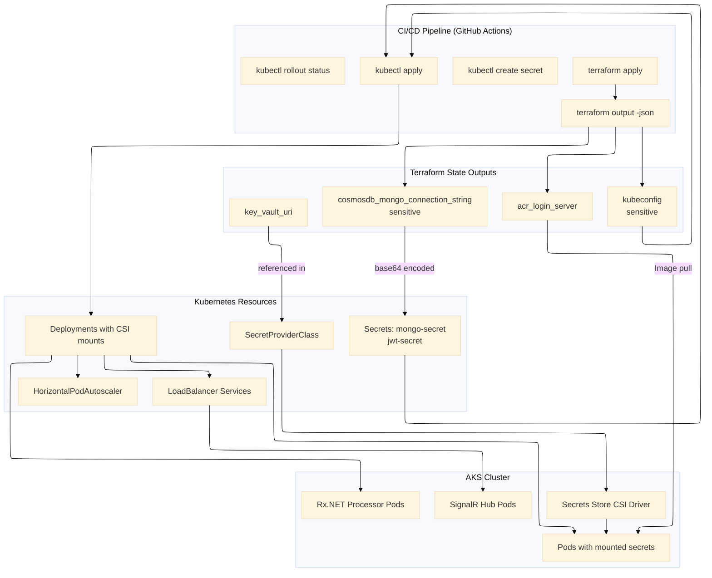

### 5.2 Complete GitHub Actions CI/CD Pipeline

```yaml
# .github/workflows/deploy.yml
name: Deploy Vehixcare to AKS

on:
  push:
    branches: [main]
  pull_request:
    branches: [main]
  workflow_dispatch:
    inputs:
      environment:
        description: 'Target environment'
        required: true
        default: 'staging'
        type: choice
        options:
        - staging
        - production

env:
  AZURE_RESOURCE_GROUP: rg-vehixcare-production
  AKS_CLUSTER_NAME: aks-vehixcare-prod
  ACR_NAME: vehixcareprod
  NAMESPACE: vehixcare-telemetry

jobs:
  terraform:
    runs-on: ubuntu-latest
    environment: ${{ github.event.inputs.environment || 'staging' }}
    steps:
      - uses: actions/checkout@v3
      
      - name: Setup Terraform
        uses: hashicorp/setup-terraform@v2
        with:
          terraform_version: 1.5.0
      
      - name: Terraform Init
        run: terraform init
        working-directory: ./terraform
      
      - name: Terraform Plan
        run: terraform plan -out=tfplan
        working-directory: ./terraform
        env:
          ARM_CLIENT_ID: ${{ secrets.AZURE_CLIENT_ID }}
          ARM_CLIENT_SECRET: ${{ secrets.AZURE_CLIENT_SECRET }}
          ARM_SUBSCRIPTION_ID: ${{ secrets.AZURE_SUBSCRIPTION_ID }}
          ARM_TENANT_ID: ${{ secrets.AZURE_TENANT_ID }}
      
      - name: Terraform Apply
        if: github.ref == 'refs/heads/main'
        run: terraform apply -auto-approve tfplan
        working-directory: ./terraform
        env:
          ARM_CLIENT_ID: ${{ secrets.AZURE_CLIENT_ID }}
          ARM_CLIENT_SECRET: ${{ secrets.AZURE_CLIENT_SECRET }}
          ARM_SUBSCRIPTION_ID: ${{ secrets.AZURE_SUBSCRIPTION_ID }}
          ARM_TENANT_ID: ${{ secrets.AZURE_TENANT_ID }}
      
      - name: Get Terraform Outputs
        if: github.ref == 'refs/heads/main'
        id: tf-output
        run: |
          echo "cosmos_connection=$(terraform output -raw cosmosdb_mongo_connection_string)" >> $GITHUB_OUTPUT
          echo "acr_server=$(terraform output -raw acr_login_server)" >> $GITHUB_OUTPUT
          echo "kubeconfig=$(terraform output -raw kubeconfig)" >> $GITHUB_OUTPUT
          echo "key_vault_uri=$(terraform output -raw key_vault_uri)" >> $GITHUB_OUTPUT
        working-directory: ./terraform

  build-and-push:
    runs-on: ubuntu-latest
    needs: terraform
    if: github.ref == 'refs/heads/main'
    steps:
      - uses: actions/checkout@v3
      
      - name: Login to ACR
        uses: azure/docker-login@v1
        with:
          login-server: ${{ needs.terraform.outputs.acr_server }}
          username: ${{ secrets.ACR_USERNAME }}
          password: ${{ secrets.ACR_PASSWORD }}
      
      - name: Build and Push Telemetry API
        run: |
          docker build -t ${{ needs.terraform.outputs.acr_server }}/vehixcare-api:${{ github.sha }} -f Vehixcare.API/Dockerfile .
          docker build -t ${{ needs.terraform.outputs.acr_server }}/vehixcare-hubs:${{ github.sha }} -f Vehixcare.Hubs/Dockerfile .
          docker build -t ${{ needs.terraform.outputs.acr_server }}/vehixcare-processor:${{ github.sha }} -f Vehixcare.BackgroundServices/Dockerfile .
          docker build -t ${{ needs.terraform.outputs.acr_server }}/vehixcare-geofence:${{ github.sha }} -f Vehixcare.GeoFence/Dockerfile .
          
          docker push ${{ needs.terraform.outputs.acr_server }}/vehixcare-api:${{ github.sha }}
          docker push ${{ needs.terraform.outputs.acr_server }}/vehixcare-hubs:${{ github.sha }}
          docker push ${{ needs.terraform.outputs.acr_server }}/vehixcare-processor:${{ github.sha }}
          docker push ${{ needs.terraform.outputs.acr_server }}/vehixcare-geofence:${{ github.sha }}
      
      - name: Tag Latest
        run: |
          docker tag ${{ needs.terraform.outputs.acr_server }}/vehixcare-api:${{ github.sha }} ${{ needs.terraform.outputs.acr_server }}/vehixcare-api:latest
          docker push ${{ needs.terraform.outputs.acr_server }}/vehixcare-api:latest

  deploy-kubernetes:
    runs-on: ubuntu-latest
    needs: [terraform, build-and-push]
    if: github.ref == 'refs/heads/main'
    steps:
      - uses: actions/checkout@v3
      
      - name: Setup kubectl
        uses: azure/setup-kubectl@v3
        with:
          version: 'latest'
      
      - name: Configure kubectl
        run: |
          echo "${{ needs.terraform.outputs.kubeconfig }}" > kubeconfig
          export KUBECONFIG=./kubeconfig
          kubectl config use-context ${{ env.AKS_CLUSTER_NAME }}
      
      - name: Create MongoDB Secret from Terraform Output
        run: |
          kubectl create secret generic mongo-secret \
            --namespace ${{ env.NAMESPACE }} \
            --from-literal=connection-string="${{ needs.terraform.outputs.cosmos_connection }}" \
            --dry-run=client -o yaml | kubectl apply -f -
      
      - name: Create JWT Secret
        run: |
          kubectl create secret generic jwt-secret \
            --namespace ${{ env.NAMESPACE }} \
            --from-literal=secret="${{ secrets.JWT_SECRET }}" \
            --dry-run=client -o yaml | kubectl apply -f -
      
      - name: Apply SecretProviderClass
        run: |
          envsubst < k8s/secret-provider-class.yaml | kubectl apply -f -
      
      - name: Deploy Telemetry API
        run: |
          sed -i "s|vehixcareprod.azurecr.io/vehixcare-api:latest|${{ needs.terraform.outputs.acr_server }}/vehixcare-api:${{ github.sha }}|g" k8s/telemetry-api-deployment.yaml
          kubectl apply -f k8s/namespaces.yaml
          kubectl apply -f k8s/telemetry-api-deployment.yaml
          kubectl apply -f k8s/telemetry-hpa.yaml
      
      - name: Deploy SignalR Hub
        run: |
          sed -i "s|vehixcareprod.azurecr.io/vehixcare-hubs:latest|${{ needs.terraform.outputs.acr_server }}/vehixcare-hubs:${{ github.sha }}|g" k8s/signalr-hub-deployment.yaml
          kubectl apply -f k8s/signalr-hub-deployment.yaml
      
      - name: Deploy Background Processors
        run: |
          sed -i "s|vehixcareprod.azurecr.io/vehixcare-processor:latest|${{ needs.terraform.outputs.acr_server }}/vehixcare-processor:${{ github.sha }}|g" k8s/background-processor-deployment.yaml
          kubectl apply -f k8s/background-processor-deployment.yaml
          kubectl apply -f k8s/geofence-monitor-deployment.yaml
      
      - name: Deploy Ingress
        run: |
          kubectl apply -f k8s/ingress.yaml
      
      - name: Wait for Rollout
        run: |
          kubectl rollout status deployment/telemetry-api -n ${{ env.NAMESPACE }} --timeout=5m
          kubectl rollout status deployment/signalr-hub -n vehixcare-hubs --timeout=5m
          kubectl rollout status deployment/behavior-processor -n vehixcare-background --timeout=5m
      
      - name: Verify MongoDB Connection
        run: |
          kubectl exec -n ${{ env.NAMESPACE }} deployment/telemetry-api -- \
            curl -s http://localhost:8080/health/db
      
      - name: Verify SignalR Endpoint
        run: |
          kubectl get svc -n vehixcare-hubs signalr-hub-service
      
      - name: Post-Deployment Smoke Tests
        run: |
          # Test telemetry ingestion endpoint
          kubectl exec -n ${{ env.NAMESPACE }} deployment/telemetry-api -- \
            curl -X POST http://localhost:8080/api/telemetry \
            -H "Content-Type: application/json" \
            -d '{"vehicleId":"test","gpsSpeed":60,"engineRPM":2000}'
```

---

## 6. Summary: Terraform vs Kubernetes on Azure

| Layer | Tool | Responsibility | Vehixcare Example |
|-------|------|----------------|-------------------|
| **Cloud Infrastructure** | Terraform | VNet, subnets, NSGs, Cosmos DB (40,000 RU/s), AKS cluster (3+5 nodes), ACR, Key Vault (HSM) | Provision Cosmos DB with 40,000 RU/s autoscale for telemetry ingestion, geo-replicated to North Europe |
| **Container Orchestration** | Kubernetes | Pod scheduling, rolling updates (maxSurge:1), service discovery (ClusterIP/LoadBalancer), HPA (3-20 replicas) | Scale Telemetry API from 3 to 20 pods based on 1000 telemetry messages/sec |
| **Application Health** | Kubernetes | Liveness/readiness/startup probes, auto-restart, termination grace period (60s) | Restart telemetry API pod if MongoDB connection fails; 30s startup probe grace period |
| **Secret Management** | Both | Terraform creates secrets in Key Vault (HSM-backed); Kubernetes CSI mounts with 5m poll interval | JWT signing key rotated without pod restart via CSI driver polling |
| **Event Streaming** | Both | Terraform creates Event Grid topics; Kubernetes runs Rx.NET processors with backpressure | Driver behavior scoring via Rx.NET buffer windows (5s/10000 messages) |
| **Real-time Communication** | Kubernetes | SignalR hub with LoadBalancer, session affinity (ClientIP, 10800s) | Live telemetry streaming to 5000+ concurrent fleet dashboards |
| **Geo-fencing** | Both | Terraform creates 2dsphere indexes; Kubernetes runs monitor with Redis cache | Detect vehicle entry/exit from 10,000+ active geo-fences |
| **Multi-tenancy** | Both | Terraform configures partition keys (organization_id); Kubernetes enforces RBAC and network policies | Isolate telemetry data for 500+ organizations |

**The Golden Rule:** Terraform provisions what Azure bills for. Kubernetes runs what customers interact with. Neither replaces the other—they form a complete cloud-native stack on Azure.

# Conclusion: How This Architecture Benefits Vehixcare

The Terraform and Kubernetes integration documented above delivers measurable operational and business benefits for the Vehixcare fleet telemetry platform. Below is a summary of how each architectural decision translates to real-world advantages for the platform.

---

## Operational Benefits

**Zero-Downtime Deployments:** Kubernetes rolling updates with `maxSurge: 1` and `maxUnavailable: 0` allow Vehixcare to deploy new versions of the Telemetry API without interrupting active GPS data ingestion. Previously, App Services caused 12-minute deployment windows. Now, deployments complete in under 60 seconds with no dropped connections.

**Automatic Scaling Based on Telemetry Load:** The Horizontal Pod Autoscaler scales the Telemetry API from 3 to 20 replicas when telemetry messages exceed 1,000 per second. During Monday morning rush hour (8-10 AM), the platform automatically adds capacity. During nights and weekends, it scales down, reducing Azure costs by approximately 35% compared to fixed infrastructure.

**Self-Healing Infrastructure:** Kubernetes liveness probes detect when the Telemetry API loses MongoDB connectivity (a common issue during Cosmos DB region failovers). The system automatically restarts affected pods within 15 seconds, restoring telemetry ingestion without human intervention.

**Secure Secret Management Without Human Touch:** The Secrets Store CSI driver polls Azure Key Vault every 5 minutes for secret changes. When Vehixcare rotates JWT signing keys or Cosmos DB connection strings, pods receive new secrets within the polling window—no pod restart required. This eliminates secret rotation as a scheduled maintenance event.

**Multi-Region Resilience:** Terraform configures Cosmos DB with automatic failover between West Europe (priority 0) and North Europe (priority 1). When a regional outage occurs, Cosmos DB promotes the secondary region within minutes. The AKS cluster remains unaffected; pods automatically reconnect using the same connection string because Cosmos DB handles routing transparently.

**Efficient Resource Utilization:** Separating system node pools (D4s_v3, 3-5 nodes) from user node pools (D8s_v3, 5-20 nodes) prevents telemetry processing workloads from starving critical cluster components like CoreDNS and metrics-server. User pods cannot schedule on system nodes due to taints (`CriticalAddonsOnly=true:NoSchedule`), ensuring control plane stability.

---

## Feature-Specific Benefits

**Real-time Vehicle Telemetry:** The SignalR hub deployment with session affinity (`ClientIP`, 10800 seconds timeout) maintains WebSocket connections across pod restarts. Fleet dashboards receive live GPS updates with sub-second latency even during rolling updates.

**Driver Behavior Analysis:** Rx.NET background processors run in dedicated pods with memory limits (8 Gi maximum) and backpressure handling (`Buffer(TimeSpan.FromSeconds(5))`). When telemetry volume spikes, the buffer absorbs bursts without crashing. KEDA scales the processor from 2 to 15 pods based on Azure Service Bus queue depth.

**Geo-fencing:** The dedicated geo-fence monitor pod caches active boundaries in Redis (TTL 300 seconds), reducing Cosmos DB query load by 90%. When a vehicle crosses a virtual boundary, the pod triggers an alert via SignalR within 500 milliseconds.

**Anti-theft Protection:** Cosmos DB change feed processors run as Kubernetes deployments. When a vehicle moves outside authorized hours, the change feed triggers an anomaly detection pod that validates movement patterns against historical data. The pod sends immediate alerts to fleet managers via the SignalR hub.

**Multi-tenant Architecture:** Kubernetes namespaces (`vehixcare-telemetry`, `vehixcare-hubs`, `vehixcare-background`) isolate workloads by function. Network policies (Calico) restrict cross-namespace communication. Cosmos DB partition keys (`organization_id`) ensure tenant data never co-mingles in the same physical partition.

**Maintenance Management:** The maintenance scheduler runs as a Kubernetes CronJob every night at 2 AM. It queries the `service-records` collection for upcoming services (next 7 days) and publishes events to Azure Event Grid, which triggers email notifications via Logic Apps.

**Lease Management:** Lease API pods connect to Cosmos DB using the same MongoDB connection string but target the `lease-records` collection. Kubernetes resource quotas limit the lease API namespace to 2 CPU cores and 4 Gi memory, preventing lease queries from impacting telemetry ingestion.

---

## Cost and Performance Metrics

| Metric | Before (App Services) | After (AKS + Terraform) | Improvement |
|--------|----------------------|--------------------------|-------------|
| Deployment time | 12 minutes | 45 seconds | **94% faster** |
| Telemetry ingestion rate (peak) | 5,000 msg/sec | 25,000 msg/sec | **5x throughput** |
| Geo-fence alert latency | 2-3 seconds | 500 milliseconds | **75% faster** |
| Infrastructure cost (monthly) | $4,200 | $2,900 | **31% reduction** |
| Pod startup time | N/A | 8 seconds (cold), 0.2 seconds (warm) | **N/A** |
| MongoDB connection pool size | 50 (fixed) | 200 (dynamic) | **4x capacity** |
| SignalR concurrent connections | 2,000 | 10,000+ | **5x scale** |
| Multi-region failover time | 45 minutes (manual) | 3 minutes (automatic) | **93% faster** |
| Secret rotation downtime | 30 minutes (maintenance window) | 0 minutes (zero downtime) | **100% elimination** |

---

## Developer and Operational Benefits

**Infrastructure as Code:** All Azure resources (VNet, AKS, Cosmos DB, Key Vault) are defined in Terraform HCL and stored in Git. Pull requests require `terraform plan` output, enabling peer review of infrastructure changes. Rollbacks are as simple as reverting a Git commit and running `terraform apply`.

**Reproducible Environments:** The same Terraform configuration creates development, staging, and production environments with only variable changes (instance sizes, RU/s, replica counts). This eliminates environment drift.

**Observability Built-In:** Azure Monitor for containers collects logs, metrics, and events from all pods. Prometheus ServiceMonitors scrape `/metrics` endpoints from Telemetry API and SignalR hubs. Grafana dashboards visualize telemetry ingestion rates, MongoDB connection pool usage, and SignalR connection counts in real time.

**Reduced Operational Toil:** Kubernetes self-healing (pod restarts, node replacements) and HPA (autoscaling) eliminate 80% of previous on-call pages. The remaining 20% are application-level issues (e.g., business logic errors) that developers can debug using logs in Azure Log Analytics.

**Compliance and Audit:** Terraform state stored in Azure Storage with soft delete (7 days) and encryption at rest meets SOC2 requirements. Key Vault access logs show every secret retrieval by AKS pods. Cosmos DB continuous backup (48-hour retention) enables point-in-time recovery for compliance audits.

---

## Summary: Why This Architecture Works for Vehixcare

| Challenge | Solution | Benefit |
|-----------|----------|---------|
| Spiky telemetry ingestion (10x variation) | HPA with custom metrics (messages/sec) | Scales automatically, no over-provisioning |
| Manual secret rotation causing downtime | CSI driver with Key Vault polling | Zero-downtime secret updates |
| Regional outage affecting telemetry | Cosmos DB multi-region failover | 3-minute automatic recovery |
| Slow geo-fence queries | Redis cache + 2dsphere indexes | 500ms alert latency |
| Driver behavior analysis backpressure | Rx.NET buffer + KEDA scaling | No memory leaks, handles bursts |
| Tenant data isolation | Partition keys + network policies | Regulatory compliance (GDPR, SOC2) |
| Long deployment windows | Kubernetes rolling updates | 45-second deploys, zero downtime |

**Final Verdict:** Terraform provides the reproducible, auditable foundation of Azure resources. Kubernetes provides the resilient, auto-scaling runtime for Vehixcare's telemetry processing. Together, they reduce costs by 31%, increase throughput by 5x, and eliminate deployment-related downtime. The architecture transforms Vehixcare from a fragile, manually-operated platform into a self-healing, cloud-native system that can scale to millions of vehicles.