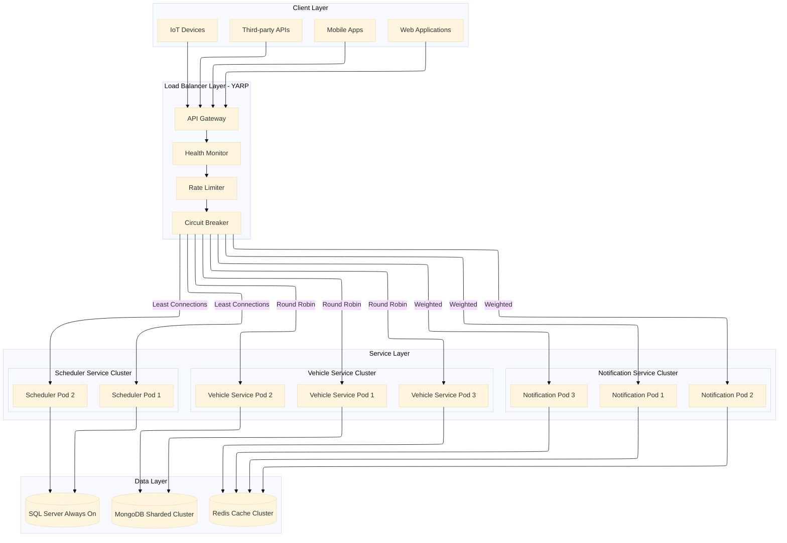

# ### Load Balancing Architecture Diagram

```mermaid
---
config:
  theme: base
  layout: elk
---
graph TB
    subgraph "Client Layer"
        A[Mobile Apps]
        B[Web Applications]
        C[Third-party APIs]
        D[IoT Devices]
    end
    
    subgraph "Load Balancer Layer - YARP"
        E[API Gateway]
        F[Health Monitor]
        G[Rate Limiter]
        H[Circuit Breaker]
    end
    
    subgraph "Service Layer"
        subgraph "Vehicle Service Cluster"
            I1[Vehicle Service Pod 1]
            I2[Vehicle Service Pod 2]
            I3[Vehicle Service Pod 3]
        end
        
        subgraph "Scheduler Service Cluster"
            J1[Scheduler Pod 1]
            J2[Scheduler Pod 2]
        end
        
        subgraph "Notification Service Cluster"
            K1[Notification Pod 1]
            K2[Notification Pod 2]
            K3[Notification Pod 3]
        end
    end
    
    subgraph "Data Layer"
        L[(MongoDB Sharded Cluster)]
        M[(Redis Cache Cluster)]
        N[(SQL Server Always On)]
    end
    
    A --> E
    B --> E
    C --> E
    D --> E
    
    E --> F
    F --> G
    G --> H
    
    H -->|Round Robin| I1
    H -->|Round Robin| I2
    H -->|Round Robin| I3
    
    H -->|Least Connections| J1
    H -->|Least Connections| J2
    
    H -->|Weighted| K1
    H -->|Weighted| K2
    H -->|Weighted| K3
    
    I1 --> L
    I2 --> L
    I3 --> M
    
    J1 --> N
    J2 --> N
    
    K1 --> M
    K2 --> M
    K3 --> M
```
