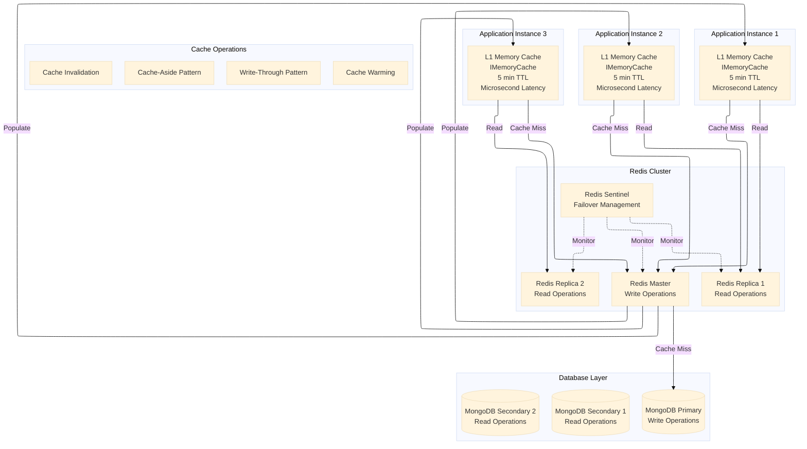

# ### Multi-Tier Caching Architecture

```mermaid
---
config:
  theme: base
  layout: elk
---
graph TB
    subgraph "Application Instance 1"
        A1[L1 Memory Cache<br/>IMemoryCache<br/>5 min TTL<br/>Microsecond Latency]
    end
    
    subgraph "Application Instance 2"
        A2[L1 Memory Cache<br/>IMemoryCache<br/>5 min TTL<br/>Microsecond Latency]
    end
    
    subgraph "Application Instance 3"
        A3[L1 Memory Cache<br/>IMemoryCache<br/>5 min TTL<br/>Microsecond Latency]
    end
    
    subgraph "Redis Cluster"
        B1[Redis Master<br/>Write Operations]
        B2[Redis Replica 1<br/>Read Operations]
        B3[Redis Replica 2<br/>Read Operations]
        B4[Redis Sentinel<br/>Failover Management]
    end
    
    subgraph "Database Layer"
        C1[(MongoDB Primary<br/>Write Operations)]
        C2[(MongoDB Secondary 1<br/>Read Operations)]
        C3[(MongoDB Secondary 2<br/>Read Operations)]
    end
    
    subgraph "Cache Operations"
        D[Cache-Aside Pattern]
        E[Write-Through Pattern]
        F[Cache Invalidation]
        G[Cache Warming]
    end
    
    A1 -->|Cache Miss| B1
    A2 -->|Cache Miss| B1
    A3 -->|Cache Miss| B1
    
    B1 -->|Cache Miss| C1
    B1 -->|Populate| A1
    B1 -->|Populate| A2
    B1 -->|Populate| A3
    
    A1 -->|Read| B2
    A2 -->|Read| B2
    A3 -->|Read| B3
    
    B4 -.->|Monitor| B1
    B4 -.->|Monitor| B2
    B4 -.->|Monitor| B3
```
