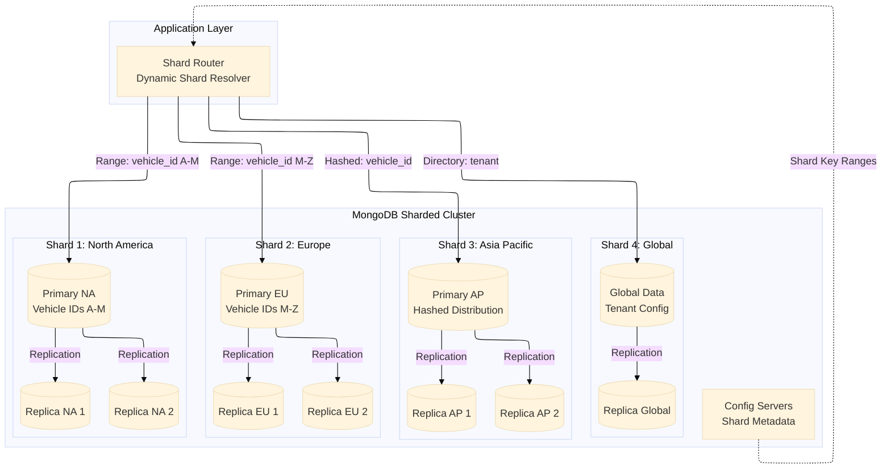

# diagram_03_sharding-architecture-diagram

```mermaid
---
config:
  theme: base
  layout: elk
---
graph TB
    subgraph "Application Layer"
        A[Shard Router<br/>Dynamic Shard Resolver]
    end
    
    subgraph "MongoDB Sharded Cluster"
        B[Config Servers<br/>Shard Metadata]
        
        subgraph "Shard 1: North America"
            C1[(Primary NA<br/>Vehicle IDs A-M)]
            C2[(Replica NA 1)]
            C3[(Replica NA 2)]
        end
        
        subgraph "Shard 2: Europe"
            D1[(Primary EU<br/>Vehicle IDs M-Z)]
            D2[(Replica EU 1)]
            D3[(Replica EU 2)]
        end
        
        subgraph "Shard 3: Asia Pacific"
            E1[(Primary AP<br/>Hashed Distribution)]
            E2[(Replica AP 1)]
            E3[(Replica AP 2)]
        end
        
        subgraph "Shard 4: Global"
            F1[(Global Data<br/>Tenant Config)]
            F2[(Replica Global)]
        end
    end
    
    A -->|Range: vehicle_id A-M| C1
    A -->|Range: vehicle_id M-Z| D1
    A -->|Hashed: vehicle_id| E1
    A -->|Directory: tenant| F1
    
    C1 -->|Replication| C2
    C1 -->|Replication| C3
    
    D1 -->|Replication| D2
    D1 -->|Replication| D3
    
    E1 -->|Replication| E2
    E1 -->|Replication| E3
    
    F1 -->|Replication| F2
    
    B -.->|Shard Key Ranges| A
```
