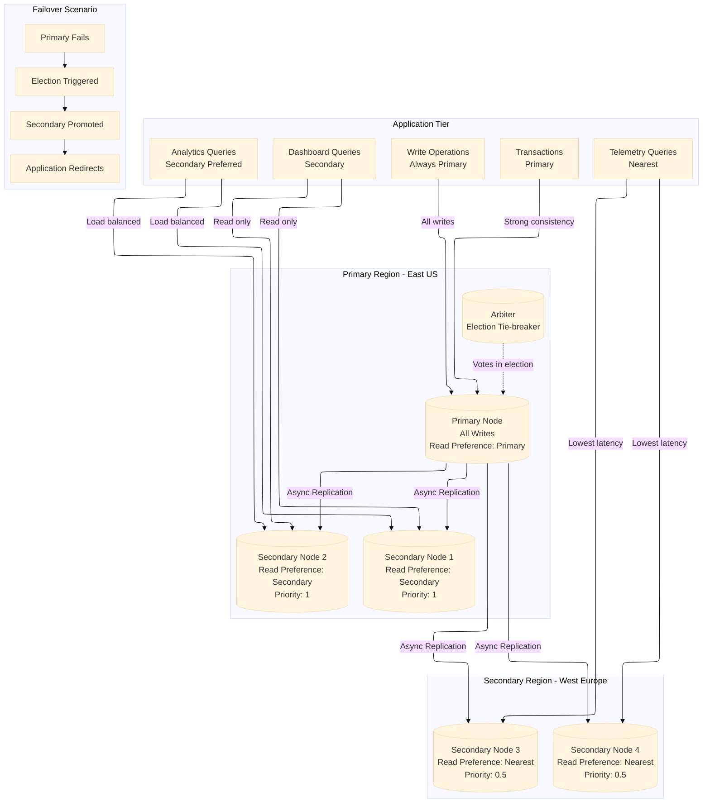

# diagram_04_replication-architecture-diagram-404c

```mermaid
---
config:
  theme: base
  layout: elk
---
graph TB
    subgraph "Primary Region - East US"
        A[(Primary Node<br/>All Writes<br/>Read Preference: Primary)]
        A2[(Secondary Node 1<br/>Read Preference: Secondary<br/>Priority: 1)]
        A3[(Secondary Node 2<br/>Read Preference: Secondary<br/>Priority: 1)]
        A4[(Arbiter<br/>Election Tie-breaker)]
    end
    
    subgraph "Secondary Region - West Europe"
        B[(Secondary Node 3<br/>Read Preference: Nearest<br/>Priority: 0.5)]
        B2[(Secondary Node 4<br/>Read Preference: Nearest<br/>Priority: 0.5)]
    end
    
    subgraph "Application Tier"
        W[Write Operations<br/>Always Primary]
        R1[Analytics Queries<br/>Secondary Preferred]
        R2[Dashboard Queries<br/>Secondary]
        R3[Telemetry Queries<br/>Nearest]
        R4[Transactions<br/>Primary]
    end
    
    W -->|All writes| A
    A -->|Async Replication| A2
    A -->|Async Replication| A3
    A -->|Async Replication| B
    A -->|Async Replication| B2
    
    A4 -.->|Votes in election| A
    
    R1 -->|Load balanced| A2
    R1 -->|Load balanced| A3
    
    R2 -->|Read only| A2
    R2 -->|Read only| A3
    
    R3 -->|Lowest latency| B
    R3 -->|Lowest latency| B2
    
    R4 -->|Strong consistency| A
    
    subgraph "Failover Scenario"
        F1[Primary Fails] --> F2[Election Triggered]
        F2 --> F3[Secondary Promoted]
        F3 --> F4[Application Redirects]
    end
```
