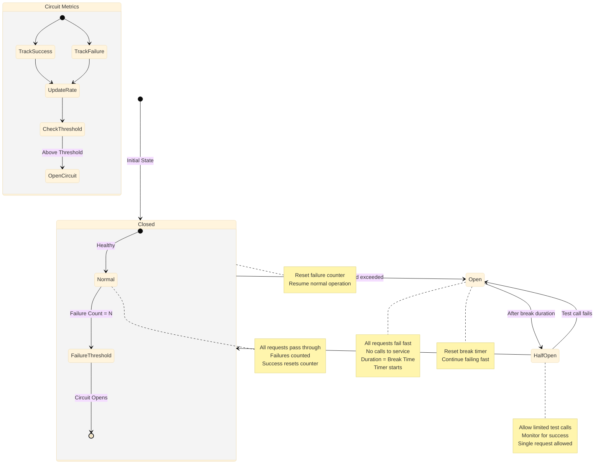

# ### Circuit Breaker State Machine Diagram

```mermaid
---
config:
  theme: base
---
stateDiagram
  direction TB
  state Closed {
    direction TB
    [*] --> Normal:Healthy
    Normal --> FailureThreshold:Failure Count = N
    FailureThreshold --> [*]:Circuit Opens
[*]    Normal
    FailureThreshold
[*]  }
  state Metrics {
    direction TB
    [*] --> TrackSuccess
    [*] --> TrackFailure
    TrackSuccess --> UpdateRate
    TrackFailure --> UpdateRate
    UpdateRate --> CheckThreshold
    CheckThreshold --> OpenCircuit:Above Threshold
[*]    TrackSuccess
    TrackFailure
    UpdateRate
    CheckThreshold
    OpenCircuit
  }
  [*] --> Closed:Initial State
  Closed --> Open:Failure threshold exceeded
  Open --> HalfOpen:After break duration
  HalfOpen --> Closed:Test call succeeds
  HalfOpen --> Open:Test call fails
  Metrics:Circuit Metrics
  note right of Normal 
  All requests pass through
            Failures counted
            Success resets counter
  end note
  note right of Open 
  All requests fail fast
        No calls to service
        Duration = Break Time
        Timer starts
  end note
  note right of Open 
  Reset break timer
        Continue failing fast
  end note
  note right of HalfOpen 
  Allow limited test calls
        Monitor for success
        Single request allowed
  end note
  note right of Closed 
  Reset failure counter
        Resume normal operation
  end note
```
