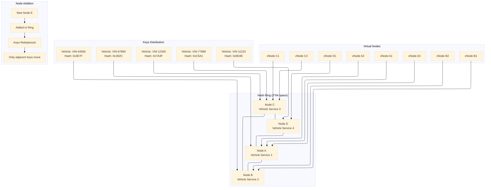

# diagram_01_consistent-hashing-architecture-diagram-3eff

```mermaid
---
config:
  theme: base
  layout: elk
---
graph TB
    subgraph "Hash Ring (2^64 space)"
        direction LR
        A[Node A<br/>Vehicle Service 1]
        B[Node B<br/>Vehicle Service 2]
        C[Node C<br/>Vehicle Service 3]
        D[Node D<br/>Vehicle Service 4]
        
        A --- B
        B --- C
        C --- D
        D --- A
    end
    
    subgraph "Virtual Nodes"
        A1[vNode A1] --> A
        A2[vNode A2] --> A
        A3[vNode A3] --> A
        B1[vNode B1] --> B
        B2[vNode B2] --> B
        C1[vNode C1] --> C
        C2[vNode C2] --> C
        D1[vNode D1] --> D
    end
    
    subgraph "Keys Distribution"
        K1[Vehicle: VIN-12345<br/>Hash: 0x7A3F] --> C
        K2[Vehicle: VIN-67890<br/>Hash: 0x1B2C] --> A
        K3[Vehicle: VIN-11223<br/>Hash: 0x9D4E] --> D
        K4[Vehicle: VIN-44556<br/>Hash: 0x3E7F] --> B
        K5[Vehicle: VIN-77889<br/>Hash: 0xC5A1] --> C
    end
    
    subgraph "Node Addition"
        E[New Node E] --> F[Added to Ring]
        F --> G[Keys Rebalanced]
        G --> H[Only adjacent keys move]
    end
```
