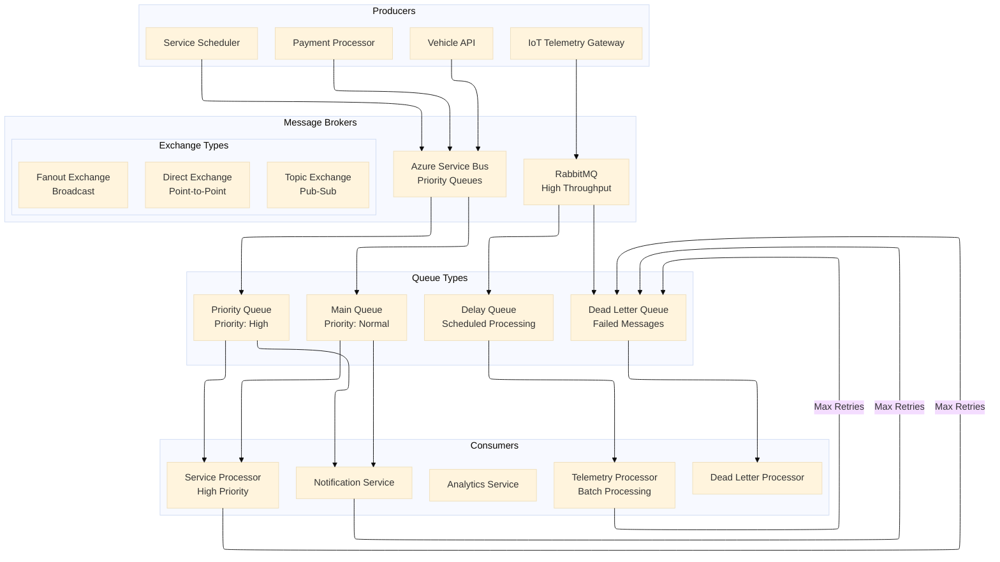

# ### Message Queue Architecture Diagram

```mermaid
---
config:
  theme: base
  layout: elk
---
graph TB
    subgraph "Producers"
        A1[Vehicle API]
        A2[IoT Telemetry Gateway]
        A3[Service Scheduler]
        A4[Payment Processor]
    end
    
    subgraph "Message Brokers"
        B1[Azure Service Bus<br/>Priority Queues]
        B2[RabbitMQ<br/>High Throughput]
        
        subgraph "Exchange Types"
            C1[Direct Exchange<br/>Point-to-Point]
            C2[Topic Exchange<br/>Pub-Sub]
            C3[Fanout Exchange<br/>Broadcast]
        end
    end
    
    subgraph "Consumers"
        D1[Service Processor<br/>High Priority]
        D2[Telemetry Processor<br/>Batch Processing]
        D3[Notification Service]
        D4[Analytics Service]
        D5[Dead Letter Processor]
    end
    
    subgraph "Queue Types"
        E1[Main Queue<br/>Priority: Normal]
        E2[Priority Queue<br/>Priority: High]
        E3[Dead Letter Queue<br/>Failed Messages]
        E4[Delay Queue<br/>Scheduled Processing]
    end
    
    A1 --> B1
    A2 --> B2
    A3 --> B1
    A4 --> B1
    
    B1 --> E1
    B1 --> E2
    B2 --> E3
    B2 --> E4
    
    E1 --> D1
    E2 --> D1
    E1 --> D3
    E2 --> D3
    E4 --> D2
    
    D1 -->|Max Retries| E3
    D2 -->|Max Retries| E3
    D3 -->|Max Retries| E3
    
    E3 --> D5
```
