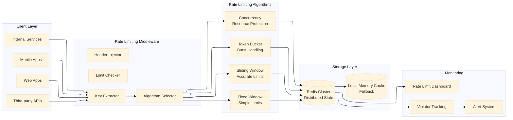

# ### Rate Limiting Architecture Diagram

```mermaid
---
config:
  theme: base
  layout: elk
---
flowchart LR
 subgraph subGraph0["Client Layer"]
        A1["Mobile Apps"]
        A2["Web Apps"]
        A3["Third-party APIs"]
        A4["Internal Services"]
  end
 subgraph subGraph1["Rate Limiting Middleware"]
        B1["Key Extractor"]
        B2["Algorithm Selector"]
        B3["Limit Checker"]
        B4["Header Injector"]
  end
 subgraph subGraph2["Rate Limiting Algorithms"]
        C1["Token Bucket<br>Burst Handling"]
        C2["Sliding Window<br>Accurate Limits"]
        C3["Fixed Window<br>Simple Limits"]
        C4["Concurrency<br>Resource Protection"]
  end
 subgraph subGraph3["Storage Layer"]
        D1[("Redis Cluster<br>Distributed State")]
        D2[("Local Memory Cache<br>Fallback")]
  end
 subgraph Monitoring["Monitoring"]
        E1["Rate Limit Dashboard"]
        E2["Violator Tracking"]
        E3["Alert System"]
  end
    A1 --> B1
    A2 --> B1
    A3 --> B1
    A4 --> B1
    B1 --> B2
    B2 --> C1 & C2 & C3 & C4
    C1 --> D1
    C2 --> D1
    C3 --> D1
    C4 --> D1
    D1 --> D2 & E1 & E2
    E2 --> E3
```
