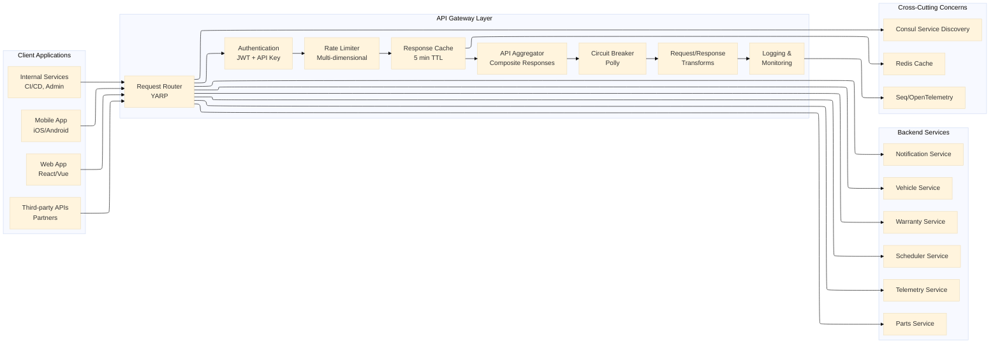

# diagram_04_api-gateway-architecture-diagram-1751

```mermaid
---
config:
  theme: base
  layout: elk
---
flowchart LR
 subgraph subGraph0["Client Applications"]
        A1["Mobile App<br>iOS/Android"]
        A2["Web App<br>React/Vue"]
        A3["Third-party APIs<br>Partners"]
        A4["Internal Services<br>CI/CD, Admin"]
  end
 subgraph subGraph1["API Gateway Layer"]
        B1["Request Router<br>YARP"]
        B2["Authentication<br>JWT + API Key"]
        B3["Rate Limiter<br>Multi-dimensional"]
        B4["Response Cache<br>5 min TTL"]
        B5["API Aggregator<br>Composite Responses"]
        B6["Circuit Breaker<br>Polly"]
        B7["Request/Response<br>Transforms"]
        B8["Logging &amp;<br>Monitoring"]
  end
 subgraph subGraph2["Backend Services"]
        C1["Vehicle Service"]
        C2["Scheduler Service"]
        C3["Notification Service"]
        C4["Telemetry Service"]
        C5["Parts Service"]
        C6["Warranty Service"]
  end
 subgraph subGraph3["Cross-Cutting Concerns"]
        D1["Redis Cache"]
        D2["Seq/OpenTelemetry"]
        D3["Consul Service Discovery"]
  end
    A1 --> B1
    A2 --> B1
    A3 --> B1
    A4 --> B1
    B1 --> B2 & C1 & C2 & C3 & C4 & C5 & C6 & D3
    B2 --> B3
    B3 --> B4
    B4 --> B5 & D1
    B5 --> B6
    B6 --> B7
    B7 --> B8
    B8 --> D2
```
