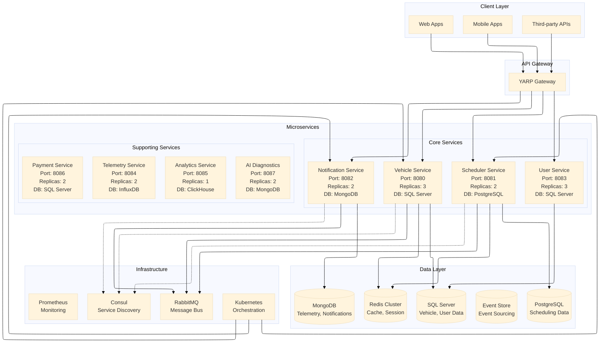

# ### Microservices Architecture Diagram

```mermaid
---
config:
  theme: base
  layout: elk
---
graph TB
    subgraph "Client Layer"
        A[Mobile Apps]
        B[Web Apps]
        C[Third-party APIs]
    end
    
    subgraph "API Gateway"
        D[YARP Gateway]
    end
    
    subgraph "Microservices"
        subgraph "Core Services"
            E1[Vehicle Service<br/>Port: 8080<br/>Replicas: 3<br/>DB: SQL Server]
            E2[Scheduler Service<br/>Port: 8081<br/>Replicas: 2<br/>DB: PostgreSQL]
            E3[Notification Service<br/>Port: 8082<br/>Replicas: 2<br/>DB: MongoDB]
            E4[User Service<br/>Port: 8083<br/>Replicas: 3<br/>DB: SQL Server]
        end
        
        subgraph "Supporting Services"
            F1[Telemetry Service<br/>Port: 8084<br/>Replicas: 2<br/>DB: InfluxDB]
            F2[Analytics Service<br/>Port: 8085<br/>Replicas: 1<br/>DB: ClickHouse]
            F3[Payment Service<br/>Port: 8086<br/>Replicas: 2<br/>DB: SQL Server]
            F4[AI Diagnostics<br/>Port: 8087<br/>Replicas: 2<br/>DB: MongoDB]
        end
    end
    
    subgraph "Data Layer"
        G1[(SQL Server<br/>Vehicle, User Data)]
        G2[(PostgreSQL<br/>Scheduling Data)]
        G3[(MongoDB<br/>Telemetry, Notifications)]
        G4[(Redis Cluster<br/>Cache, Session)]
        G5[(Event Store<br/>Event Sourcing)]
    end
    
    subgraph "Infrastructure"
        H1[Kubernetes<br/>Orchestration]
        H2[Consul<br/>Service Discovery]
        H3[RabbitMQ<br/>Message Bus]
        H4[Prometheus<br/>Monitoring]
    end
    
    A --> D
    B --> D
    C --> D
    
    D --> E1
    D --> E2
    D --> E3
    D --> E4
    
    E1 --> G1
    E1 --> G4
    E2 --> G2
    E2 --> G4
    E3 --> G3
    E4 --> G1
    
    E1 --> H3
    E2 --> H3
    E3 --> H3
    
    E1 -.-> H2
    E2 -.-> H2
    E3 -.-> H2
    
    H1 --> E1
    H1 --> E2
    H1 --> E3
```
