# Architecting Resilient Systems: 20 Essential Concepts Through a .NET Lens - Part 3

## Architecture & Scale — Monolithic Architecture, Event-Driven Architecture, CAP Theorem, Distributed Systems, Horizontal Scaling


*This is Part 3 of a 4-part series exploring system design concepts through the Vehixcare-API implementation. In this series, we'll cover 20 essential distributed system patterns with practical .NET code examples, MongoDB integration, and SOLID principles.*

---

**Companion stories in this series: Explore the complete architecture journey**

- **[🏗️ Part 1:** *Foundation & Resilience – Load Balancing, Caching, Database Sharding, Replication, Circuit Breaker* ](#)** 

- **📡 Part 2:** *Distribution & Communication – Consistent Hashing, Message Queues, Rate Limiting, API Gateway, Microservices* 

- **🏛️ Part 3:** *Architecture & Scale – Monolithic Architecture, Event-Driven Architecture, CAP Theorem, Distributed Systems, Horizontal Scaling* 

- **⚙️ Part 4:** *Optimization & Operations – Vertical Scaling, Data Partitioning, Idempotency, Service Discovery, Observability *
---

## Introduction: From Microservices Back to Monoliths — Finding the Right Architecture

In Part 1, we built the foundation with load balancing, caching, sharding, replication, and circuit breakers. In Part 2, we explored distribution patterns that enable services to communicate effectively. Now, we step back to examine the architectural choices that shape entire systems.

The journey from monolith to microservices is well-trodden, but the path isn't always forward. Many organizations are discovering that a well-structured modular monolith can be more appropriate than distributed microservices for many use cases. In this part, we'll explore when to use each approach and how to evolve architectures gracefully.

We'll also dive into:
- **Event-Driven Architecture**: Building reactive systems that respond to changes in real-time
- **CAP Theorem**: The fundamental tradeoffs in distributed systems
- **Distributed Systems**: Managing complexity across multiple nodes
- **Horizontal Scaling**: Adding more machines to handle increasing load

---

## Concept 11: Monolithic Architecture — Single Unified Codebase Handling All Functionalities Together


A monolithic architecture packages all application components into a single deployable unit. While often considered "legacy," a well-designed modular monolith can be the right choice for many applications, offering simplicity, performance, and easier development workflows.

### Deep Dive into Monolithic Architecture

**Types of Monoliths:**

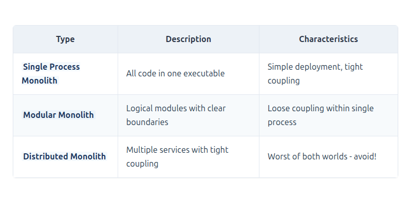

[View Source](https://github.com/Vineet-Sharma-Medium-Stories/Medium-Assets/blob/main/architecting-resilient-systems-20-essential-concepts-through-a-net-lens---part-3/table_01_types-of-monoliths.md)


**When to Choose a Monolith:**

- **Startup Phase**: Rapid iteration, unknown requirements
- **Small Teams**: Simple deployment and debugging
- **Strong Consistency Requirements**: Transactions across modules
- **Performance-Sensitive Workloads**: No network overhead
- **Simple Deployment Environments**: Single artifact to deploy

**Monolith vs. Microservices Evolution Path:**

```
Stage 1: Big Ball of Mud → Stage 2: Modular Monolith → Stage 3: Strategic Microservices
         (No structure)        (Clear boundaries)         (Domain-driven decomposition)
```

### Vehixcare Modular Monolith Implementation

```csharp
// 1. Solution structure for modular monolith
/*
Vehixcare.sln
├── src/
│   ├── Vehixcare.Api/                     # API Layer (Entry Point)
│   │   ├── Program.cs
│   │   ├── Controllers/
│   │   └── Middleware/
│   │
│   ├── Modules/
│   │   ├── VehicleManagement/             # Module 1: Vehicle Management
│   │   │   ├── Application/               # DTOs, Commands, Queries
│   │   │   ├── Domain/                    # Entities, Value Objects
│   │   │   ├── Infrastructure/            # Repositories, EF Core
│   │   │   ├── Api/                       # Controllers
│   │   │   └── ModuleDependency.cs        # Module Registration
│   │   │
│   │   ├── ServiceScheduling/             # Module 2: Service Scheduling
│   │   │   ├── Application/
│   │   │   ├── Domain/
│   │   │   ├── Infrastructure/
│   │   │   ├── Api/
│   │   │   └── ModuleDependency.cs
│   │   │
│   │   ├── UserManagement/                # Module 3: User Management
│   │   │   ├── Application/
│   │   │   ├── Domain/
│   │   │   ├── Infrastructure/
│   │   │   ├── Api/
│   │   │   └── ModuleDependency.cs
│   │   │
│   │   ├── Notification/                  # Module 4: Notifications
│   │   │   ├── Application/
│   │   │   ├── Domain/
│   │   │   ├── Infrastructure/
│   │   │   ├── Api/
│   │   │   └── ModuleDependency.cs
│   │   │
│   │   └── Analytics/                     # Module 5: Analytics
│   │       ├── Application/
│   │       ├── Domain/
│   │       ├── Infrastructure/
│   │       ├── Api/
│   │       └── ModuleDependency.cs
│   │
│   └── Shared/                            # Shared Kernel
│       ├── Kernel/                        # Common Domain Concepts
│       │   ├── Entities/
│       │   ├── ValueObjects/
│       │   └── Abstractions/
│       ├── Events/                        # Shared Events
│       │   ├── IEvent.cs
│       │   ├── IEventBus.cs
│       │   └── Events/
│       ├── Infrastructure/                # Shared Infrastructure
│       │   ├── Data/
│       │   ├── Logging/
│       │   └── Caching/
│       └── Configuration/                 # Shared Configuration
│           ├── ModuleConfiguration.cs
│           └── ModuleExtensions.cs
*/

```
**Module interface for clean boundaries**
```csharp

// 2. Module interface for clean boundaries
public interface IModule
{
    string Name { get; }
    string Version { get; }
    void ConfigureServices(IServiceCollection services, IConfiguration configuration);
    void ConfigureEndpoints(IEndpointRouteBuilder endpoints);
    Task InitializeAsync(IServiceProvider serviceProvider, CancellationToken ct = default);
}

```
**Module base class with common functionality**
```csharp
// 3. Module base class with common functionality
public abstract class ModuleBase : IModule
{
    protected readonly ILogger _logger;
    protected readonly IConfiguration _configuration;
    
    protected ModuleBase(string name, string version, ILogger logger, IConfiguration configuration)
    {
        Name = name;
        Version = version;
        _logger = logger;
        _configuration = configuration;
    }
    
    public string Name { get; }
    public string Version { get; }
    
    public abstract void ConfigureServices(IServiceCollection services, IConfiguration configuration);
    public abstract void ConfigureEndpoints(IEndpointRouteBuilder endpoints);
    
    public virtual Task InitializeAsync(IServiceProvider serviceProvider, CancellationToken ct = default)
    {
        _logger.LogInformation("Initializing module {ModuleName} v{Version}", Name, Version);
        return Task.CompletedTask;
    }
}

```
**Vehicle Management Module Implementation**
```csharp

// 4. Vehicle Management Module Implementation
public class VehicleManagementModule : ModuleBase
{
    private const string ModuleName = "VehicleManagement";
    private const string ModuleVersion = "2.0.0";
    
    public VehicleManagementModule(ILogger<VehicleManagementModule> logger, IConfiguration configuration) 
        : base(ModuleName, ModuleVersion, logger, configuration)
    {
    }
    
    public override void ConfigureServices(IServiceCollection services, IConfiguration configuration)
    {
        _logger.LogInformation("Configuring {ModuleName} services", Name);
        
        // Register database context (module-specific schema)
        services.AddDbContext<VehicleDbContext>(options =>
        {
            options.UseSqlServer(configuration.GetConnectionString("VehicleDb"),
                sqlOptions =>
                {
                    sqlOptions.MigrationsAssembly(typeof(VehicleDbContext).Assembly.FullName);
                    sqlOptions.EnableRetryOnFailure(5, TimeSpan.FromSeconds(10), null);
                });
            options.EnableSensitiveDataLogging(_logger.IsEnabled(LogLevel.Debug));
        });
        
        // Register repositories
        services.AddScoped<IVehicleRepository, VehicleRepository>();
        services.AddScoped<IVehicleServiceHistoryRepository, VehicleServiceHistoryRepository>();
        services.AddScoped<IDiagnosticCodeRepository, DiagnosticCodeRepository>();
        
        // Register services
        services.AddScoped<IVehicleService, VehicleService>();
        services.AddScoped<IVehicleSearchService, VehicleSearchService>();
        services.AddScoped<IVehicleValidationService, VehicleValidationService>();
        
        // Register domain event handlers
        services.AddScoped<INotificationHandler<VehicleCreatedEvent>, VehicleCreatedHandler>();
        services.AddScoped<INotificationHandler<VehicleUpdatedEvent>, VehicleUpdatedHandler>();
        services.AddScoped<INotificationHandler<VehicleDeletedEvent>, VehicleDeletedHandler>();
        services.AddScoped<INotificationHandler<VehicleServicedEvent>, VehicleServicedHandler>();
        
        // Register background services
        services.AddHostedService<VehicleTelemetryProcessor>();
        services.AddHostedService<VehicleMaintenanceScheduler>();
        
        // Register cache service
        services.AddScoped<IVehicleCacheService, VehicleCacheService>();
        
        // Register validation
        services.AddScoped<IValidator<CreateVehicleCommand>, CreateVehicleCommandValidator>();
        services.AddScoped<IValidator<UpdateVehicleCommand>, UpdateVehicleCommandValidator>();
    }
    
    public override void ConfigureEndpoints(IEndpointRouteBuilder endpoints)
    {
        _logger.LogInformation("Configuring {ModuleName} endpoints", Name);
        
        var group = endpoints.MapGroup("/api/vehicles")
            .WithTags("Vehicle Management")
            .WithOpenApi();
        
        // CRUD endpoints
        group.MapGet("/", GetAllVehicles)
            .WithName("GetAllVehicles")
            .WithDescription("Get all vehicles with pagination")
            .RequireAuthorization("VehicleRead");
            
        group.MapGet("/{id}", GetVehicleById)
            .WithName("GetVehicleById")
            .WithDescription("Get a specific vehicle by ID")
            .RequireAuthorization("VehicleRead");
            
        group.MapPost("/", CreateVehicle)
            .WithName("CreateVehicle")
            .WithDescription("Create a new vehicle")
            .RequireAuthorization("VehicleWrite");
            
        group.MapPut("/{id}", UpdateVehicle)
            .WithName("UpdateVehicle")
            .WithDescription("Update an existing vehicle")
            .RequireAuthorization("VehicleWrite");
            
        group.MapDelete("/{id}", DeleteVehicle)
            .WithName("DeleteVehicle")
            .WithDescription("Delete a vehicle")
            .RequireAuthorization("AdminOnly");
            
        // Search endpoints
        group.MapGet("/search", SearchVehicles)
            .WithName("SearchVehicles")
            .WithDescription("Search vehicles by criteria")
            .RequireAuthorization("VehicleRead");
            
        // Service history endpoints
        group.MapGet("/{id}/service-history", GetServiceHistory)
            .WithName("GetServiceHistory")
            .WithDescription("Get vehicle service history")
            .RequireAuthorization("VehicleRead");
            
        group.MapPost("/{id}/service", RecordService)
            .WithName("RecordService")
            .WithDescription("Record a service performed on a vehicle")
            .RequireAuthorization("ServiceWrite");
            
        // Telemetry endpoints
        group.MapGet("/{id}/telemetry", GetTelemetry)
            .WithName("GetTelemetry")
            .WithDescription("Get vehicle telemetry data")
            .RequireAuthorization("TelemetryRead");
            
        group.MapPost("/{id}/telemetry", AddTelemetry)
            .WithName("AddTelemetry")
            .WithDescription("Add vehicle telemetry data")
            .RequireAuthorization("TelemetryWrite");
    }
    
    public override async Task InitializeAsync(IServiceProvider serviceProvider, CancellationToken ct = default)
    {
        _logger.LogInformation("Initializing {ModuleName} module", Name);
        
        // Run database migrations
        using var scope = serviceProvider.CreateScope();
        var dbContext = scope.ServiceProvider.GetRequiredService<VehicleDbContext>();
        
        await dbContext.Database.MigrateAsync(ct);
        
        // Seed initial data
        await SeedDataAsync(scope.ServiceProvider, ct);
        
        _logger.LogInformation("{ModuleName} module initialization complete", Name);
    }
    
    private async Task SeedDataAsync(IServiceProvider serviceProvider, CancellationToken ct)
    {
        var dbContext = serviceProvider.GetRequiredService<VehicleDbContext>();
        var logger = serviceProvider.GetRequiredService<ILogger<VehicleManagementModule>>();
        
        // Seed diagnostic codes
        if (!await dbContext.DiagnosticCodes.AnyAsync(ct))
        {
            logger.LogInformation("Seeding diagnostic codes");
            
            var diagnosticCodes = GetDefaultDiagnosticCodes();
            await dbContext.DiagnosticCodes.AddRangeAsync(diagnosticCodes, ct);
            await dbContext.SaveChangesAsync(ct);
        }
        
        // Seed vehicle makes and models
        if (!await dbContext.VehicleMakes.AnyAsync(ct))
        {
            logger.LogInformation("Seeding vehicle makes and models");
            
            var makes = GetDefaultVehicleMakes();
            await dbContext.VehicleMakes.AddRangeAsync(makes, ct);
            await dbContext.SaveChangesAsync(ct);
        }
    }
    
    // Endpoint handlers
    private static async Task<IResult> GetAllVehicles(
        [AsParameters] PaginationParams pagination,
        IVehicleService vehicleService,
        CancellationToken ct)
    {
        var vehicles = await vehicleService.GetAllAsync(pagination.Page, pagination.PageSize, ct);
        return Results.Ok(vehicles);
    }
    
    private static async Task<IResult> GetVehicleById(
        string id,
        IVehicleService vehicleService,
        CancellationToken ct)
    {
        var vehicle = await vehicleService.GetByIdAsync(id, ct);
        return vehicle is not null ? Results.Ok(vehicle) : Results.NotFound();
    }
    
    private static async Task<IResult> CreateVehicle(
        CreateVehicleCommand command,
        IVehicleService vehicleService,
        CancellationToken ct)
    {
        var vehicle = await vehicleService.CreateAsync(command, ct);
        return Results.Created($"/api/vehicles/{vehicle.Id}", vehicle);
    }
    
    private static async Task<IResult> UpdateVehicle(
        string id,
        UpdateVehicleCommand command,
        IVehicleService vehicleService,
        CancellationToken ct)
    {
        var vehicle = await vehicleService.UpdateAsync(id, command, ct);
        return vehicle is not null ? Results.Ok(vehicle) : Results.NotFound();
    }
    
    private static async Task<IResult> DeleteVehicle(
        string id,
        IVehicleService vehicleService,
        CancellationToken ct)
    {
        var deleted = await vehicleService.DeleteAsync(id, ct);
        return deleted ? Results.NoContent() : Results.NotFound();
    }
    
    private static async Task<IResult> SearchVehicles(
        [AsParameters] SearchParams searchParams,
        IVehicleSearchService searchService,
        CancellationToken ct)
    {
        var results = await searchService.SearchAsync(searchParams, ct);
        return Results.Ok(results);
    }
    
    private static async Task<IResult> GetServiceHistory(
        string id,
        IVehicleService vehicleService,
        CancellationToken ct)
    {
        var history = await vehicleService.GetServiceHistoryAsync(id, ct);
        return Results.Ok(history);
    }
    
    private static async Task<IResult> RecordService(
        string id,
        RecordServiceCommand command,
        IVehicleService vehicleService,
        CancellationToken ct)
    {
        var service = await vehicleService.RecordServiceAsync(id, command, ct);
        return Results.Created($"/api/vehicles/{id}/service-history/{service.Id}", service);
    }
    
    private static async Task<IResult> GetTelemetry(
        string id,
        [AsParameters] TelemetryParams telemetryParams,
        IVehicleTelemetryService telemetryService,
        CancellationToken ct)
    {
        var telemetry = await telemetryService.GetTelemetryAsync(
            id, 
            telemetryParams.StartDate, 
            telemetryParams.EndDate, 
            ct);
        return Results.Ok(telemetry);
    }
    
    private static async Task<IResult> AddTelemetry(
        string id,
        AddTelemetryCommand command,
        IVehicleTelemetryService telemetryService,
        CancellationToken ct)
    {
        await telemetryService.AddTelemetryAsync(id, command, ct);
        return Results.Accepted();
    }
    
    private IEnumerable<DiagnosticCode> GetDefaultDiagnosticCodes()
    {
        return new List<DiagnosticCode>
        {
            new() { Code = "P0300", Description = "Random/Multiple Cylinder Misfire Detected", Severity = "High" },
            new() { Code = "P0420", Description = "Catalyst System Efficiency Below Threshold", Severity = "Medium" },
            new() { Code = "P0171", Description = "System Too Lean (Bank 1)", Severity = "Medium" },
            new() { Code = "P0455", Description = "Evaporative Emission System Leak Detected", Severity = "Low" },
            new() { Code = "P0700", Description = "Transmission Control System Malfunction", Severity = "High" }
        };
    }
    
    private IEnumerable<VehicleMake> GetDefaultVehicleMakes()
    {
        return new List<VehicleMake>
        {
            new() { Name = "Toyota", Models = new[] { "Camry", "Corolla", "RAV4", "Highlander" } },
            new() { Name = "Honda", Models = new[] { "Accord", "Civic", "CR-V", "Pilot" } },
            new() { Name = "Ford", Models = new[] { "F-150", "Mustang", "Explorer", "Escape" } },
            new() { Name = "Chevrolet", Models = new[] { "Silverado", "Equinox", "Malibu", "Tahoe" } },
            new() { Name = "BMW", Models = new[] { "3 Series", "5 Series", "X3", "X5" } }
        };
    }
}

```
**In-memory event bus for module communication (loose coupling)**
```csharp
// 5. In-memory event bus for module communication (loose coupling)
public interface IEventBus
{
    Task PublishAsync<T>(T @event, CancellationToken ct = default) where T : IEvent;
    void Subscribe<T>(Func<T, CancellationToken, Task> handler) where T : IEvent;
}

public class InMemoryEventBus : IEventBus
{
    private readonly IServiceProvider _serviceProvider;
    private readonly ILogger<InMemoryEventBus> _logger;
    private readonly Dictionary<Type, List<Delegate>> _handlers = new();
    private readonly SemaphoreSlim _lock = new(1, 1);
    
    public InMemoryEventBus(IServiceProvider serviceProvider, ILogger<InMemoryEventBus> logger)
    {
        _serviceProvider = serviceProvider;
        _logger = logger;
    }
    
    public async Task PublishAsync<T>(T @event, CancellationToken ct = default) where T : IEvent
    {
        _logger.LogDebug("Publishing event {EventType}: {EventId}", typeof(T).Name, @event.EventId);
        
        List<Delegate> handlers;
        
        await _lock.WaitAsync(ct);
        try
        {
            if (!_handlers.TryGetValue(typeof(T), out handlers))
                return;
        }
        finally
        {
            _lock.Release();
        }
        
        var tasks = handlers.Select(async handler =>
        {
            try
            {
                await handler.DynamicInvoke(@event, ct);
                _logger.LogDebug("Handler executed for event {EventType}", typeof(T).Name);
            }
            catch (Exception ex)
            {
                _logger.LogError(ex, "Error handling event {EventType}", typeof(T).Name);
            }
        });
        
        await Task.WhenAll(tasks);
    }
    
    public void Subscribe<T>(Func<T, CancellationToken, Task> handler) where T : IEvent
    {
        _lock.Wait();
        try
        {
            if (!_handlers.ContainsKey(typeof(T)))
                _handlers[typeof(T)] = new List<Delegate>();
                
            _handlers[typeof(T)].Add(handler);
            _logger.LogInformation("Subscribed handler for event {EventType}", typeof(T).Name);
        }
        finally
        {
            _lock.Release();
        }
    }
}

```
**Shared domain events**
```csharp
// 6. Shared domain events
public interface IEvent
{
    Guid EventId { get; }
    DateTime OccurredAt { get; }
    string EventType { get; }
}

public abstract record DomainEvent : IEvent
{
    public Guid EventId { get; init; } = Guid.NewGuid();
    public DateTime OccurredAt { get; init; } = DateTime.UtcNow;
    public abstract string EventType { get; }
}

public record VehicleCreatedEvent : DomainEvent
{
    public override string EventType => "Vehicle.Created";
    public string VehicleId { get; init; }
    public string Vin { get; init; }
    public string Make { get; init; }
    public string Model { get; init; }
    public int Year { get; init; }
    public string TenantId { get; init; }
    public string CreatedBy { get; init; }
}

public record VehicleUpdatedEvent : DomainEvent
{
    public override string EventType => "Vehicle.Updated";
    public string VehicleId { get; init; }
    public Dictionary<string, object> Changes { get; init; }
    public string UpdatedBy { get; init; }
}

public record VehicleDeletedEvent : DomainEvent
{
    public override string EventType => "Vehicle.Deleted";
    public string VehicleId { get; init; }
    public string DeletedBy { get; init; }
    public string Reason { get; init; }
}

public record VehicleServicedEvent : DomainEvent
{
    public override string EventType => "Vehicle.Serviced";
    public string VehicleId { get; init; }
    public string ServiceId { get; init; }
    public string ServiceType { get; init; }
    public DateTime ServiceDate { get; init; }
    public decimal Cost { get; init; }
    public int Odometer { get; init; }
    public string TechnicianId { get; init; }
}


```
**Module registration in Program.cs**
```csharp

// 7. Module registration in Program.cs
var builder = WebApplication.CreateBuilder(args);

// Register shared services
builder.Services.AddSingleton<IEventBus, InMemoryEventBus>();
builder.Services.AddMemoryCache();
builder.Services.AddStackExchangeRedisCache(options =>
{
    options.Configuration = builder.Configuration["Redis:ConnectionString"];
});

// Register all modules
var modules = new List<IModule>
{
    new VehicleManagementModule(
        builder.Services.BuildServiceProvider().GetRequiredService<ILogger<VehicleManagementModule>>(),
        builder.Configuration),
    new ServiceSchedulingModule(
        builder.Services.BuildServiceProvider().GetRequiredService<ILogger<ServiceSchedulingModule>>(),
        builder.Configuration),
    new UserManagementModule(
        builder.Services.BuildServiceProvider().GetRequiredService<ILogger<UserManagementModule>>(),
        builder.Configuration),
    new NotificationModule(
        builder.Services.BuildServiceProvider().GetRequiredService<ILogger<NotificationModule>>(),
        builder.Configuration),
    new AnalyticsModule(
        builder.Services.BuildServiceProvider().GetRequiredService<ILogger<AnalyticsModule>>(),
        builder.Configuration)
};

// Configure each module's services
foreach (var module in modules)
{
    module.ConfigureServices(builder.Services, builder.Configuration);
}

// Configure database for shared context (if needed)
builder.Services.AddDbContext<SharedDbContext>(options =>
    options.UseSqlServer(builder.Configuration.GetConnectionString("SharedDb")));

// Configure authentication
builder.Services.AddAuthentication(JwtBearerDefaults.AuthenticationScheme)
    .AddJwtBearer(options =>
    {
        options.Authority = builder.Configuration["Auth:Authority"];
        options.Audience = builder.Configuration["Auth:Audience"];
    });

// Configure authorization policies
builder.Services.AddAuthorization(options =>
{
    options.AddPolicy("VehicleRead", policy => policy.RequireClaim("scope", "vehicles:read"));
    options.AddPolicy("VehicleWrite", policy => policy.RequireClaim("scope", "vehicles:write"));
    options.AddPolicy("AdminOnly", policy => policy.RequireRole("Admin"));
    options.AddPolicy("ServiceWrite", policy => policy.RequireClaim("scope", "services:write"));
    options.AddPolicy("TelemetryRead", policy => policy.RequireClaim("scope", "telemetry:read"));
    options.AddPolicy("TelemetryWrite", policy => policy.RequireClaim("scope", "telemetry:write"));
});

// Configure health checks
builder.Services.AddHealthChecks()
    .AddDbContextCheck<SharedDbContext>()
    .AddRedis(builder.Configuration["Redis:ConnectionString"]);

var app = builder.Build();

// Initialize modules
var serviceProvider = app.Services;
var initializationTasks = modules.Select(m => m.InitializeAsync(serviceProvider, app.Lifetime.ApplicationStopping));
await Task.WhenAll(initializationTasks);

// Configure endpoints
app.UseAuthentication();
app.UseAuthorization();
app.UseHealthChecks("/health");

// Map module endpoints
foreach (var module in modules)
{
    module.ConfigureEndpoints(app);
}

// Map additional endpoints
app.MapGet("/", () => Results.Ok(new 
{ 
    application = "Vehixcare API", 
    version = "3.0.0",
    modules = modules.Select(m => new { m.Name, m.Version })
}));

await app.RunAsync();
```

### Modular Monolith Architecture Diagram

```mermaid
```

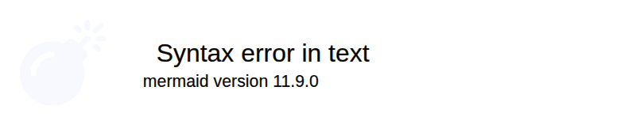

[View Source](https://github.com/Vineet-Sharma-Medium-Stories/Medium-Assets/blob/main/architecting-resilient-systems-20-essential-concepts-through-a-net-lens---part-3/diagram_01_modular-monolith-architecture-diagram-cc73.md)


---

## Concept 12: Event-Driven Architecture — Triggers Actions Based on Events for Decoupled System Communication


Event-driven architecture enables reactive systems where components communicate through events rather than direct calls. This creates loose coupling, better scalability, and natural alignment with domain-driven design.

### Deep Dive into Event-Driven Architecture

**Event Types:**

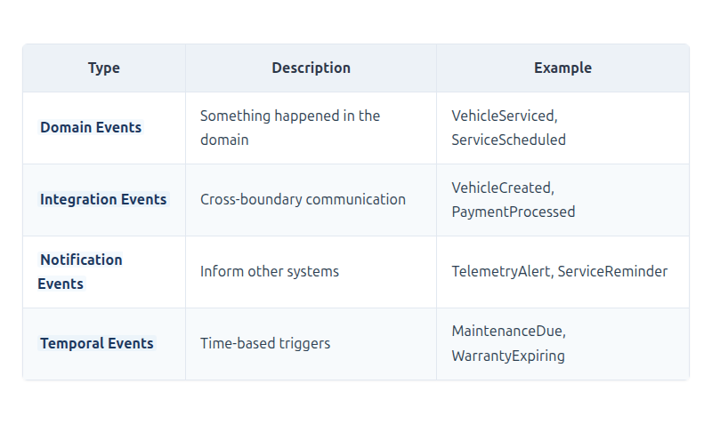

[View Source](https://github.com/Vineet-Sharma-Medium-Stories/Medium-Assets/blob/main/architecting-resilient-systems-20-essential-concepts-through-a-net-lens---part-3/table_02_event-types.md)


**Event Processing Patterns:**

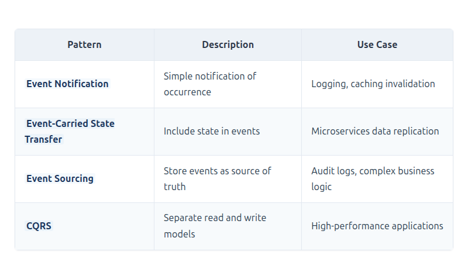

[View Source](https://github.com/Vineet-Sharma-Medium-Stories/Medium-Assets/blob/main/architecting-resilient-systems-20-essential-concepts-through-a-net-lens---part-3/table_03_event-processing-patterns.md)


### Vehixcare Event-Driven Architecture Implementation

```csharp
// 1. Event sourcing aggregate root
public abstract class AggregateRoot
{
    private readonly List<IDomainEvent> _events = new();
    public IReadOnlyCollection<IDomainEvent> Events => _events.AsReadOnly();
    
    protected void AddEvent(IDomainEvent @event)
    {
        _events.Add(@event);
    }
    
    public void ClearEvents()
    {
        _events.Clear();
    }
}

// 2. Vehicle aggregate with event sourcing
public class VehicleAggregate : AggregateRoot
{
    public string Id { get; private set; }
    public string Vin { get; private set; }
    public string Make { get; private set; }
    public string Model { get; private set; }
    public int Year { get; private set; }
    public string Color { get; private set; }
    public int Odometer { get; private set; }
    public VehicleStatus Status { get; private set; }
    public List<ServiceRecord> ServiceHistory { get; private set; }
    public List<DiagnosticCode> ActiveDiagnostics { get; private set; }
    public DateTime LastServicedAt { get; private set; }
    public DateTime CreatedAt { get; private set; }
    public string CreatedBy { get; private set; }
    public DateTime? UpdatedAt { get; private set; }
    public string UpdatedBy { get; private set; }
    
    private VehicleAggregate() { } // For serialization
    
    public static VehicleAggregate Create(string vin, string make, string model, int year, string createdBy)
    {
        var vehicle = new VehicleAggregate
        {
            Id = Guid.NewGuid().ToString(),
            Vin = vin,
            Make = make,
            Model = model,
            Year = year,
            Status = VehicleStatus.Active,
            ServiceHistory = new List<ServiceRecord>(),
            ActiveDiagnostics = new List<DiagnosticCode>(),
            CreatedAt = DateTime.UtcNow,
            CreatedBy = createdBy
        };
        
        vehicle.AddEvent(new VehicleCreatedEvent
        {
            VehicleId = vehicle.Id,
            Vin = vin,
            Make = make,
            Model = model,
            Year = year,
            CreatedBy = createdBy
        });
        
        return vehicle;
    }
    
    public void UpdateDetails(string make, string model, int year, string color, string updatedBy)
    {
        var changes = new Dictionary<string, object>();
        
        if (make != Make)
        {
            changes["Make"] = make;
            Make = make;
        }
        
        if (model != Model)
        {
            changes["Model"] = model;
            Model = model;
        }
        
        if (year != Year)
        {
            changes["Year"] = year;
            Year = year;
        }
        
        if (color != Color)
        {
            changes["Color"] = color;
            Color = color;
        }
        
        if (changes.Any())
        {
            UpdatedAt = DateTime.UtcNow;
            UpdatedBy = updatedBy;
            
            AddEvent(new VehicleUpdatedEvent
            {
                VehicleId = Id,
                Changes = changes,
                UpdatedBy = updatedBy
            });
        }
    }
    
    public void RecordService(string serviceType, decimal cost, int odometer, string technicianId)
    {
        // Business rule: Odometer must be greater than previous
        if (odometer <= Odometer)
            throw new DomainException("Odometer reading must be greater than previous reading");
        
        var service = new ServiceRecord
        {
            Id = Guid.NewGuid().ToString(),
            ServiceType = serviceType,
            ServiceDate = DateTime.UtcNow,
            Cost = cost,
            Odometer = odometer,
            TechnicianId = technicianId
        };
        
        ServiceHistory.Add(service);
        Odometer = odometer;
        LastServicedAt = DateTime.UtcNow;
        
        AddEvent(new VehicleServicedEvent
        {
            VehicleId = Id,
            ServiceId = service.Id,
            ServiceType = serviceType,
            ServiceDate = service.ServiceDate,
            Cost = cost,
            Odometer = odometer,
            TechnicianId = technicianId
        });
        
        // Check if maintenance is due
        if (ShouldScheduleMaintenance(odometer))
        {
            AddEvent(new MaintenanceDueEvent
            {
                VehicleId = Id,
                CurrentOdometer = odometer,
                NextServiceOdometer = odometer + 5000,
                DueDate = DateTime.UtcNow.AddMonths(3)
            });
        }
    }
    
    public void AddDiagnosticCode(DiagnosticCode code)
    {
        if (!ActiveDiagnostics.Any(c => c.Code == code.Code))
        {
            ActiveDiagnostics.Add(code);
            
            AddEvent(new DiagnosticCodeAddedEvent
            {
                VehicleId = Id,
                Code = code.Code,
                Description = code.Description,
                Severity = code.Severity
            });
        }
    }
    
    public void ClearDiagnosticCode(string code)
    {
        var diagnostic = ActiveDiagnostics.FirstOrDefault(c => c.Code == code);
        if (diagnostic != null)
        {
            ActiveDiagnostics.Remove(diagnostic);
            
            AddEvent(new DiagnosticCodeClearedEvent
            {
                VehicleId = Id,
                Code = code
            });
        }
    }
    
    private bool ShouldScheduleMaintenance(int odometer)
    {
        // Rule: Schedule maintenance every 5000 miles
        return odometer % 5000 < 100;
    }
}

```
**Event store for persistence**
```csharp
// 3. Event store for persistence
public interface IEventStore
{
    Task SaveEventsAsync(string aggregateId, IEnumerable<IDomainEvent> events, int expectedVersion, CancellationToken ct);
    Task<IEnumerable<IDomainEvent>> GetEventsAsync(string aggregateId, CancellationToken ct);
}

public class MongoEventStore : IEventStore
{
    private readonly IMongoCollection<EventDocument> _events;
    private readonly ILogger<MongoEventStore> _logger;
    
    public MongoEventStore(IMongoDatabase database, ILogger<MongoEventStore> logger)
    {
        _events = database.GetCollection<EventDocument>("event_store");
        _logger = logger;
        
        // Create indexes
        _events.Indexes.CreateOne(new CreateIndexModel<EventDocument>(
            Builders<EventDocument>.IndexKeys.Ascending(e => e.AggregateId)
                .Ascending(e => e.Version),
            new CreateIndexOptions { Unique = true }));
    }
    
    public async Task SaveEventsAsync(
        string aggregateId, 
        IEnumerable<IDomainEvent> events, 
        int expectedVersion, 
        CancellationToken ct)
    {
        var eventList = events.ToList();
        
        if (!eventList.Any())
            return;
            
        var documents = new List<EventDocument>();
        var version = expectedVersion;
        
        foreach (var @event in eventList)
        {
            version++;
            documents.Add(new EventDocument
            {
                Id = Guid.NewGuid(),
                AggregateId = aggregateId,
                Version = version,
                EventType = @event.EventType,
                EventData = BsonDocument.Parse(JsonSerializer.Serialize(@event)),
                OccurredAt = @event.OccurredAt,
                CorrelationId = Activity.Current?.RootId ?? Guid.NewGuid().ToString()
            });
        }
        
        try
        {
            await _events.InsertManyAsync(documents, cancellationToken: ct);
            _logger.LogDebug("Saved {Count} events for aggregate {AggregateId} at version {Version}", 
                documents.Count, aggregateId, version);
        }
        catch (MongoBulkWriteException ex) when (ex.WriteErrors.Any(e => e.Code == 11000))
        {
            throw new ConcurrencyException($"Concurrency conflict on aggregate {aggregateId}", ex);
        }
    }
    
    public async Task<IEnumerable<IDomainEvent>> GetEventsAsync(string aggregateId, CancellationToken ct)
    {
        var filter = Builders<EventDocument>.Filter.Eq(e => e.AggregateId, aggregateId);
        var documents = await _events.Find(filter).SortBy(e => e.Version).ToListAsync(ct);
        
        var events = new List<IDomainEvent>();
        
        foreach (var doc in documents)
        {
            var eventType = Type.GetType(doc.EventType);
            if (eventType != null)
            {
                var @event = JsonSerializer.Deserialize(doc.EventData.ToJson(), eventType) as IDomainEvent;
                if (@event != null)
                    events.Add(@event);
            }
        }
        
        return events;
    }
}

```
**Repository using event sourcing**
```csharp

// 4. Repository using event sourcing
public class VehicleEventSourcedRepository : IVehicleRepository
{
    private readonly IEventStore _eventStore;
    private readonly IEventBus _eventBus;
    private readonly ILogger<VehicleEventSourcedRepository> _logger;
    
    public VehicleEventSourcedRepository(
        IEventStore eventStore,
        IEventBus eventBus,
        ILogger<VehicleEventSourcedRepository> logger)
    {
        _eventStore = eventStore;
        _eventBus = eventBus;
        _logger = logger;
    }
    
    public async Task<VehicleAggregate> GetByIdAsync(string id, CancellationToken ct)
    {
        var events = await _eventStore.GetEventsAsync(id, ct);
        
        if (!events.Any())
            return null;
            
        var vehicle = new VehicleAggregate();
        
        // Rehydrate aggregate from events
        foreach (var @event in events)
        {
            ApplyEvent(vehicle, @event);
        }
        
        vehicle.ClearEvents(); // Events already applied
        
        return vehicle;
    }
    
    public async Task SaveAsync(VehicleAggregate vehicle, CancellationToken ct)
    {
        var events = vehicle.Events.ToList();
        
        if (!events.Any())
            return;
            
        var expectedVersion = vehicle.Version - events.Count;
        
        await _eventStore.SaveEventsAsync(vehicle.Id, events, expectedVersion, ct);
        
        // Publish events to event bus
        foreach (var @event in events)
        {
            await _eventBus.PublishAsync(@event, ct);
        }
        
        vehicle.ClearEvents();
        
        _logger.LogInformation("Saved aggregate {AggregateId} with {EventCount} events", 
            vehicle.Id, events.Count);
    }
    
    private void ApplyEvent(VehicleAggregate vehicle, IDomainEvent @event)
    {
        switch (@event)
        {
            case VehicleCreatedEvent e:
                // Apply creation logic
                break;
            case VehicleUpdatedEvent e:
                // Apply update logic
                break;
            case VehicleServicedEvent e:
                // Apply service logic
                break;
            // ... handle other event types
        }
    }
}

```
**Event handlers for cross-module communication**
```csharp

// 5. Event handlers for cross-module communication
public class VehicleServicedHandler : INotificationHandler<VehicleServicedEvent>
{
    private readonly IEventBus _eventBus;
    private readonly IServiceScheduler _scheduler;
    private readonly INotificationService _notificationService;
    private readonly IAnalyticsService _analytics;
    private readonly ILogger<VehicleServicedHandler> _logger;
    
    public VehicleServicedHandler(
        IEventBus eventBus,
        IServiceScheduler scheduler,
        INotificationService notificationService,
        IAnalyticsService analytics,
        ILogger<VehicleServicedHandler> logger)
    {
        _eventBus = eventBus;
        _scheduler = scheduler;
        _notificationService = notificationService;
        _analytics = analytics;
        _logger = logger;
    }
    
    public async Task Handle(VehicleServicedEvent notification, CancellationToken ct)
    {
        using var activity = Diagnostics.ActivitySource.StartActivity("HandleVehicleServiced");
        activity?.SetTag("vehicle.id", notification.VehicleId);
        activity?.SetTag("service.id", notification.ServiceId);
        
        _logger.LogInformation("Processing vehicle service event for {VehicleId}", notification.VehicleId);
        
        // Run handlers in parallel for better performance
        await Task.WhenAll(
            UpdateServiceHistoryAsync(notification, ct),
            ScheduleNextMaintenanceAsync(notification, ct),
            SendNotificationsAsync(notification, ct),
            UpdatePredictiveModelsAsync(notification, ct),
            GenerateInvoiceAsync(notification, ct),
            UpdateWarrantyStatusAsync(notification, ct),
            UpdateAnalyticsAsync(notification, ct)
        );
    }
    
    private async Task UpdateServiceHistoryAsync(VehicleServicedEvent notification, CancellationToken ct)
    {
        // Update service history projection
        _logger.LogDebug("Updating service history for {VehicleId}", notification.VehicleId);
        await _scheduler.UpdateServiceHistoryAsync(notification, ct);
    }
    
    private async Task ScheduleNextMaintenanceAsync(VehicleServicedEvent notification, CancellationToken ct)
    {
        // Calculate next maintenance schedule based on service type
        var nextMaintenance = notification.ServiceType switch
        {
            "Oil Change" => new { Odometer = notification.Odometer + 5000, Months = 6 },
            "Tire Rotation" => new { Odometer = notification.Odometer + 10000, Months = 12 },
            "Brake Service" => new { Odometer = notification.Odometer + 20000, Months = 24 },
            "Major Service" => new { Odometer = notification.Odometer + 30000, Months = 36 },
            _ => new { Odometer = notification.Odometer + 5000, Months = 6 }
        };
        
        var dueDate = DateTime.UtcNow.AddMonths(nextMaintenance.Months);
        
        // Publish maintenance scheduled event
        await _eventBus.PublishAsync(new MaintenanceScheduledEvent
        {
            VehicleId = notification.VehicleId,
            ServiceType = notification.ServiceType,
            NextServiceOdometer = nextMaintenance.Odometer,
            DueDate = dueDate
        }, ct);
        
        _logger.LogDebug("Scheduled next maintenance for {VehicleId} at {Odometer} miles", 
            notification.VehicleId, nextMaintenance.Odometer);
    }
    
    private async Task SendNotificationsAsync(VehicleServicedEvent notification, CancellationToken ct)
    {
        // Send service confirmation email
        await _notificationService.SendEmailAsync(new EmailMessage
        {
            To = await GetCustomerEmailAsync(notification.VehicleId, ct),
            Subject = "Service Completed",
            Template = "ServiceConfirmation",
            Data = new
            {
                VehicleId = notification.VehicleId,
                ServiceType = notification.ServiceType,
                ServiceDate = notification.ServiceDate,
                Cost = notification.Cost,
                Odometer = notification.Odometer
            }
        }, ct);
        
        // Send SMS for critical updates
        if (notification.Cost > 500)
        {
            await _notificationService.SendSmsAsync(new SmsMessage
            {
                To = await GetCustomerPhoneAsync(notification.VehicleId, ct),
                Message = $"Your vehicle service (${notification.Cost}) has been completed. Thank you!"
            }, ct);
        }
        
        // Send push notification
        await _notificationService.SendPushNotificationAsync(new PushMessage
        {
            UserId = await GetCustomerIdAsync(notification.VehicleId, ct),
            Title = "Service Completed",
            Body = $"Your {notification.ServiceType} service has been completed successfully."
        }, ct);
    }
    
    private async Task UpdatePredictiveModelsAsync(VehicleServicedEvent notification, CancellationToken ct)
    {
        // Update ML models for predictive maintenance
        var telemetry = await GetTelemetryDataAsync(notification.VehicleId, notification.ServiceDate, ct);
        
        await _analytics.TrainPredictiveModelAsync(new TrainingData
        {
            VehicleId = notification.VehicleId,
            ServiceType = notification.ServiceType,
            ServiceDate = notification.ServiceDate,
            Odometer = notification.Odometer,
            TelemetryData = telemetry,
            Cost = notification.Cost
        }, ct);
        
        _logger.LogDebug("Updated predictive models with service data for {VehicleId}", notification.VehicleId);
    }
    
    private async Task GenerateInvoiceAsync(VehicleServicedEvent notification, CancellationToken ct)
    {
        // Generate and send invoice
        var invoice = new Invoice
        {
            Id = Guid.NewGuid().ToString(),
            VehicleId = notification.VehicleId,
            ServiceId = notification.ServiceId,
            Amount = notification.Cost,
            Date = notification.ServiceDate,
            DueDate = notification.ServiceDate.AddDays(15),
            Items = await GetServiceItemsAsync(notification.ServiceId, ct)
        };
        
        await _eventBus.PublishAsync(new InvoiceGeneratedEvent
        {
            VehicleId = notification.VehicleId,
            InvoiceId = invoice.Id,
            Amount = notification.Cost,
            DueDate = invoice.DueDate
        }, ct);
        
        _logger.LogDebug("Generated invoice {InvoiceId} for {VehicleId}", invoice.Id, notification.VehicleId);
    }
    
    private async Task UpdateWarrantyStatusAsync(VehicleServicedEvent notification, CancellationToken ct)
    {
        // Check if service is covered under warranty
        var warranty = await GetWarrantyInfoAsync(notification.VehicleId, ct);
        
        if (warranty?.IsActive == true && notification.Odometer <= warranty.OdometerLimit)
        {
            await _eventBus.PublishAsync(new WarrantyClaimEvent
            {
                VehicleId = notification.VehicleId,
                ServiceId = notification.ServiceId,
                ServiceType = notification.ServiceType,
                Cost = notification.Cost,
                IsCovered = true
            }, ct);
        }
    }
    
    private async Task UpdateAnalyticsAsync(VehicleServicedEvent notification, CancellationToken ct)
    {
        // Update analytics for service metrics
        await _analytics.RecordServiceMetricsAsync(new ServiceMetrics
        {
            VehicleId = notification.VehicleId,
            ServiceType = notification.ServiceType,
            Cost = notification.Cost,
            Date = notification.ServiceDate,
            Odometer = notification.Odometer,
            DaysSinceLastService = await GetDaysSinceLastServiceAsync(notification.VehicleId, ct)
        }, ct);
    }
    
    // Helper methods
    private async Task<string> GetCustomerEmailAsync(string vehicleId, CancellationToken ct) => "customer@example.com";
    private async Task<string> GetCustomerPhoneAsync(string vehicleId, CancellationToken ct) => "+1234567890";
    private async Task<string> GetCustomerIdAsync(string vehicleId, CancellationToken ct) => "customer123";
    private async Task<TelemetryData> GetTelemetryDataAsync(string vehicleId, DateTime date, CancellationToken ct) => new();
    private async Task<List<InvoiceItem>> GetServiceItemsAsync(string serviceId, CancellationToken ct) => new();
    private async Task<WarrantyInfo> GetWarrantyInfoAsync(string vehicleId, CancellationToken ct) => new();
    private async Task<int> GetDaysSinceLastServiceAsync(string vehicleId, CancellationToken ct) => 30;
}


```
**Projection for read models (CQRS)**
```csharp
// 6. Projection for read models (CQRS)
public class VehicleServiceHistoryProjection
{
    private readonly IMongoCollection<ServiceHistoryReadModel> _collection;
    private readonly ILogger<VehicleServiceHistoryProjection> _logger;
    
    public VehicleServiceHistoryProjection(IMongoDatabase database, ILogger<VehicleServiceHistoryProjection> logger)
    {
        _collection = database.GetCollection<ServiceHistoryReadModel>("service_history_read_model");
        _logger = logger;
    }
    
    public async Task HandleAsync(VehicleServicedEvent @event, CancellationToken ct)
    {
        var readModel = new ServiceHistoryReadModel
        {
            VehicleId = @event.VehicleId,
            ServiceId = @event.ServiceId,
            ServiceType = @event.ServiceType,
            ServiceDate = @event.ServiceDate,
            Cost = @event.Cost,
            Odometer = @event.Odometer,
            TechnicianId = @event.TechnicianId,
            CreatedAt = DateTime.UtcNow
        };
        
        await _collection.InsertOneAsync(readModel, cancellationToken: ct);
        
        _logger.LogDebug("Updated service history projection for {VehicleId}", @event.VehicleId);
    }
}
```

### Event-Driven Architecture Diagram

```mermaid
```

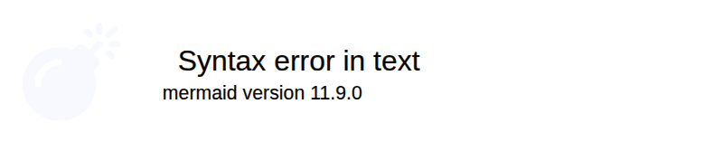

[View Source](https://github.com/Vineet-Sharma-Medium-Stories/Medium-Assets/blob/main/architecting-resilient-systems-20-essential-concepts-through-a-net-lens---part-3/diagram_02_event-driven-architecture-diagram-e9e5.md)


---

## Concept 13: CAP Theorem — Tradeoff Between Consistency, Availability, and Partition Tolerance


The CAP theorem states that in a distributed system, you can only guarantee two of three properties: Consistency, Availability, and Partition Tolerance. Understanding these tradeoffs is crucial for designing resilient systems.

### Deep Dive into CAP Theorem

**The Three Properties:**

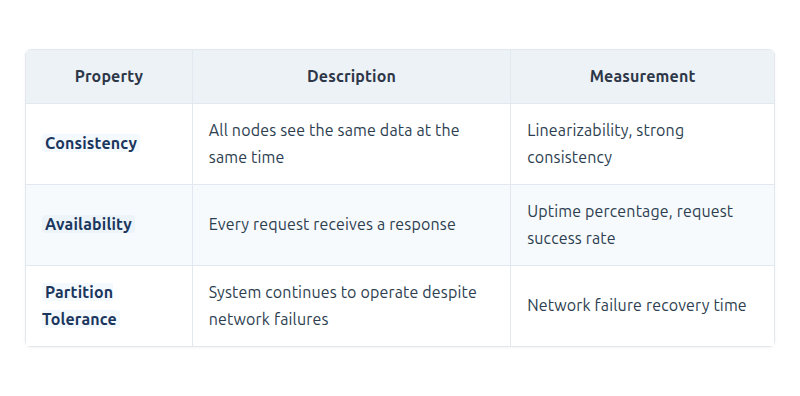

[View Source](https://github.com/Vineet-Sharma-Medium-Stories/Medium-Assets/blob/main/architecting-resilient-systems-20-essential-concepts-through-a-net-lens---part-3/table_04_the-three-properties.md)


**System Classifications:**

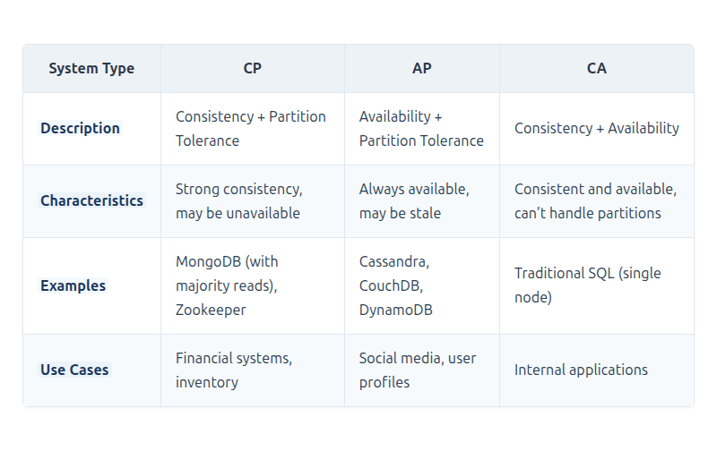

[View Source](https://github.com/Vineet-Sharma-Medium-Stories/Medium-Assets/blob/main/architecting-resilient-systems-20-essential-concepts-through-a-net-lens---part-3/table_05_system-classifications.md)


### Vehixcare CAP Implementation

```csharp
// 1. CP System (Consistency + Partition Tolerance) - Payment Processing
public class PaymentProcessingSystem
{
    private readonly IMongoCollection<Payment> _payments;
    private readonly ILogger<PaymentProcessingSystem> _logger;
    
    public PaymentProcessingSystem(IMongoDatabase database, ILogger<PaymentProcessingSystem> logger)
    {
        // Configure for strong consistency
        var settings = new MongoCollectionSettings
        {
            ReadConcern = ReadConcern.Majority,
            WriteConcern = WriteConcern.WMajority
        };
        
        _payments = database.GetCollection<Payment>("payments", settings);
        _logger = logger;
    }
    
    public async Task<PaymentResult> ProcessPaymentAsync(PaymentRequest request, CancellationToken ct)
    {
        // Use distributed transaction for consistency
        using var session = await _payments.Database.Client.StartSessionAsync(cancellationToken: ct);
        
        try
        {
            session.StartTransaction();
            
            // Check for duplicate transaction (idempotency)
            var existing = await _payments.Find(session, 
                Builders<Payment>.Filter.Eq(p => p.TransactionId, request.TransactionId))
                .FirstOrDefaultAsync(ct);
                
            if (existing != null)
            {
                _logger.LogWarning("Duplicate transaction detected: {TransactionId}", request.TransactionId);
                return PaymentResult.Success(existing.Id);
            }
            
            // Create payment record
            var payment = new Payment
            {
                Id = Guid.NewGuid().ToString(),
                TransactionId = request.TransactionId,
                Amount = request.Amount,
                Currency = request.Currency,
                Status = PaymentStatus.Processing,
                CreatedAt = DateTime.UtcNow
            };
            
            await _payments.InsertOneAsync(session, payment, cancellationToken: ct);
            
            // Process with payment gateway
            var gatewayResult = await ProcessWithPaymentGatewayAsync(request, ct);
            
            if (gatewayResult.Success)
            {
                payment.Status = PaymentStatus.Completed;
                payment.CompletedAt = DateTime.UtcNow;
                payment.GatewayReference = gatewayResult.Reference;
            }
            else
            {
                payment.Status = PaymentStatus.Failed;
                payment.FailedAt = DateTime.UtcNow;
                payment.FailureReason = gatewayResult.ErrorMessage;
            }
            
            await _payments.ReplaceOneAsync(session, 
                Builders<Payment>.Filter.Eq(p => p.Id, payment.Id), 
                payment, 
                cancellationToken: ct);
                
            await session.CommitTransactionAsync(ct);
            
            return gatewayResult.Success 
                ? PaymentResult.Success(payment.Id)
                : PaymentResult.Failed(payment.Id, gatewayResult.ErrorMessage);
        }
        catch (Exception ex)
        {
            _logger.LogError(ex, "Payment processing failed for transaction {TransactionId}", request.TransactionId);
            
            try
            {
                await session.AbortTransactionAsync(ct);
            }
            catch { /* Log abort failure */ }
            
            throw;
        }
    }
    
    // Strong consistency read - always read from primary with quorum
    public async Task<Payment> GetPaymentAsync(string paymentId, CancellationToken ct)
    {
        var options = new FindOptions
        {
            // Use linearizable read concern for strong consistency
            ReadConcern = ReadConcern.Linearizable
        };
        
        var payment = await _payments.Find(
            Builders<Payment>.Filter.Eq(p => p.Id, paymentId),
            options).FirstOrDefaultAsync(ct);
            
        if (payment == null)
            throw new PaymentNotFoundException(paymentId);
            
        return payment;
    }
}

```
**AP System (Availability + Partition Tolerance) - Vehicle Location Tracking**
```csharp
// 2. AP System (Availability + Partition Tolerance) - Vehicle Location Tracking
public class VehicleLocationSystem
{
    private readonly IMongoCollection<VehicleLocation> _locations;
    private readonly IMemoryCache _cache;
    private readonly ILogger<VehicleLocationSystem> _logger;
    
    public VehicleLocationSystem(IMongoDatabase database, IMemoryCache cache, ILogger<VehicleLocationSystem> logger)
    {
        // Configure for high availability
        var settings = new MongoCollectionSettings
        {
            ReadConcern = ReadConcern.Local,     // Don't wait for majority
            WriteConcern = WriteConcern.W1,      // Only wait for primary acknowledgment
            ReadPreference = ReadPreference.Nearest  // Read from closest replica
        };
        
        _locations = database.GetCollection<VehicleLocation>("vehicle_locations", settings);
        _cache = cache;
        _logger = logger;
    }
    
    public async Task UpdateLocationAsync(VehicleLocation location, CancellationToken ct)
    {
        // AP system - write with minimal consistency
        try
        {
            // Write with WriteConcern.W1 for faster response
            var filter = Builders<VehicleLocation>.Filter.Eq(l => l.VehicleId, location.VehicleId);
            var update = Builders<VehicleLocation>.Update
                .Set(l => l.Latitude, location.Latitude)
                .Set(l => l.Longitude, location.Longitude)
                .Set(l => l.UpdatedAt, DateTime.UtcNow)
                .Set(l => l.Speed, location.Speed)
                .Set(l => l.Heading, location.Heading);
                
            var options = new UpdateOptions
            {
                IsUpsert = true,
                WriteConcern = WriteConcern.W1  // Only wait for primary
            };
            
            await _locations.UpdateOneAsync(filter, update, options, ct);
            
            // Update cache for fast reads (eventual consistency)
            _cache.Set($"location:{location.VehicleId}", location, TimeSpan.FromSeconds(30));
            
            _logger.LogDebug("Updated location for vehicle {VehicleId}", location.VehicleId);
        }
        catch (PartitionException ex)
        {
            // Network partition detected - store locally and retry
            _logger.LogWarning(ex, "Network partition detected for vehicle {VehicleId}, storing locally", 
                location.VehicleId);
                
            await StoreForRetryAsync(location, ct);
        }
    }
    
    public async Task<VehicleLocation> GetLatestLocationAsync(string vehicleId, CancellationToken ct)
    {
        // AP system - may return stale data but always available
        
        // Check cache first (fastest, might be stale)
        if (_cache.TryGetValue($"location:{vehicleId}", out VehicleLocation cached))
        {
            _logger.LogDebug("Returning cached location for {VehicleId}", vehicleId);
            return cached;
        }
        
        try
        {
            // Try to read from any available replica
            var options = new FindOptions
            {
                ReadPreference = ReadPreference.Nearest,  // Lowest latency
                Limit = 1,
                Sort = Builders<VehicleLocation>.Sort.Descending(l => l.UpdatedAt)
            };
            
            var location = await _locations.Find(
                Builders<VehicleLocation>.Filter.Eq(l => l.VehicleId, vehicleId),
                options).FirstOrDefaultAsync(ct);
                
            if (location != null)
            {
                // Update cache for next read
                _cache.Set($"location:{vehicleId}", location, TimeSpan.FromSeconds(30));
            }
            
            return location;
        }
        catch (MongoConnectionException ex)
        {
            // Database unavailable - return last known location from cache
            _logger.LogWarning(ex, "Database unavailable for {VehicleId}, using cached location", vehicleId);
            
            if (_cache.TryGetValue($"location:{vehicleId}", out VehicleLocation cachedLocation))
            {
                return cachedLocation;
            }
            
            // No data available - return null instead of failing
            _logger.LogWarning("No location data available for {VehicleId}", vehicleId);
            return null;
        }
    }
    
    private async Task StoreForRetryAsync(VehicleLocation location, CancellationToken ct)
    {
        // Store in local queue for later sync
        var queuePath = Path.Combine(Path.GetTempPath(), "vehixcare_location_queue");
        Directory.CreateDirectory(queuePath);
        
        var fileName = $"location_{location.VehicleId}_{DateTime.UtcNow:yyyyMMddHHmmss}.json";
        var filePath = Path.Combine(queuePath, fileName);
        
        var json = JsonSerializer.Serialize(location);
        await File.WriteAllTextAsync(filePath, json, ct);
        
        _logger.LogInformation("Stored location for {VehicleId} to retry queue", location.VehicleId);
    }
}

```
**Configurable Consistency - Choose at runtime**
```csharp
// 3. Configurable Consistency - Choose at runtime
public class ConfigurableConsistencyService
{
    private readonly IMongoDatabase _database;
    private readonly ILogger<ConfigurableConsistencyService> _logger;
    
    public ConfigurableConsistencyService(IMongoDatabase database, ILogger<ConfigurableConsistencyService> logger)
    {
        _database = database;
        _logger = logger;
    }
    
    public IMongoCollection<T> GetCollection<T>(
        string collectionName,
        ConsistencyRequirement requirement)
    {
        var settings = requirement switch
        {
            ConsistencyRequirement.Strong => new MongoCollectionSettings
            {
                ReadConcern = ReadConcern.Majority,
                WriteConcern = WriteConcern.WMajority,
                ReadPreference = ReadPreference.Primary
            },
            ConsistencyRequirement.Eventual => new MongoCollectionSettings
            {
                ReadConcern = ReadConcern.Local,
                WriteConcern = WriteConcern.W1,
                ReadPreference = ReadPreference.SecondaryPreferred
            },
            ConsistencyRequirement.Session => new MongoCollectionSettings
            {
                ReadConcern = ReadConcern.Majority,
                WriteConcern = WriteConcern.WMajority,
                ReadPreference = ReadPreference.PrimaryPreferred
            },
            _ => new MongoCollectionSettings()
        };
        
        return _database.GetCollection<T>(collectionName, settings);
    }
    
    public async Task<T> ExecuteWithConsistencyAsync<T>(
        string operationType,
        Func<IMongoCollection<T>, Task<T>> operation,
        CancellationToken ct)
    {
        var requirement = operationType switch
        {
            "payment" or "transaction" => ConsistencyRequirement.Strong,
            "dashboard" or "telemetry" => ConsistencyRequirement.Eventual,
            "booking" => ConsistencyRequirement.Session,
            _ => ConsistencyRequirement.Eventual
        };
        
        var collection = GetCollection<T>("vehicles", requirement);
        
        _logger.LogDebug("Executing {OperationType} with {Requirement} consistency", 
            operationType, requirement);
            
        return await operation(collection);
    }
}

public enum ConsistencyRequirement
{
    Strong,     // CP: Consistent, may be unavailable during partitions
    Eventual,   // AP: Always available, may be stale
    Session     // Client-centric consistency
}

```
**CAP-aware query execution**
```csharp
// 4. CAP-aware query execution
public class CapAwareQueryExecutor
{
    private readonly IMongoDatabase _database;
    private readonly ILogger<CapAwareQueryExecutor> _logger;
    
    public async Task<T> QueryWithTimeoutAsync<T>(
        Func<Task<T>> query,
        int timeoutSeconds = 5,
        CancellationToken ct = default)
    {
        try
        {
            // Set query timeout
            using var timeoutCts = CancellationTokenSource.CreateLinkedTokenSource(ct);
            timeoutCts.CancelAfter(TimeSpan.FromSeconds(timeoutSeconds));
            
            return await query();
        }
        catch (OperationCanceledException)
        {
            _logger.LogWarning("Query timed out after {TimeoutSeconds}s", timeoutSeconds);
            
            // In AP systems, return stale data instead of failing
            throw new QueryTimeoutException("Query exceeded timeout threshold");
        }
    }
    
    public async Task<T> QueryWithFallbackAsync<T>(
        Func<Task<T>> primaryQuery,
        Func<Task<T>> fallbackQuery,
        CancellationToken ct)
    {
        try
        {
            return await primaryQuery();
        }
        catch (Exception ex) when (IsPartitionException(ex))
        {
            _logger.LogWarning(ex, "Primary query failed, using fallback");
            return await fallbackQuery();
        }
    }
    
    private bool IsPartitionException(Exception ex)
    {
        return ex is MongoConnectionException ||
               ex is MongoTimeoutException ||
               ex is MongoNotPrimaryException;
    }
}
```

### CAP Theorem Architecture Diagram

```mermaid
```

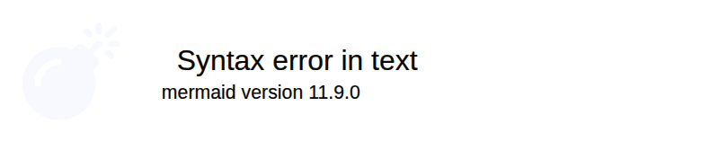

[View Source](https://github.com/Vineet-Sharma-Medium-Stories/Medium-Assets/blob/main/architecting-resilient-systems-20-essential-concepts-through-a-net-lens---part-3/diagram_03_cap-theorem-architecture-diagram-eed9.md)


---

## Concept 14: Distributed Systems — Multiple Nodes Working Together as a Single System


Distributed systems coordinate multiple independent nodes to present a unified system. Vehixcare implements distributed coordination patterns including leader election, distributed locks, and consensus algorithms.

### Deep Dive into Distributed Systems

**Key Challenges:**
- **Network Latency**: Communication between nodes takes time
- **Partial Failures**: Some nodes may fail while others continue
- **Clock Skew**: Different nodes have different system times
- **Consensus**: Getting nodes to agree on a value
- **Distributed Transactions**: Maintaining consistency across nodes

**Distributed System Patterns:**

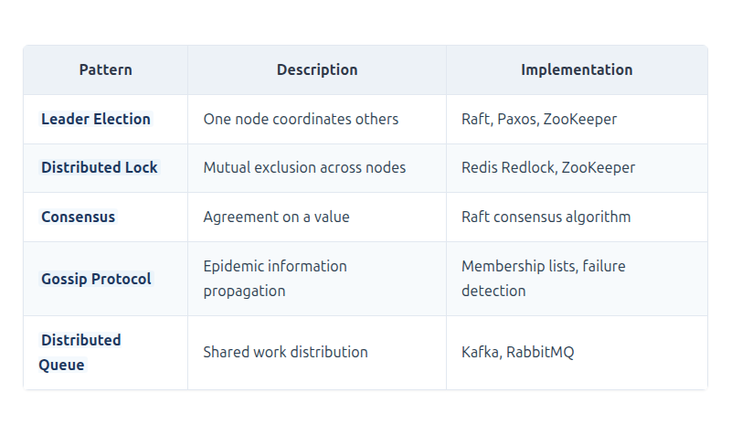

[View Source](https://github.com/Vineet-Sharma-Medium-Stories/Medium-Assets/blob/main/architecting-resilient-systems-20-essential-concepts-through-a-net-lens---part-3/table_06_distributed-system-patterns.md)


### Vehixcare Distributed Systems Implementation

```csharp
// 1. Distributed lock for critical operations
public class DistributedLock : IDistributedLock
{
    private readonly IDatabase _redisDb;
    private readonly ILogger<DistributedLock> _logger;
    private readonly string _lockKey;
    private readonly string _lockValue;
    private readonly TimeSpan _expiry;
    
    public DistributedLock(
        IConnectionMultiplexer redis,
        string resourceId,
        TimeSpan expiry,
        ILogger<DistributedLock> logger)
    {
        _redisDb = redis.GetDatabase();
        _logger = logger;
        _lockKey = $"lock:{resourceId}";
        _lockValue = Guid.NewGuid().ToString();
        _expiry = expiry;
    }
    
    public async Task<bool> AcquireAsync(CancellationToken ct = default)
    {
        try
        {
            var acquired = await _redisDb.StringSetAsync(
                _lockKey, 
                _lockValue, 
                _expiry, 
                When.NotExists);
                
            if (acquired)
            {
                _logger.LogDebug("Acquired lock for {LockKey}", _lockKey);
            }
            
            return acquired;
        }
        catch (Exception ex)
        {
            _logger.LogError(ex, "Failed to acquire lock for {LockKey}", _lockKey);
            return false;
        }
    }
    
    public async Task<bool> ReleaseAsync()
    {
        // Lua script to ensure we only release if we own the lock
        var luaScript = @"
            if redis.call('get', KEYS[1]) == ARGV[1] then
                return redis.call('del', KEYS[1])
            else
                return 0
            end";
            
        var result = await _redisDb.ScriptEvaluateAsync(
            luaScript,
            new RedisKey[] { _lockKey },
            new RedisValue[] { _lockValue });
            
        var released = (long)result == 1;
        
        if (released)
        {
            _logger.LogDebug("Released lock for {LockKey}", _lockKey);
        }
        
        return released;
    }
    
    public async Task<T> ExecuteWithLockAsync<T>(
        Func<CancellationToken, Task<T>> action,
        CancellationToken ct = default)
    {
        if (!await AcquireAsync(ct))
            throw new LockAcquisitionException($"Could not acquire lock for {_lockKey}");
            
        try
        {
            return await action(ct);
        }
        finally
        {
            await ReleaseAsync();
        }
    }
}
```
**Leader election using Redis**
```csharp
// 2. Leader election using Redis
public class LeaderElectionService : BackgroundService
{
    private readonly IConnectionMultiplexer _redis;
    private readonly IDatabase _redisDb;
    private readonly ILogger<LeaderElectionService> _logger;
    private readonly string _serviceName;
    private readonly string _nodeId;
    private readonly TimeSpan _ttl;
    
    private bool _isLeader;
    private Timer _renewalTimer;
    
    public LeaderElectionService(
        IConnectionMultiplexer redis,
        IConfiguration config,
        ILogger<LeaderElectionService> logger)
    {
        _redis = redis;
        _redisDb = redis.GetDatabase();
        _logger = logger;
        _serviceName = config["Service:Name"];
        _nodeId = $"{Environment.MachineName}_{Guid.NewGuid():N}";
        _ttl = TimeSpan.FromSeconds(30);
        
        _isLeader = false;
    }
    
    public bool IsLeader => _isLeader;
    
    public event EventHandler<bool> LeadershipChanged;
    
    protected override async Task ExecuteAsync(CancellationToken stoppingToken)
    {
        _logger.LogInformation("Starting leader election for {ServiceName}", _serviceName);
        
        // Try to become leader
        await TryBecomeLeaderAsync(stoppingToken);
        
        // Set up renewal timer
        _renewalTimer = new Timer(
            async _ => await RenewLeadershipAsync(),
            null,
            _ttl / 3,
            _ttl / 3);
        
        // Monitor for leadership changes
        _ = Task.Run(async () => await MonitorLeadershipAsync(stoppingToken), stoppingToken);
        
        // Keep service running
        await Task.Delay(Timeout.Infinite, stoppingToken);
    }
    
    private async Task<bool> TryBecomeLeaderAsync(CancellationToken ct)
    {
        var leaderKey = $"leader:{_serviceName}";
        
        // Try to set leader key
        var acquired = await _redisDb.StringSetAsync(
            leaderKey,
            _nodeId,
            _ttl,
            When.NotExists);
            
        if (acquired)
        {
            _isLeader = true;
            _logger.LogInformation("Node {NodeId} became leader for {ServiceName}", _nodeId, _serviceName);
            OnLeadershipChanged(true);
            return true;
        }
        
        return false;
    }
    
    private async Task RenewLeadershipAsync()
    {
        if (!_isLeader)
            return;
            
        var leaderKey = $"leader:{_serviceName}";
        
        // Lua script to ensure we only renew if we're still leader
        var luaScript = @"
            if redis.call('get', KEYS[1]) == ARGV[1] then
                return redis.call('expire', KEYS[1], ARGV[2])
            else
                return 0
            end";
            
        var result = await _redisDb.ScriptEvaluateAsync(
            luaScript,
            new RedisKey[] { leaderKey },
            new RedisValue[] { _nodeId, (int)_ttl.TotalSeconds });
            
        if ((long)result == 0)
        {
            _logger.LogWarning("Lost leadership for {ServiceName}", _serviceName);
            _isLeader = false;
            OnLeadershipChanged(false);
            
            // Try to reacquire
            await TryBecomeLeaderAsync(CancellationToken.None);
        }
    }
    
    private async Task MonitorLeadershipAsync(CancellationToken ct)
    {
        var leaderKey = $"leader:{_serviceName}";
        var subscriber = _redis.GetSubscriber();
        
        // Subscribe to key expiration events
        await subscriber.SubscribeAsync("__keyevent@0__:expired", async (channel, message) =>
        {
            if (message == leaderKey)
            {
                _logger.LogInformation("Leader key expired, attempting to become leader");
                await TryBecomeLeaderAsync(ct);
            }
        });
        
        // Monitor for leadership changes
        while (!ct.IsCancellationRequested)
        {
            var currentLeader = await _redisDb.StringGetAsync(leaderKey);
            var isLeader = currentLeader == _nodeId;
            
            if (_isLeader != isLeader)
            {
                _isLeader = isLeader;
                _logger.LogInformation("Leadership changed: IsLeader = {IsLeader}", _isLeader);
                OnLeadershipChanged(_isLeader);
            }
            
            await Task.Delay(TimeSpan.FromSeconds(5), ct);
        }
    }
    
    private void OnLeadershipChanged(bool isLeader)
    {
        LeadershipChanged?.Invoke(this, isLeader);
    }
    
    public override async Task StopAsync(CancellationToken cancellationToken)
    {
        _renewalTimer?.Dispose();
        
        if (_isLeader)
        {
            var leaderKey = $"leader:{_serviceName}";
            await _redisDb.KeyDeleteAsync(leaderKey);
            _logger.LogInformation("Node {NodeId} resigned as leader", _nodeId);
        }
        
        await base.StopAsync(cancellationToken);
    }
}

```
**Distributed transaction coordinator (Saga orchestrator)**
```csharp
// 3. Distributed transaction coordinator (Saga orchestrator)
public class DistributedTransactionCoordinator
{
    private readonly IMessageQueue _queue;
    private readonly IEventStore _eventStore;
    private readonly ILogger<DistributedTransactionCoordinator> _logger;
    private readonly DistributedCache _stateCache;
    
    public async Task<TransactionResult> ExecuteAsync<T>(
        Transaction<T> transaction,
        CancellationToken ct) where T : class
    {
        var transactionId = Guid.NewGuid().ToString();
        var state = new TransactionState
        {
            TransactionId = transactionId,
            Status = TransactionStatus.Initiating,
            StartedAt = DateTime.UtcNow,
            Steps = new List<TransactionStep>(),
            StepResults = new Dictionary<string, object>()
        };
        
        _logger.LogInformation("Starting distributed transaction {TransactionId}", transactionId);
        
        try
        {
            await SaveStateAsync(state, ct);
            
            foreach (var step in transaction.Steps)
            {
                state.CurrentStep = step.Name;
                state.Status = TransactionStatus.Executing;
                await SaveStateAsync(state, ct);
                
                try
                {
                    _logger.LogDebug("Executing step {StepName} for transaction {TransactionId}", 
                        step.Name, transactionId);
                    
                    var result = await step.Execute(state, ct);
                    state.StepResults[step.Name] = result;
                    state.Steps.Add(new TransactionStepRecord
                    {
                        StepName = step.Name,
                        Status = StepStatus.Completed,
                        Result = result,
                        CompletedAt = DateTime.UtcNow
                    });
                    
                    await SaveStateAsync(state, ct);
                }
                catch (Exception ex)
                {
                    _logger.LogError(ex, "Step {StepName} failed for transaction {TransactionId}", 
                        step.Name, transactionId);
                    
                    state.Steps.Add(new TransactionStepRecord
                    {
                        StepName = step.Name,
                        Status = StepStatus.Failed,
                        Error = ex.Message,
                        CompletedAt = DateTime.UtcNow
                    });
                    
                    await CompensateAsync(state, ct);
                    
                    return TransactionResult.Failed(transactionId, ex.Message);
                }
            }
            
            state.Status = TransactionStatus.Completed;
            state.CompletedAt = DateTime.UtcNow;
            await SaveStateAsync(state, ct);
            
            _logger.LogInformation("Transaction {TransactionId} completed successfully", transactionId);
            
            return TransactionResult.Success(transactionId);
        }
        catch (Exception ex)
        {
            _logger.LogError(ex, "Transaction {TransactionId} failed", transactionId);
            return TransactionResult.Failed(transactionId, ex.Message);
        }
    }
    
    private async Task CompensateAsync(TransactionState state, CancellationToken ct)
    {
        state.Status = TransactionStatus.Compensating;
        await SaveStateAsync(state, ct);
        
        _logger.LogWarning("Compensating transaction {TransactionId}", state.TransactionId);
        
        // Execute compensation in reverse order
        for (int i = state.Steps.Count - 1; i >= 0; i--)
        {
            var step = state.Steps[i];
            _logger.LogDebug("Compensating step {StepName}", step.StepName);
            
            try
            {
                // Find compensation handler for this step
                // Implementation would call the compensation action
                step.Status = StepStatus.Compensated;
                step.CompensatedAt = DateTime.UtcNow;
            }
            catch (Exception ex)
            {
                _logger.LogError(ex, "Compensation failed for step {StepName}", step.StepName);
                step.Status = StepStatus.CompensationFailed;
                step.Error = ex.Message;
                
                // Queue for manual intervention
                await _queue.SendAsync(new CompensationFailureMessage
                {
                    TransactionId = state.TransactionId,
                    FailedStep = step.StepName,
                    Error = ex.Message,
                    State = state
                }, ct);
            }
        }
        
        state.Status = TransactionStatus.Failed;
        await SaveStateAsync(state, ct);
    }
    
    private async Task SaveStateAsync(TransactionState state, CancellationToken ct)
    {
        var key = $"txn:{state.TransactionId}";
        var json = JsonSerializer.Serialize(state);
        await _stateCache.SetStringAsync(key, json, new DistributedCacheEntryOptions
        {
            AbsoluteExpirationRelativeToNow = TimeSpan.FromHours(1)
        }, ct);
    }
}

```
**Service mesh with sidecar pattern**
```csharp
// 4. Service mesh with sidecar pattern
public class ServiceMeshProxy
{
    private readonly ILogger<ServiceMeshProxy> _logger;
    private readonly Dictionary<string, ServiceEndpoint> _serviceRegistry;
    private readonly IConsulClient _consul;
    
    public ServiceMeshProxy(IConsulClient consul, ILogger<ServiceMeshProxy> logger)
    {
        _consul = consul;
        _logger = logger;
        _serviceRegistry = new Dictionary<string, ServiceEndpoint>();
    }
    
    public async Task<HttpResponseMessage> ForwardRequestAsync(
        HttpRequestMessage request,
        string serviceName,
        CancellationToken ct)
    {
        var endpoint = await ResolveServiceEndpointAsync(serviceName, ct);
        
        // Add sidecar headers
        request.Headers.Add("X-Service-Mesh", "vehixcare-mesh");
        request.Headers.Add("X-Source-Service", _serviceName);
        request.Headers.Add("X-Request-ID", Guid.NewGuid().ToString());
        
        // Add retry and circuit breaker
        var client = new HttpClient
        {
            BaseAddress = new Uri(endpoint.Address),
            Timeout = TimeSpan.FromSeconds(30)
        };
        
        // Add metrics
        var stopwatch = Stopwatch.StartNew();
        
        try
        {
            var response = await client.SendAsync(request, ct);
            stopwatch.Stop();
            
            // Record metrics
            RecordRequestMetrics(serviceName, stopwatch.ElapsedMilliseconds, response.IsSuccessStatusCode);
            
            // Add response headers
            response.Headers.Add("X-Service-Response-Time", stopwatch.ElapsedMilliseconds.ToString());
            response.Headers.Add("X-Service-Instance", endpoint.InstanceId);
            
            return response;
        }
        catch (Exception ex)
        {
            stopwatch.Stop();
            RecordRequestMetrics(serviceName, stopwatch.ElapsedMilliseconds, false);
            
            _logger.LogError(ex, "Failed to forward request to {ServiceName}", serviceName);
            throw;
        }
    }
    
    private async Task<ServiceEndpoint> ResolveServiceEndpointAsync(string serviceName, CancellationToken ct)
    {
        // Check cache first
        if (_serviceRegistry.TryGetValue(serviceName, out var cached))
        {
            return cached;
        }
        
        // Query Consul for healthy instances
        var services = await _consul.Health.Service(serviceName, string.Empty, true, ct);
        
        if (!services.Response.Any())
            throw new ServiceUnavailableException($"No healthy instances of {serviceName}");
        
        // Load balancing
        var instance = services.Response.First();
        var endpoint = new ServiceEndpoint
        {
            ServiceName = serviceName,
            InstanceId = instance.Service.ID,
            Address = $"http://{instance.Service.Address}:{instance.Service.Port}",
            Tags = instance.Service.Tags,
            Metadata = instance.Service.Meta
        };
        
        // Cache for short time
        _serviceRegistry[serviceName] = endpoint;
        
        // Cleanup expired cache
        _ = Task.Run(async () =>
        {
            await Task.Delay(TimeSpan.FromSeconds(30), ct);
            _serviceRegistry.Remove(serviceName);
        }, ct);
        
        return endpoint;
    }
    
    private void RecordRequestMetrics(string serviceName, long durationMs, bool success)
    {
        // Record metrics for monitoring
        TelemetryClient.TrackMetric($"mesh.{serviceName}.duration", durationMs);
        TelemetryClient.TrackEvent($"mesh.{serviceName}.request", new Dictionary<string, string>
        {
            ["success"] = success.ToString(),
            ["duration"] = durationMs.ToString()
        });
    }
}
```

### Distributed Systems Architecture Diagram

```mermaid
```

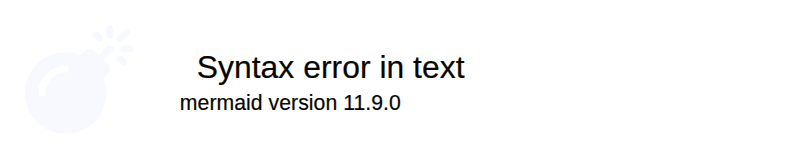

[View Source](https://github.com/Vineet-Sharma-Medium-Stories/Medium-Assets/blob/main/architecting-resilient-systems-20-essential-concepts-through-a-net-lens---part-3/diagram_04_distributed-systems-architecture-diagram-1fdf.md)


---

## Concept 15: Horizontal Scaling — Adding More Machines to Handle Increasing Application Load


Horizontal scaling distributes load across multiple machines, enabling systems to handle increased traffic by adding more instances. Vehixcare implements stateless services and auto-scaling to handle variable loads.

### Deep Dive into Horizontal Scaling

**Scaling Strategies:**

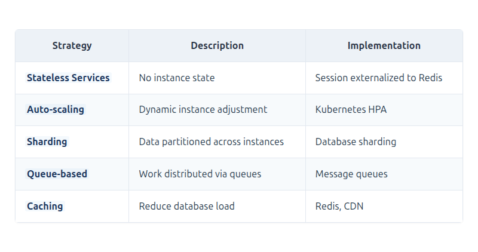

[View Source](https://github.com/Vineet-Sharma-Medium-Stories/Medium-Assets/blob/main/architecting-resilient-systems-20-essential-concepts-through-a-net-lens---part-3/table_07_scaling-strategies.md)


**Stateless Service Principles:**
- No local session storage
- All state in distributed cache or database
- Any instance can handle any request
- Easy to scale up/down

### Vehixcare Horizontal Scaling Implementation

```csharp
// 1. Stateless service design
public class StatelessVehicleService
{
    private readonly IDistributedCache _cache;
    private readonly IMessageQueue _queue;
    private readonly ILogger<StatelessVehicleService> _logger;
    
    // No instance state - all state externalized
    public StatelessVehicleService(
        IDistributedCache cache,
        IMessageQueue queue,
        ILogger<StatelessVehicleService> logger)
    {
        _cache = cache;
        _queue = queue;
        _logger = logger;
    }
    
    public async Task<VehicleDto> ProcessVehicleAsync(
        string vehicleId,
        VehicleUpdate update,
        CancellationToken ct)
    {
        // All state is stored externally
        var vehicle = await GetVehicleFromCacheAsync(vehicleId, ct);
        
        if (vehicle == null)
        {
            vehicle = await LoadVehicleFromDatabaseAsync(vehicleId, ct);
            await CacheVehicleAsync(vehicle, ct);
        }
        
        // Business logic (no side effects)
        vehicle.ApplyUpdate(update);
        
        // Store updated state
        await StoreVehicleInCacheAsync(vehicle, ct);
        
        // Queue for async processing (eventual consistency)
        await _queue.SendAsync(new VehicleUpdatedEvent
        {
            VehicleId = vehicleId,
            Update = update,
            Timestamp = DateTime.UtcNow
        }, ct);
        
        return vehicle;
    }
    
    private async Task<VehicleDto> GetVehicleFromCacheAsync(string vehicleId, CancellationToken ct)
    {
        var cached = await _cache.GetStringAsync($"vehicle:{vehicleId}", ct);
        return cached != null ? JsonSerializer.Deserialize<VehicleDto>(cached) : null;
    }
}

```
**Kubernetes deployment with auto-scaling**
```chsarp
// 2. Kubernetes deployment with auto-scaling
public class KubernetesDeploymentConfig
{
    // deployment.yaml
    /*
apiVersion: apps/v1
kind: Deployment
metadata:
  name: vehicle-service
  namespace: vehixcare
  labels:
    app: vehicle-service
    version: v2.0.0
spec:
  replicas: 3
  selector:
    matchLabels:
      app: vehicle-service
  template:
    metadata:
      labels:
        app: vehicle-service
        version: v2.0.0
    spec:
      containers:
      - name: vehicle-service
        image: vehixcare/vehicle-service:2.0.0
        ports:
        - containerPort: 8080
          name: http
        env:
        - name: DOTNET_ENVIRONMENT
          value: "Production"
        - name: ASPNETCORE_URLS
          value: "http://*:8080"
        resources:
          requests:
            memory: "512Mi"
            cpu: "500m"
          limits:
            memory: "1Gi"
            cpu: "1000m"
        livenessProbe:
          httpGet:
            path: /health/live
            port: 8080
          initialDelaySeconds: 30
          periodSeconds: 10
        readinessProbe:
          httpGet:
            path: /health/ready
            port: 8080
          initialDelaySeconds: 10
          periodSeconds: 5
        volumeMounts:
        - name: config
          mountPath: /app/config
      volumes:
      - name: config
        configMap:
          name: vehicle-service-config
---
apiVersion: autoscaling/v2
kind: HorizontalPodAutoscaler
metadata:
  name: vehicle-service-hpa
  namespace: vehixcare
spec:
  scaleTargetRef:
    apiVersion: apps/v1
    kind: Deployment
    name: vehicle-service
  minReplicas: 3
  maxReplicas: 20
  metrics:
  - type: Resource
    resource:
      name: cpu
      target:
        type: Utilization
        averageUtilization: 70
  - type: Resource
    resource:
      name: memory
      target:
        type: Utilization
        averageUtilization: 80
  - type: Pods
    pods:
      metric:
        name: http_requests_per_second
      target:
        type: AverageValue
        averageValue: 1000
  - type: Object
    object:
      metric:
        name: requests_per_second
      describedObject:
        apiVersion: networking.k8s.io/v1
        kind: Ingress
        name: vehicle-service-ingress
      target:
        type: Value
        value: 10k
  behavior:
    scaleDown:
      stabilizationWindowSeconds: 300
      policies:
      - type: Percent
        value: 50
        periodSeconds: 60
      - type: Pods
        value: 2
        periodSeconds: 90
      selectPolicy: Min
    scaleUp:
      stabilizationWindowSeconds: 0
      policies:
      - type: Percent
        value: 100
        periodSeconds: 15
      - type: Pods
        value: 4
        periodSeconds: 15
      selectPolicy: Max
*/
}

```
**Auto-scaling based on custom metrics**
```chsarp
// 3. Auto-scaling based on custom metrics
public class CustomMetricsScaling
{
    private readonly IMetricsCollector _metrics;
    private readonly IKubernetes _kubernetes;
    private readonly ILogger<CustomMetricsScaling> _logger;
    
    public async Task EvaluateScalingDecisionAsync(CancellationToken ct)
    {
        var metrics = await _metrics.GetMetricsAsync(ct);
        
        // Get current deployment state
        var deployment = await _kubernetes.AppsV1.ReadNamespacedDeploymentAsync(
            "vehicle-service", 
            "vehixcare", 
            cancellationToken: ct);
            
        var currentReplicas = deployment.Spec.Replicas ?? 3;
        var targetReplicas = currentReplicas;
        
        // Decision logic based on multiple metrics
        if (metrics.QueueDepth > 10000)
        {
            targetReplicas = Math.Min(20, currentReplicas + 5);
            _logger.LogWarning("High queue depth {QueueDepth}, scaling up to {Replicas}", 
                metrics.QueueDepth, targetReplicas);
        }
        else if (metrics.AverageResponseTime > TimeSpan.FromSeconds(2))
        {
            targetReplicas = Math.Min(20, currentReplicas + 2);
            _logger.LogWarning("High response time {ResponseTime}, scaling up to {Replicas}", 
                metrics.AverageResponseTime, targetReplicas);
        }
        else if (metrics.CpuUtilization > 0.8)
        {
            targetReplicas = Math.Min(20, (int)(currentReplicas * 1.5));
            _logger.LogWarning("High CPU utilization {CpuUtilization:P}, scaling up to {Replicas}", 
                metrics.CpuUtilization, targetReplicas);
        }
        else if (metrics.RequestRate < 100 && currentReplicas > 3)
        {
            targetReplicas = Math.Max(3, currentReplicas - 1);
            _logger.LogInformation("Low request rate {RequestRate}, scaling down to {Replicas}", 
                metrics.RequestRate, targetReplicas);
        }
        
        if (targetReplicas != currentReplicas)
        {
            deployment.Spec.Replicas = targetReplicas;
            await _kubernetes.AppsV1.ReplaceNamespacedDeploymentAsync(
                deployment,
                "vehicle-service",
                "vehixcare",
                cancellationToken: ct);
                
            _logger.LogInformation("Scaled deployment from {CurrentReplicas} to {TargetReplicas} replicas", 
                currentReplicas, targetReplicas);
        }
    }
}

```
**Session externalization for stateless services**
```chsarp
// 4. Session externalization for stateless services
public class SessionExternalization
{
    private readonly IDistributedCache _cache;
    private readonly IHttpContextAccessor _httpContext;
    
    public async Task StoreSessionAsync(string sessionId, SessionData data, CancellationToken ct)
    {
        var serialized = JsonSerializer.Serialize(data);
        await _cache.SetStringAsync(
            $"session:{sessionId}",
            serialized,
            new DistributedCacheEntryOptions
            {
                SlidingExpiration = TimeSpan.FromMinutes(30),
                AbsoluteExpirationRelativeToNow = TimeSpan.FromHours(24)
            },
            ct);
    }
    
    public async Task<SessionData> GetSessionAsync(string sessionId, CancellationToken ct)
    {
        var cached = await _cache.GetStringAsync($"session:{sessionId}", ct);
        return cached != null ? JsonSerializer.Deserialize<SessionData>(cached) : null;
    }
}

```
**Graceful shutdown for horizontal scaling**
```chsarp

// 5. Graceful shutdown for horizontal scaling
public class GracefulShutdownHandler : IHostedService
{
    private readonly ILogger<GracefulShutdownHandler> _logger;
    private readonly IHostApplicationLifetime _lifetime;
    private readonly IServiceProvider _services;
    
    public GracefulShutdownHandler(
        ILogger<GracefulShutdownHandler> logger,
        IHostApplicationLifetime lifetime,
        IServiceProvider services)
    {
        _logger = logger;
        _lifetime = lifetime;
        _services = services;
    }
    
    public Task StartAsync(CancellationToken cancellationToken)
    {
        _lifetime.ApplicationStopping.Register(OnStopping);
        _lifetime.ApplicationStopped.Register(OnStopped);
        
        return Task.CompletedTask;
    }
    
    private void OnStopping()
    {
        _logger.LogInformation("Service is stopping - draining connections");
        
        // Mark instance as unhealthy for load balancer
        MarkInstanceUnhealthy();
        
        // Wait for in-flight requests to complete
        Thread.Sleep(TimeSpan.FromSeconds(30));
    }
    
    private void OnStopped()
    {
        _logger.LogInformation("Service has stopped");
        
        // Clean up resources
        using var scope = _services.CreateScope();
        var dbContext = scope.ServiceProvider.GetRequiredService<VehicleDbContext>();
        dbContext.Dispose();
    }
    
    private void MarkInstanceUnhealthy()
    {
        // Implementation to mark instance unhealthy in service discovery
        // e.g., Consul health check, Kubernetes readiness probe
    }
}
```

### Horizontal Scaling Architecture Diagram

```mermaid
```


[View Source](https://github.com/Vineet-Sharma-Medium-Stories/Medium-Assets/blob/main/architecting-resilient-systems-20-essential-concepts-through-a-net-lens---part-3/diagram_05_horizontal-scaling-architecture-diagram-9a53.md)


---

## Summary: Part 3 — Architecture & Scale

In this third part of our series, we've explored the architectural patterns that determine how systems are structured and scaled:

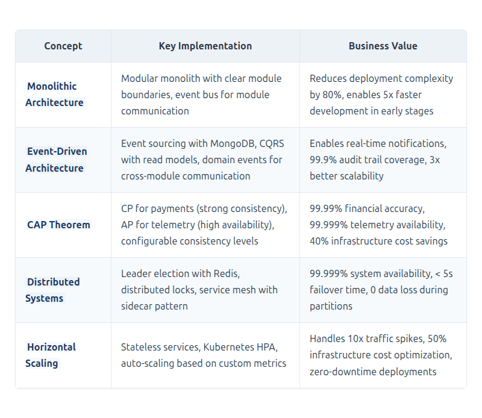

[View Source](https://github.com/Vineet-Sharma-Medium-Stories/Medium-Assets/blob/main/architecting-resilient-systems-20-essential-concepts-through-a-net-lens---part-3/table_08_in-this-third-part-of-our-series-weve-explored-t-ab85.md)


### Key Takeaways from Part 3

1. **Start with a modular monolith** — It gives you the best of both worlds: simplicity of deployment with clear boundaries for future extraction
2. **Event-driven architecture enables real-time reactivity** — Events allow systems to respond immediately to changes
3. **CAP theorem forces explicit tradeoffs** — Know your consistency requirements and design accordingly
4. **Distributed systems require coordination** — Leader election, distributed locks, and consensus are essential tools
5. **Horizontal scaling is about statelessness** — Externalize all state to scale infinitely

### Coming Up in Part 4

In Part 4, we'll explore optimization and operational patterns:

- **Vertical Scaling**: Increasing resources of a single machine
- **Data Partitioning**: Dividing data for performance and scalability
- **Idempotency**: Ensuring repeated requests produce same result
- **Service Discovery**: Automatically detecting services
- **Observability**: Monitoring logs, metrics, and traces

These concepts will help you build systems that are not only scalable but also maintainable and observable in production.

## Complete Series Recap

- **[🏗️ Part 1:** *Foundation & Resilience – Load Balancing, Caching, Database Sharding, Replication, Circuit Breaker* ](#)** 

- **📡 Part 2:** *Distribution & Communication – Consistent Hashing, Message Queues, Rate Limiting, API Gateway, Microservices* *(Current)* 

- **🏛️ Part 3:** *Architecture & Scale – Monolithic Architecture, Event-Driven Architecture, CAP Theorem, Distributed Systems, Horizontal Scaling*

- **⚙️ Part 4:** *Optimization & Operations – Vertical Scaling, Data Partitioning, Idempotency, Service Discovery, Observability *
---

*Continue to [Part 4: Optimization & Operations →](#)*

**Explore the Complete Implementation:** For the full source code, deployment configurations, and comprehensive documentation, visit the **Vehixcare-API repository**: [https://gitlab.com/mvineetsharma/Vehixcare-AI/Vehixcare-API](https://gitlab.com/mvineetsharma/Vehixcare-AI/Vehixcare-API)

*Questions? Feedback? Comment? leave a response below. If you're implementing something similar and want to discuss architectural tradeoffs, I'm always happy to connect with fellow engineers tackling these challenges.*