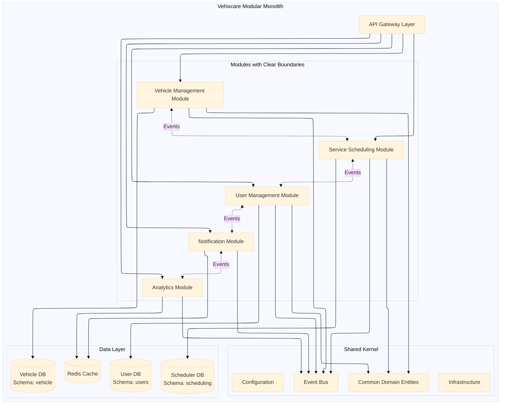

# ### Modular Monolith Architecture Diagram

```mermaid
---
config:
  theme: base
  layout: elk
---

graph TB
    subgraph "Vehixcare Modular Monolith"
        A[API Gateway Layer]
        
        subgraph "Modules with Clear Boundaries"
            B[Vehicle Management Module]
            C[Service Scheduling Module]
            D[User Management Module]
            E[Notification Module]
            F[Analytics Module]
        end
        
        subgraph "Shared Kernel"
            G[Common Domain Entities]
            H[Event Bus]
            I[Infrastructure]
            J[Configuration]
        end
        
        subgraph "Data Layer"
            K[(Vehicle DB<br/>Schema: vehicle)]
            L[(Scheduler DB<br/>Schema: scheduling)]
            M[(User DB<br/>Schema: users)]
            N[(Redis Cache)]
        end
    end
    
    A --> B
    A --> C
    A --> D
    A --> E
    A --> F
    
    B --> G
    B --> H
    B --> K
    
    C --> G
    C --> H
    C --> L
    
    D --> G
    D --> H
    D --> M
    
    E --> H
    E --> N
    
    F --> H
    F --> N
    
    B <-.->|Events| C
    C <-.->|Events| D
    D <-.->|Events| E
    E <-.->|Events| F
```
